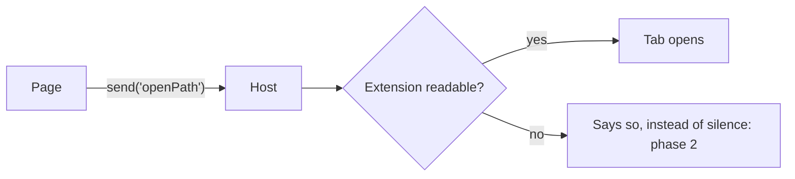

# Write a ticket

A ticket is the research somebody follows months later with none of this conversation in their head. It says **why**, it says **what**, records the evidence and viable options, and breaks the work into phases with a box per piece so progress shows on the page. It does not choose between genuine options; `/design` does.

**Never run git.** Writing a ticket is not a release.

## Where it goes

The ticket tree is `leaftext/docs/`, the folder beside the app — not `app/docs/`, which is the published site.

| folder | what belongs there |
| --- | --- |
| `../docs/README.md` | one line per ticket in the whole tree. Read it first; update it last |
| `../docs/GLOSSARY.md` | every word this tree uses about itself — ticket, phase, box, tier, the record. **Write the ticket in these words**, and add a row for any planning word it spends that is not there yet |
| `../docs/PLAN.md` | the running order over the live tickets. A new ticket is not findable until it has a row here, and [`/pm`](../pm/SKILL.md) writes that row — never this skill |
| `../docs/features/` | the app cannot do this yet |
| `../docs/refactor/` | the app already does it; this changes how |
| `../docs/fixes/` | something is wrong and this is the fix |
| `../docs/refactor/workflow/` | a skill, a hook or a check — how the work gets done, rather than what the app does |
| `../docs/done/` | shipped. Move it here when the last box is ticked |
| `../docs/canceled/` | decided against. Keep the reasoning |

Not sure between the first three? It is a **feature** if a user would notice it appear, a **refactor** if only the code changes, and a **fix** if the app is doing something wrong today.

**Then a subject folder inside it.** None of those folders is a flat pile: the ticket goes in the folder for the part of the app it is about. The live three share one vocabulary — `storage/`, `library/`, `reading/`, `editing/`, `filtering/`, `diagrams/`, `big-swings/`, `plugins/`, plus `repo/` for a ticket about how the repo is built rather than about the app — and **the word does not change when the ticket moves**, so `features/editing/table-editing.md` can become `refactor/editing/` or `fixes/editing/` without being re-filed. `done/` and `canceled/` group by what kind of thing it was instead: `app/`, `repo/`, `release/`, `reference/`, `indexer/`, `pdf/`, `not-this-app/`. A ticket whose subject is genuinely new gets a new folder plus a row in `../docs/GLOSSARY.md` under [subject folder](../../../docs/GLOSSARY.md#subject-folder) naming it — `scripts/check-docs.mjs` matches a role by folder prefix, so a subject folder inherits its parent's role and needs no edit there.

The file name is kebab-case and names the thing, not the change: `highlight-annotate.md`, `search.md`, `update-system.md`.

## The index — read it first, then keep it

`../docs/README.md` is one line per ticket in the tree, grouped by subject, saying what shipped, what is planned and what was turned down. **Read it before writing a word.** Ninety-odd plans is more than anyone holds in their head, and the two ways that costs are both expensive: planning a thing this tree already turned down, or planning around plumbing that already has a ticket. The index is where a ticket finds its neighbors — the vault tickets ride on one piece of plumbing, the filter tickets share one syntax, and a plan that ignores that gets built twice.

**Then keep it.** Adding, renaming, or moving a ticket is not finished until the index matches, in the same edit:

- A new ticket gets a row in the group it belongs to — or a new group if it starts one. The row says what the ticket is in the owner's words, not the file name again.
- A ticket moved to `done/` or `canceled/` moves rows too, and the row changes from what it plans to **what it shipped, or why not**. A canceled row that does not say why is the row someone re-plans against.
- A ticket that replaces another says so in both rows, so nobody builds the old one.

The index carries no change log. Git holds when a ticket moved; the outcomes worth keeping go in `AGENTS.md`, under the rules each paid for.

**When the index and a ticket disagree, do not quietly fix it.** A ticket in `done/` whose own status line says nothing is built is a claim about the app, and only reading the code settles it. It goes in the index's **Needs a second look** table with both halves of the disagreement stated.

## Before writing: read, then ask

**Read the repo, do not remember it.** Every claim in a ticket is checked against the code, and it carries the line it came from — `src/format.rs:41`, not "the format table". A plausible claim that is false sends the next person down a dead end, and they will trust the file over the code.

**Then research anything still open.** A ticket does not ask the owner to choose between build options and does not pretend one is settled. Measure each viable option, record what it wins and costs, and leave the choice for `/design`:

- Two ways to build it, and the choice changes the phases: record both and identify the decision `/design` must make
- Something the app has no precedent for: record the closest evidence and the gap
- Scope that could reasonably stop at half: record the seams and the consequence of each boundary

The evidence and options go in the file; the decision belongs to `/design`. A ticket may name a decision needed from `/design`, but it must not hide one in a phase or silently make it itself. If a thing genuinely cannot be known until code is written, that is not a question — it is **phase 0**: one grep, one measurement, spelled out as a box.

## The shape of the file

**Every ticket has the same six parts, in this order.** Not a suggestion — a reader who has opened one has opened all of them, and knows where the answer they want is without reading the rest.

```markdown
# What it does, in the owner's words

> **Not built.** A plan.

**One sentence, and it names who, what and why it will work:** *enable* <who>
*to* <do the thing> *by* <the change>, *which works because* <the evidence>.

## Why

The problem, and the cost of leaving it alone. Numbers if there are numbers.

## What was measured

| | |
|---|---|
| the claim | `src/file.rs:203` — what is actually there |

## How it is built

Where the code goes and what each piece touches. Options, evidence, and the decision `/design` must make.

## What it looks like

Only when the reader will see a difference — drawn, not described. See below.

## Phases

## What an earlier draft got wrong
```

### The one-sentence summary

The line under the not-built note is the whole ticket in one sentence, and it is the only part most readers finish. It has four pieces and each earns its place:

- **who** — the person it is for. "A reader following links between notes", not "the user".
- **what** — what they will be able to do, or what stops happening to them. In their words, not the code's.
- **by** — the change, named at the size a reader can hold: "by giving each step in the back list the place you left it", not the struct field.
- **which works because** — the evidence it will work, out of the measured table below. What already ships, what was measured, what the app already does elsewhere. **This is the piece that gets skipped and it is the one that makes the sentence worth reading** — a summary with no reason behind it is a wish.

> **Enable a reader following links between notes to come back to the paragraph they left, rather than the top of the page, by giving each step in a tab's back list the position it was left at — which works because the page already sends that position with every link click and the host already restores one on four other paths.**

**Why, measured and how it is built each answer one question and stop.** `## Why` is the cost of doing nothing; it does not describe the build. `## What was measured` is claims with citations and nothing else — no plan, no opinion. `## How it is built` is where the code goes and what was decided; it does not re-argue the why. A paragraph that could sit under two of those headings belongs under neither, and is usually a paragraph to cut.

**A paragraph is one line.** Never hard-wrap the file — `just check-wrapping` fails on one, and every reader of a ticket reflows it anyway.

The measured table is the part that makes a ticket worth having. It is also the part that goes stale — so cite, and never write a row you did not open.

**The ticket is where the words go.** A running-order row gets two sentences and a ticket gets as many as the work needs, so anything long enough to bloat `PLAN.md` — the reasoning, the citations, the costs, what an earlier draft got wrong — lands here instead. That is the trade the two files are built on.

## Phases

Each phase ships on its own and is worth having on its own. Each opens with one italic line saying **why it is in that position** — what it proves, or what the next phase would otherwise be guessing at. Wrong order is the usual way a plan costs double.

```markdown
### Phase 1 — copy, on a locked page

*Why first: it is the only one of the three that writes nothing. Every later
phase rides on the same plumbing.*

- [ ] Move the lock check off the early return and onto the buttons
- [ ] Copy uses the clipboard path `decorate.js:1176` already ships
- [ ] Test: the bar appears on a locked document; bold and headings do not
```

A box is one piece of work with an obvious done. "Make search fast" is not a box. Tests get their own boxes, in the phase that needs them — see [how a phase is proved](#every-phase-says-how-it-is-proved) below, which is where the shape of that box is written.

**Every phase in a file has to be buildable off this repo as it stands, plus the phases above it.** A phase that waits on *another ticket* does not belong in this one — it belongs in its own file, whose first line says what it rides on. A file with a buildable half and a blocked half cannot be finished, so it never moves to `done/`, its index row goes on describing a plan forever, and whoever picks it up stops halfway with no idea whether that was the plan. Split it at the seam and cross-reference both halves: the buildable file ships and closes, the blocked one waits with a name of its own.

End the phase list with the block that closes every phase:

```markdown
### Every phase ends the same way

- [ ] `just bundle-tokens`, `bundle-icons`, `bundle-gallery` for anything that touched `design/`
- [ ] `/check`
```

Drop the bundler line when the work is nowhere near `design/`.

## Every phase says how it is proved

**Every phase carries at least one test box, and the box names where the test goes.** `just verify` runs the tests that exist and nothing asks whether the change made one necessary, so a phase with no test box is code shipped with nothing that would have caught it going wrong. [`/sync-tests`](../sync-tests/SKILL.md) holds the table of where a test lives and the naming rule; the short version is `src/tests/`, one file per subject, for library code, `src/app/tests.rs` for the binary, and `scripts/check-shell.mjs` for anything in `src/assets/shell/`, which boots the fragments in order rather than reading them.

- **Name the claim, not the function.** A test box is `Test: a comment on its own line leaves every other block editable`, in the file it goes in. `Test the new code` is not a box, for the same reason "make search fast" is not one.
- **A fix's test is named after what went wrong**, so the regression cannot ship twice. A ticket in `../docs/fixes/` whose phases do not carry that box has not been written: the fix is the easy half.
- **A new class, component, token or icon has no test to ask for.** `just check-classes`, `check-tokens`, `check-icons` and `check-gallery` already refuse anything `design/` does not list, so that phase's box is the row in `design/` and the bundler run — asking for a test there is a box nobody can write.
- **Say in the phase what cannot be tested here**, where that is true: a real window, live selected text, a held pointer. One line, so the next reader does not take a missing test for an oversight. Never a general caveat about the Mac build, the installer or the workflows — GitHub compiles all three on a tagged release, and a caveat that is true on every ticket is one nobody reads.

**A test gap outside this ticket is its own ticket.** Reading the code to write a plan is the pass most likely to turn up a subject nothing covers, and that finding is worth keeping: it does not survive the session any other way. It does **not** become a box here — a ticket about the find bar that quietly grows four tests for the pager is a ticket nobody can review and a diff nobody can read. Write the second file in the same pass, under `../docs/refactor/` in the subject folder the gap is in, with its row in the index, and run [`/pm`](../pm/SKILL.md) once for both. Every skill that reads the code holds to this — [`/design`](../design/SKILL.md), [`/dev`](../dev/SKILL.md), [`/pm`](../pm/SKILL.md) and [`/sync-tests`](../sync-tests/SKILL.md) all file rather than fix in passing, and **it is always a ticket**, never a sentence in a hand-back.

## A round of fixes on built work is a checklist before it is a change

**When the owner looks at something already built and says what is wrong, every clause of what they said becomes a box in the ticket before a line is changed.** One box per thing they will look for — the aside at the end of the sentence is a box too, and it is the one that gets lost. They go in the phase the work belongs to, under a bold line naming the round, and each is ticked in the same edit as its own fix. Working from memory instead loses whichever ask came last, and the owner has to say it twice.

- **Write them in what they will see**, not in what the code does: *the pointer is a grabbed hand while dragging*, not *set the cursor property*. The owner reads these back to check the round, so a box they cannot check is a box that failed.
- **A box nobody built is struck with the reason**, never quietly dropped, and never ticked because something near it was done.
- **The round's own record goes under the boxes**, saying what was tried and thrown away, so the next reader does not rebuild the version that was refused.

## A change to a skill or the workflow is a ticket too

**A skill, a hook, a check or anything else about how the work gets done is a ticket like any other**, written the moment it is asked for and closed the moment it ships. Without one there is no record of why the rule exists — and a rule nobody can trace is the first one somebody deletes. These are usually written and built in the same pass, so the file is short: what went wrong, what the rule is now, and a box per file changed.

- **It goes in `../docs/refactor/workflow/`**, its own subject folder beside the app's, because it changes how the work is done rather than what the app does. It takes a row in the index and a row in the running order like everything else, and [`/done`](../done/SKILL.md) moves it to `../docs/done/repo/` once it is shipped.
- **The trigger is the same as any other fix**: something was missed, went wrong twice, or has to be remembered. What the rule prevents goes in the file, in the words of what went wrong.
- **A rule that already cost a version number belongs in `AGENTS.md` as well** — the ticket says why it was added; that file says what to do.

## A picture the owner hands over goes in the tree, not in the chat

**Every image the owner sends is saved to `../docs/imgs/` and embedded in the ticket it is about, in the same pass.** One folder at the top of the plan tree, so every ticket points at the same copies and a picture outlives the conversation it arrived in. Without this it is gone the moment the session ends, and the next reader — or the next agent — goes and takes it again, which is somebody's window and somebody's time.

- **Name it after the ticket**, `theme-palette-icon.png`, and add a number when a ticket has more than one: `-2`, `-3`. Never `1.png`, never a name off the host's cache.
- **Embed it where it is evidence**, under the line it backs, with alt text saying what it shows: ``. From a subject folder that is two levels up.
- **A drawing gets pasted as well as pictured.** A picture of an icon cannot be built from, so the markup or the `d` goes in `How it is built` beside it, and the picture is what proves the markup is the right thing.
- **The same rule holds mid-build.** [`/dev`](../dev/SKILL.md) and [`/design`](../design/SKILL.md) file a handed-over picture the same way rather than leaving it in the transcript.

## Anything the reader will see gets drawn before it gets built

**A ticket that adds, moves or restyles one thing in the window carries a `## What it looks like` section, and no phase may build a control that is not in it.** Without one the builder invents the interface, and the owner finds out by looking at their own app. v0.1.479's filter work put a second search box, a `?` button and a popup panel into the pane, none of them named in the plan; all three came straight back out.

That section holds three things, and a box in a phase that has no counterpart here is a box to cut:

- **Where it goes, as a picture in the file.** Write the sketch as HTML in `../docs/imgs/wireframes/<ticket>.html` and photograph it: `node scripts/wireframe.mjs ../docs/imgs/wireframes/<ticket>.html ../docs/imgs/<ticket>-wireframe.png 760 470`. The PNG is embedded in the ticket, the HTML stays beside it so a later edit redraws rather than restarts. **Never ASCII boxes** — they come out ragged in every renderer that matters, break the moment a label runs long, and are the reason this rule is written down. Not a sentence describing it either: a reader has to point at where the thing sits and what it is beside.


The sketch is plain HTML — boxes, borders, real text, a numbered dot per changed part and a key beside it saying what each one is. `scripts/wireframe.mjs --check` says which browser it will use; it takes the Edge or Chrome already on the machine, so nothing is added to the tree.

> **Never draw with box characters.** Not here, not in `How it is built`, not in a reply, not anywhere in the plan tree. `┌ │ └ ─` line up in exactly one font at exactly one size and nowhere else: the app's own renderer, GitHub and every editor set the characters beside them differently, so what looked square when it was typed arrives as a ragged mess, and it breaks outright the first time a label runs long. `just check-ascii-art` fails on one and names the line. A picture instead — the command above — or a Mermaid block where the thing really is a graph rather than a layout.
- **What it is made of** — the markup, the component row it will get in `design/components.md`, and the tokens it takes. A new control is a new row there, so the row is written here first.
- **What it replaces or leaves alone.** Naming what does *not* change is the half that stops a build growing a second copy of something.

**Prefer nothing new.** The strongest version of this section is "no new control — it rides the box that is already there". A second input, a second button, a second panel: each one is a thing the owner has to look at forever, and the ticket has to say why the existing one could not carry it. If it cannot say that, the answer is the existing one.

**Draw the options and leave the choice to `/design`.** Not "ask whether to add a control" — write the sketch into the ticket. Two or three drawn options where there is a real fork, with what each wins and costs. `/design` records the selected option and why; a ticket that reaches `/dev` with an undecided drawing has not been designed yet.

## Anything with an order or a branch gets drawn as a flow

**A wireframe answers where a control sits; a flow diagram answers what happens, in what order, and who answers it.** A ticket about a mechanism needs the second as much as a ticket about a control needs the first, and it is the half most often left as four paragraphs somebody has to hold in their head. [api-documents](../../../../docs/features/storage/api-documents.md) is the shape a live ticket uses; [stage-2-module-split](../../../../docs/done/reference/stage-2-module-split/README.md) is what one is still worth long after the work shipped.

**It is a Mermaid block in the ticket itself** — no sketch file, no photograph, nothing in `../docs/imgs/`. The app renders it, GitHub renders it, and editing the block redraws the picture, which is the whole reason a flow is cheap where a layout has to be photographed. Pick the kind by the question: `flowchart` for a path, `sequenceDiagram` for who calls whom in what order, `stateDiagram-v2` for a thing with modes. **Never box characters** — `just check-ascii-art` fails on a `┌` anywhere in the tree, for the reasons under the wireframe rule above.

**One earns its place when the prose has to hold more than a reader can.** Three or more hops; a branch, where the same input goes two ways; anything crossing the line between the page and the host, because that boundary is what a builder gets wrong; and an order the phases rest on, since a phase's italic line is far easier to check against a picture than against four paragraphs. Two boxes and an arrow is a sentence — write the sentence.

**Every node is a real thing, named as the code names it, with the files cited under the block.** A node nobody can find is an uncited claim that reads as settled because it is drawn, which makes it worse than the same sentence. An edge says what carries the message rather than merely that something happens. And where the ticket is *adding* a piece, the node says so — a drawing that mixes what ships with what is planned and marks neither is one a builder cannot use.

````markdown


The host's arm is `src/app/event_loop.rs:141` and the readable test is `src/format.rs:88`. Everything but the refusal ships today.
````

**It goes in `## How it is built`, and it covers what the phases build and no more.** `## What was measured` stays claims with citations — a picture there is a plan hiding in the evidence. Read the drawing against the phase list once, deliberately, before handing back: a node nothing in the phases builds is either a node to cut or a box somebody forgot to write, and that one pass is the cheapest way this section pays for itself.

**Keep it to one question.** One diagram per thing being explained, a dozen nodes at the outside. Two small diagrams answering one question each beat one answering three, and a diagram nobody can read at a glance is prose with lines on it.

## Two files finish the job, every time

A ticket nobody can find is a ticket nobody builds. So writing the plan is two-thirds of the work, and neither of the other files is optional — do both in the same pass, before handing back.

**1. The index row.** `../docs/README.md`, in the group the ticket belongs to, saying what it is in the owner's words. The rules for a row are up under [the index](#the-index--read-it-first-then-keep-it): a ticket moved between folders moves its row, a ticket that replaces another says so in both, and a row that only restates the file name is a row nobody can argue with.

**2. The running order — run [`/pm`](../pm/SKILL.md) over the whole tree.** Not a row placed by hand. A new ticket changes what somebody should pick up next, and the author is the last person who can judge that: they have just spent an hour on one file and read none of the others, so a self-placed row lands wherever the writing left them feeling about it. Running the ranking is also the only pass that walks the three live folders off the disk, which is how a ticket with no row at all gets found — the ranking on 4 August 2026 turned up three, one of them a diagram bug that takes the whole drawing down.

So finishing a ticket is: write the file, write the index row, then `/pm`. It re-derives every `Status` cell from the tickets, re-checks statuses against the code, and rewrites `../docs/PLAN.md` in place with the new ticket ranked among the rest. Nothing here places a tier by hand, and nothing here writes a `PLAN.md` row.

**Absent is not wrong** — a capability the app never had does not reach tier 1 however big its audience. Worth knowing while writing, because a ticket that argues the app is *broken* when it is merely *incomplete* is a ticket the ranking has to argue back at.

Two things to check before handing back: the ticket has a row in the index, and `/pm` has run and left it a row in `PLAN.md`. Missing either, the work is not findable.

## Working a ticket later

That is [dev](../dev/SKILL.md)'s job — it builds the phases in order, ticks each box (`- [x]`) in the same edit as the code, strikes through a box that will not be done with the reason beside it, and **stops at the owner's own box**. Shipping is [git-release](../git-release/SKILL.md)'s; closing is [done](../done/SKILL.md)'s, on the owner's word alone: the shipped note at the top, the move into the right subject folder under `../docs/done/`, the index row rewritten to say what shipped, and the running-order row moved into `../docs/done/PLAN.md`.

## Reference

- `/pm` — ranks every ticket in the tree into one running order.
- `/design` — checks a written ticket against the code before anyone builds it.
- `/dev` — builds one and stops at the owner's box; `/git-release` ships it; `/done` moves it to `done/`.
- `/sync-tests` — where a test goes, how it is named, and the pass that writes the ones a phase asked for.
- `../docs/README.md` — every ticket, one line each. Read first, updated last.
- `../docs/imgs/` — every picture the owner has handed over, named after the ticket that uses it.
- `../docs/GLOSSARY.md` — the words a ticket is written in. A planning word this file spends and that file does not define gets a row there in the same pass.
- `../docs/features/editing/highlight-annotate.md` — measured table, phases, a phase 0.
- `../docs/done/repo/inline-link.md` — short, and shows the shipped note.
- `../docs/done/app/update-system.md` — how several tickets share a phase order.

<!-- keycode: LEAF-6C9B -->
