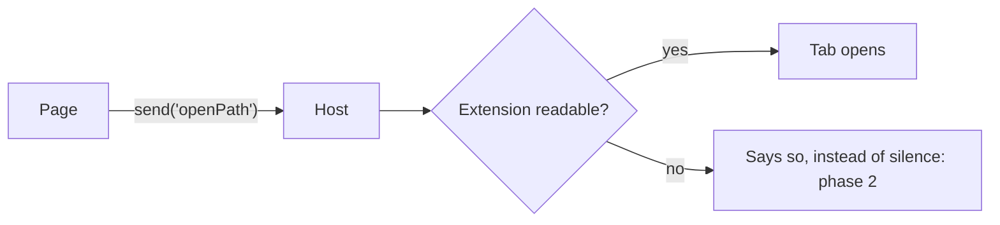

# Write a ticket

A ticket is the research somebody follows months later with none of this conversation in their head. It says **why**, it says **what**, records the evidence and viable options, and breaks the work into phases with a box per piece so progress shows on the page. It does not choose between genuine options; `/design` does.

**Never run git.** Writing a ticket is not a release.

## Process

### 1. Read the index and neighboring tickets

Open the index first and refuse to re-plan an answer already in the tree. It is four files, one per status: `../docs/README.md` is the live rows, and `../docs/done/README.md`, `../docs/on-hold/README.md` and `../docs/canceled/README.md` are the archive. An answer this tree already gave is in one of the three archive files, so reading only the live one is reading the 5% that cannot hold it.

### 2. Research the code and the request

Open the paths, callers, tests and repo rules the ticket will rely on without choosing a genuine fork.

### 3. Write the seven ticket parts

Create the title, note, summary, why, measured table, build account, phases, footprint and record in their required order.

### 4. Give every phase proof and an owner's box

Name the test for each phase and end the file with the one gesture only the owner ticks.

### 5. Draw the interface or flow

Add a measured wireframe for visible work or a Mermaid flow for an ordered mechanism.

### 6. Update the README and track

Write the ticket's one owned index row and place it as one numbered step of exactly one subject.

**The step's [`Waits on`](../../../../docs/GLOSSARY.md#waits-on) cell is written in the same edit as the step.** It is the one place a wait is declared and the only thing the running order reads a track's order out of, so a step added with the cell left blank is a ticket that will be offered above what it cannot be built without. Name the step numbers of its own track, or link a live ticket on another track; write `—` where nothing has to be built first, which is the honest answer for most steps and leaves the row ranked on cost exactly as it is today.

**A ticket carrying `> **Performance finding.**` is always the next step of the Performance track**, whatever subject folder holds its code. `nothing-files-a-performance-finding` stays the track's unmarked first step because it builds this route rather than recording a slow path, and its owner-chosen place in the running order is not changed by this rule.

### 7. Run /pm

Add the ticket to the running order and rebuild its derived cells.

### 8. Hand back the ticket

The whole reply is the owner's message, word for word. The plan is a file the owner can open, so naming it in the reply says nothing the file does not.

## Where it goes

The ticket tree is `leaftext/docs/`, the folder beside the app — not `app/docs/`, which is the published site.

| folder | what belongs there |
| --- | --- |
| `../docs/README.md` | one line per live ticket. Read it first; the new ticket's row is written here, last |
| `../docs/done/README.md`, `../docs/on-hold/README.md`, `../docs/canceled/README.md` | the same, one line per shipped, held or refused ticket. Read them first too: this is where an answer the tree already gave is written |
| `../docs/GLOSSARY.md` | every word this tree uses about itself — ticket, phase, box, tier, the record. **Write the ticket in these words**, and add a row for any planning word it spends that is not there yet |
| `../docs/PLAN.md` | the running order over the live tickets. A new ticket is not findable until it has a row here, and [`/pm`](../pm/SKILL.md) writes that row — never this skill |
| `../docs/features/` | the app cannot do this yet |
| `../docs/refactor/` | the app already does it; this changes how |
| `../docs/fixes/` | something is wrong and this is the fix |
| `../docs/on-hold/workflow/` | a skill, a hook, a check, a script, the plan tree — how the work gets done, rather than what the app does. **Held on the owner's standing word**: build upkeep is filed straight here, not into the live folders |
| `../docs/on-hold/` | paused by the owner. [`/pm`](../pm/SKILL.md) moves work in and out and records the live folder it returns to |
| `../docs/done/` | shipped. Move it here when the last box is ticked |
| `../docs/canceled/` | decided against. Keep the reasoning |

Not sure between the first three? It is a **feature** if a user would notice it appear, a **refactor** if only the code changes, and a **fix** if the app is doing something wrong today.

**Then a subject folder inside it.** None of those folders is a flat pile: the ticket goes in the folder for the part of the app it is about. The live three share one vocabulary — `storage/`, `library/`, `reading/`, `editing/`, `filtering/`, `diagrams/`, `big-swings/`, `plugins/`, plus `repo/` for a ticket about how the repo is built rather than about the app — and **the word does not change when the ticket moves**, so `features/editing/table-editing.md` can become `refactor/editing/` or `fixes/editing/` without being re-filed. `done/` and `canceled/` group by what kind of thing it was instead: `app/`, `repo/`, `release/`, `reference/`, `indexer/`, `pdf/`, `not-this-app/`. A ticket whose subject is genuinely new gets a new folder plus a row in `../docs/GLOSSARY.md` under [subject folder](../../../../docs/GLOSSARY.md#subject-folder) naming it — `scripts/check-docs.mjs` matches a role by folder prefix, so a subject folder inherits its parent's role and needs no edit there.

The file name is kebab-case and names the thing, not the change: `highlight-annotate.md`, `search.md`, `update-system.md`.

**A name already used under `../docs/on-hold/`, `../docs/done/` or `../docs/canceled/` is taken, whatever folder it sits in.** Read the held ticket instead of planning it again; only the owner restores it. A shipped or canceled file keeps its name as the record of the first answer.

## The index — read it first, then keep it

The index is one line per ticket in the tree, grouped by subject, written across four files: `../docs/README.md` says what is planned, and `../docs/done/README.md`, `../docs/on-hold/README.md` and `../docs/canceled/README.md` say what shipped, what is paused and what was turned down. **Read them before writing a word.** Ninety-odd plans is more than anyone holds in their head, and the two ways that costs are both expensive: planning a thing this tree already turned down, or planning around plumbing that already has a ticket. The index is where a ticket finds its neighbors — the vault tickets ride on one piece of plumbing, the filter tickets share one syntax, and a plan that ignores that gets built twice.

**Then keep it.** A new ticket is live, so its row goes in `../docs/README.md`; [`/done`](../done/SKILL.md) is what later moves that row into the index of the folder the ticket lands in. Adding, renaming, or moving a ticket is not finished until the index matches, in the same edit:

- A new ticket gets a row in the group it belongs to — or a new group if it starts one. The row says what the ticket is in the owner's words, not the file name again.
- A ticket moved to `on-hold/`, `done/` or `canceled/` moves rows too. A held row keeps its stage and return folder; the others say **what shipped, or why not**.
- A ticket that replaces another says so in both rows, so nobody builds the old one.

The README carries no change log. Git holds when a ticket moved; the outcomes worth keeping go in `AGENTS.md`, under the rules each paid for.

**When the README and a ticket disagree, do not quietly fix it.** A ticket in `done/` whose own status line says nothing is built is a claim about the app, and only reading the code settles it. It goes in the README's **Needs a second look** table with both halves of the disagreement stated.

## Before writing: read, then ask

**Read the repo, do not remember it.** Every claim in a ticket is checked against the code, and it carries the line it came from — `src/format.rs:41`, not "the format table". A plausible claim that is false sends the next person down a dead end, and they will trust the file over the code.

**Then research anything still open.** A ticket does not ask the owner to choose between build options and does not pretend one is settled. Measure each viable option, record what it wins and costs, and leave the choice for `/design`:

- Two ways to build it, and the choice changes the phases: record both and identify the decision `/design` must make
- Something the app has no precedent for: record the closest evidence and the gap
- Scope that could reasonably stop at half: record the seams and the consequence of each boundary

The evidence and options go in the file; the decision belongs to `/design`. A ticket may name a decision needed from `/design`, but it must not hide one in a phase or silently make it itself. If a thing genuinely cannot be known until code is written, that is not a question — it is **phase 0**: one grep, one measurement, spelled out as a box.

## The shape of the file

**Every ticket has the same seven parts, in this order.** Not a suggestion — a reader who has opened one has opened all of them, and knows where the answer they want is without reading the rest.

```markdown
# What it does, in the owner's words

> **Not built.** A plan. Asked for 18 August 2026, 9:11pm.

**One sentence, and it names who, what and why it will work:** *enable* <who>
*to* <do the thing> *by* <the change>, *which works because* <the evidence>.

## Why

The problem, and the cost of leaving it alone. Numbers if there are numbers.

## What was measured

| | |
|---|---|
| the claim | `src/file.rs:203` — what is actually there |

## How it is built

Where the code goes and what each piece touches. Options, evidence, and the decision `/design` must make.

## What it looks like

Only when the reader will see a difference — drawn, not described. See below.

## Phases

## What it writes

| file | phase |
|---|---|
| `app/src/render/decorate.js` | 1 |

## What an earlier draft got wrong
```

**The not-built note says when the ticket was asked for, and it says the time as well as the day.** So does the found line where this ticket came out of another pass — `Found 18 August 2026, 9:11pm while designing …`. Read both off this machine's clock (`Get-Date`), never off memory and never off the last date you saw written down: the tree fills a whole day in a day, so a date on its own cannot say whether a ticket is twelve minutes old or twelve hours, and after a shuffle of the running order that is the only question anybody is asking about the names in front of them. `AGENTS.md` carries the rule, and `just check-docs` refuses a date written from `2026-08-19` on with no time after it.

**A ticket written because the performance-finding rule fired carries one fixed line directly under its not-built and found lines: `> **Performance finding.**`.** No other ticket carries it, and neither a fast-sounding file name nor prose elsewhere in the ticket stands in for it; the line records where the request came from so the track and ranking checks can read the fact without guessing.

### The one-sentence summary

The line under the not-built note is the whole ticket in one sentence, and it is the only part most readers finish. It has four pieces and each earns its place:

- **who** — the person it is for. "A reader following links between notes", not "the user".
- **what** — what they will be able to do, or what stops happening to them. In their words, not the code's.
- **by** — the change, named at the size a reader can hold: "by giving each step in the back list the place you left it", not the struct field.
- **which works because** — the evidence it will work, out of the measured table below. What already ships, what was measured, what the app already does elsewhere. **This is the piece that gets skipped and it is the one that makes the sentence worth reading** — a summary with no reason behind it is a wish.

> **Enable a reader following links between notes to come back to the paragraph they left, rather than the top of the page, by giving each step in a tab's back list the position it was left at — which works because the page already sends that position with every link click and the host already restores one on four other paths.**

**Why, measured and how it is built each answer one question and stop.** `## Why` is the cost of doing nothing; it does not describe the build. `## What was measured` is claims with citations and nothing else — no plan, no opinion. `## How it is built` is where the code goes and what was decided; it does not re-argue the why. A paragraph that could sit under two of those headings belongs under neither, and is usually a paragraph to cut.

**A paragraph is one line.** Never hard-wrap the file — `just check-wrapping` fails on one, and every reader of a ticket reflows it anyway.

The measured table is the part that makes a ticket worth having. It is also the part that goes stale — so cite, and never write a row you did not open.

**The ticket is where the words go.** A running-order row gets two sentences and a ticket gets as many as the work needs, so anything long enough to bloat `PLAN.md` — the reasoning, the citations, the costs, what an earlier draft got wrong — lands here instead. That is the trade the two files are built on.

## Phases

Each phase ships on its own and is worth having on its own. Each opens with one italic line saying **why it is in that position** — what it proves, or what the next phase would otherwise be guessing at. Wrong order is the usual way a plan costs double.

```markdown
### Phase 1 — copy, on a locked page

*Why first: it is the only one of the three that writes nothing. Every later
phase rides on the same plumbing.*

- [ ] Move the lock check off the early return and onto the buttons
- [ ] Copy uses the clipboard path `decorate.js:1176` already ships
- [ ] Test: the bar appears on a locked document; bold and headings do not
```

A box is one piece of work with an obvious done. "Make search fast" is not a box. Tests get their own boxes, in the phase that needs them — see [how a phase is proved](#every-phase-says-how-it-is-proved) below, which is where the shape of that box is written.

**Every phase in a file has to be buildable off this repo as it stands, plus the phases above it.** A phase that waits on *another ticket* does not belong in this one — it belongs in its own file, whose first line says what it rides on. A file with a buildable half and a blocked half cannot be finished, so it never moves to `done/`, its README row goes on describing a plan forever, and whoever picks it up stops halfway with no idea whether that was the plan. Split it at the seam and cross-reference both halves: the buildable file ships and closes, the blocked one waits with a name of its own.

End the phase list with the block that closes the build — one block for the whole ticket, never one per phase:

```markdown
### The build ends the same way

- [ ] `just bundle-tokens`, `bundle-icons`, `bundle-gallery` for anything that touched `design/`
- [ ] `/check` once, after every phase is built
```

Drop the bundler line when the work is nowhere near `design/`. **One check, at the end.** A ticket is what pays for the complete suite, and it pays once: a block repeated under every phase is the same fifty seconds spent again for each one, and it proves nothing the final run does not prove.

## The last box in the file is the owner's

**Every ticket carries one more heading at the end of its phases, after the line every phase ends with:**

```markdown
### The owner's box

- [ ] Open a table with a short column on the whole window and confirm the cell reads as one word
```

**It holds the gesture, never a stock line.** What the owner does to see the thing, written in what they will look at — the line above, never "confirm it works". A ticket whose subject genuinely has nothing to press writes the box and [strikes it](../../../../docs/GLOSSARY.md#struck-through) with that reason, the way a test box that cannot be built here is struck.

**It stays unticked while a machine works the file.** [`/dev`](../dev/SKILL.md) stops there and leaves it open, [`/git-release`](../git-release/SKILL.md) refuses a ticket whose one open box sits anywhere else, and `scripts/check-docs.mjs` refuses a live plan with no such heading, one that keeps it anywhere but as the last `###` inside `## Phases`, and one writing a box that opens `The owner ` outside it — from the day it is written rather than from its first ticked box — a plan is easiest to write the box into while it is being scoped, and hardest from inside a half-built phase. Without the heading a plan goes fully ticked on machine work alone, and a machine agreeing with itself is not evidence — which is the whole of why the glossary calls the last box the owner's.

## What it writes — the ticket's footprint

**Directly after `## Phases`, a table of one row per file this build will change and the phase that changes it.** Not the files the plan read: [a citation](../../../../docs/GLOSSARY.md#citation) is evidence, and a ticket quoting a rule out of `app/AGENTS.md` writes nothing there. This section is what a build will write, which is the only thing a collision between two agents is about — it is the [footprint](../../../../docs/GLOSSARY.md#footprint) the running order's [Devs with](../../../../docs/GLOSSARY.md#devs-with) cell is computed from, so a wrong one makes every cell naming this ticket wrong.

```markdown
## What it writes

| file | phase |
|---|---|
| `app/src/render/decorate.js` | 1 |
| `app/docs/02-development/01-architecture.md` | 1, 3 |
| `docs/GLOSSARY.md` | 2 |
```

- **Every path is spelled from the pair's top** — `app/…` or `docs/…`, never `src/render/decorate.js`, never a bare `state.js`, never `../../GLOSSARY.md`. Both repositories hold a `README.md` and an `AGENTS.md`, so a bare path names two different files and cannot be compared; and the tree already cites the same file from two roots, which a set comparison reads as two files. One spelling makes the comparison exact, and it is the one thing `just check-docs` refuses here.
- **A file the build will create is written down like any other.** Most of what a build writes does not exist when the plan is written, so nothing asks whether a footprint path is on the disk — a path is compared as the string it is written as, which is what lets two tickets that will both create the same module collide before either has.
- **A ticket that writes no file at all writes `—`.** An empty section reads as a ticket nobody has filled in.
- **A folder counts as a row** where the work is a sweep across one — a row naming `docs/features/` is a footprint, and it collides with every ticket inside it.
- **Write the shared plan files down like any other.** `docs/PLAN.md`, `docs/GLOSSARY.md` and the four index files — `docs/README.md`, `docs/done/README.md`, `docs/on-hold/README.md` and `docs/canceled/README.md` — are written by every build, so the comparison drops them by name; the section is what this build writes, and leaving them out to help the comparison is the section lying about the work. `docs/tracks/` is not among them and collides on purpose — `/pm` is its one writer and no build is.

## Every phase says how it is proved

**Every phase carries at least one test box, and the box names where the test goes.** `just verify` runs the tests that exist and nothing asks whether the change made one necessary, so a phase with no test box is code shipped with nothing that would have caught it going wrong. [`/sync-tests`](../sync-tests/SKILL.md) holds the table of where a test lives and the naming rule; the short version is `src/tests/`, one file per subject, for library code, `src/app/tests/`, one file per subject, for the binary, and `scripts/check-shell/`, one file per subject, for anything in `src/assets/shell/`, which boots the fragments in order rather than reading them.

- **Name the claim, not the function.** A test box is `Test: a comment on its own line leaves every other block editable`, in the file it goes in. `Test the new code` is not a box, for the same reason "make search fast" is not one.
- **A fix's test is named after what went wrong**, so the regression cannot ship twice. A ticket in `../docs/fixes/` whose phases do not carry that box has not been written: the fix is the easy half.
- **A new class, component, token or icon has no test to ask for.** `just check-classes`, `check-tokens`, `check-icons` and `check-gallery` already refuse anything `design/` does not list, so that phase's box is the row in `design/` and the bundler run — asking for a test there is a box nobody can write.
- **Say in the phase what cannot be tested here**, where that is true: a real window, live selected text, a held pointer. One line, so the next reader does not take a missing test for an oversight. Never the Mac build, the installer or the workflows — [`/check`](../check/SKILL.md) step 4 holds that rule.

**A ticket that touches the front end says what the browser does about it.** The app and a published site are one front end with two hosts under it, so anything that adds or changes a command the page sends is two pieces of work — and the second one is decided here, while the work is being scoped, or it is decided by nobody. One line per new command in the phase that adds it: the browser answers it, will not and here is why, or not yet and here is the ticket that owns it. That line becomes the row in `web/preview/host.js`'s table, which `just check-web-commands` refuses the build without. Where the browser's answer is real work rather than a line, it is its own ticket in the same pass, ranked with [`/pm`](../pm/SKILL.md) — never a phase quietly widened to carry it.

**A test gap outside this ticket is its own ticket** — the commonest case of the rule below, and the one every pass here hits, because reading the code to write a plan is what turns up a subject nothing covers. Write the second file under `../docs/refactor/` in the subject folder the gap is in.

## Work a pass turns up that is not this ticket's is its own ticket

**Anything found while reading the code that no phase in this file would have to build anyway is a second file, written in the same pass.** A bug beside the one being planned, a rule nothing enforces, a check that would have caught it, a subject with no tests, a piece of work the ticket brushes past — the find does not survive the session any other way, and there are only two other places it can go, both of which lose it. A box smuggled in makes a ticket nobody can review: a ticket about the find bar that quietly grows four tests for the pager, or a fix for something else, is one the owner cannot read against what they asked for. A sentence in a hand-back dies with the session.

**<!-- shared-rule: performance-finding -->Anything the work in front of this pass hints could be faster is a performance finding: file it as a ticket in the same turn, without stopping for a benchmark or fixing it in passing, and never name it in the reply.<!-- /shared-rule -->** Research already has the code open, so a repeated operation, needless breadth or visible wait is evidence enough to write the finding; the new ticket owns measurement and the fix.

- **The test is scope, not size.** A one-line fix that is out of this ticket's work is still a ticket, because what makes it one is the record, not the cost. A find a phase already in the file has to build anyway is a box in that phase, not a second file.
- **Two files finish it, the same two as any other ticket** — the file, its row in the live index `../docs/README.md`, then [`/pm`](../pm/SKILL.md) once for both. Never a row placed by hand.
- **Name it in the ticket it was found from**, under **Still open**, so nobody reads it as covered by the work in front of them.
- **It is always a ticket**, never a sentence in a hand-back and never fixed in passing. [`/design`](../design/SKILL.md), [`/dev`](../dev/SKILL.md), [`/pm`](../pm/SKILL.md) and [`/sync-tests`](../sync-tests/SKILL.md) all hold to this from their own end.

## A ticket carrying two jobs is split, the way a blocked one is

**A file whose phases add up to two pieces of work is split at the seam between them**, each half keeping a name of its own, a row in the README and a place in the running order, and each naming the other. The seam rule above is the same cut on a different line: there it is where buildable phases stop and blocked ones begin, here it is where one job stops and the next starts.

A file is carrying two when its summary sentence needs an *and* to stay true, when its phases answer more than one question, or when somebody would pick up half of it and leave the rest. That last one is the tell that costs the most: a file nobody can finish never moves to `../docs/done/`, so its README row goes on describing a plan for ever. Splitting is describing the same work more honestly rather than changing it, so it does not wait on a question — but the running order is re-derived by [`/pm`](../pm/SKILL.md), never edited by hand, because two rows where there was one changes what somebody picks up next.

## A round of fixes on built work is a checklist before it is a change

**When the owner looks at something already built and says what is wrong, every clause of what they said becomes a box in the ticket before a line is changed** — one box per thing they will look for, the aside at the end of the sentence included, under a bold line naming the round in the phase the work belongs to. Write them in what the owner will see (*the pointer is a grabbed hand while dragging*, not *set the cursor property*), since they read these back to check the round. A box nobody built is struck with the reason, never quietly dropped — the reason written after the closing `~~`, since a reason inside the strike is the shape a bare strike already has and `just check-docs` refuses a struck box with nothing after it. The round's own record goes under the boxes, so the next reader does not rebuild the version that was refused. [`/dev`](../dev/SKILL.md) works the rounds; this is the shape they take in the file.

## A change to a skill or the workflow is a ticket too

**A skill, a hook, a check or anything else about how the work gets done is a ticket like any other**, written the moment it is asked for and closed the moment it ships. Without one there is no record of why the rule exists — and a rule nobody can trace is the first one somebody deletes. These are usually written and built in the same pass, so the file is short: what went wrong, what the rule is now, and a box per file changed.

- **It goes straight into `../docs/on-hold/workflow/`, held, and never into the running order.** The owner holds every build-upkeep plan on a standing word: the ranking is for the app, and a list of the machinery's own faults crowds out the work somebody using Leaftext would notice. So the ticket takes its README row under **On hold**, a step of [`Process upkeep`](../../../../docs/tracks/process-upkeep.md), and a row in [the on-hold list](../../../../docs/on-hold/PLAN.md) recording `refactor/workflow/` as where it returns to. It gets no position and no tier, and no pass restores it — only the owner does. [`/done`](../done/SKILL.md) moves it to `../docs/done/repo/` if it is ever built.
- **The one exception is a bug in the app itself.** Where the machinery is only how the fault was found, the ticket is about what the app does wrong, it is filed under `../docs/fixes/` in the subject folder for the part of the app it breaks, and it is ranked. A gate that goes red, a check that misses something, a script that mangles a commit message: all machinery, all held.
- **A footprint that is entirely `app/scripts/`, `app/.agents/`, `app/Justfile`, `AGENTS.md` or the plan tree is the test.** It is the same line `AGENTS.md` already draws for what takes a version number, so a plan that ships no installer is a plan the owner holds.
- **The trigger is the same as any other fix**: something was missed, went wrong twice, or has to be remembered. What the rule prevents goes in the file, in the words of what went wrong.
- **A rule that already cost a version number belongs in `AGENTS.md` as well** — the ticket says why it was added; that file says what to do.

## What the owner hands over goes in the ticket, not in the chat

**Copy every owner prompt into the ticket where it supplies intent: `## Why` for the request, or its round in `## Phases` for later direction. Save every image to `../docs/imgs/` and embed it inline where it is evidence.** A supplied screenshot is the picture for the state it shows: use it, never draw an equivalent wireframe.

- **Name it after the ticket**, `theme-palette-icon.png`, and add a number when a ticket has more than one: `-2`, `-3`. Never `1.png`, never a name off the host's cache.
- **Embed it where it is evidence**, under the line it backs, with alt text saying what it shows: ``. From a subject folder that is two levels up.
- **A drawing gets pasted as well as pictured.** A picture of an icon cannot be built from, so the markup or the `d` goes in `How it is built` beside it, and the picture is what proves the markup is the right thing.
- **The same rule holds mid-build.** [`/dev`](../dev/SKILL.md) and [`/design`](../design/SKILL.md) file a handed-over picture the same way rather than leaving it in the transcript.

## Anything the reader will see gets drawn before it gets built

**A ticket that adds, moves or restyles one thing in the window carries a `## What it looks like` section, and no phase may build a control that is not in it.** A supplied screenshot satisfies the picture for its state; do not replace it with a wireframe. Without either, the builder invents the interface, and the owner finds out by looking at their own app. v0.1.479's filter work put a second search box, a `?` button and a popup panel into the pane, none of them named in the plan; all three came straight back out.

That section holds three things, and a box in a phase that has no counterpart here is a box to cut:

- **Where it goes, as a picture in the file.** Write the sketch as HTML in `../docs/imgs/wireframes/<ticket>.html` and photograph it: `node scripts/wireframe.mjs ../docs/imgs/wireframes/<ticket>.html ../docs/imgs/<ticket>-wireframe.png 760 470`. The PNG is embedded in the ticket, the HTML stays beside it so a later edit redraws rather than restarts. **Never ASCII boxes** — they come out ragged in every renderer that matters, break the moment a label runs long, and are the reason this rule is written down. Not a sentence describing it either: a reader has to point at where the thing sits and what it is beside.


The sketch is plain HTML — boxes, borders, real text, a numbered dot per changed part and a key beside it saying what each one is. `scripts/wireframe.mjs --check` says which browser it will use; it takes the Edge or Chrome already on the machine, so nothing is added to the tree.

> **Never draw with box characters** — not here, not in `How it is built`, not in a reply, nowhere in the plan tree. They line up in exactly one font at exactly one size, so what looked square when it was typed arrives ragged everywhere else and breaks outright the first time a label runs long. `just check-ascii-art` fails on one and names the line. A picture instead — the command above — or a Mermaid block where the thing really is a graph rather than a layout.
- **What it is made of** — the markup, the component row it will get in `design/components.md`, and the tokens it takes. A new control is a new row there, so the row is written here first.
- **What it replaces or leaves alone.** Naming what does *not* change is the half that stops a build growing a second copy of something.

**Prefer nothing new.** The strongest version of this section is "no new control — it rides the box that is already there". A second input, a second button, a second panel: each one is a thing the owner has to look at forever, and the ticket has to say why the existing one could not carry it. If it cannot say that, the answer is the existing one.

**Draw the options and leave the choice to `/design`.** Not "ask whether to add a control" — write the sketch into the ticket. Two or three drawn options where there is a real fork, with what each wins and costs. `/design` records the selected option and why; a ticket that reaches `/dev` with an undecided drawing has not been designed yet.

## Anything with an order or a branch gets drawn as a flow

**A wireframe answers where a control sits; a flow diagram answers what happens, in what order, and who answers it.** A ticket about a mechanism needs the second as much as a ticket about a control needs the first, and it is the half most often left as four paragraphs somebody has to hold in their head. [api-documents](../../../../docs/features/storage/api-documents.md) is the shape a live ticket uses; [stage-2-module-split](../../../../docs/done/reference/stage-2-module-split/README.md) is what one is still worth long after the work shipped.

**It is a Mermaid block in the ticket itself** — no sketch file, no photograph, nothing in `../docs/imgs/`. The app renders it, GitHub renders it, and editing the block redraws the picture, which is the whole reason a flow is cheap where a layout has to be photographed. Pick the kind by the question: `flowchart` for a path, `sequenceDiagram` for who calls whom in what order, `stateDiagram-v2` for a thing with modes.

**One earns its place when the prose has to hold more than a reader can.** Three or more hops; a branch, where the same input goes two ways; anything crossing the line between the page and the host, because that boundary is what a builder gets wrong; and an order the phases rest on, since a phase's italic line is far easier to check against a picture than against four paragraphs. Two boxes and an arrow is a sentence — write the sentence.

**Every node is a real thing, named as the code names it, with the files cited under the block.** A node nobody can find is an uncited claim that reads as settled because it is drawn, which makes it worse than the same sentence. An edge says what carries the message rather than merely that something happens. And where the ticket is *adding* a piece, the node says so — a drawing that mixes what ships with what is planned and marks neither is one a builder cannot use.

````markdown


The host's arm is `src/app/event_loop.rs:141` and the readable test is `src/format.rs:88`. Everything but the refusal ships today.
````

**It goes in `## How it is built`, and it covers what the phases build and no more.** `## What was measured` stays claims with citations — a picture there is a plan hiding in the evidence. Read the drawing against the phase list once, deliberately, before handing back: a node nothing in the phases builds is either a node to cut or a box somebody forgot to write, and that one pass is the cheapest way this section pays for itself.

**Keep it to one question.** One diagram per thing being explained, a dozen nodes at the outside. Two small diagrams answering one question each beat one answering three, and a diagram nobody can read at a glance is prose with lines on it.

## Two files finish the job, every time

A ticket nobody can find is a ticket nobody builds, so finishing one is: write the file, write its [README](#the-readme-read-it-first-then-keep-it) row, then run [`/pm`](../pm/SKILL.md) over the whole tree — in the same pass, before handing back.

**A ticket this skill writes is `Ready`, and nothing else.** It has been researched and not designed, so it carries no dated `Designed` line and its running-order row cannot claim one — writing the file and marking it `Designed` or `Dev` in the same pass is claiming a reading that never happened, and it is what makes the owner think work is under way that nobody has opened against the code. [`/design`](../design/SKILL.md) is what moves it off `Ready`, and [`/dev`](../dev/SKILL.md) is refused until that pass has run. `scripts/check-plan-stage.mjs` and `scripts/gate-design.mjs` hold both ends.

**Never place the running-order row by hand.** A new ticket changes what somebody should pick up next, and the author is the last person who can judge that: they have just spent an hour on one file and read none of the others. `/pm` derives every `Status` cell from the tickets, keeps the higher of that and the cell already in the running order, re-checks them against the code, and rewrites `../docs/PLAN.md` in place. It is also the only pass that walks the three live folders off the disk, which is how a ticket with no row at all gets found — the ranking on 4 August 2026 turned up three, one of them a diagram bug that takes the whole drawing down.

**Absent is not wrong** — a capability the app never had does not reach tier 1 however big its audience. Worth knowing while writing, because a ticket that argues the app is *broken* when it is merely *incomplete* is a ticket the ranking has to argue back at.

## Working a ticket later

That is [dev](../dev/SKILL.md)'s job — it builds the phases in order, ticks each box (`- [x]`) in the same edit as the code, strikes through a box that will not be done with the reason beside it, and **stops at the owner's own box while that box is open**. Shipping is [git-release](../git-release/SKILL.md)'s; closing is [done](../done/SKILL.md)'s, on the owner's word alone. **<!-- shared-rule: struck-owners-box -->A struck owner's box is not the owner's word.<!-- /shared-rule -->** It says the subject has nothing to press, not that the owner has seen what was built, so `/dev` hands back and the ticket stays live until they ask.

## Reference

- `/pm` — ranks every ticket in the tree into one running order.
- `/design` — checks a written ticket against the code before anyone builds it.
- `/dev` — builds one and always stops at the owner's box, struck or open; `/git-release` ships it; `/done` moves it to `done/` on the owner's word.
- `/sync-tests` — where a test goes, how it is named, and the pass that writes the ones a phase asked for.
- `../docs/README.md`, `../docs/done/README.md`, `../docs/on-hold/README.md`, `../docs/canceled/README.md` — the ticket index, one file per status, one line per ticket. Read all four first; the new row goes in the live one, last.
- `../docs/imgs/` — every picture the owner has handed over, named after the ticket that uses it.
- `../docs/GLOSSARY.md` — the words a ticket is written in. A planning word this file spends and that file does not define gets a row there in the same pass.
- `../docs/features/editing/highlight-annotate.md` — measured table, phases, a phase 0.
- `../docs/done/repo/inline-link.md` — short, and shows the shipped note.
- `../docs/done/app/update-system.md` — how several tickets share a phase order.
