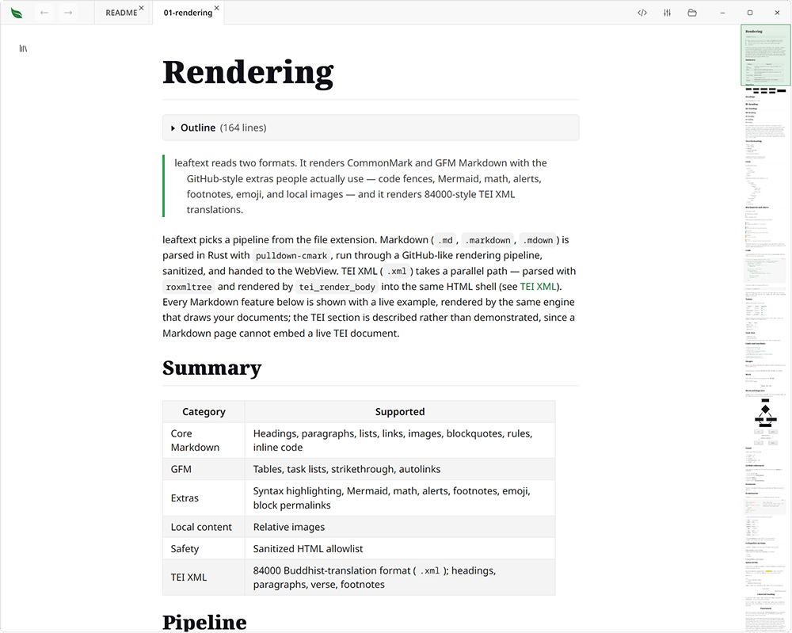
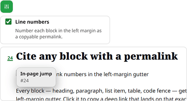
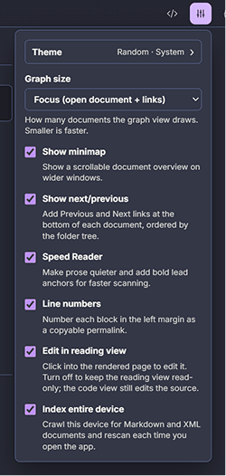

# Refine your mind.
## Your thoughts, secure and free.

Leaftext is a free desktop app for reading and editing Markdown and XML. Open a file. Read it.


<a href="https://github.com/ryanallen/leaftext/releases"></a>
<a href="https://github.com/ryanallen/leaftext/releases"></a>
<a href="https://github.com/ryanallen/leaftext/releases"></a>

**[Read the docs →](docs/)** · **[View the project on GitHub →](https://github.com/ryanallen/leaftext)**

---

**Leaf Text** is a free desktop app for reading and editing [Markdown](docs/01-features/01-rendering.md) and [XML](docs/01-features/01-rendering.md#xml) on macOS and Windows. It opens a local file into a clean, GitHub-accurate reading view you can type straight into, keeps your place with tabs and history, and maps how your documents relate in a [graph](docs/01-features/03-library.md#graph). Everything runs locally — no account, no cloud, no telemetry.

## Features

### Read Markdown and XML



Open a `.md` file and Leaf Text renders it exactly as GitHub would — CommonMark and GitHub Flavored Markdown with the extras people actually use: [syntax-highlighted code](docs/01-features/01-rendering.md#code), [Mermaid diagrams](docs/01-features/01-rendering.md#mermaid-diagrams), [math](docs/01-features/01-rendering.md#math), [GitHub alerts](docs/01-features/01-rendering.md#blockquotes-and-alerts), [footnotes](docs/01-features/01-rendering.md#footnotes), [emoji](docs/01-features/01-rendering.md#emoji), task lists, and [local images](docs/01-features/01-rendering.md#images). It also opens [`.xml` files](docs/01-features/01-rendering.md#xml) through a parallel renderer into the same clean reading view: [any XML](docs/01-features/01-rendering.md#any-xml) — a sitemap, a feed, a config file — reads as sections, fields, and tables instead of tags, and [84000-style TEI](docs/01-features/01-rendering.md#tei-xml-84000-translations), the Buddhist-canon translation format, gets a renderer that knows its conventions. **[Rendering →](docs/01-features/01-rendering.md)**

### Edit in place, save on your terms


Reading-first, but editable. Click into a sentence in the rendered page and type, split and merge blocks with `Enter` and `Backspace`, or toggle a checkbox — the change is written back to the source at exactly that spot, with step-by-step [undo](docs/01-features/07-editing.md#undo). Prefer raw text? Drop to the [code view](docs/01-features/07-editing.md#code-view) for the file's actual Markdown or XML, with editor-style colouring of every delimiter. There's no autosave: nothing touches your file until you press **Save**. **[Editing →](docs/01-features/07-editing.md)**

### Find every file, and see how they connect


A left-side pane backed by a local SQLite index of every Markdown file you own — [full-text search](docs/01-features/03-library.md#search) it, or walk the folders one at a time with a [breadcrumb](docs/01-features/03-library.md#project) that always says where you are. A [graph view](docs/01-features/03-library.md#graph) maps how your documents link to one another, so you can see the shape of your notes instead of just a list. **[Library →](docs/01-features/03-library.md)**

### Navigate like a browser


[Tabs](docs/01-features/02-navigation.md#tabs), Back/Forward [history](docs/01-features/02-navigation.md#history), a collapsible [outline](docs/01-features/02-navigation.md#outline) (table of contents) at the top of every document, in-document jumps, and a Previous/Next [pager](docs/01-features/05-settings.md#pager) that walks a folder in reading order. Save a file in your editor and Leaf Text [live-reloads](docs/01-features/02-navigation.md#reload) it, keeping your place. **[Navigation →](docs/01-features/02-navigation.md)**

### Stay oriented with the minimap


A shrunken clone of the page in a side rail — real, tiny text, not abstract bars — with a live viewport indicator. Recognize where you are from the shape of the text itself, click any section to jump, or drag the indicator to scroll. **[Minimap →](docs/01-features/04-minimap.md)**

### Cite any block with a permalink



Every block — heading, paragraph, list item, table, code fence — gets a stable address in a left-margin gutter. Click it to copy a deep link that lands on that exact spot, in both the app and on the website. Turn the gutter numbers on or off in Settings. **[Rendering →](docs/01-features/01-rendering.md)**

### Read faster with Speed Reader


An optional mode that dims prose and links and adds bold lead anchors at word starts, so the reading path pops against the page and your eye moves down it quickly. **[Settings →](docs/01-features/05-settings.md#speed-reader)**

### Make it yours


Ten theme families — [Amaranth, Arabica, Fern, Ginger, GitHub, Goldenrod, Halcyon, Nightshade, Pippin, and Sage](docs/01-features/06-themes.md#families) — each with light and dark variants plus System and Daylight appearance, applied through a semantic token contract so the reader, code, alerts, and minimap always stay visually consistent. Theme fonts load from Google Fonts on demand. **[Themes →](docs/01-features/06-themes.md)**

### Settings that stick, in two languages



Theme, graph size (affects performance), navigation, speed reader, minimap, permalink line numbers, reading-view editing and indexing (affects performance) — stored locally and durable across restarts. Leaf Text also keeps itself current: new versions download in the background and are checked against a published digest, then wait for you to click **Restart to update** — nothing ever installs on its own. **[Settings →](docs/01-features/05-settings.md#updates)**

## Documentation

New here? Start with the **[Quickstart](docs/03-quickstart.md)**, or browse the **[full documentation](docs/01-introduction.md)**.

The pages are plain Markdown under [`docs/`](docs/) — edit them there.

## Installation

Full setup notes — including troubleshooting — live in the [Installation guide](docs/02-installation.md).

### macOS

Download the universal DMG from [Releases](https://github.com/ryanallen/leaftext/releases). Mount it and drag **Leaf Text** onto the **Applications** shortcut.

**First launch — "not verified" warning**

macOS quarantines apps downloaded from the internet. If you see a prompt saying Leaf Text can't be opened because it's from an unidentified developer, run this in Terminal after dragging the app to Applications:

```sh
xattr -cr /Applications/leaftext.app
```

Then open the app normally.

### Windows

Download the 64-bit MSI from [Releases](https://github.com/ryanallen/leaftext/releases). Default install path:

```text
C:\Program Files\leaftext\bin\leaftext.exe
```

WebView2 browser data and the library index live in the same profile:

```text
%LOCALAPPDATA%\ryanallen\leaftext\data
```

The installer adds no Start Menu or desktop shortcut — pin `leaftext.exe` yourself if you want one. Applying an [update](docs/01-features/05-settings.md#updates) raises one elevation prompt, at the moment you click **Restart to update**.

---

## Development

See [Building](docs/02-development/02-building.md), [Architecture](docs/02-development/01-architecture.md), and [Releasing](docs/02-development/03-releasing.md) for the full developer docs.

Run the full verification suite before handing work back:

```sh
just verify
```

Other [`Justfile`](Justfile) tasks:

| Task | Command |
|:--|:--|
| Cut a release | `just release <version>` |

`just release` commits the version bump, tags, and pushes — CI builds the Windows MSI and the macOS DMG.
