# Refine your mind.

**Your thoughts, secure and free.** Leaftext is a free desktop app for reading and writing your own documents. Everything stays on your device, in plain files you own.


{{{icon:windows[Download for Windows](https://github.com/ryanallen/leaftext/releases/latest/download/leaftext-windows-x86_64.exe)}}} {{{icon:apple[Download for macOS](https://github.com/ryanallen/leaftext/releases/latest/download/leaftext-macos-universal.dmg)}}}

Free · Windows 10+ and macOS Universal · **[Windows `.msi`](https://github.com/ryanallen/leaftext/releases/latest/download/leaftext-windows-x86_64.msi)** · **[All releases](https://github.com/ryanallen/leaftext/releases/latest)**

**[How to install it →](docs/02-installation.md#install)** · **[Mac won't open it? →](docs/02-installation.md#mac-blocks-the-first-launch)**

> **Read this if you're on a Mac.** macOS refuses the first launch of any app Apple hasn't been paid to vouch for, and Leaftext is free, so it hasn't. Nothing was scanned and nothing was found. Let it through once — **System Settings → Privacy & Security → Open Anyway** — and it opens normally from then on. [The four clicks, spelled out →](docs/02-installation.md#mac-blocks-the-first-launch)

**[Get started →](docs/03-quickstart.md)** · **[Read the docs →](docs/)** · **[View the project on GitHub →](https://github.com/ryanallen/leaftext)**

---

Your notes deserve better than a text editor. Open a file in Leaftext and it becomes a page you actually want to read — quiet, well set, and easy to move through. Click into a sentence and you can write. Nothing saves until you say so.

There's no account and no sign-up. Your files never leave your computer, and they stay [Markdown](docs/01-features/01-rendering.md), [source files](docs/01-features/01-rendering.md#source-files), [HTML](docs/01-features/01-rendering.md#html-files), [XML](docs/01-features/01-rendering.md#xml), [JSON, and YAML](docs/01-features/01-rendering.md#data-files-json-and-yaml), [plain text](docs/01-features/01-rendering.md#plain-text-files) and [config files](docs/01-features/01-rendering.md#ini-files) — and even [saved emails](docs/01-features/01-rendering.md#email-eml) and [Word, Excel, PowerPoint and OpenDocument files](docs/01-features/01-rendering.md#office-and-opendocument-files) — formats every other app can read, so you're never locked in.

Free, on macOS and Windows.

## Find it fast

| If you want to… | Go to |
| --- | --- |
| See what it looks like | [Read your files](#read-your-files) |
| Open a Word, Excel or PowerPoint file | [Word, Excel and PowerPoint files](#word-excel-and-powerpoint-files) |
| Write in the page, not in an editor | [Write where you read](#write-where-you-read) |
| Search your notes and see how they link | [Keep a library](#keep-a-library) |
| Find a word in the document you are reading | [Search everything you've written](#search-everything-youve-written) |
| Keep your place across long documents | [Move around](#move-around) |
| Change the look | [Make it yours](#make-it-yours) |
| Know what leaves your machine | [Your thoughts stay yours](#your-thoughts-stay-yours) |
| Install it | [Install it](#install-it) |
| Learn the whole app | [Learn it](#learn-it) |
| Build it from source | [Development](#development) |

## Read your files

### Markdown, rendered the way GitHub renders it

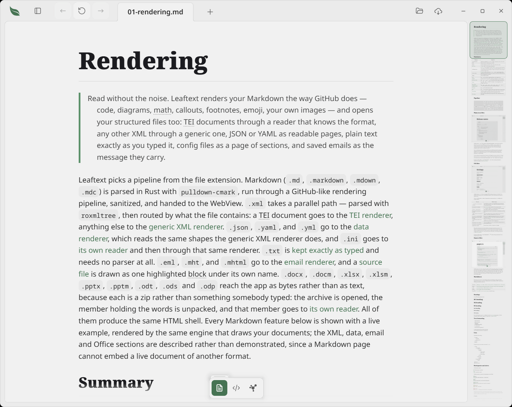

Open a `.md` file and it renders the way you'd expect, with the extras people actually use: [highlighted code](docs/01-features/01-rendering.md#code), [math](docs/01-features/01-rendering.md#math), [callouts](docs/01-features/01-rendering.md#blockquotes-and-alerts), [footnotes](docs/01-features/01-rendering.md#footnotes), [emoji](docs/01-features/01-rendering.md#emoji), [task lists](docs/01-features/01-rendering.md#task-lists), [tables](docs/01-features/01-rendering.md#tables), [collapsible sections](docs/01-features/01-rendering.md#collapsible-sections), [frontmatter](docs/01-features/01-rendering.md#frontmatter), and [your own images](docs/01-features/01-rendering.md#images). **[Rendering →](docs/01-features/01-rendering.md)**

### Diagrams that take your theme's colors

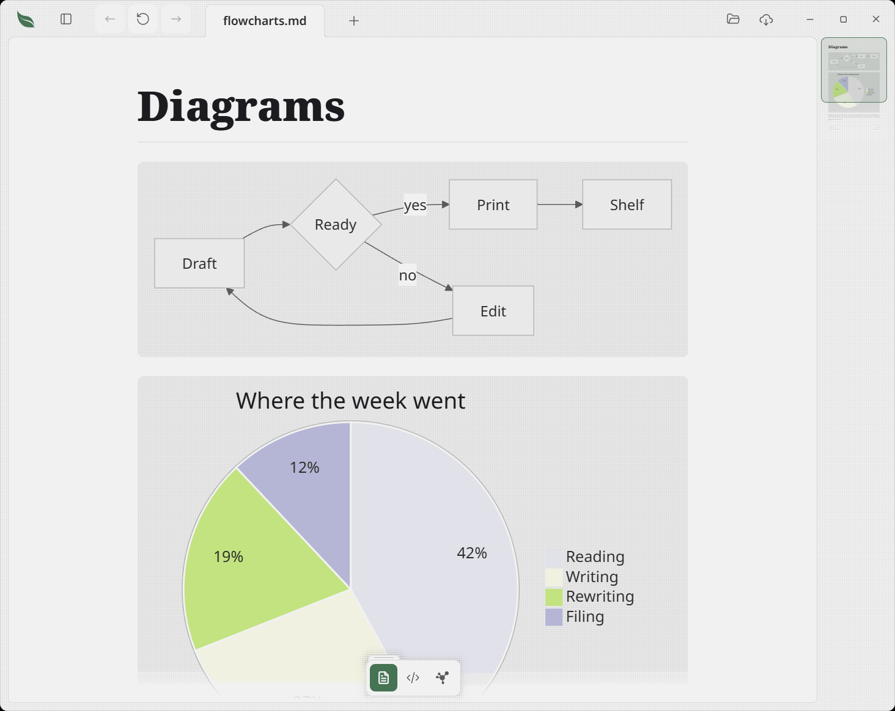

Write a `mermaid` code fence and get a diagram — flowchart, sequence, gantt, mindmap, pie — drawn offline in your theme's own colors and font. Switch theme and the diagrams on the page are redrawn to match. A page of sixty opens as fast as a page of three: only the ones near what you are reading are drawn, and the rest fill in as you scroll to them. Drag one to move it, `Ctrl` and the wheel to zoom, without the page around it shifting. **[Diagrams →](docs/01-features/01-rendering.md#mermaid-diagrams)**

### XML, sitemaps, feeds, and Buddhist canon

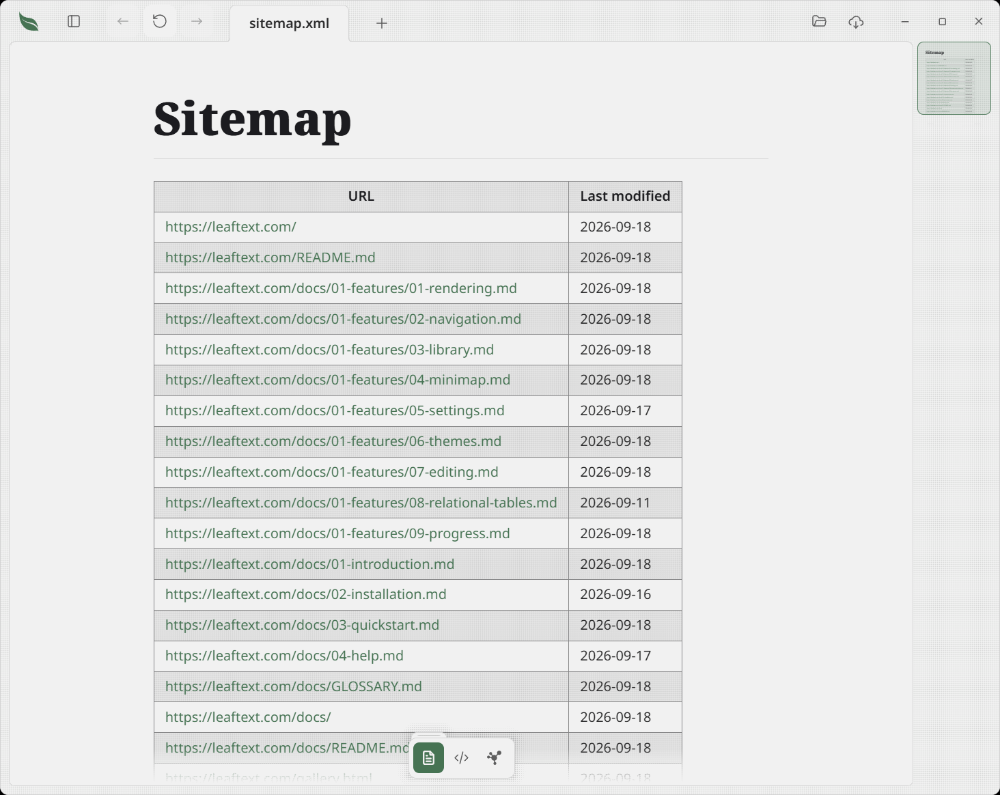

[Any XML](docs/01-features/01-rendering.md#any-xml) reads as sections, fields, and tables instead of tags — a sitemap, a feed, a `pom.xml`. And [84000-style TEI](docs/01-features/01-rendering.md#tei-xml-84000-translations), the format the Buddhist canon is translated into, gets a reader that understands its conventions: titles, front matter, nested divisions, verse, endnotes. **[XML →](docs/01-features/01-rendering.md#xml)**

### JSON and YAML as pages

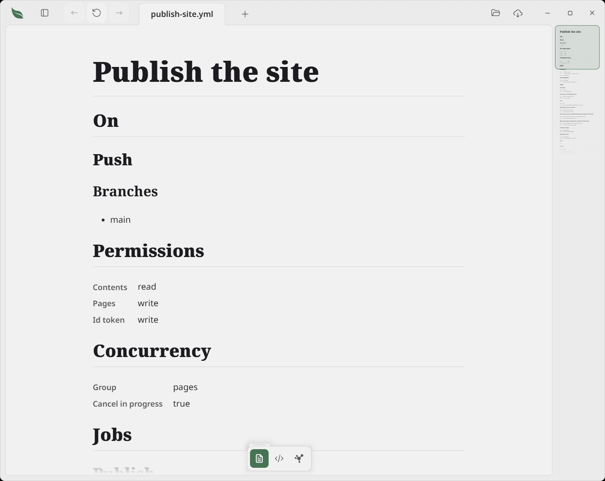

A lock file, a CI workflow, or a Kubernetes manifest as headed sections, aligned fields, and record tables instead of punctuation — read by the same shape rules as XML, so the same field is named the same way in both. **[JSON and YAML →](docs/01-features/01-rendering.md#data-files-json-and-yaml)**

### Saved email

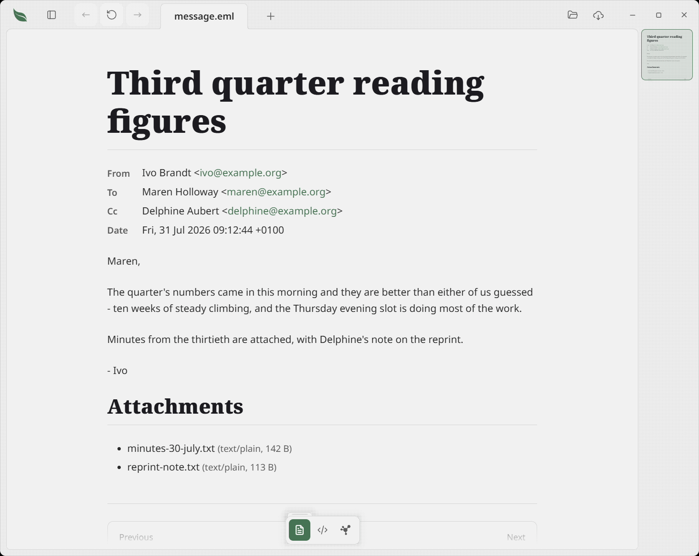

An `.eml` from Gmail, Outlook, or Apple Mail opens as the message it carries: headers, body, inline images, attachments — instead of a wall of base64. Nothing in the message reaches the network. **[Email →](docs/01-features/01-rendering.md#email-eml)**

### HTML without the web page taking over

A saved report, exported note, or hand-written `.html` page opens in Leaftext's own reading view. Scripts, styles, forms, buttons, event handlers, and unsafe addresses are removed; the source view keeps the original file for editing. **[HTML →](docs/01-features/01-rendering.md#html-files)**

### Plain text, exactly as you typed it

A `.txt` opens as one block with every space and every line break kept, so an ASCII banner stays lined up and an indented list stays indented. Nothing is reflowed and nothing is guessed at. **[Plain text →](docs/01-features/01-rendering.md#plain-text-files)**

### Config files as a page

An `.ini` opens as sections with their keys and values under each, every value ready to be typed into and written straight back. Each key is drawn the way it was written, because `font_size` is a name somebody chose. **[INI →](docs/01-features/01-rendering.md#ini-files)**

### Word, Excel and PowerPoint files


A `.docx`, `.docm`, `.xlsx`, `.xlsm`, `.pptx`, `.pptm`, `.odt`, `.ods` or `.odp` opens as the document it is — headings, paragraphs, lists and tables, a sheet as a table of records, a deck as one entry per slide. Type into a paragraph or a cell, save, and everything Leaftext never read — your styles, themes, comments, tracked changes, charts and macros — is byte for byte what it was. A macro is read past and never run; Leaftext has no way to run one. No network, no account, no sign-in. **[Word, Excel, PowerPoint and OpenDocument →](docs/01-features/01-rendering.md#office-and-opendocument-files)**

### Read faster when you need to

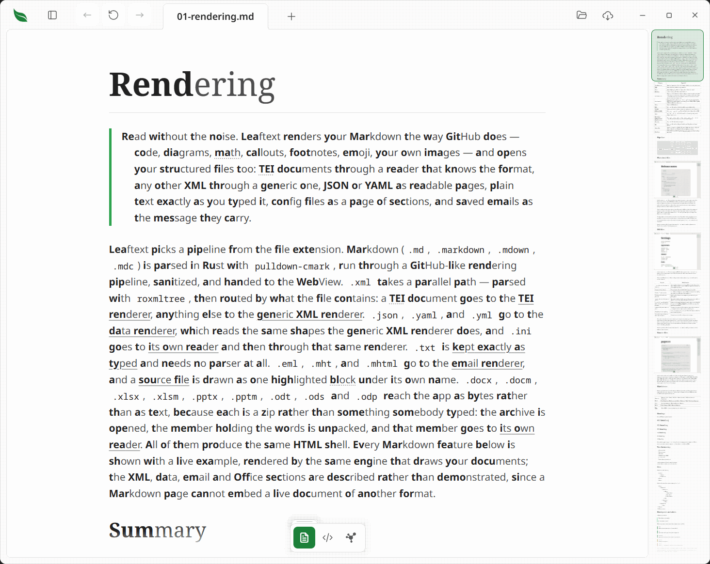

Turn on Speed Reader and the page dims back while bold anchors mark the start of each word. Your eye follows the path down instead of hunting for it. **[Speed Reader →](docs/01-features/05-settings.md#speed-reader)**

## Write where you read

### Click into a sentence and type

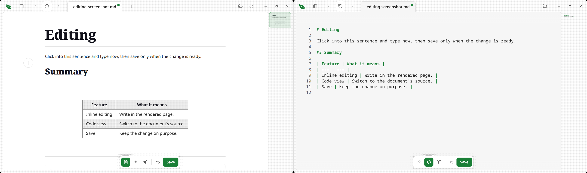

Split a paragraph with `Enter`, join it back with `Backspace` — the change lands in your file at exactly that spot, and [undo](docs/01-features/07-editing.md#undo) walks back step by step, with Redo beside it for a press too many. Text edits never autosave: nothing touches your file until you press **Save**. Ticking a checkbox is the one exception — that saves on the spot, and works even with editing locked. **[Editing →](docs/01-features/07-editing.md)**

### A format bar where the words are

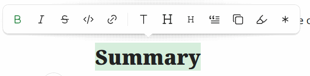

Highlight words and a small bar appears over them: bold, italic, strikethrough, code, link — then text, a bigger or smaller heading, and quote for the whole block. A button with nowhere to go grays out. **[The format bar →](docs/01-features/07-editing.md#the-format-bar)**

### Reach into the margin to move a block

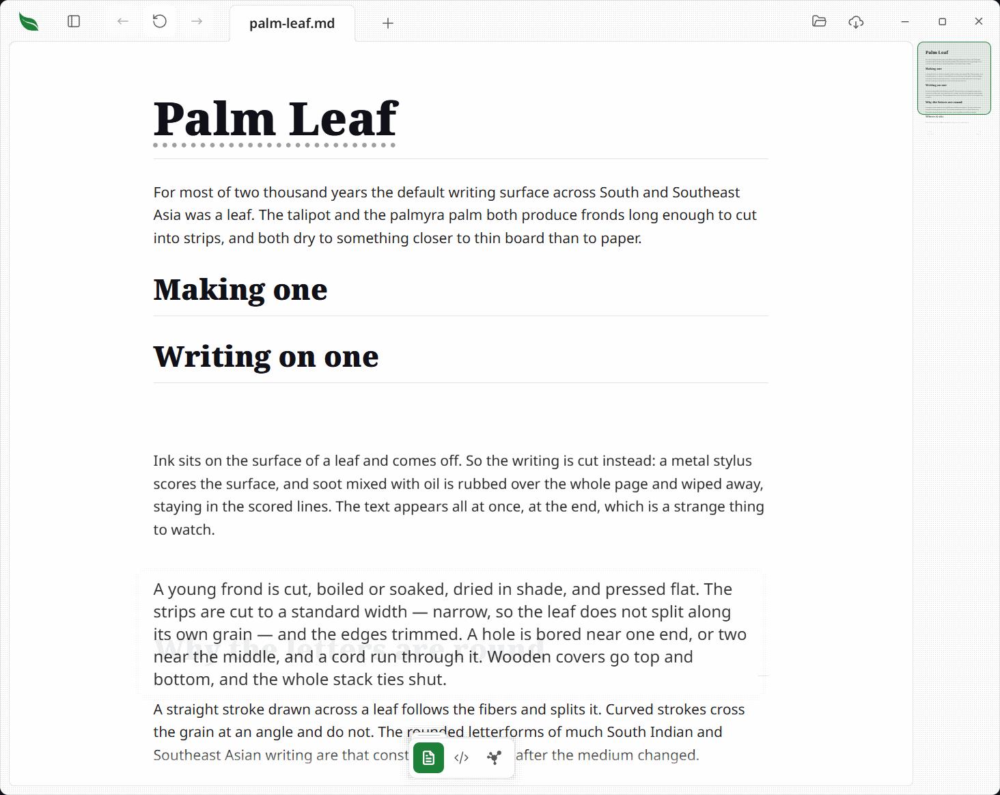

Take the handle and a block lifts off the page; drop it where its neighbors have opened a gap. Press the plus on an empty line and [a row of block kinds](docs/01-features/07-editing.md#adding-a-block) fans out — text, heading, list, quote, code, table, image, flowchart, divider. **[The block gutter →](docs/01-features/07-editing.md#the-block-gutter)**

### Draw a flowchart instead of typing one

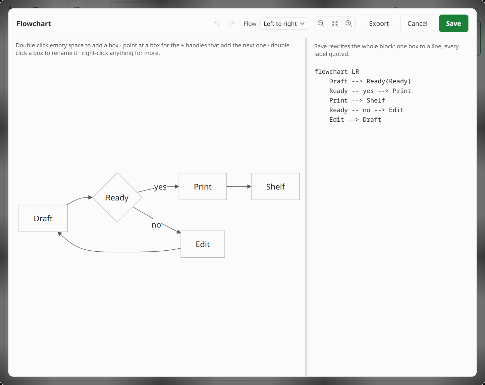

A canvas beside the Mermaid text, each following the other. Double-click to add a box and name it, pick from [forty-seven shapes](docs/01-features/07-editing.md#what-it-can-draw) grouped by what they are for, drag a handle onto another box to connect them or back onto the box it came from for a step that loops on itself, and group boxes together. A box can also carry a link, one of the app's own icons, or a picture. Every other kind of diagram opens the same sheet as a live preview. Open it on any diagram already in a page, and [export](docs/01-features/01-rendering.md#mermaid-diagrams) any diagram as its own Markdown file, picture or PDF from the button in its corner. **[The flowchart editor →](docs/01-features/07-editing.md#the-flowchart-editor)**

### Or work in the raw source

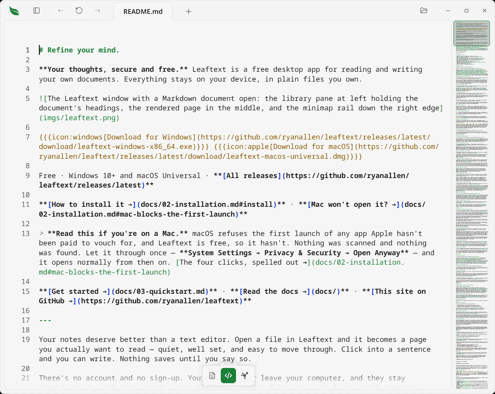

Drop into [code view](docs/01-features/07-editing.md#code-view) for the file's actual source — Markdown, HTML, XML, JSON, YAML, a raw email, or the XML of the part a Word, Excel, PowerPoint or OpenDocument file is anchored to — with line numbers, a minimap, and the headings you're under [pinned to the top edge](docs/01-features/07-editing.md#pinned-headings). Markdown, HTML, XML, YAML, JSON and the XML inside an Office file come colored in your theme's own syntax colors; email is plain text. A color written in the source carries a small square of itself in the line beside it. **[Code view →](docs/01-features/07-editing.md#code-view)**

### Typing help drawn from your own notes

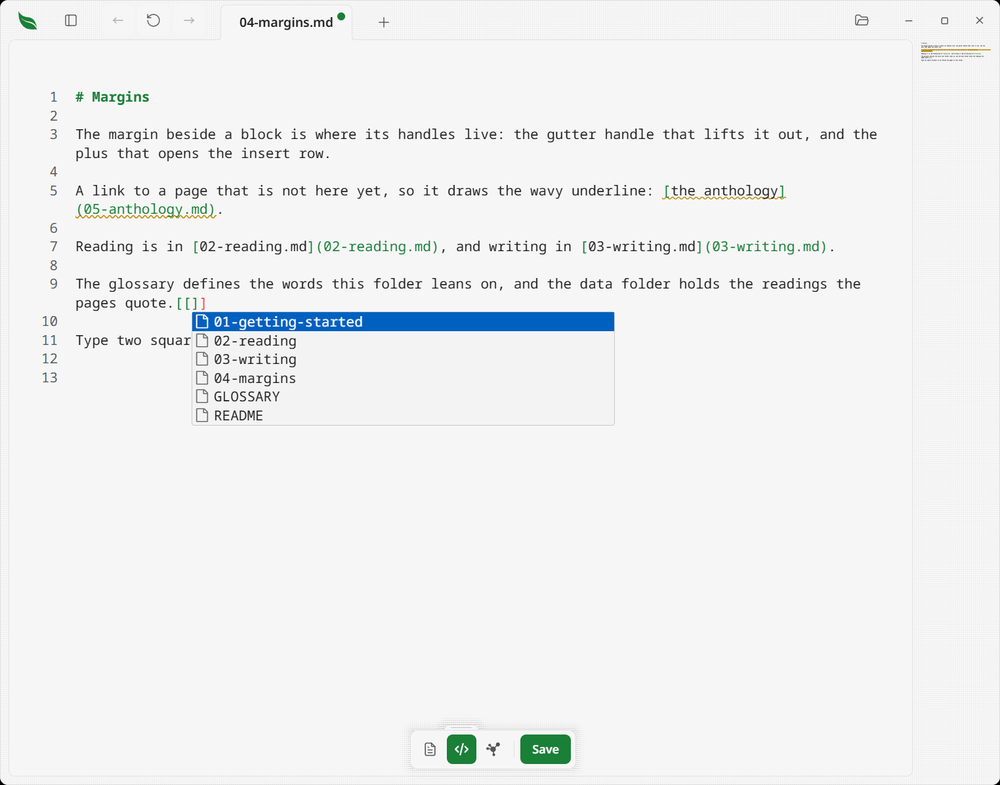

Type `[[` and your notes are listed, by file name and by any [other name](docs/01-features/03-library.md#other-names) they answer to. Type `#` for a heading. Hover a wikilink for a preview, and a link that answers to nothing gets a wavy underline. It knows only what you pointed it at. **[Typing help →](docs/01-features/07-editing.md#typing-help)**

## Keep a library

### Point it at a folder and it becomes a vault


A side pane that browses one folder at a time, with a breadcrumb that always says where you are. Name a folder a **vault** and it becomes the thing search and syncing work over; the same switcher over the start screen takes you back from Library. Nothing is crawled, and nothing is written into your folder. **[Library →](docs/01-features/03-library.md#vaults)**

The button that changes where the list is rooted is a caret and a mark, which says nothing on its own — so the first time you open the pane, one small bubble points at it and then never appears again. **[The first-launch bubble →](docs/01-features/03-library.md#the-bubble-on-your-first-launch)**

Until you have a vault the start screen offers to add your notes folder, and the pane says once what one buys you. Both go for good the moment there is one. **[Your first vault →](docs/01-features/03-library.md#your-first-vault)**

### Search everything you've written


Name matches first — the whole name beats the start of it, which beats a word inside it — then content matches ranked for the document's size, so a long file cannot win by being long. Up to three rows per file, one per place the word is, and clicking one lands on that line. There's no index on disk: the text is read once and held in memory, so nothing can go stale against your files, and nothing is uploaded to search it. A folder a machine filled — build output, a package cache — is left out of that read, and the line above the results says when one was. **[Search →](docs/01-features/03-library.md#search)**

`Ctrl+F` searches inside the document you are reading instead — one bar over the page or its source, with match case, whole word, expressions, and replace behind the padlock. **[Find in this document →](docs/01-features/02-navigation.md#find-in-this-document)**

### See how your ideas connect


The [graph view](docs/01-features/03-library.md#graph) maps the links between your documents, so you can see the shape of what you've written instead of scrolling a list. Notes you'd forgotten turn out to be next door to the one you're reading. Web addresses are nodes too, so two notes citing one page share it. **[Graph →](docs/01-features/03-library.md#graph)**

### Push a vault to GitHub


A vault can be a git repository that pushes to GitHub. Leaftext never holds a token — it runs the `git` already on your machine. A sync button appears on the breadcrumb whenever there's work that hasn't reached GitHub. **[GitHub sync →](docs/01-features/03-library.md#github-sync)**

## Move around

### Never lose your place


It moves like a browser: [tabs](docs/01-features/02-navigation.md#tabs), Back and Forward through your [history](docs/01-features/02-navigation.md#history), an [outline](docs/01-features/02-navigation.md#outline) of the open document in the pane beside it, and Ctrl-click on a link to [open it behind](docs/01-features/02-navigation.md#opening-a-link-in-a-new-page) the page you are reading. Change a file in another app and Leaftext [picks it up](docs/01-features/02-navigation.md#reload) without losing your spot. **[Navigation →](docs/01-features/02-navigation.md)**

### Take in the whole page at once

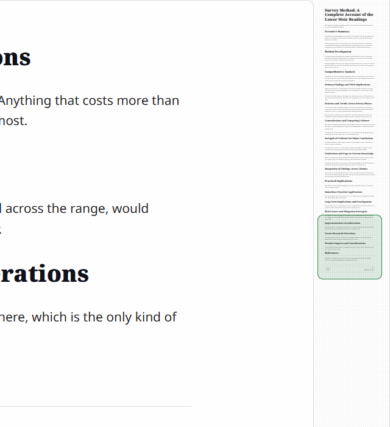

A tiny version of your document runs down the side — real text, not abstract bars — with a marker showing where you are. You'll recognize a section by its shape. Click to jump, or drag to scroll. **[Minimap →](docs/01-features/04-minimap.md)**

### Read a folder in order

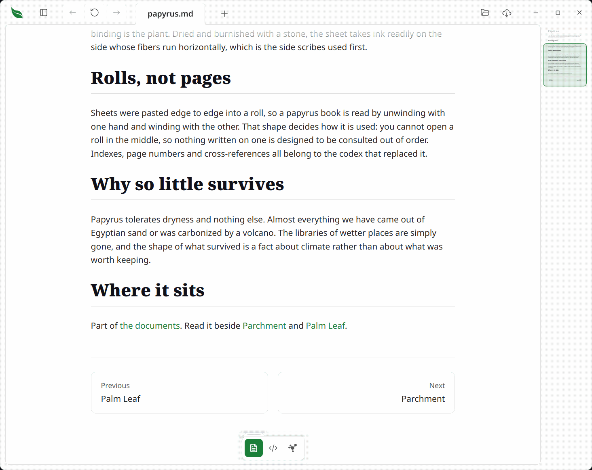

Where folders are joined by `README.md` files, a **Previous / Next** bar appears at the bottom of each page, so a folder of notes reads like a book. Point at a button and it fills with the same fine dot texture the page's code blocks wear, with a tooltip naming the document it opens. **[Pager →](docs/01-features/02-navigation.md#pager)**

### Define a word once for a whole set of notes

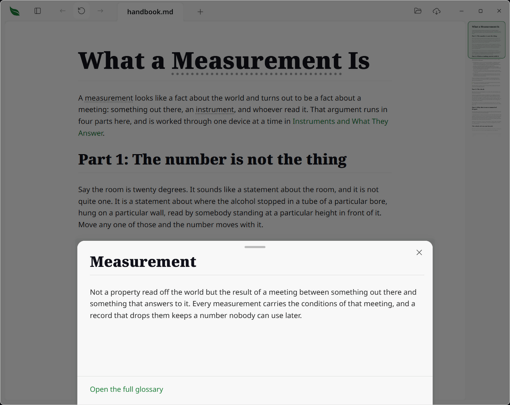

Write one `GLOSSARY.md` and every mention of a defined term, across every document, links to it — resting on one draws its entry in the hover card, and clicking one opens a sheet over the page instead of taking you away from it. **[Glossary →](docs/01-features/02-navigation.md#glossary)**

## Make it yours

### Eleven themes, light and dark


[Amaranth, Arabica, Bloodleaf, Fern, Ginger, GitHub, Goldenrod, Halcyon, Nightshade, Pippin, and Sage](docs/01-features/06-themes.md#families) — each in light and dark, plus System and Daylight if you'd rather the app follow the time of day. Everything moves together: text, code, callouts, diagrams, minimap, and the [icons](docs/01-features/06-themes.md#icons) — seven icon sets, and each theme wears one. Each theme's font is fetched from Google Fonts the first time you choose it. **[Themes →](docs/01-features/06-themes.md)**

### Settings you can read, where you need them

There's no settings panel to hunt through. Every control stands where it applies: the palette in the app bar for [theme and appearance](docs/01-features/06-themes.md#choose), the [graph](docs/01-features/03-library.md#graph)'s own toolbar for how big a map to draw. It's all a plain JSON file on your machine, not an account. **[Settings →](docs/01-features/05-settings.md)**

## Your thoughts stay yours

No account. No cloud. No telemetry. Nothing you open, write, or search leaves your machine on its own.

### What reaches the network

Three things, and none of them carries a word you wrote:

- **The release check** — it asks GitHub whether a newer version exists.
- **The update download** — when one does, it fetches that installer.
- **A theme's font** — from Google Fonts, the first time you pick that theme.

The one exception is the one you ask for: [GitHub sync](docs/01-features/03-library.md#github-sync) pushes a vault to your own repository, using the `git` already on your machine. Nothing syncs unless you set it up and press the button.

### Your files stay your files

Your [settings](docs/01-features/05-settings.md) are a JSON file on your machine, and your documents are the files you already had. Delete Leaftext tomorrow and every word you wrote is still sitting in the folder you put it in, readable by anything.

Leaftext also keeps a plain text [journal](docs/01-features/05-settings.md#journal) of what it did, so a bug report has something to attach. It records file paths and errors — never a word you wrote — it stops at about a megabyte, and it goes nowhere unless you send it. Beside it sits an empty marker file saying a run is under way, which the close takes away — so a launch that still finds one says the run before it ended without closing. It holds nothing at all.

### How an update lands

An installer downloads in the background, is checked for the length the release advertised, and is re-hashed before it is ever run. Then the **next launch installs it, before any window opens** — the one moment Windows lets an app replace itself — or press **Restart to update** if you would rather not wait. Each version is installed automatically once; after that it waits for a click. An install that does not take relaunches the build you already had, so the next launch tells you which version failed, why, and which one you are still on. **[Updates →](docs/01-features/05-settings.md#updates)**

## Install it

Leaftext is free. **[Download for Windows](https://github.com/ryanallen/leaftext/releases/latest/download/leaftext-windows-x86_64.exe)** or **[for macOS](https://github.com/ryanallen/leaftext/releases/latest/download/leaftext-macos-universal.dmg)**, then follow your platform below — or the fuller walkthrough in the **[Installation guide](docs/02-installation.md#install)**.

### macOS

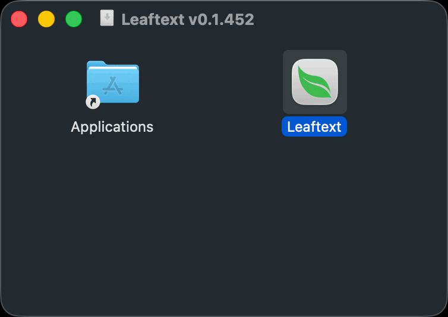

1. Download the file ending in **`-macos-universal.dmg`**. One file covers Apple Silicon and Intel.
2. Open it. Drag the leaf app onto the **Applications** folder beside it.
3. Eject the disk image, then open **Leaftext** from Applications.

#### First launch — macOS will refuse it

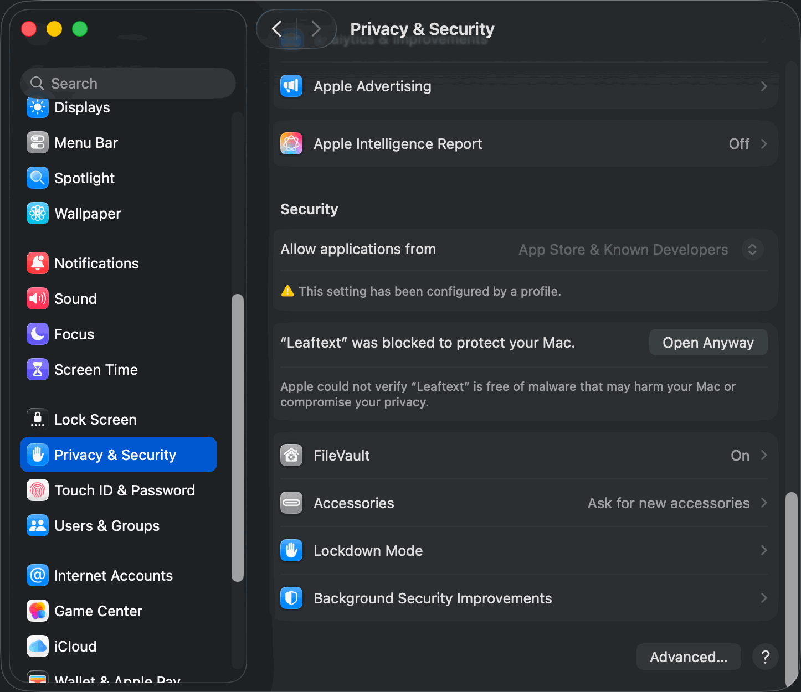

Expected. Apple charges a yearly fee to notarize an app; Leaftext is free and isn't enrolled, so macOS blocks anything unnotarized on sight. Nothing was scanned and nothing was found. Let it through once:

1. Double-click **Leaftext**, then click **Done** on the refusal.
2. Open **System Settings** → **Privacy & Security**.
3. Scroll to the bottom. Click **Open Anyway** on the line naming Leaftext.
4. Confirm with Touch ID or your password, then click **Open**.

Every launch after that is an ordinary double-click. On macOS 12 and earlier it's shorter: right-click the app → **Open** → **Open**. If the **Open Anyway** button never appears, open Terminal and run `xattr -cr /Applications/leaftext.app` instead. **[More detail →](docs/02-installation.md#mac-blocks-the-first-launch)**

### Windows

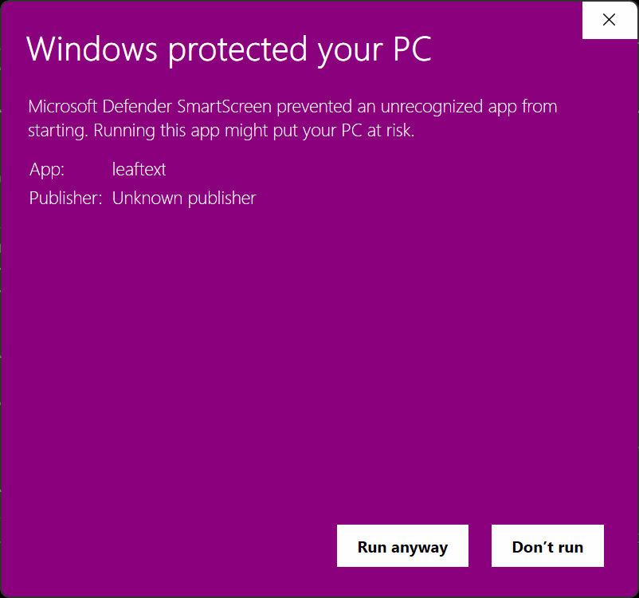

Grab the 64-bit MSI and run it. If a full-screen **Windows protected your PC** box appears, click **More info** → **Run anyway** — the installer isn't signed with a paid certificate. It installs just for you, with no admin prompt. Here by default, though **Change...** puts it anywhere you like and updates keep it there:

```text
%LOCALAPPDATA%\Programs\leaftext\bin\leaftext.exe
```

Your app data lives alongside it:

```text
%LOCALAPPDATA%\ryanallen\leaftext\data
```

**Leaftext opens itself when the install finishes.** After that, launch it from the Start Menu, or tap the Windows key and type **Leaftext**. One Start Menu entry, no desktop shortcut.

If a small box says **the system administrator has set policies to prevent this installation**, that machine is set to refuse Windows Installer packages and no certificate would change it. Take the `.exe` from the release page instead — same install, same folder, same Start Menu entry, and updates keep arriving as that file. **[More detail →](docs/02-installation.md#windows-refuses-the-msi)**

> **Upgrading from v0.1.364 or earlier?** Uninstall the old version first, from **Settings → Apps**. Those installed machine-wide into `C:\Program Files`, and a per-user package can't remove one, so you'd end up with two copies.

### Opening files with it

Installing registers Leaftext for every extension it reads, including `.txt`, `.ini`, `.docx`, `.docm`, `.xlsx`, `.xlsm`, `.pptx`, `.pptm`, `.odt`, `.ods`, `.odp`, and source-file extensions such as `.rs`, `.py`, `.toml`, `.jsonc`, and `.gql`, so Leaftext is available from Open with. Source files, HTML, plain text, `.ini` and Word, Excel, PowerPoint and OpenDocument files stay with their current app unless you choose Leaftext. **[File associations →](docs/02-installation.md#file-associations)**

## Learn it

New here? The **[Quickstart](docs/03-quickstart.md)** gets you reading in a couple of minutes. Then browse the **[full documentation](docs/01-introduction.md)**.

| Page | What it covers |
| --- | --- |
| [Quickstart](docs/03-quickstart.md) | Open a file, read it, move around, come back to it |
| [Installation](docs/02-installation.md) | Both platforms, the first-launch warnings, file associations, updates |
| [Rendering](docs/01-features/01-rendering.md) | Every syntax and format it reads, with live examples |
| [Navigation](docs/01-features/02-navigation.md) | Tabs, history, outline, pager, glossary, link hints and the link menu, live reload |
| [Library](docs/01-features/03-library.md) | Vaults, the file tree, search, the graph, GitHub sync, file actions |
| [Minimap](docs/01-features/04-minimap.md) | The side rail, in both the reading view and the code view |
| [Settings](docs/01-features/05-settings.md) | Every preference, its default, and where it is stored |
| [Themes](docs/01-features/06-themes.md) | The eleven families, appearance, fonts, diagram colors |
| [Editing](docs/01-features/07-editing.md) | Inline editing, the block gutter, the flowchart editor, code view, save |
| [Glossary](docs/GLOSSARY.md) | Every word Leaftext uses for a part of itself |

The pages are plain Markdown under [`docs/`](docs/) — the same format the app reads, so you can open them in Leaftext itself.

---

## Development

See [Building](docs/02-development/02-building.md), [Architecture](docs/02-development/01-architecture.md), [Security](docs/02-development/08-security.md), [Theming](docs/02-development/04-theming.md), [Design system](docs/02-development/05-design-system.md), [Releasing](docs/02-development/03-releasing.md), and [Workflow](docs/02-development/07-workflow.md) for the full developer docs.

Every theme is drawn on one page at **[leaftext.com/gallery.html](https://leaftext.com/gallery.html)** — all 82 colors, every icon and every part of the interface, in light and dark.

Run the full verification suite before handing work back:

```sh
just verify
```

Other [`Justfile`](Justfile) tasks:

| Task | Command |
|:--|:--|
| Cut a release | `just release <version>` |
| Finish a release GitHub would not publish | `just publish-release <version>` |

`just release` commits the version bump, tags, and pushes — CI builds the two Windows installers and the macOS DMG. `just publish-release` starts those builds again against a tag that is already up, for the case where the installers were built and only the release to hang them on was refused; it writes nothing, so no second version number is spent. See [Releasing](docs/02-development/03-releasing.md#finishing-a-release-github-refused).

### Every written file in the repo

The prose, the design sources, and the guidance an agent reads — each of these links onward to the rest of its own set, so nothing in the tree is reachable only by knowing it is there.

| Where | What is in it |
|:--|:--|
| [Documentation](docs/README.md) | Every page published at [leaftext.com/docs](https://leaftext.com/docs), listed above |
| [Glossary](docs/GLOSSARY.md) | Every word Leaftext uses for a part of itself |
| [Agent guide](AGENTS.md) | The standing rules for anyone — person or agent — changing this repo. `CLAUDE.md` and `CODEX.md` are the same file. Its tables link the fifteen [skills](.agents/skills/) and the [hook settings](.agents/settings.json), and [Workflow](docs/02-development/07-workflow.md) is the published account of how they fit together |
| [Design sources](docs/02-development/05-design-system.md) | [Colors](design/colors.md), [tokens](design/tokens.md), [icons](design/icons.md) and [components](design/components.md) — the four files every value in the interface is compiled from |
| [Themes](themes/README.md) | The eleven families, one Markdown file each, with the colors they set and the icon set they wear. `just bundle-themes` compiles them into [one bundle](src/assets/themes.md) the app reads at startup |
| Third-party notices | [Feather](src/assets/Feather-MIT.md), [Heroicons](src/assets/Heroicons-MIT.md), [KaTeX](src/assets/KaTeX-MIT.md), [Lucide](src/assets/Lucide-ISC.md), [Noto](src/assets/Noto-OFL.md), [Phosphor](src/assets/Phosphor-MIT.md), [Remix Icon](src/assets/Remix-Apache.md), [Simple Icons](src/assets/SimpleIcons-CC0.md), [Tabler](src/assets/Tabler-MIT.md) — the licenses of what is vendored into the app |
| Crawler files | [`robots.txt`](robots.txt), [`sitemap.xml`](sitemap.xml), [`sitemap-md.txt`](sitemap-md.txt), [`llms.txt`](llms.txt), [`llms-full.txt`](llms-full.txt) — generated from this file and `docs/` by `scripts/seo-gen.mjs` |
