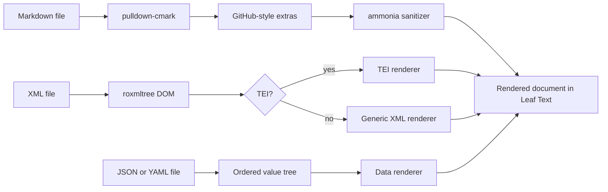
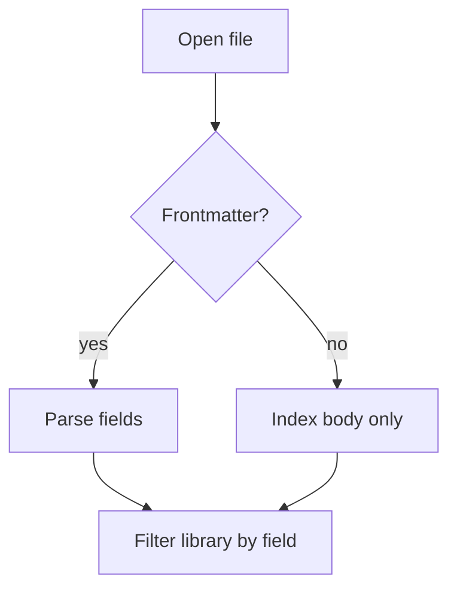
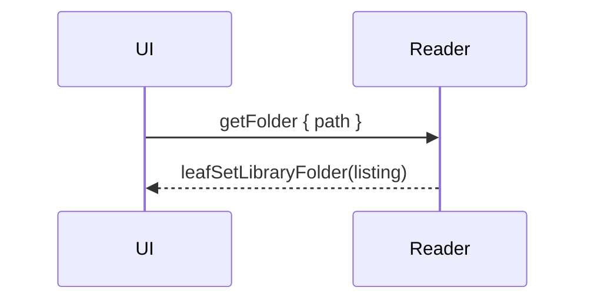

# Rendering

> Read without the noise. Leaf Text renders your Markdown the way GitHub does — code, diagrams, math, callouts, footnotes, emoji, your own images — and opens your structured files too: 84000-style TEI translations through a reader that knows the format, any other XML through a generic one, and JSON or YAML as readable pages.

Leaf Text picks a pipeline from the file extension. Markdown (`.md`, `.markdown`, `.mdown`) is parsed in Rust with `pulldown-cmark`, run through a GitHub-like rendering pipeline, sanitized, and handed to the WebView. `.xml` takes a parallel path — parsed with `roxmltree`, then routed by what the file contains: a TEI document goes to the [TEI renderer](#tei-xml-84000-translations), anything else to the [generic XML renderer](#any-xml). `.json`, `.yaml`, and `.yml` go to the [data renderer](#data-files-json-and-yaml), which reads the same shapes the generic XML renderer does. All of them produce the same HTML shell. Every Markdown feature below is shown with a live example, rendered by the same engine that draws your documents; the XML and data sections are described rather than demonstrated, since a Markdown page cannot embed a live document of another format.

## Summary

| Category | Supported |
| --- | --- |
| Core Markdown | Headings, paragraphs, lists, links, images, blockquotes, rules, inline code |
| GFM | Tables, task lists, strikethrough, autolinks |
| Extras | Syntax highlighting, Mermaid, math, alerts, footnotes, emoji |
| Leaf extensions | [Buttons](#buttons-leaf-extension) — a link wrapped in braces |
| Local content | [Images](#images) by relative, absolute, or `file://` path |
| Safety | Sanitized HTML allowlist |
| [XML](#any-xml) | Any `.xml` file: sections, label/value fields, record tables, links |
| [TEI XML](#tei-xml-84000-translations) | 84000 Buddhist-translation format; headings, paragraphs, verse, footnotes |
| [JSON and YAML](#data-files-json-and-yaml) | Any `.json`, `.yaml`, or `.yml` file, read by the same shape rules as XML |

## Pipeline



## Headings

All six ATX heading levels render:

# H1 heading
## H2 heading
### H3 heading
#### H4 heading
##### H5 heading
###### H6 heading

Every heading gets a slug `id`, so `#slug` links and the [outline](02-navigation.md#outline) resolve against it. Blocks carrying an explicit author-supplied `id` keep theirs — see [Inline HTML](#inline-html).

## Text formatting

- *Italic* and _italic_
- **Bold** and __bold__
- ***Bold italic***
- ~~Strikethrough~~ (GFM)
- `inline code`
- Inline footnote reference[^demo]

A trailing backslash forces a hard line break,\
so this sentence continues on the next line.

## Lists

Unordered, with nesting:

- Leaves
  - Simple
  - Compound
- Stems
- Roots

Ordered lists nest into a classic outline (I, A, 1, a, i):

1. Trees
   1. Broadleaf
      1. Deciduous
         1. Maple
            1. Sugar maple
            2. Red maple
            3. Silver maple
         2. Oak
      2. Evergreen
         1. Holly
   2. Needleleaf
      1. Pine
2. Shrubs
3. Ground cover

## Blockquotes and alerts

A blockquote, nested:

> "Read deeply, not widely."
>
> > A leaf within a leaf.

GitHub-style alerts render with theme-aware colors (all five):

> [!NOTE]
> Leaf Text renders Markdown — it never edits it.

> [!TIP]
> Search every leaf in your library with a keystroke.

> [!IMPORTANT]
> Pages render entirely on your machine. No network.

> [!WARNING]
> A reader, not an editor.

> [!CAUTION]
> A stray `---` mid-page is a horizontal rule, not frontmatter.

Standard blockquotes also use a hanging indent for each authored line, so when a long quoted line wraps in the reader the continuation stays inset and you can distinguish a soft wrap from a Markdown hard line break.

## Code

Language-tagged fenced code blocks get syntax coloring, a language badge, and a Copy button. Hover a block to reveal the button.

A line too long for the column scrolls sideways inside the block; the badge and the Copy button stay put while it does, and the block itself keeps the reading column's left edge.

```rust
/// Extract the leading frontmatter block, if any.
pub fn extract_frontmatter(text: &str) -> Option<FrontmatterBlock> {
    let text = text.strip_prefix('\u{feff}').unwrap_or(text);
    let mut lines = text.lines();
    if lines.next()?.trim_end() != "---" {
        return None;
    }
    let mut body = String::new();
    for line in lines {
        if line.trim_end() == "---" {
            return Some(FrontmatterBlock { body });
        }
        body.push_str(line);
        body.push('\n');
    }
    None
}
```

A plain fence renders as monospace with no colors:

```
no language, no highlighting
```

Supported language tags include `ts`, `tsx`, `js`, `jsx`, `json`, `html`, `css`, `scss`, `md`, `bash`, `zsh`, `yaml`, `toml`, `xml`, `ini`, `rust`, `python`, `sql`, `diff`, `dotenv`, `dockerfile`, `graphql`, and plain text.

## Tables

GFM tables with a header row and a body:

| Feature       | Syntax         | Supported |
| ------------- | -------------- | --------- |
| Tables        | `\| a \| b \|` | ✅        |
| Strikethrough | `~~text~~`     | ✅        |
| Task lists    | `- [ ] item`   | ✅        |
| Autolinks     | bare URLs      | ✅        |

A table cell whose entire content is a task-list marker — `[ ]` or `[x]` — renders as a checkbox, so a table can carry a status column:

| Step            | Done  |
| --------------- | ----- |
| Render a page   | [x]   |
| Search files    | [x]   |
| Edit the source | [ ]   |

## Task lists

- [x] Render a page
- [x] Search the library
- [ ] Reformat the source on save (out of scope — edits are saved verbatim)

## Links and autolinks

- Inline link: [the Leaf Text repo](https://github.com/ryanallen/leaftext)
- Reference link: [CommonMark][cm]
- Relative link to a sibling page: [Navigation](02-navigation.md)
- In-page link back to the [top](#rendering)
- Bare URL autolink: https://github.com/ryanallen/leaftext
- www autolink: www.example.com
- Email autolink: hello@example.com

[cm]: https://commonmark.org

## Buttons (Leaf extension)

This one is a Leaf Text addition, not standard Markdown. Wrap an ordinary inline
link in braces and it renders as a button styled like the app's action controls,
linking wherever the link points. The more braces, the more prominent the button:

| Style | Syntax | Looks like |
| --- | --- | --- |
| Ghost | `{[Label](url)}` | No fill or outline until hover |
| Outline | `{{[Label](url)}}` | Outline, fills on hover |
| Filled | `{{{[Label](url)}}}` | Filled |

{[Ghost](https://github.com/ryanallen/leaftext)} {{[Outline](https://github.com/ryanallen/leaftext)}} {{{[Filled](https://github.com/ryanallen/leaftext)}}}

Each is just a normal `[label](url)` link with braces around the whole thing. The
wrapper is braces only — brackets are link syntax, so `[[Label](url)]` is a plain
link between two square brackets, not a button. The braces must balance: `{{…}`
is prose and stays as written. The label may hold inline formatting, and the
button follows a link like any other (external URLs open in your browser,
relative `.md` paths open in the reader). Written inside code the wrapper stays
literal, so this page can show the syntax without turning it into a button.

## Images

Image paths are resolved against the open file: relative paths (including `../` at any depth), absolute paths, and `file://` URLs all load. The title shows on hover:


Allowed image types include SVG, PNG, JPEG, GIF, APNG, AVIF, BMP, ICO, and WebP.

Images always show the file that is on disk. Overwriting one refreshes it in the open document straight away ([Reload](02-navigation.md#reload)), and every rerender re-reads them, so a replaced picture never lingers as a cached copy.

## Math

Inline math uses `$…$`: the mass–energy equivalence is $E = mc^2$.

Display math uses `$$…$$`:

$$
\int_{a}^{b} f(x)\,dx = F(b) - F(a)
$$

## Mermaid diagrams

`mermaid` fences are rendered with the bundled Mermaid runtime, fully offline. If Mermaid fails, Leaf Text leaves the source visible instead of a blank block.





## Emoji

Leaf Text renders GitHub shortcodes:

- `:rocket:` → :rocket:
- `:tada:` → :tada:
- `:warning:` → :warning:
- `:white_check_mark:` → :white_check_mark:
- `:shipit:` → :shipit:

## GitHub references

Inside a Git repo, issue, PR, and commit references link to the repo; @mentions are highlighted:

- Issue or PR: #1, GH-2
- Cross-repo issue: ryanallen/leaftext#3
- Commit: e4d3ec8
- Mention: @ryanallen
- Team mention: @ryanallen/maintainers

## Footnotes

Footnotes collect at the foot of the page, each with a back-link.[^one] Reference one twice[^one] or add more.[^two]

[^demo]: Referenced from the *Text formatting* section.
[^one]: Click the back-arrow to jump back.
[^two]: With `inline code` and a [link](https://commonmark.org).

## Frontmatter

A leading `--- … ---` block becomes a metadata table at the top of the page:

```yaml
---
title: Launch Notes                # key: value scalar
status: draft                      # strings, booleans, numbers, dates → text
audience: [readers, testers]       # inline array → one row per item
tags:                              # block list → one row per item
  - markdown
  - demo
created: 2026-06-14
pinned: true
---
```

…renders as this table (list values expand to one row each):

<div class="frontmatter"><table><tbody><tr><th>title</th><td>Launch Notes</td></tr><tr><th>status</th><td>draft</td></tr><tr><th>audience</th><td>readers</td></tr><tr><th>audience</th><td>testers</td></tr><tr><th>tags</th><td>markdown</td></tr><tr><th>tags</th><td>demo</td></tr><tr><th>created</th><td>2026-06-14</td></tr><tr><th>pinned</th><td>true</td></tr></tbody></table></div>

- Only the **leading** block counts; a later `---` is a horizontal rule.
- Malformed frontmatter still renders — just without the table.

## Collapsible sections

`<details>` / `<summary>` fold content away. Add `open` to start expanded.

<details open>
<summary>Open by default — click to collapse</summary>

Folded content holds full Markdown: **formatting**, <kbd>Ctrl</kbd>, and a list.

- A leaf
- A page

</details>

<details>
<summary>Closed by default — click to expand</summary>

Tucked away until you open it.

</details>

## Inline HTML

Leaf Text sanitizes raw HTML with `ammonia`: a curated set of **safe** tags is allowed; the rest is stripped, keeping the inner text.

Beyond plain Markdown: <ins>inserted</ins>, <s>struck</s>, and <mark>highlighted</mark> text. Water is H<sub>2</sub>O and 2<sup>10</sup> = 1024. Press <kbd>Ctrl</kbd> + <kbd>F</kbd> to search. An <abbr title="HyperText Markup Language">HTML</abbr> abbreviation shows its title on hover.

Definition list:

<dl>
<dt>Leaf</dt>
<dd>A page, rendered for reading.</dd>
<dt>Frontmatter</dt>
<dd>Metadata at the top of a page.</dd>
</dl>

`align` on `<div>`, `<p>`, and headings (`<h1>`–`<h6>`) controls horizontal alignment:

<div align="center">Centered block</div>
<p align="right">Right-aligned paragraph</p>
<h2 align="center">Centered heading</h2>

Accepted values: `left`, `center`, `right`, `justify`. Note: `align` is stripped from `<blockquote>` — it is not in the allowlist for that tag.

An `id` on a `<div>`, `<p>`, `<span>`, or a heading (`<h1>`–`<h6>`) creates a named anchor with a stable, author-controlled address for deep-linking (the sanitizer keeps `id` only on those tags):

<h1 id="foreword" align="center">Foreword</h1>

Link to it from anywhere on the same page: `[Foreword](#foreword)`. Headings are addressable this way without any markup of your own — each gets a slug `id` from its text.

`<br>` forces a line break inside a paragraph without starting a new block:

Line one.<br>Same paragraph, next line.

Markdown italic can wrap an HTML heading — useful for centering and italicising a title together:

*<h1 align="center">Words of My Perfect Teacher</h1>*

Stripped for safety: `<script>`, inline event handlers such as `onclick=`, `javascript:` URLs, and disallowed elements such as `<iframe>` and `<form>`.

## Horizontal rules

Three or more `-`, `*`, or `_` on their own line:

---

***

___

## Text in any language

The interface is English. Your documents are not: anything valid UTF-8 renders as written, unaltered — accents, Greek, Cyrillic, Hebrew, Arabic, CJK, emoji:

> Lire, sans éditer. Ανάγνωση, όχι επεξεργασία. — Leaf Text показывает готовый документ.

| Feature | Behavior |
| :-- | :-- |
| Full-text search | Matches on any substring, whatever the script |
| Frontmatter | Filters the library by field, whatever the value |

Editing is anchored to byte offsets in the file, so a multi-byte character above the block you are editing never shifts where that block is saved.

## XML

Leaf Text opens `.xml` files alongside `.md` files — the same "Open Document" dialog accepts both, and the [library](03-library.md) indexes both. Which XML renderer runs is decided by the file itself, not by its name: a document with a `<TEI>` root or a `<teiHeader>` goes to the [TEI renderer](#tei-xml-84000-translations); everything else goes to the generic one.

Doctypes are read and ignored, so plists, XHTML, and DocBook open normally. A file that is not well-formed renders as a single line naming the parse position — `XML parse error. expected 'b' tag, not 'a' at 1:7` — instead of a blank page.

### Any XML

Most XML carries no reading conventions to follow, so the generic renderer works from the shape of the tree:

| Shape in the file | Rendered as |
|---|---|
| An element holding only text, or only attributes | A label/value field. Consecutive ones share one two-column list, so labels line up down the page |
| Two or more sibling records with the same tag, made only of short values | A [table](#tables), one row per record, columns in first-seen order |
| An element holding other elements | A section. Its heading is its own `<title>`/`<head>` child, or `Tag: name` when a `<name>` child or a naming attribute (`name`, `id`, `type`, `class`) is all there is, or the tag name itself |
| An element mixing text and inline markup | A paragraph of its text |
| A value that is entirely a URL | A link |

Tag names are read as words, so `lastBuildDate` renders as "Last build date" and `group_id` as "Group id"; a few names common in feeds and sitemaps are spelled out (`loc` → "URL", `lastmod` → "Last modified", `pubDate` → "Published"). Headings get the same slugs Markdown headings do, so the [outline](02-navigation.md#outline) and the [minimap](04-minimap.md) work the same way.

A file that names no title of its own — a sitemap has nowhere to say what it is — is headed and titled by its file name.

A sitemap, for example, renders as a table of its `<url>` records; an RSS or Atom feed as its channel title, its channel fields, then one section per item; a Maven POM as its project fields plus a table of dependencies.

### TEI XML (84000 translations)

TEI documents have conventions worth following, so they get their own renderer.

**Supported TEI elements:**

| Element | Rendered as |
|---|---|
| `<titleStmt>` titles | The document title block. The English main title (`type="mainTitle" xml:lang="en"`) becomes the page heading and the tab/library title; beneath it, in muted text, come the Sanskrit main title (italic), the English long title, and the Sanskrit long title (italic). Tibetan titles are never shown. Files with no typed titles fall back to the first non-Tibetan `<title>` |
| `<front>` | The front matter (summary, acknowledgments, introduction) that precedes the body, rendered as a collapsed disclosure (a `<details>` you click to open) so the reader lands on the translation itself. Its own section headings stay out of the outline |
| `<div type="…">` | A nested section. Heading level follows nesting depth (`##` at the top, one smaller per level, floored at `######`), so a nested heading is never larger than the one above it. `translation` is a transparent wrapper (no heading, no added depth) |
| `<head>` | Heading text at the div's depth, including inline children (e.g. a nested `<title>`) |
| `<p>` | Paragraph |
| `<lg><l>…</l></lg>` | Verse stanza rendered as a [blockquote](#blockquotes-and-alerts) (left bar + hanging indent), one `<l>` line per row |
| bare `<l>…</l>` | Verse lines with no `<lg>` wrapper — a run of adjacent `<l>` siblings is coalesced into a single blockquote, like consecutive `>` lines in Markdown |
| `<note place="end">` | Inline footnote (collected at page foot) |
| `<ptr>` | Cross-reference label kept; linked when the target is an external URL, plain text for internal targets |
| `<term>`, `<title>`, `<ref>` | Inline text (tags stripped) |
| `<milestone>`, `<lb>`, `<caesura>` | Omitted |

Both XML renderers walk the `roxmltree` DOM and produce the same HTML structure the Markdown pipeline outputs, so themes, footnotes, minimap, pager, and [inline editing](07-editing.md#inline-editing-the-reading-view) all work unchanged for XML documents.

The web reader on this site (`site/reader.js`) renders `.xml` through `renderTEI()` from `tei-xml.js`, which uses `DOMParser` — the TEI path only, fully offline. The generic XML renderer is app-side.

## Data files (JSON and YAML)

Leaf Text opens `.json`, `.yaml`, and `.yml` as pages. A data file is a tree of mappings, lists, and values rather than prose, so it is read by the same shape rules as [any XML](#any-xml) — and shares that renderer's labels, so a sitemap and the JSON next to it name the same field the same way.

| Shape in the file | Rendered as |
|---|---|
| A run of keys holding single values | A label/value field. Consecutive ones share one two-column list, so labels line up down the page |
| Two or more list entries with the same keys, made only of short values | A [table](#tables), one row per entry, columns in first-seen order |
| A key holding a mapping or a list | A section, headed by the key name |
| A list of single values | A bulleted list |
| A value that is entirely a URL | A link |
| `null`, or a value that is empty | Nothing at all, like an empty XML element |

Key names are read as words, so `runs-on` renders as "Runs on" and `lastBuildDate` as "Last build date"; the same spelled-out names apply (`loc` → "URL", `lastmod` → "Last modified"). A root `title` or `name` key titles the document and heads the page, and is not repeated in the body; a file that has neither is headed and titled by its file name. Headings get the same slugs Markdown headings do, so the [outline](02-navigation.md#outline), the [minimap](04-minimap.md), and the [pager](02-navigation.md#pager) all work as they do elsewhere.

**JSON** is read by Leaf Text's own reader, so nothing about the file is normalized on the way in: keys stay in the order the file wrote them, and numbers display exactly as written rather than being routed through a float. It is deliberately forgiving of two things that are not strictly JSON but are everywhere in the `.json` files people actually open, like `tsconfig.json` and editor settings: `//` and `/* */` comments, and a trailing comma before a closing brace or bracket.

**YAML** is parsed with `yaml-rust2`. An `*alias` is resolved to what its `&anchor` held, and a `<<:` merge key is spliced into the mapping that used it — so a job that merges shared defaults shows those settings under the job, not as a field named `<<`. Keys already written win, which is what merging means. Several documents in one stream (separated by `---`) read as a list of them, so a multi-document Kubernetes manifest renders as a table of its resources.

A file that will not parse renders a single line naming the position — `JSON parse error. expected ',' or '}' after the value (line 12)` — instead of a blank page. A file nested hundreds of levels deep is refused the same way rather than being followed down.

> [!NOTE]
> Data files are opened through **Open Document**, drag and drop, or the [library](03-library.md), and they are indexed and paged like any other document. Installing Leaf Text does **not** register it as the handler for `.json` or `.yaml`, so double-clicking one in your file manager still opens whatever you normally use. Only [Markdown and XML extensions are associated](../02-installation.md#file-associations).

Editing works, with one limit worth knowing. The [code view](07-editing.md#code-view) edits any data file as raw text, exactly as it does Markdown and XML. In the reading view, a block is click-to-edit only where its precise byte range in the file can be *proved*: that covers every JSON value, and YAML plain scalars. YAML lists, tables, quoted strings, and block scalars (`|`, `>`) are read-only in the reading view and edited in the code view instead — an approximate range would splice an edit over the wrong bytes, so none is offered. See [Editing data files](07-editing.md#editing-data-files).

## Next

- [Navigation](02-navigation.md)
- [Themes](06-themes.md)
- [Architecture](../02-development/01-architecture.md)
