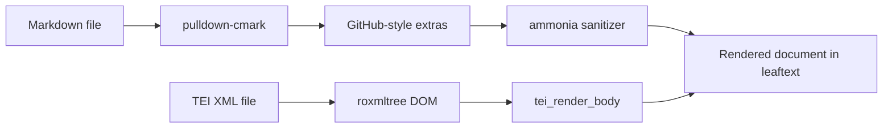
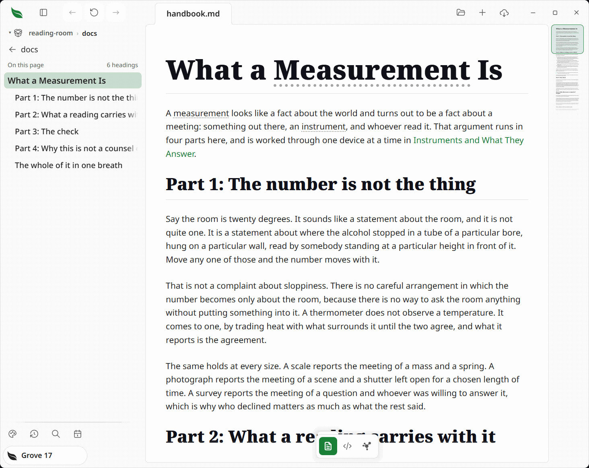
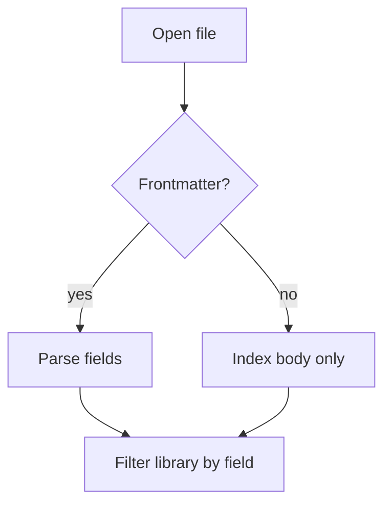
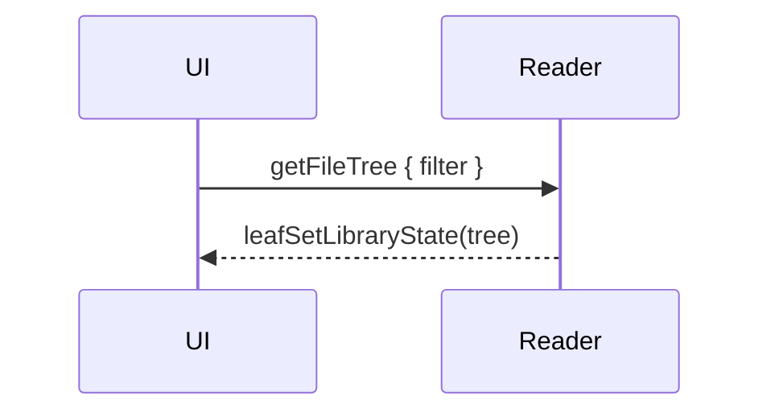

# Rendering

> leaftext reads two formats. It renders CommonMark and GFM Markdown with the GitHub-style extras people actually use — code fences, Mermaid, math, alerts, footnotes, emoji, and local images — and it renders 84000-style TEI XML translations.

leaftext picks a pipeline from the file extension. Markdown (`.md`, `.markdown`, `.mdown`) is parsed in Rust with `pulldown-cmark`, run through a GitHub-like rendering pipeline, sanitized, and handed to the WebView. TEI XML (`.xml`) takes a parallel path — parsed with `roxmltree` and rendered by `tei_render_body` into the same HTML shell (see [TEI XML](#tei-xml-84000-translations)). Every Markdown feature below is shown with a live example, rendered by the same engine that draws your documents; the TEI section is described rather than demonstrated, since a Markdown page cannot embed a live TEI document.

## Summary

| Category | Supported |
| --- | --- |
| Core Markdown | Headings, paragraphs, lists, links, images, blockquotes, rules, inline code |
| GFM | Tables, task lists, strikethrough, autolinks |
| Extras | Syntax highlighting, Mermaid, math, alerts, footnotes, emoji, block permalinks |
| Local content | Relative images |
| Safety | Sanitized HTML allowlist |
| TEI XML | 84000 Buddhist-translation format (`.xml`); headings, paragraphs, verse, footnotes |

## Pipeline



## Headings

All six ATX heading levels render:

# H1 heading
## H2 heading
### H3 heading
#### H4 heading
##### H5 heading
###### H6 heading

Every heading gets a slug `id`. Every other content block — paragraphs, list items, blockquotes, code blocks, tables, and more — gets a stable auto-assigned `id` too. Hover any block, or the gutter spot beside it, to reveal a permalink button in the left margin; clicking it jumps to that exact block. On touch devices, which have no hover, the button stays faintly visible in the margin beside every block and brightens when tapped. A blockquote (or GitHub alert) is treated as a single citable unit: it carries one permalink button, and the paragraphs inside it share it — each still keeps its own `id`, so a direct `#`-link to an inner block resolves. Blocks with an explicit author-supplied `id` work the same way — see [Inline HTML](#inline-html).

## Text formatting

- *Italic* and _italic_
- **Bold** and __bold__
- ***Bold italic***
- ~~Strikethrough~~ (GFM)
- `inline code`
- Inline footnote reference[^demo]

A trailing backslash forces a hard line break,\
so this sentence continues on the next line.

## Lists

Unordered, with nesting:

- Leaves
  - Simple
  - Compound
- Stems
- Roots

Ordered lists nest into a classic outline (I, A, 1, a, i):

1. Trees
   1. Broadleaf
      1. Deciduous
         1. Maple
            1. Sugar maple
            2. Red maple
            3. Silver maple
         2. Oak
      2. Evergreen
         1. Holly
   2. Needleleaf
      1. Pine
2. Shrubs
3. Ground cover

## Blockquotes and alerts

A blockquote, nested:

> "Read deeply, not widely."
>
> > A leaf within a leaf.

GitHub-style alerts render with theme-aware colors (all five):

> [!NOTE]
> Leaf Text renders Markdown — it never edits it.

> [!TIP]
> Search every leaf in your library with a keystroke.

> [!IMPORTANT]
> Pages render entirely on your machine. No network.

> [!WARNING]
> A reader, not an editor.

> [!CAUTION]
> A stray `---` mid-page is a horizontal rule, not frontmatter.

Standard blockquotes also use a hanging indent for each authored line, so when a long quoted line wraps in the reader the continuation stays inset and you can distinguish a soft wrap from a Markdown hard line break.

## Code

Language-tagged fenced code blocks get syntax coloring, a language badge, and a Copy button. Hover a block to reveal the button.

```rust
/// Extract the leading frontmatter block, if any.
pub fn extract_frontmatter(text: &str) -> Option<FrontmatterBlock> {
    let text = text.strip_prefix('\u{feff}').unwrap_or(text);
    let mut lines = text.lines();
    if lines.next()?.trim_end() != "---" {
        return None;
    }
    let mut body = String::new();
    for line in lines {
        if line.trim_end() == "---" {
            return Some(FrontmatterBlock { body });
        }
        body.push_str(line);
        body.push('\n');
    }
    None
}
```

A plain fence renders as monospace with no colors:

```
no language, no highlighting
```

Supported language tags include `ts`, `tsx`, `js`, `jsx`, `json`, `html`, `css`, `scss`, `md`, `bash`, `zsh`, `yaml`, `toml`, `xml`, `ini`, `rust`, `python`, `sql`, `diff`, `dotenv`, `dockerfile`, `graphql`, and plain text.

## Tables

GFM tables with a header row and a body:

| Feature       | Syntax         | Supported |
| ------------- | -------------- | --------- |
| Tables        | `\| a \| b \|` | ✅        |
| Strikethrough | `~~text~~`     | ✅        |
| Task lists    | `- [ ] item`   | ✅        |
| Autolinks     | bare URLs      | ✅        |

## Task lists

- [x] Render a page
- [x] Search the library
- [ ] Edit anything (out of scope — Leaf Text is a reader)

## Links and autolinks

- Inline link: [the Leaf Text repo](https://github.com/ryanallen/leaftext)
- Reference link: [CommonMark][cm]
- Relative link to a sibling page: [Navigation](02-navigation.md)
- In-page link back to the [top](#rendering)
- Bare URL autolink: https://github.com/ryanallen/leaftext
- www autolink: www.example.com
- Email autolink: hello@example.com

[cm]: https://commonmark.org

## Images

Relative image paths work when they stay inside the opened file's allowed directory scope; the title shows on hover:



Allowed image types include SVG, PNG, JPEG, GIF, APNG, AVIF, BMP, ICO, and WebP.

## Math

Inline math uses `$…$`: the mass–energy equivalence is $E = mc^2$.

Display math uses `$$…$$`:

$$
\int_{a}^{b} f(x)\,dx = F(b) - F(a)
$$

## Mermaid diagrams

`mermaid` fences are rendered with the bundled Mermaid runtime, fully offline. If Mermaid fails, leaftext leaves the source visible instead of a blank block.





## Emoji

leaftext renders GitHub shortcodes:

- `:rocket:` → :rocket:
- `:tada:` → :tada:
- `:warning:` → :warning:
- `:white_check_mark:` → :white_check_mark:
- `:shipit:` → :shipit:

## GitHub references

Inside a Git repo, issue, PR, and commit references link to the repo; @mentions are highlighted:

- Issue or PR: #1, GH-2
- Cross-repo issue: ryanallen/leaftext#3
- Commit: e4d3ec8
- Mention: @ryanallen
- Team mention: @ryanallen/maintainers

## Footnotes

Footnotes collect at the foot of the page, each with a back-link.[^one] Reference one twice[^one] or add more.[^two]

[^demo]: Referenced from the *Text formatting* section.
[^one]: Click the back-arrow to jump back.
[^two]: With `inline code` and a [link](https://commonmark.org).

## Frontmatter

A leading `--- … ---` block becomes a metadata table at the top of the page:

```yaml
---
title: Launch Notes                # key: value scalar
status: draft                      # strings, booleans, numbers, dates → text
audience: [readers, testers]       # inline array → one row per item
tags:                              # block list → one row per item
  - markdown
  - demo
created: 2026-06-14
pinned: true
---
```

…renders as this table (list values expand to one row each):

<div class="frontmatter"><table><tbody><tr><th>title</th><td>Launch Notes</td></tr><tr><th>status</th><td>draft</td></tr><tr><th>audience</th><td>readers</td></tr><tr><th>audience</th><td>testers</td></tr><tr><th>tags</th><td>markdown</td></tr><tr><th>tags</th><td>demo</td></tr><tr><th>created</th><td>2026-06-14</td></tr><tr><th>pinned</th><td>true</td></tr></tbody></table></div>

- Only the **leading** block counts; a later `---` is a horizontal rule.
- Malformed frontmatter still renders — just without the table.

## Collapsible sections

`<details>` / `<summary>` fold content away. Add `open` to start expanded.

<details open>
<summary>Open by default — click to collapse</summary>

Folded content holds full Markdown: **formatting**, <kbd>Ctrl</kbd>, and a list.

- A leaf
- A page

</details>

<details>
<summary>Closed by default — click to expand</summary>

Tucked away until you open it.

</details>

## Inline HTML

leaftext sanitizes raw HTML with `ammonia`: a curated set of **safe** tags is allowed; the rest is stripped, keeping the inner text.

Beyond plain Markdown: <ins>inserted</ins>, <s>struck</s>, and <mark>highlighted</mark> text. Water is H<sub>2</sub>O and 2<sup>10</sup> = 1024. Press <kbd>Ctrl</kbd> + <kbd>F</kbd> to search. An <abbr title="HyperText Markup Language">HTML</abbr> abbreviation shows its title on hover.

Definition list:

<dl>
<dt>Leaf</dt>
<dd>A page, rendered for reading.</dd>
<dt>Frontmatter</dt>
<dd>Metadata at the top of a page.</dd>
</dl>

`align` on `<div>`, `<p>`, and headings (`<h1>`–`<h6>`) controls horizontal alignment:

<div align="center">Centered block</div>
<p align="right">Right-aligned paragraph</p>
<h2 align="center">Centered heading</h2>

Accepted values: `left`, `center`, `right`, `justify`. Note: `align` is stripped from `<blockquote>` — it is not in the allowlist for that tag.

An `id` on a `<div>`, `<p>`, `<span>`, or a heading (`<h1>`–`<h6>`) creates a named anchor with a stable, author-controlled address for deep-linking (the sanitizer keeps `id` only on those tags):

<h1 id="foreword" align="center">Foreword</h1>

Link to it from anywhere on the same page: `[Foreword](#foreword)`. Every content block also carries a line number in the left gutter — the same affordance every block gets automatically, with or without an explicit `id`.

Every block gets a short, citable address from its place in the document: a flat running count down the page — `1`, `2`, `3`, `4` and so on, like a code editor's line gutter, with no reset at headings. The number sits in the left margin as faint monospace text and stays visible as you read, brightening on hover. The address is plain ASCII, so it stays readable in the tooltip even when the heading text has diacritics. A heading also keeps its text slug, so `#slug` links and the table of contents still resolve; it carries its number through a hidden alias. Clicking a gutter number jumps to the block **and** copies its `#<id>` to the clipboard, so you can paste the citation out. A block with an explicit author `id` keeps that id.

`<br>` forces a line break inside a paragraph without starting a new block:

Line one.<br>Same paragraph, next line.

Markdown italic can wrap an HTML heading — useful for centering and italicising a title together:

*<h1 align="center">Words of My Perfect Teacher</h1>*

Stripped for safety: `<script>`, inline event handlers such as `onclick=`, `javascript:` URLs, and disallowed elements such as `<iframe>` and `<form>`.

## Horizontal rules

Three or more `-`, `*`, or `_` on their own line:

---

***

___

## Simplified Chinese

leaftext offers an English and a Simplified Chinese interface, and renders CJK content without altering it:

> 阅读，而非编辑。Leaf Text 只显示渲染后的 Markdown 文档。

| 功能 | 说明 |
| :-- | :-- |
| 全文搜索 | 支持中文前缀匹配 |
| 前置元数据 | 可按字段筛选文库 |

## TEI XML (84000 translations)

leaftext opens `.xml` files in the 84000 Buddhist-translation TEI format alongside `.md` files. The same "Open Document" dialog accepts both; the renderer detects which pipeline to use from the file extension.

**Supported TEI elements:**

| Element | Rendered as |
|---|---|
| `<titleStmt>` titles | The document title block. The English main title (`type="mainTitle" xml:lang="en"`) becomes the page heading and the tab/library title; beneath it, in muted text, come the Sanskrit main title (italic), the English long title, and the Sanskrit long title (italic). Tibetan titles are never shown. Files with no typed titles fall back to the first non-Tibetan `<title>` |
| `<front>` | The front matter (summary, acknowledgements, introduction) that precedes the body, rendered as a collapsed disclosure (a `<details>` you click to open) so the reader lands on the translation itself. Its own section headings stay out of the outline |
| `<div type="…">` | A nested section. Heading level follows nesting depth (`##` at the top, one smaller per level, floored at `######`), so a nested heading is never larger than the one above it. `translation` is a transparent wrapper (no heading, no added depth) |
| `<head>` | Heading text at the div's depth, including inline children (e.g. a nested `<title>`) |
| `<p>` | Paragraph |
| `<lg><l>…</l></lg>` | Verse stanza rendered as a [blockquote](#blockquotes-and-alerts) (left bar + hanging indent), one `<l>` line per row |
| bare `<l>…</l>` | Verse lines with no `<lg>` wrapper — a run of adjacent `<l>` siblings is coalesced into a single blockquote, like consecutive `>` lines in Markdown |
| `<note place="end">` | Inline footnote (collected at page foot) |
| `<ptr>` | Cross-reference label kept; linked when the target is an external URL, plain text for internal targets |
| `<term>`, `<title>`, `<ref>` | Inline text (tags stripped) |
| `<milestone>`, `<lb>`, `<caesura>` | Omitted |

The Rust rendering path uses `roxmltree` to walk the DOM and produce the same HTML structure the Markdown pipeline outputs, so themes, footnotes, minimap, and pager all work unchanged for TEI documents.

The web reader (`site/reader.js`) routes `.xml` content through `renderTEI()` from `tei-xml.js`, which uses `DOMParser` — the same semantics as the Rust side, fully offline.

## Next

- [Navigation](02-navigation.md)
- [Themes](06-themes.md)
- [Architecture](../02-development/01-architecture.md)
