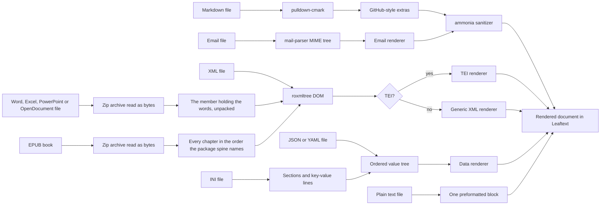
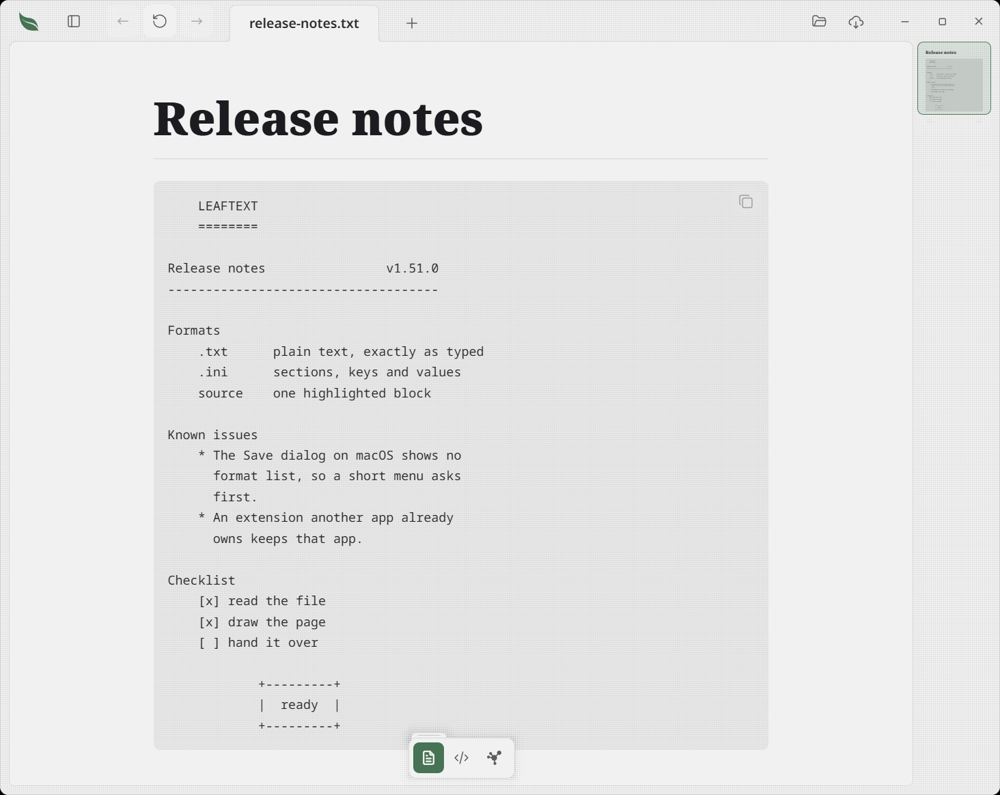
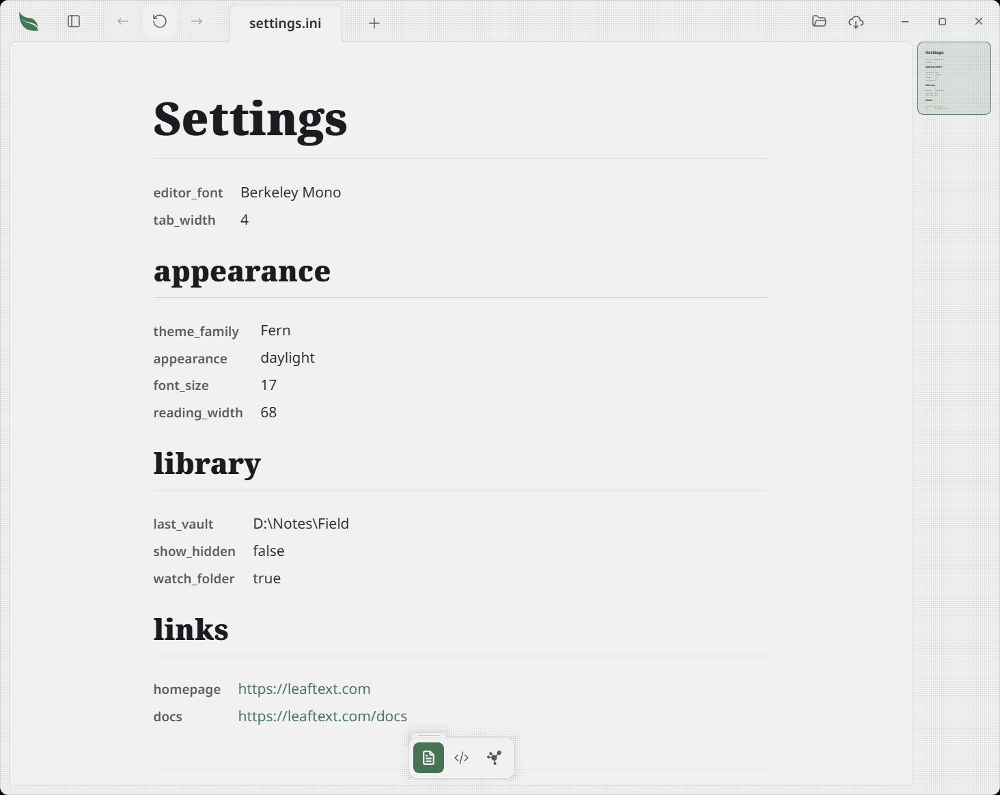
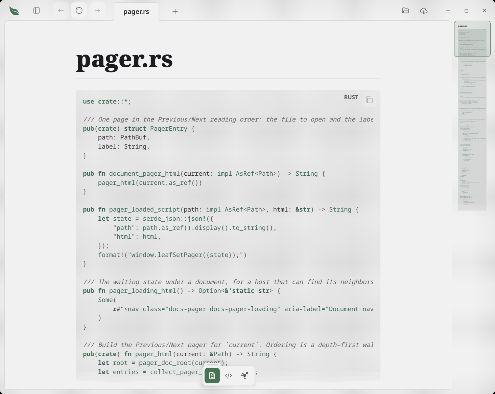
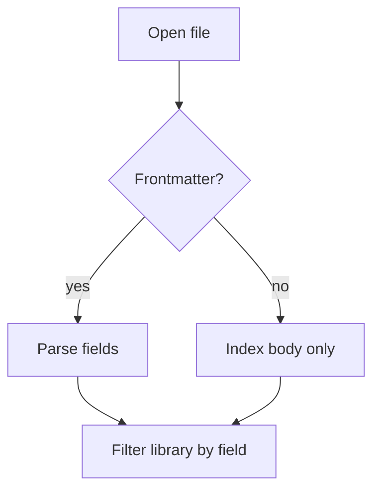
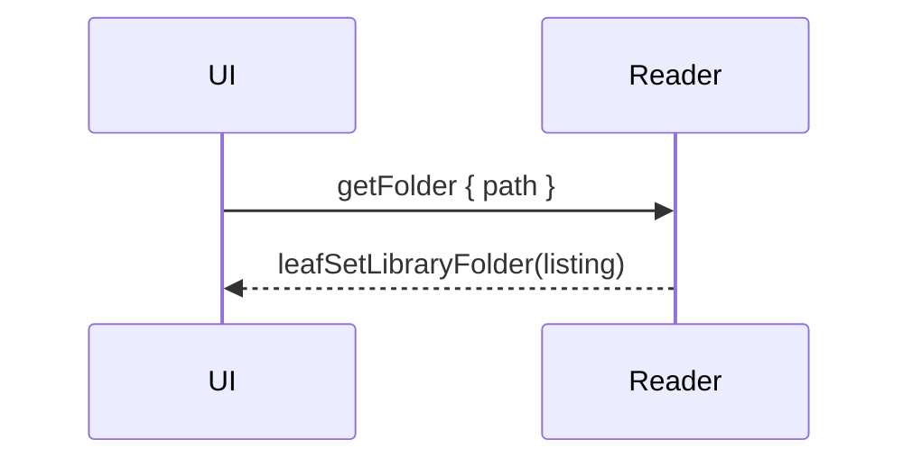
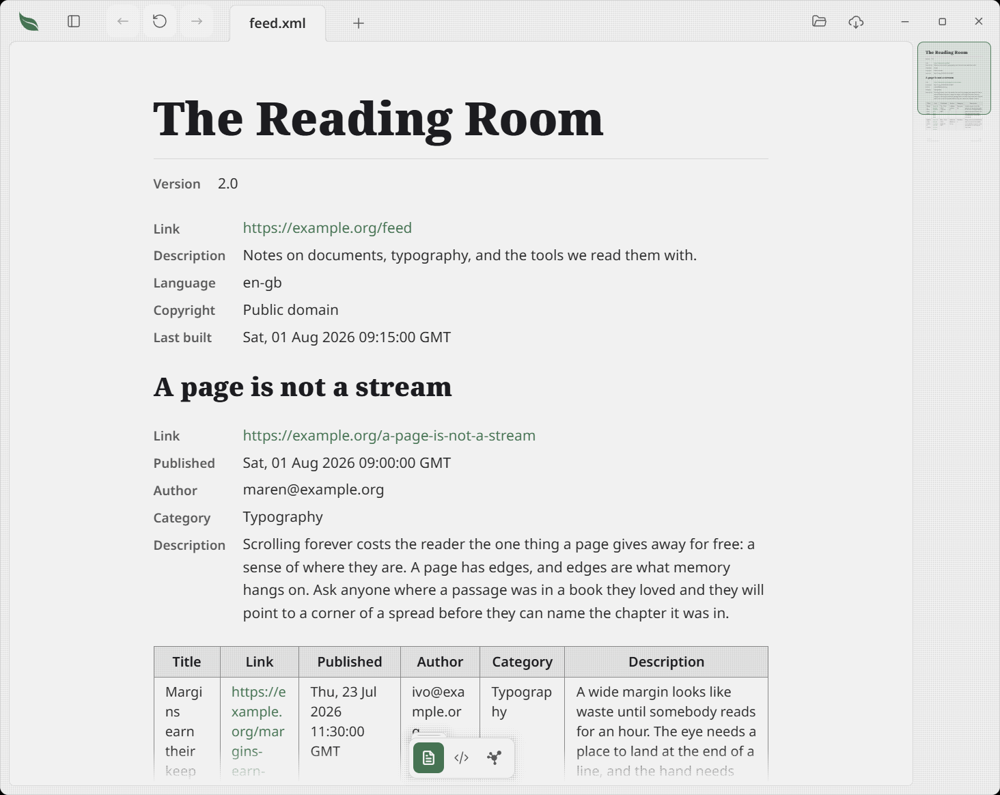
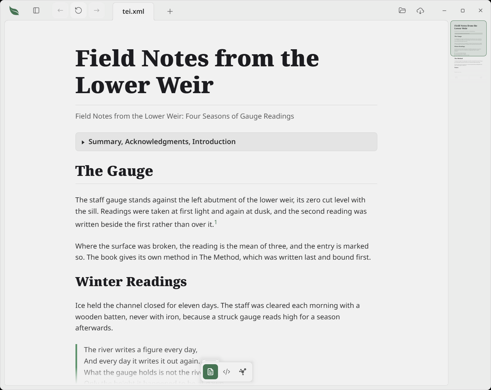

# Rendering

> Read without the noise. Leaftext renders your Markdown the way GitHub does — code, diagrams, math, callouts, footnotes, emoji, your own images — and opens your structured files too: TEI documents through a reader that knows the format, any other XML through a generic one, JSON or YAML as readable pages, plain text exactly as you typed it, config files as a page of sections, and saved emails as the message they carry.

Leaftext picks a pipeline from the file extension, and from the file's own first words where its name carries no extension at all — `.gitignore`, `LICENSE`, `Procfile` and the rest. A nameless file that opens with a doctype or an `<html>` root is drawn as a page, one that opens with an XML declaration through the XML reader, one that opens with a brace or a bracket and parses as JSON through the data reader, and everything else as Markdown, which is what a `.gitignore` gets today. A file whose extension already names its format is never asked what it holds, and a file you are typing in keeps the format it opened with. Markdown (`.md`, `.markdown`, `.mdown`, `.mdc`) is parsed in Rust with `pulldown-cmark`, run through a GitHub-like rendering pipeline, sanitized, and handed to the WebView. `.xml` takes a parallel path — parsed with `roxmltree`, then routed by what the file contains: a TEI document goes to the [TEI renderer](#tei-xml), anything else to the [generic XML renderer](#any-xml). `.json`, `.yaml`, and `.yml` go to the [data renderer](#data-files-json-and-yaml), which reads the same shapes the generic XML renderer does, and `.ini` goes to [its own reader](#ini-files) and then through that same renderer. `.txt` is [kept exactly as typed](#plain-text-files) and needs no parser at all. `.eml`, `.mht`, and `.mhtml` go to the [email renderer](#email-eml), and a [source file](#source-files) is drawn as one highlighted block under its own name. `.docx`, `.docm`, `.xlsx`, `.xlsm`, `.pptx`, `.pptm`, `.odt`, `.ods` and `.odp` reach the app as bytes rather than as text, because each is a zip rather than something somebody typed: the archive is opened, the member holding the words is unpacked, and that member goes to [its own reader](#office-and-opendocument-files). `.epub` arrives as bytes through the same door and goes to [the book reader](#epub-books), which follows the book's own package rather than one named part. All of them produce the same HTML shell. Every Markdown feature below is shown with a live example, rendered by the same engine that draws your documents; the XML, data, email and Office sections are described rather than demonstrated, since a Markdown page cannot embed a live document of another format.

## Summary

| Category | Supported |
| --- | --- |
| Core Markdown | Headings, paragraphs, lists, links, images, blockquotes, rules, inline code |
| GFM | Tables, task lists, strikethrough, autolinks |
| Extras | Syntax highlighting, Mermaid, math, alerts, footnotes, emoji |
| [Wiki links](#wiki-links) | `[[Note name]]`, with shown words after a `|` and a heading after a `#`, drawn as a link to that note |
| Leaf extensions | [Buttons](#buttons-leaf-extension) — a link wrapped in braces; [badges](#badges-leaf-extension) — words as inline code with a color name, or a hex color of your own, in a comment after them; [bars](#bars-leaf-extension) — a list whose items end in an amount, drawn on one scale, in a color name or a hex color of your own |
| Local content | [Images](#images) by relative, absolute, or `file://` path, using the page's width, opening on the whole window, and saving out as a PNG, a WebP, a JPEG, a PDF or a Markdown document |
| Safety | Sanitized HTML allowlist |
| [XML](#any-xml) | Any `.xml` file: sections, label/value fields, record tables, links |
| [TEI XML](#tei-xml) | Scholarly and archival markup; headings, paragraphs, verse, footnotes |
| [JSON and YAML](#data-files-json-and-yaml) | Any `.json`, `.yaml`, or `.yml` file, read by the same shape rules as XML |
| [Email](#email-eml) | Any `.eml`, `.mht`, or `.mhtml` file: headers, the message body, inline images, attachments |
| [Word, Excel, PowerPoint and OpenDocument](#office-and-opendocument-files) | Any `.docx`, `.docm`, `.xlsx`, `.xlsm`, `.pptx`, `.pptm`, `.odt`, `.ods` or `.odp` file, read as the document it is and edited in place |
| [EPUB books](#epub-books) | Any `.epub` file, read as one document in the order the book's own package says to read it |
| [Plain text](#plain-text-files) | Any `.txt` file, kept exactly as typed |
| [INI](#ini-files) | Any `.ini` file: sections, keys and values, each key drawn as it was written |
| [Source files](#source-files) | TypeScript, JavaScript, JSONC, CSS, shell, TOML, Rust, Python, SQL, diff, dotenv, GraphQL, and Dockerfile files as highlighted source |
| [Encodings](#file-encodings) | UTF-8, UTF-16 and UTF-32 by their byte order mark; saved back as they were read |

## Pipeline



## EPUB books

Leaftext opens an `.epub` as **one document**, in the order the book's own package says to read it. An EPUB is a zip of chapters with a package document naming their order, so what you get is the whole book on one scrolling page: the cover where the book puts it, the book's own contents page with every entry landing on the chapter it names, and then the chapters themselves. The minimap, find, the heading outline in the pane and Previous/Next all work on it the way they work on a note, because it is one document rather than a shelf of them.

| In the book | Rendered as |
|---|---|
| The package spine | The order the page runs in, first entry to last |
| A chapter | Its own section of the page, with an anchor a link to it lands on |
| The book's own contents page | A contents page, with every link jumping inside the document |
| What the book's contents call each chapter | That chapter's heading, at the level the contents nest it at, where the chapter draws none of its own |
| The title and author in the package metadata | The page heading, and the author's name under it as a quiet byline |
| A picture the book packs | The picture, drawn out of the book itself, including a cover carried by an SVG `image` element on its own page |
| A stylesheet the book packs | The typography it describes, drawn in Leaftext's own type: italic, bold, small, raised, lowered, large, small capitals, centered or aligned, tight, and indented — and a part the book hides is not drawn. The stylesheet itself never reaches the page |
| A script the book packs | Nothing. A book does not script the reading surface |
| A part in a form nothing can draw | One quiet italic sentence saying so, where the part sits |

**Every chapter of a book has a heading, so the outline holds the whole book.** Almost no book writes its chapter titles as headings — a title is an ordinary paragraph the publisher's stylesheet made big — so Leaftext reads the book's own contents, the one every EPUB carries, and uses what it calls each chapter. Where a chapter opens on its title already, that opening line *becomes* the heading rather than gaining a second copy above it; where a chapter opens on its first words, the name the book's contents gives it is written above them. The level comes from the book's own nesting, so a part is a top-level heading and each chapter under it sits one level in. A chapter that does write its own heading, at any level, is left exactly as the author wrote it, and a book whose contents name nothing reads as it always did, with the chapters it does have. This is what fills the [outline in the pane](02-navigation.md#outline), the minimap and find for a book.

**A book keeps its publisher's typography and not its publisher's numbers.** Every EPUB carries a stylesheet, and the words in a book are not plain prose: a title is centered and heavy, a book's name inside a sentence is italic, a footnote marker is a small raised digit, and a contents page is a close-set list. Leaftext reads that stylesheet and draws each of those in **its own** type, so a book takes the theme you are reading in rather than the weights and sizes its publisher picked. Twelve things are recognized — italic, bold, small, raised, lowered, large, larger, small capitals, no gap under a block, an indented first line, all four alignments, and a part the book hides — and anything else a stylesheet says is left out: a book cannot set a color, place a box or name an address, because the reading surface is the app's page as well as the book's. **A part the book hides stays hidden**, because a publisher hides a part of a page for the same reason any reading system does: a comic packs a full-page panel and then the same panel again in pieces for a small screen, each piece marked not to be shown, and drawing them all turns eight pages into forty.

**The book's own words start the book.** The author's name under the title and the sentence shown where a part cannot be drawn are the reader's own lines rather than the book's, so both are drawn quieter than the words around them. The [drop cap](09-progress.md#grow-with-seeds), once it is grown and switched on, steps over them the way it steps over a heading, walks past the cover and past any chapter with nothing in it to take, and lands on the first paragraph the book itself writes.

**Nothing is fetched from the network when a book opens.** A book may name a picture, a font, a sound or a film on the internet, and every one of those loads itself the moment the page draws — so a tracking picture in a book somebody sent you would call home before you read a word. Leaftext removes every such address and draws only the pictures packed inside the book. A **link** is different, because a link is a press: a book's links to the web and to an email address are kept and open the way any other document's do.

**A book is read-only.** Nothing writes back into an `.epub`, the reading view has no editable text in it, and the source button says a book is made of several source files rather than opening an editor over one. [Typing into a chapter](07-editing.md) is separate work.

**A book that is not the book it claims to be says so instead of taking the machine.** A missing or damaged package document, a chapter that points outside the book, a chapter claiming more text than the app will open, a spine longer than 4,096 parts and a chain of fallbacks that points round in a circle each get one sentence. A book whose chapters are encrypted says so by name; one that only scrambles its fonts reads normally, because a book's own fonts never load here.

**A very illustrated book stops drawing pictures partway and says so.** Every picture is carried inside the page, so a comic or a manga volume of a hundred and eighty megabytes cannot all be drawn at once; a book past sixteen megabytes of picture draws what fits, keeps the descriptions the book wrote for the rest, and says at the foot that the others are not shown.

> [!NOTE]
> Leaftext is a reader of EPUB rather than a conforming EPUB reading system, and does not claim to be one. A fixed-layout book — a comic drawn to exact pages — opens as its pictures in reading order rather than as the pages its maker laid out. A book's scripts do not run and its audio narration has no player.

## Plain text files



Leaftext opens a `.txt` file as **one block, kept exactly as typed** — every space, every line break, every column of an ASCII banner. Nothing is reflowed, nothing is parsed, and nothing is guessed at, because the app was never told what shape the file holds. An indented list stays indented, a hand-drawn table stays lined up, and a hand-wrapped paragraph keeps the width somebody chose for it.

That is a deliberate pick over reading a text file as prose. Reflowing blank-line-separated paragraphs would read better for a note and would take apart everything drawn with spaces, which is a great deal of what is in a `.txt` file. If you want prose, the app's own Markdown is a rename away.

The block wears the same border, dot texture, and **Copy** button every code block in the app wears. It carries no click-to-edit range — a range covering the whole file would be the [code view](07-editing.md#code-view) drawn a second time inside the reading view — so a `.txt` is edited in the code view.

Installing Leaftext offers it under **Open with** for `.txt` without replacing Notepad or TextEdit as the default. See [File associations](../02-installation.md#file-associations).

## INI files



Leaftext opens an `.ini` file as the page a JSON file already draws: each `[section]` is a heading, and the keys under it are a label-and-value list, with a value that looks like a link drawn as one.

There is no INI standard — dialects disagree about nearly everything — so Leaftext picks one and states it:

| The rule | What it means |
|---|---|
| `;` or `#` first on a line opens a comment | An end-of-line comment is the one difference that silently eats data: a Windows path, a color, a URL and a password all carry `#` in the middle of a value |
| A comment is not drawn | The [code view](07-editing.md#code-view) shows the file in full, comments and all |
| The first `=` splits the line | A `:` delimiter is Python's, not the Windows original, and taking both makes any URL-valued key ambiguous |
| The key and the value are trimmed | Nothing else is touched: no unquoting, no unescaping, no joining lines |
| `[name]` alone on a line opens a section | Keys written before the first one are drawn at the top, which is where a `.gitconfig`-shaped file puts its first lines |
| A `title` or `name` key written before the first section heads the page | It becomes the page's big heading rather than a row in that list, the same as in a [JSON or YAML](#data-files-json-and-yaml) file, so the file's own name for itself is not said twice |
| A repeated key draws twice, in order | The point is to show the file as written rather than to model it — a repeated section opens a second heading too |
| A key keeps its own spelling | `font_size` draws `font_size`, not "Font size", because that is a name somebody chose |
| A line that is none of these is drawn with no name | Its words are in the file, so they are on the page |

**Every value, key name and section heading can be typed into where you read it.** The reader holds the exact bytes between the `=` and the end of the line, the key's own bytes without the spacing around them, and the section's name inside its brackets — each the smallest useful thing to edit — and the save writes the file back in the spelling it was read in. See [Editing data files](07-editing.md#editing-data-files).

Installing Leaftext offers it under **Open with** for `.ini` without taking the extension from whatever opens it today.

## Source files



Leaftext opens source and configuration files as a file-name heading above one highlighted source block. It recognizes TypeScript, TSX, JavaScript, JSX, JSONC, CSS, SCSS, shell, TOML, Rust, Python, SQL, diff, dotenv, GraphQL, and Dockerfile files. JSON, HTML, XML, YAML, INI, plain text, and Markdown keep their dedicated reading views. Source files open when you choose one or follow a link, and stay out of folder listings, vault search, graphs, and Previous/Next pages.

## Markdown

Everything in this section is a live example: what you are reading is drawn by the same engine that draws your documents. Leaftext parses [CommonMark](../GLOSSARY.md#commonmark) and [GFM](../GLOSSARY.md#gfm), then adds the GitHub extras people actually use.

| | |
| --- | --- |
| Structure | [Headings](#headings) · [Lists](#lists) · [Tables](#tables) · [Task lists](#task-lists) · [Horizontal rules](#horizontal-rules) · [Collapsible sections](#collapsible-sections) · [Frontmatter](#frontmatter) |
| Words | [Text formatting](#text-formatting) · [Blockquotes and alerts](#blockquotes-and-alerts) · [Footnotes](#footnotes) · [Emoji](#emoji) · [Text in any language](#text-in-any-language) |
| Links | [Links and autolinks](#links-and-autolinks) · [GitHub references](#github-references) · [Buttons](#buttons-leaf-extension) |
| Media | [Code](#code) · [Images](#images) · [Math](#math) · [Mermaid diagrams](#mermaid-diagrams) |
| Raw HTML | [Inline HTML](#inline-html) — a [security boundary](#inline-html), not a passthrough |

### Headings

All six ATX heading levels render:

# H1 heading
## H2 heading
### H3 heading
#### H4 heading
##### H5 heading
###### H6 heading

Every heading gets a slug `id`, so `#slug` links and the [outline](02-navigation.md#outline) resolve against it. Blocks carrying an explicit author-supplied `id` keep theirs — see [Inline HTML](#inline-html).

### Text formatting

- *Italic* and _italic_
- **Bold** and __bold__
- ***Bold italic***
- ~~Strikethrough~~ (GFM)
- `inline code`
- Inline footnote reference[^demo]

A trailing backslash forces a hard line break,\
so this sentence continues on the next line.

### Lists

Unordered, with nesting:

- Leaves
  - Simple
  - Compound
- Stems
- Roots

Ordered lists nest into a classic outline (I, A, 1, a, i):

1. Trees
   1. Broadleaf
      1. Deciduous
         1. Maple
            1. Sugar maple
            2. Red maple
            3. Silver maple
         2. Oak
      2. Evergreen
         1. Holly
   2. Needleleaf
      1. Pine
2. Shrubs
3. Ground cover

### Blockquotes and alerts

A blockquote, nested:

> "Read deeply, not widely."
>
> > A leaf within a leaf.

GitHub-style alerts render with theme-aware colors (all five):

> [!NOTE]
> Leaftext renders Markdown — it never edits it.

> [!TIP]
> Search every leaf in your library with a keystroke.

> [!IMPORTANT]
> Pages render entirely on your machine. No network.

> [!WARNING]
> A reader, not an editor.

> [!CAUTION]
> A stray `---` mid-page is a horizontal rule, not frontmatter.

Standard blockquotes also use a hanging indent for each authored line, so when a long quoted line wraps in the reader the continuation stays inset and you can distinguish a soft wrap from a Markdown hard line break.

### Code

Language-tagged fenced code blocks get syntax coloring, a language badge, and a Copy button. Hover a block to reveal the button.

A line too long for the column scrolls sideways inside the block; the badge and the Copy button stay put while it does, and the block itself keeps the reading column's left edge.

```rust
/// Extract the leading frontmatter block, if any.
pub fn extract_frontmatter(text: &str) -> Option<FrontmatterBlock> {
    let text = text.strip_prefix('\u{feff}').unwrap_or(text);
    let mut lines = text.lines();
    if lines.next()?.trim_end() != "---" {
        return None;
    }
    let mut body = String::new();
    for line in lines {
        if line.trim_end() == "---" {
            return Some(FrontmatterBlock { body });
        }
        body.push_str(line);
        body.push('\n');
    }
    None
}
```

A plain fence renders as monospace with no colors:

```
no language, no highlighting
```

Supported language tags include `ts`, `tsx`, `js`, `jsx`, `json`, `html`, `css`, `scss`, `md`, `bash`, `zsh`, `yaml`, `toml`, `xml`, `ini`, `rust`, `python`, `sql`, `diff`, `dotenv`, `dockerfile`, `graphql`, and plain text.

### Tables

GFM tables with a header row and a body:

| Feature       | Syntax         | Supported |
| ------------- | -------------- | --------- |
| Tables        | `\| a \| b \|` | ✅        |
| Strikethrough | `~~text~~`     | ✅        |
| Task lists    | `- [ ] item`   | ✅        |
| Autolinks     | bare URLs      | ✅        |

A colon in the divider row sets a column's alignment — `:---` left, `:---:` center, `---:` right:

| Left | Center | Right |
| :--- | :----: | ----: |
| a    | b      | c     |

**Drag a divider to size a column or a row, the way a spreadsheet does.** Point at any row and the divider between its cells takes the sideways pointer: drag it and that column goes to the width you left it at, with the columns beside it exactly where they were. A table with no heading row works the same way, and so does one whose heading joins two columns under a single label: the divider between those two columns sizes one of them and leaves the other where it was. A row that starts with a heading cell of its own is sized like any other row: each divider in it sizes the column it is drawn on, and the last cell of the row offers none, since its right edge is the table's own. The line under a row does the same up and down, and it runs under every cell of that row rather than only the first, so a table scrolled sideways is still sized from the cell you are looking at — a row can be made taller freely, and never shorter than the words wrapped inside it. A table written inside another table's cell is sized as the table it is: each one carries the dividers of the columns and rows it actually has, and a drag on one leaves the other where it was. A double-click on a divider gives that one column or row its automatic size back. Nothing is written to your file and no size outlives the document: the widths hold through a typing pause — one that types words above the table and moves it down the file as readily as one inside it — a live reload and a theme change, and a table opened again comes back the way the app draws it.

Every second body row is filled a shade back from the page, so a reader can follow one row across to its last column. The fill is the [theme](06-themes.md) family’s own recess rather than one gray for every family, which is what lets the band read on a dark page as well as a light one.

A cell can also be one the app keeps right: a [formula line](../GLOSSARY.md#formula-line) commented under the table says what it is, and Leaftext rewrites it as the rows it reads change. See [Editing](07-editing.md#a-table-that-adds-itself-up).

A table with one column and at most one body row draws as a card. A header on its own is one set-apart line; a body row makes the header a small label over a large figure. Point at the card to show its **Table** and **Card** switch, which changes only the page and never the file.

**A table with a few rows in it can become a relational table.** Point at a table with a header row and two or more body rows and its quiet bar appears above it: **Table**, **Cards**, **Board**, **List**, **Sort** and **Filter**. [Relational tables](08-relational-tables.md) explains the RDB view, relations, temporary layouts, filters and the optional schema comment. It leaves ordinary GFM tables as the file you own.

A table cell whose entire content is a task-list marker — `[ ]` or `[x]` — renders as a checkbox, so a table can carry a status column:

| Step            | Done  |
| --------------- | ----- |
| Render a page   | [x]   |
| Search files    | [x]   |
| Edit the source | [ ]   |

A table wider than the text uses the reader's full width rather than the reading measure, staying centered and holding a strip clear either side for the block handle. Wider still and it scrolls sideways on its own bar; a horizontal trackpad gesture or Control or Command plus a vertical wheel over the table moves it sideways too, and the column at the cut fades into the page — the near edge only once you have scrolled past it, the far edge until you reach the last column. Those two marks stay under [Reduce Motion](05-settings.md#reduce-motion), because they only move when you scroll the table. A plain wheel over a table moves the page the way it does anywhere else: a table scrolls sideways only, so resting the pointer on one never takes a gesture meant for the document. A table that fits the text is left where it is.

Narrow the reader far enough that the grid no longer fits and the table stops being one: every row becomes a card, the heading row goes, and each cell carries its own column heading in front of its value — so no column is dropped and nothing is guessed about which one matters. The heading is drawn small and in capitals, so a field's name is told from its answer at a glance rather than by weight and shade alone. The table itself becomes a quiet lane and every record a card standing on it, so a page of them reads as a list of records rather than as one long document. Cells share a line where their widths fit, and a column whose writing is too long to share a line anywhere takes a line of its own behind a rule — which columns those are is read off the table's own values, so a table of short fields gets no rule at all and one with several long columns gets a section for each. Cards are what a reader with no room left gets: while the reading column is wider than a phone's the table stays a grid however far it overflows, so the bar, the two faded edges and the sideways gesture above are what a wide table is read with. Under that width the changeover is measured against what the table itself needs rather than the window, so a table that still fits stays a grid there too. A column alignment is ignored while it is cards, since an alignment is about a column and cards have none, and the expand button above it still opens the table on the whole window, where it is a grid again. The record tables read out of [XML](#any-xml) and [data files](#data-files-json-and-yaml) fold the same way. The [frontmatter](#frontmatter) block is already a key and a value per row, so it is left as it is, and paper keeps its grid.

### Task lists

- [x] Render a page
- [x] Search the library
- [ ] Reformat the source on save (out of scope — edits are saved verbatim)

A task can carry a date at the end of its line, written `📅 09/16/2026` — month, day and four-digit year. It is drawn as a short badge after the words, `Sep 16`, with the year only when it is not this one: red once the day has passed, green on the day itself, amber from tomorrow through the next seven days, and gray when it is later or the box is ticked. Pressing the badge opens a menu offering today, tomorrow and next Monday, a box for any other date, and a row that clears it. Picking one rewrites only that date in the file, and undo puts it back. A date written any other way stays part of the words.

### Links and autolinks

- Inline link: [the Leaftext repo](https://github.com/ryanallen/leaftext)
- Reference link: [CommonMark][cm]
- Relative link to a sibling page: [Navigation](02-navigation.md)
- In-page link back to the [top](#rendering)
- Bare URL autolink: https://github.com/ryanallen/leaftext
- www autolink: www.example.com
- Email autolink: hello@example.com

[cm]: https://commonmark.org

A link may point at the web, at an email address, at a page beside the document, or at a file anywhere on this machine — a whole path, written from the drive letter or as a `file://` address, works the same as a relative one, and a link to a file the system would run asks before it runs it. Any other kind of address — another program's own scheme, a phone number — is not one Leaftext follows, so it is taken off the link. What is left is drawn as the document's own words with a dotted line under them rather than in the link color, and the [hover hint](02-navigation.md#link-hints) says the address it was written with is not one this app follows, so a link that goes nowhere can be told from a live one without clicking it.

### Wiki links

A note written the way Obsidian writes them links to another note by name: `[[Station handbook]]`. The reading view draws it as an ordinary link to that note and leaves the brackets off the page. Three spellings are read:

| Written | Shown | Opens |
| --- | --- | --- |
| `[[Station handbook]]` | Station handbook | the note called Station handbook |
| `[[Station handbook\|the rules]]` | the rules | the same note |
| `[[Station handbook#Boundary rule]]` | Station handbook | that note, at its Boundary rule heading |

The name is matched however it is capitalized. A note whose file is called that name wins over another note that lists the name in its `aliases` field, and a name no file carries opens the first note that lists it as an alias. The note is looked for in the [vault](03-library.md#vaults) the document belongs to, or in the document's own folder when it belongs to none; a published site looks in the documents it serves. A name no note answers to leaves the page where it is and says so. Hovering one shows the note's first lines, and the link's menu reveals it or copies its path, the same as any link to a page beside the document.

Editing the paragraph around a wiki link writes it back exactly as it was spelled. To change where it points or the words it shows, change it in the [code view](07-editing.md). Written inside code, behind a backslash, across a line break, with nothing before a `#`, or as an embed (`![[…]]`), it stays the words it was written as.

### Buttons (Leaf extension)

This one is a Leaftext addition, not standard Markdown. Wrap an ordinary inline link in braces and it renders as a button styled like the app's action controls, linking wherever the link points. The more braces, the more prominent the button:

| Style | Syntax | Looks like |
| --- | --- | --- |
| Ghost | `{[Label](url)}` | No fill or outline until hover |
| Outline | `{{[Label](url)}}` | Outline, fills on hover |
| Filled | `{{{[Label](url)}}}` | Filled |

{[Ghost](https://github.com/ryanallen/leaftext)} {{[Outline](https://github.com/ryanallen/leaftext)}} {{{[Filled](https://github.com/ryanallen/leaftext)}}}

**All three answer the pointer the same way**, whatever they look like at rest: the fill arrives over a beat and nothing else moves — the box and its corner stay exactly where they rest, see [what a control does under the pointer](02-navigation.md#what-a-control-does-under-the-pointer). A button whose link goes nowhere is drawn as words rather than as a button, so it takes none of that.

Each is just a normal `[label](url)` link with braces around the whole thing. The wrapper is braces only — brackets are link syntax, so `[[Label](url)]` is a plain link between two square brackets, not a button. The braces must balance: `{{…}` is prose and stays as written. The label may hold inline formatting, and the button follows a link like any other (external URLs open in your browser, relative `.md` paths open in the reader). Written inside code the wrapper stays literal, so this page can show the syntax without turning it into a button. Several buttons written on one line keep room between them at any width, so a pair that stands side by side on a wide page and stacks on a narrow one reads as two buttons either way.

**A button can wear a mark.** Name one inside the braces, before the label, and it is drawn at the front of the button in the button's own color:

| Syntax | Looks like |
| --- | --- |
| `{{{icon:windows[Download for Windows](url)}}}` | The Microsoft four-square, then the label |
| `{{{icon:apple[Download for macOS](url)}}}` | The Apple mark, then the label |

{{{icon:windows[Download for Windows](https://github.com/ryanallen/leaftext)}}} {{{icon:apple[Download for macOS](https://github.com/ryanallen/leaftext)}}}

The marks a document may wear are a short list, not the whole icon set: a document that could name any of them could wear any part of the app's own interface. A name that is not on the list is not a button at all — the whole thing stays as you wrote it, so a typo shows rather than drawing a button with a blank where its mark should be.

### Badges (Leaf extension)

Another Leaftext addition. Write some words as inline code and put a color name in a comment straight after it, and the words are drawn as a small badge in that color, so a list of states can be scanned down its left edge instead of read:

| Syntax | Looks like |
| --- | --- |
| ``` `Shipped`<!--green--> ``` | `Shipped`<!--green--> |
| ``` `Next press, on hold`<!--amber--> ``` | `Next press, on hold`<!--amber--> |
| ``` `Conflicts with #205`<!--red--> ``` | `Conflicts with #205`<!--red--> |
| ``` `Backlog`<!--gray--> ``` | `Backlog`<!--gray--> |
| ``` `In review`<!--primary--> ``` | `In review`<!--primary--> |

**Anywhere else, it is inline code.** A Markdown reader that has never heard of Leaftext hides the comment and draws the words as an ordinary code chip, so a note full of badges still reads cleanly on GitHub or in another editor. The comment goes after the words and touches them: written first, a comment at the start of a line swallows the whole line, and with a space between them the words stay plain code. Spaces inside the comment are fine — `<!-- green -->` reads the same.

Notes written the older way, with the color and words inside braces — `{green: Shipped}` — still draw. Editing a paragraph that holds one writes that badge back in the new spelling, and nothing else in the note is touched.

Four named colors, and no more of those, because the [theme families](06-themes.md) each carry one accent and a fifth named color could not be told from the other four in all of them. Each one takes a color its family already sets, so a badge follows the theme without anything being chosen per family, and every one of them was measured against every family's page at better than the readable floor.

`primary` is the fifth and it is not a color you pick — it is whatever color the theme you are in is recognized by, so the same badge is green on one family and violet on the next. That is also why it is the one tone allowed to land on top of a named one: on a family whose action color is its green, `primary` and `green` are the same color, because the family really is green.

There is no second theme color: in most families it is a shade of the main one, so a badge in it could not be told apart from `primary`.

The words are yours and a named color is the app's. A name the app does not know is not a badge at all — ``` `bar`<!--foo--> ``` stays plain code and its comment stays hidden, so a typo shows rather than drawing a badge in no color. Written inside a longer code span or a fenced block, the syntax stays literal, so this page can show it without drawing one.

**A color of your own.** Where the five do not answer — a client, a project, a category — put `#` and an opaque hex color where a color name goes, in either spelling:

| Syntax | Looks like |
| --- | --- |
| ``` `Design`<!--#3b82f6--> ``` | `Design`<!--#3b82f6--> |
| ``` `Client`<!--#b45309 icon:tag--> ``` | `Client`<!--#b45309 icon:tag--> |
| `{#0a7: Field notes}` | {#0a7: Field notes} |

Three digits or six, in either letter case, and the marks work the way they do on a named color. Your digits are kept exactly as you typed them, so editing that paragraph writes the badge back in your own color; choosing one of the five in the bar over your words replaces it with that color, which is the way back out.

**Only those two lengths.** Four and eight digits carry transparency, which would make the drawn color — and whether it can be read at all — depend on whatever lies behind the badge, so they are not a color here. Anything else is not one either: a missing `#`, a digit that is not hex, any other length. Each of those stays exactly the characters you typed, the same way an unknown color name does.

**A color you write is yours to check.** The five named ones were measured against every theme family's page and each is readable on all of them; a color out of your file is the same color on a light page and a dark one, and nothing changes it for you. Pick one that can be read on both, or use a named color and let the theme answer for it.

**A badge is not a tag.** They are drawn from the same base on purpose, and they differ in the two things that mean something: a badge wears a square corner and cannot be pressed, because it is a label saying what state a thing is in; a [tag chip](07-editing.md#the-fields-at-the-top-of-a-note) wears a fully rounded corner and carries its `#`.

**A list whose items begin with a badge is drawn as a status list**: the badges take a column of their own so every title beside them starts on one left edge, with a hairline between the rows. A badge that is a whole sentence keeps its column rather than pushing the titles along. An item that does not begin with a badge keeps the ordinary list drawing, so a shopping list is never converted.

- `Shipped`<!--green--> **The release went out** — both installers published and the download page moved.
- `Conflicts with #205`<!--red--> **The pager** — a badge that is a whole sentence keeps its own column.
- `Backlog`<!--gray--> **Nothing is waiting on this**

**A badge can wear a mark.** Name one in the comment, after the color, and it is drawn at the front of the badge in the badge's own color:

| Syntax | Looks like |
| --- | --- |
| ``` `Shipped`<!--green icon:check--> ``` | `Shipped`<!--green icon:check--> |
| ``` `Waiting on review`<!--amber icon:update--> ``` | `Waiting on review`<!--amber icon:update--> |
| ``` `Turned down`<!--red icon:close--> ``` | `Turned down`<!--red icon:close--> |
| ``` `Filed`<!--gray icon:tag--> ``` | `Filed`<!--gray icon:tag--> |

Four marks, and they are the app's list rather than yours — the same reason a button's marks are a short list. A name that is not on it is not a badge at all: the words stay plain code, so a typo shows rather than drawing a badge with a blank where its mark should be.

You do not have to type any of it. Choose words in the reading view and the [bar over them](07-editing.md) offers Badge, which asks which of the five colors and wraps exactly the words you chose; press it again over a badge and its color changes rather than a second badge appearing. On an empty line the [plus in the margin](07-editing.md) offers Badge too: pick a color, and a box asks what the badge says and offers the four marks, drawing the badge beside the field as you type it. Nothing is written into the note until there is something to draw. Both rows draw each color's name in that color, so the choice is made by looking rather than by reading.

### Bars (Leaf extension)

A list whose items end in an amount can be drawn as bars, so three numbers far apart in size are a comparison you see rather than three strings you compare in your head. End each item with its amount as inline code and a comment reading `bar` and a color name straight after it:

```markdown
- One picture per **section** `~$2,000,000`<!--bar red-->
- One picture per **distinct course** `$75k–$200k`<!--bar amber-->
- One picture per **archetype** — what we built `$56`<!--bar green-->
```

Each item is drawn as its words on the left, its amount on the right, and a track under both, filled as far as the amount reaches:

- One picture per **section** `~$2,000,000`<!--bar red-->
- One picture per **distinct course** `$75k–$200k`<!--bar amber-->
- One picture per **archetype** — what we built `$56`<!--bar green-->

**The number is read out of the amount you wrote**, so a bar can never disagree with the figure printed beside it. It is the first run of digits: commas between groups are skipped, one `.` is a decimal point, a `k`, `m` or `b` straight after it means thousands, millions or billions, and a minus straight before it makes it negative. `~$2,000,000` is two million, `1.5M` is one and a half million, and a range like `$75k–$200k` is drawn at its low end, which is the part that is certain.

**Every bar in one list shares one scale**: the largest amount is a full track and the rest are measured against it, so the smallest is still a visible sliver rather than nothing. An amount ending in `%` is out of 100 instead, and one over 100% fills its track. A list nested under a bar is its own run with its own scale. Zero or a negative amount draws an empty track.

**The colors are the badge's**: the five names `green`, `amber`, `red`, `gray` and `primary`, and a bare `<!--bar-->` takes `primary`, the theme's own color. Each of the five fills was measured against its track on every theme family.

**A color of your own**, exactly as a badge takes one — put `#` and an opaque three- or six-digit hex color where a color name goes:

```markdown
- Client work `$2,000`<!--bar #3b82f6-->
- Everything else `$500`<!--bar #f0a-->
```

- Client work `$2,000`<!--bar #3b82f6-->
- Everything else `$500`<!--bar #f0a-->

That color is yours, so whether the fill can be told apart from the track in both light and dark is yours too. The five names are measured for you; a color you name is not.

A color that is neither one of the five names nor an opaque hex color leaves the item an ordinary list item, and so does an amount with no digit in it at all — a typo shows as plain words rather than as a bar at a made-up length.

**Anywhere else, it is a list.** A Markdown reader that has never heard of Leaftext hides the comment and draws each item as its words with the amount as a code chip, so a note of bars still reads cleanly on GitHub or in another editor. The comment has to touch the amount and end the item's line, the way a badge's comment touches its words.

Typing in a row's words keeps every bar in the list, and you do not have to type the syntax at all: on an empty line the [plus in the margin](07-editing.md) offers Bars. Pick a color, and a box asks what the bar is and how much, drawing the bar beside the fields as you type; Enter writes one row. Press the plus again on the line under it for the next bar, and it joins the same list and the same scale.

### Framed figures (Leaf extension)

A titled box with a note in its top right, whatever you put inside it, and a caption under a line at the foot — for a figure, a worked example, a set of numbers, anything you want the reader to take as one thing rather than as the paragraphs around it.

<figure class="note-frame">

<div class="note-frame-head">

Cost of a cover <span class="note-frame-aside">Per 1,000 covers</span>

</div>

The body holds whatever blocks you put in the box — prose, a list, a table, a diagram — and each keeps the drawing it already has.

- A first point.
- A second point.

<figcaption class="note-frame-caption">

A caption under a line, on a sunken strip.

</figcaption>

</figure>

It is written as plain HTML with a class on it:

```markdown
<figure class="note-frame">

<div class="note-frame-head">

Cost of a cover <span class="note-frame-aside">Per 1,000 covers</span>

</div>

The body, with whatever blocks you want in it.

<figcaption class="note-frame-caption">

A caption under a line.

</figcaption>

</figure>
```

**The blank line around every piece of content is not a style — leave one out and the note stops being editable.** Markdown ends an HTML block at each blank line, which is what gives the title, the body and the caption each their own place in the file; written on consecutive lines the whole box is one block, and then no paragraph anywhere in the note can be clicked and typed in. **You do not have to remember any of it**: on an empty line the [plus in the margin](07-editing.md) offers **Framed figure**, which writes exactly this shape with the title under the caret, ready to type over. Every part of it is editable in place afterwards — click the title, the body or the caption and type. Delete every word of the body and the frame keeps an empty line where it was, so there is still somewhere to click and type the next words, or to press the plus for another kind of block.

Four parts, and each is optional but the frame: `note-frame` on the box, `note-frame-head` on the title's line, `note-frame-aside` on the quiet note in its top right, and `note-frame-caption` on the caption. A frame missing its head, its body or its caption draws the parts it has.

**Anywhere else, it is a figure.** A reader that has never heard of Leaftext drops the class and draws what is left — the title as a line of prose, the body as itself, and the caption as a caption, in that order. Nothing arrives as visible syntax, which is why the drawing is written this way rather than as a fenced block.

**`note-` is the only class a document may name**, and it is what keeps this safe: every other class is stripped, so a note can draw a box of its own without being able to wear any part of the app's interface. A class that leaves the namespace takes the whole attribute with it rather than half-drawing something. There is no `style` on any tag, ever.

**When to write the whole file as HTML instead.** A page with its own typography, grid and palette is better off as an `.html` file — Leaftext draws it exactly as its own stylesheet makes it, in a frame of its own ([HTML files](#html-files)). What that costs is everything that makes a note a note: nothing in it is editable in place, its links do not follow into your vault, and no script runs in it, so its diagrams do not draw. A framed figure is the answer when you want the box *and* the note.

### Cards across the page (Leaf extension)

Several cards side by side, for things meant to be compared rather than read one after the next: two lists, a set of figures, a row of colors.

<div class="note-card-grid">

<div class="note-card">

#### Can do today

- Read a note
- Edit it in place

</div>

<div class="note-card">

#### Cannot do today

- Sync a vault
- Share a link
- Record a voice note

</div>

</div>

A grid wraps the cards, and each card holds whatever Markdown you like:

```markdown
<div class="note-card-grid">

<div class="note-card">

## Can do today

- Read a note

</div>

<div class="note-card">

## Cannot do today

- Sync a vault

</div>

</div>
```

`note-card-grid` sets prose cards two across the reading column. Add `note-card-grid-compact` beside it — `<div class="note-card-grid note-card-grid-compact">` — for short cards, three or four across. Cards keep the order you wrote them in, each keeps its own height rather than stretching to its neighbor's, a last card on its own row keeps the width of the ones above it, and when the window is too narrow for two the cards stack into one column.

**The blank lines are load-bearing here too**, for the same reason as in a [framed figure](#framed-figures-leaf-extension): around each wrapper and around every block inside a card. **You do not have to type it**: on an empty line the [plus in the margin](07-editing.md) offers **Cards**, then **Prose cards** (two) or **Compact cards** (four). Each card opens on an empty heading with the caret in the first one, so the first thing you type is the first card's title.

**A figure in a card** is a one-column table with one row, which reads as a label over its value:

```markdown
<div class="note-card">

| Readers |
| --- |
| 1,204 |

</div>
```

**A color swatch.** A card whose own line is nothing but one code span starting with a color — `` `#14b8a6` `` — is drawn with a band of that color across its top. It takes an opaque hex color in its three- or six-digit spelling, and words may follow it inside the span: `` `#b45309 brand amber` ``. Anything else stays ordinary code: a four- or eight-digit color, one without the `#`, a color written inside a sentence, or a code span beside other words on its line. The band is your color rather than the theme's, like a picture, so it looks the same in light and dark.

**Anywhere else, it is still a document.** A reader that has never heard of Leaftext drops the classes and draws every card's contents one after the next, in the order you wrote them, with nothing arriving as visible syntax — a swatch card is its heading and its code line.

### Images

Image paths are resolved against the open file: relative paths (including `../` at any depth), absolute paths, and `file://` URLs all load. The title shows on hover:


Allowed image types include SVG, PNG, JPEG (`.jpg`, `.jpeg` and `.jfif`), GIF, APNG, AVIF, BMP, ICO, and WebP. The picker behind [Insert image](07-editing.md#images) offers exactly these and nothing else, so a picture you can choose is one the page draws.

Every local picture is measured as the page is built — its size comes out of its own header — so the space it needs is held before it decodes and the words around it never jump. A picture Leaftext cannot find keeps its place too, marked with one glyph in the page's ink, with its alt text on hover. The same mark shows on both platforms.

Images always show the file that is on disk. Leaftext watches the note's folder and each distinct folder containing one of its local pictures without walking those folders' trees. Overwriting one refreshes it in the open document straight away ([Reload](02-navigation.md#reload)), and every rerender re-reads them, so a replaced picture never lingers as a cached copy. A missing one that later appears is found by that same refresh.

A picture alone in its paragraph reads at the width of the page rather than the width of the writing, the same room a wide [table](#tables) takes. It is never blown up: a picture smaller than the text column stays exactly the size it is, centered, and the words either side keep the measure. Hovering one shows an expand button at its top right, which opens it on the whole window — the picture fitted whole against the dimmed page, with no title bar and nothing written over it. The close mark appears only when the pointer comes near the top right corner; `Escape` and a click on the dimmed page close it as well. A picture Leaftext could not find gets no button, because there is nothing behind the mark to open.

Beside that expand button is a second one that takes the picture out of the note as a file of its own. It asks where the file goes and which kind: on Windows the save window offers PNG, WebP, JPEG, PDF and Markdown and the ending on the name you give is what gets written, and on a Mac a short menu asks first, since that window shows none of them. A picture already in the format you asked for is copied rather than made again, so the file you get is the file on disk — a `.jpeg` you ask for as a `.jpg` counts, since they are the one format spelled two ways. **JPEG** writes the picture in the one format every tool takes, for anything that will not accept a WebP; it is never the smaller file of the two, and on a photograph it is a fraction of the PNG. A picture with transparency in it comes out on the page color you were reading on, because JPEG carries none. **PDF** puts the picture on a page of its own at its own size. **Markdown** writes a small document holding the picture, with the picture itself copied into an `imgs` folder beside it under its own name. Take the same picture out again into the same place and it finds the copy it made last time and points at that, so the folder holds one copy of a picture however many times you export it. A different picture under a name already there gets a numbered one beside it, so an export never writes over a picture you already have. Nothing about the note changes: an export is a file beside it. A quiet note in the bottom-right corner names the file when it is written, and the name is a press that opens it. A picture served from the web gets no export button, because there is no file here to take. A picture Leaftext could not find gets neither button.

**Right-click a picture kept on your own disk and the menu is about the picture**, not the note it sits in: open it big, copy the picture itself, copy its path, show it in your file manager, open its properties, and — while the page is unlocked — take it out of the document. See [Picture actions](03-library.md#right-click-a-picture).

### Math

Inline math uses `$…$`: the mass–energy equivalence is $E = mc^2$.

Display math uses `$$…$$`:

$$ \int_{a}^{b} f(x)\,dx = F(b) - F(a) $$

### Mermaid diagrams

`mermaid` fences are rendered with the bundled Mermaid runtime, fully offline. A diagram that cannot be drawn shows you what you wrote instead: your own lines, numbered, with the line the drawing stopped at marked and one sentence saying why — and, where the reason is a common one, the same line written a way that draws, such as a label with brackets in it put in quotes. Only that diagram is affected: the ones drawn beside it keep their drawing and their corner buttons. A diagram that was drawn in full and then stumbled over placing one label on one arrow keeps its drawing. **Only the diagrams near what you are reading are drawn**, a few at a time and nearest first, so a page of sixty opens as fast as a page of three; the rest wait as empty blocks of the right size and draw as you scroll to them. A diagram you have already read stays drawn, so reading back up a page finds every drawing where you left it; while it is off screen the page stops painting it, and it holds its own height so nothing moves. The one exception is a document with more than 200 diagrams in it, which is past what the app can remember: there a diagram left several screens behind goes back to a block and is drawn again when you return. A diagram waiting its turn shows a spinner rather than the Mermaid it is about to replace, one too far off to be queued shows nothing, and your place on the page is kept as they land — a drawing landing above what you are reading is paid back in the same beat, so the words do not move. Once the page has settled every diagram in the document is drawn once in the background, so each block holds its own drawing's height from then on and the page stops changing length as you scroll; that pass stops the moment you scroll or type and picks up when the window is quiet again. `Ctrl`+`F` still finds the words inside a diagram nobody has drawn. [Exporting the page](02-navigation.md#export-the-page) draws every diagram in the document first, however many it holds, so the file carries all of them.

Diagrams take your theme's colors and the face it reads documents in — boxes the theme's muted surface, subgraphs its sunken one, arrows its muted ink, and a Gantt chart the theme's own active, done and critical colors. Switch theme and every diagram on the page is redrawn to match. The twelve-color scale a mindmap or pie chart cycles through is your theme's primary hue turned around the wheel, as described in [Themes → Diagrams](06-themes.md#diagrams).

A group's title is kept on one line and sits inside the group's border with room around it, so a long one reads whole instead of running under the first box in the group; the group widens to hold it, and the drag, zoom and full-window view already carry a wide drawing. In a diagram you save as a picture the title may still wrap, and the group is drawn tall enough that every line of it stays clear of the boxes.

A drawn diagram sits in its own cell, on the same tint and dot grain as a code block, and you can look around inside it. Drag the drawing to move it; `Ctrl` and the wheel — or `Cmd`, or a trackpad pinch — to zoom, with buttons for the same in the corner. Zooming never changes the block's height, so the words around a diagram hold still while you lean into it, and **Fit** or a double-click puts it back. A plain wheel scrolls the page as always.

The fourth button in that group opens the diagram on the whole window. It is drawn again at that size rather than blown up, so a chart too wide for the reading column is simply legible instead of something to drag around inside a box the height of a paragraph. It opens showing the whole thing, the same zoom and drag work there, and Escape, the X or a click outside puts you back where you were reading, with the diagram in the page exactly as you left it.

Left of that group sits one more button, and a shut padlock keeps it: it saves the diagram as a file of its own. **Markdown** writes the Mermaid text in a fenced block; **PNG** writes the drawing as a picture at twice its size, on your theme's page color and with room around it; **WebP** writes that same picture at about half the file; **PDF** prints the drawing on a page of its own, so it stays sharp however far you zoom in; **JPEG** writes the picture in the one format every tool takes, for anything that refuses a WebP. Pressing it asks where the file goes. On Windows the save window offers all five and the ending on the name is what gets written; on a Mac that window shows no format at all, so a short menu asks first and the window then carries the one you picked, with the name already ending in it. The document you are reading is not touched — the same five files [the flowchart editor](07-editing.md#export) writes, on every kind of diagram rather than only the ones it can draw. A quiet note in the bottom-right corner names the file when it is written, and the name is a press — click it to open the file in whatever your machine opens that kind with, the same as [saving the page itself](02-navigation.md#export-the-page). The full-window view carries the same button.

Hovering a diagram on an unlocked page also shows two buttons in the opposite corner: one swaps it for the Mermaid behind it, editable in place like any other block ([Editing](07-editing.md)), and one opens it in [the flowchart editor](07-editing.md#the-flowchart-editor) — a canvas beside the Mermaid text, for drawing a flowchart rather than typing it. Both ride along into the full-window view, where picking either one closes it and takes you to the diagram in the page.

A box can also carry a link, an icon or a picture. `click A "https://…"` makes the box a link, and clicking it does exactly what clicking a link in the text does — it opens in the app, in a tab, and `Ctrl` (or `Cmd`) or a middle click opens it as a page behind the one you are reading. `A@{ icon: "leaf:back" }` draws one of the app's own drawings, named as `leaf:` and the icon's name; nothing is fetched, and an icon or a set the app does not have draws the same mark a picture that will not load draws, with the rest of the diagram intact. `B@{ img: "shot.png" }` draws a picture — a file beside the document, or an address — and a picture that will not load is caught before Mermaid sees it, so a bad one costs that box its picture rather than costing the diagram. `click A call fn()` is read and does nothing: a document cannot name a function inside the app and have it run.

One more detail: a `---` front-matter block inside a `mermaid` fence reaches Mermaid intact, so `title:`, `config:`, `look:` and `layout:` written that way all work, as does a `%%{init: { ... }}%%` line.





### Emoji

Leaftext renders GitHub shortcodes:

- `:rocket:` → :rocket:
- `:tada:` → :tada:
- `:warning:` → :warning:
- `:white_check_mark:` → :white_check_mark:
- `:shipit:` → :shipit:

### GitHub references

Inside a Git repo, issue and PR references link to the repo; @mentions are highlighted:

- Issue or PR: #1, GH-2
- Cross-repo issue: ryanallen/leaftext#3
- Mention: @ryanallen
- Team mention: @ryanallen/maintainers

Bare commit hashes are **not** linked. GitHub turns any run of 7 or 40 hex characters into a commit link, so a color like `f0f0f0f` becomes a link to a commit that probably does not exist. Hex is too ordinary to claim. Write the link yourself when you want one.

### Footnotes

Footnotes collect at the foot of the page, each with a back-link.[^one] Reference one twice[^one] or add more.[^two]

[^demo]: Referenced from the *Text formatting* section.
[^one]: Click the back-arrow to jump back.
[^two]: With `inline code` and a [link](https://commonmark.org).

### Frontmatter

A leading `--- … ---` block becomes a metadata table at the top of the page, and **each field is drawn as the thing it is**:

```yaml
---
Author: Ada Lovelace               # the key keeps the case you wrote it in
status: draft                      # text
audience: [readers, testers]       # inline array → a list
tags:                              # block list → a list
  - markdown
  - demo
created: 2026-06-14                # a real date, and 06/14/2026 is the same one; 2026-13-45 is text
pinned: true                       # a checkbox
version: "1.0"                     # quoted, so text — bare 1.0 is a number
---
```

…renders as this table:

<div class="frontmatter"><table><tbody><tr><th>Author</th><td>Ada Lovelace</td></tr><tr><th>status</th><td>draft</td></tr><tr><th>audience</th><td><ul><li>readers</li><li>testers</li></ul></td></tr><tr><th>tags</th><td><ul><li>markdown</li><li>demo</li></ul></td></tr><tr><th>created</th><td>2026-06-14</td></tr><tr><th>pinned</th><td><input type="checkbox" disabled checked></td></tr><tr><th>version</th><td>1.0</td></tr></tbody></table></div>

**Six types, the same six Obsidian uses:** text, list, number, checkbox, date, and date and time. A field's type comes from four places, and the later ones win: the quoting the file already carries, then the value's own shape, then the vault's own `.obsidian/types.json` if it has one, then a `leaftext-types` line in the note itself — `leaftext-types: [phone=text, due=date]`, one `key=type` per item. `aliases`, `cssclasses` and `tags` are always lists, so `tags: one` is a list of one.

**A date is written in either order.** `2026-06-14` and `06/14/2026` are the same day, and both are typed as a date, so a note that writes its dates the American way answers the [filter](03-library.md#filtering) `due:<friday` exactly as a year-first one does. Ten characters either way: `6/14/26` and `06-14-2026` stay text rather than have a century or a separator guessed for them, and a date and time keeps the year-first shapes it has always had.

**What a note may ask for by name.** `cssclasses: [wide]` gives the page the reader's whole lane. That is the only style so far, under the names `wide` and `full-width`; a name the app does not have changes nothing and says so.

- **A quoted item on a one-line list keeps its commas.** `aliases: ["Smith, John", Jack]` is two items: a quote opens a run where an item starts and the run ends at its pair. An apostrophe mid-word is just a letter, so `[a, don't, b]` is three, and a quote left unclosed makes one long item rather than several invented ones.
- Only the **leading** block counts; a later `---` is a horizontal rule.
- Malformed frontmatter still renders — just without the table.
- **Nested fields are not read.** A `person:` with `name:` indented under it is refused rather than turned into a top-level `name`, and a key set twice keeps the first. Anything the block could not read arrives as one message when the note opens.
- **The table is edited in place**, and so is the document under it — see [the fields at the top of a note](07-editing.md#the-fields-at-the-top-of-a-note).

### Collapsible sections

`<details>` / `<summary>` fold content away. Add `open` to start expanded.

It slides rather than jumping: opening one grows it to its height over a quarter of a second and the page below travels with it, and closing is the same move, quicker. That is true of everything in the app that folds open in the flow of the page — the [front matter of a TEI document](#tei-xml), the find bar's [replace row](02-navigation.md#find-in-this-document) and the [insert row](07-editing.md#adding-a-block) in the page's margin. It is the one piece of motion the app cannot draw everywhere: on Windows it slides, and on a Mac it opens in a single frame, because the Mac's web view cannot animate a height nobody set in advance. Under [Reduce Motion](05-settings.md#reduce-motion) it opens in one frame on both.

<details open>
<summary>Open by default — click to collapse</summary>

Folded content holds full Markdown: **formatting**, <kbd>Ctrl</kbd>, and a list.

- A leaf
- A page

</details>

<details>
<summary>Closed by default — click to expand</summary>

Tucked away until you open it.

</details>

### Inline HTML

Leaftext sanitizes raw HTML with `ammonia`: a curated set of **safe** tags is allowed; the rest is stripped, keeping the inner text.

Beyond plain Markdown: <ins>inserted</ins>, <s>struck</s>, and <mark>highlighted</mark> text. Water is H<sub>2</sub>O and 2<sup>10</sup> = 1024. Press <kbd>Ctrl</kbd> + <kbd>F</kbd> to search. An <abbr title="HyperText Markup Language">HTML</abbr> abbreviation shows its title on hover.

Definition list:

<dl>
<dt>Leaf</dt>
<dd>A page, rendered for reading.</dd>
<dt>Frontmatter</dt>
<dd>Metadata at the top of a page.</dd>
</dl>

`align` on `<div>`, `<p>`, and headings (`<h1>`–`<h6>`) controls horizontal alignment:

<div align="center">Centered block</div>
<p align="right">Right-aligned paragraph</p>
<h2 align="center">Centered heading</h2>

Accepted values: `left`, `center`, `right`, `justify`. Note: `align` is stripped from `<blockquote>` — it is not in the allowlist for that tag.

An `id` on a `<div>`, `<p>`, `<span>`, or a heading (`<h1>`–`<h6>`) creates a named anchor with a stable, author-controlled address for deep-linking (the sanitizer keeps `id` only on those tags):

<h1 id="foreword" align="center">Foreword</h1>

Link to it from anywhere on the same page: `[Foreword](#foreword)`. Headings are addressable this way without any markup of your own — each gets a slug `id` from its text.

`<br>` forces a line break inside a paragraph without starting a new block:

Line one.<br>Same paragraph, next line.

Markdown italic can wrap an HTML heading — useful for centering and italicising a title together:

*<h1 align="center">Field Notes from the Lower Weir</h1>*

Stripped for safety: `<script>`, inline event handlers such as `onclick=`, `javascript:` URLs, and disallowed elements such as `<iframe>` and `<form>`.

### Horizontal rules

Three or more `-`, `*`, or `_` on their own line:

---

***

___

### Text in any language

The interface is English. Your documents are not: anything valid UTF-8 renders as written, unaltered — accents, Greek, Cyrillic, Hebrew, Arabic, CJK, emoji:

> Lire, sans éditer. Ανάγνωση, όχι επεξεργασία. — Leaftext показывает готовый документ.

| Feature | Behavior |
| :-- | :-- |
| Full-text search | Matches on any substring, whatever the script |
| Frontmatter | Filters the library by field, whatever the value |

Editing is anchored to byte offsets in the file, so a multi-byte character above the block you are editing never shifts where that block is saved.

## XML


Leaftext opens `.xml` files alongside `.md` files — the same "Open Document" dialog accepts both, and the [library](03-library.md) indexes both. Which XML renderer runs is decided by the file itself, not by its name: a document with a `<TEI>` root or a `<teiHeader>` goes to the [TEI renderer](#tei-xml); everything else goes to the generic one.

Doctypes are read and ignored, so plists, XHTML, and DocBook open normally. A file that is not well-formed renders as a single line naming the parse position — `XML parse error. expected 'b' tag, not 'a' at 1:7` — instead of a blank page.

### Any XML



Most XML carries no reading conventions to follow, so the generic renderer works from the shape of the tree:

| Shape in the file | Rendered as |
|---|---|
| An element holding only text, or only attributes | A label/value field. Consecutive ones share one two-column list, so labels line up down the page |
| Two or more sibling records with the same tag, made only of short values | A [table](#tables), one row per record, columns in first-seen order |
| An element holding other elements | A section. Its heading is its own `<title>`/`<head>` child, or `Tag: name` when a `<name>` child or a naming attribute (`name`, `id`, `type`, `class`) is all there is, or the tag name itself |
| An element mixing text and inline markup | A paragraph of its text |
| A value that is entirely a URL | A link |

Tag names are read as words, so `lastBuildDate` renders as "Last build date" and `group_id` as "Group id"; a few names common in feeds and sitemaps are spelled out (`loc` → "URL", `lastmod` → "Last modified", `pubDate` → "Published"). Headings get the same slugs Markdown headings do, so the [outline](02-navigation.md#outline) and the [minimap](04-minimap.md) work the same way.

A file that names no title of its own — a sitemap has nowhere to say what it is — is headed and titled by its file name.

A sitemap, for example, renders as a table of its `<url>` records; an RSS or Atom feed as its channel title, its channel fields, then one section per item; a Maven POM as its project fields plus a table of dependencies.

### TEI XML



TEI documents have conventions worth following, so they get their own renderer.

**Supported TEI elements:**

| Element | Rendered as |
|---|---|
| `<titleStmt>` titles | The document title block. The English main title (`type="mainTitle" xml:lang="en"`) becomes the page heading and the tab/library title; beneath it, in muted text, come the Sanskrit main title (italic), the English long title, and the Sanskrit long title (italic). Tibetan titles are never shown. Files with no typed titles fall back to the first non-Tibetan `<title>` |
| `<front>` | The front matter (summary, acknowledgments, introduction) that precedes the body, rendered as a collapsed disclosure (a `<details>` you click to open) so the reader lands on the translation itself. Its own section headings stay out of the outline |
| `<div type="…">` | A nested section. Heading level follows nesting depth (`##` at the top, one smaller per level, floored at `######`), so a nested heading is never larger than the one above it. `translation` is a transparent wrapper (no heading, no added depth) |
| `<head>` | Heading text at the div's depth, including inline children (e.g. a nested `<title>`) |
| `<p>` | Paragraph |
| `<lg><l>…</l></lg>` | Verse stanza rendered as a [blockquote](#blockquotes-and-alerts) (left bar + hanging indent), one `<l>` line per row |
| bare `<l>…</l>` | Verse lines with no `<lg>` wrapper — a run of adjacent `<l>` siblings is coalesced into a single blockquote, like consecutive `>` lines in Markdown |
| `<note place="end">` | Inline footnote (collected at page foot) |
| `<ptr>` | Cross-reference label kept; linked when the target is an external URL, plain text for internal targets |
| `<term>`, `<title>`, `<ref>` | Inline text (tags stripped) |
| `<milestone>`, `<lb>`, `<caesura>` | Omitted |

**A comment standing between two blocks is drawn, in either renderer**, as a shut row saying `Comment` that you click to read — it is a note somebody left beside the document rather than words of it, so it takes one line until you ask for it, and the file's own `<!--` marks stay out of the page. Clicking the words inside it puts a caret in them, so the note is corrected where it is read and the marks stay out of the page — see [editing](07-editing.md#inline-editing-the-reading-view). A comment written inside an element, among its words, is part of that element's text and is not drawn separately.

Both XML renderers walk the `roxmltree` DOM and produce the same HTML structure the Markdown pipeline outputs, so themes, footnotes, minimap, pager, and [inline editing](07-editing.md#inline-editing-the-reading-view) all work unchanged for XML documents.

This site draws its own pages through the same renderer, fetched as a module, so a page here is the document Leaftext draws rather than a second implementation of one — XML and every other format alike.

## Data files (JSON and YAML)


Leaftext opens `.json`, `.yaml`, and `.yml` as pages. A data file is a tree of mappings, lists, and values rather than prose, so it is read by the same shape rules as [any XML](#any-xml) — and shares that renderer's labels, so a sitemap and the JSON next to it name the same field the same way.

| Shape in the file | Rendered as |
|---|---|
| A run of keys holding single values | A label/value field. Consecutive ones share one two-column list, so labels line up down the page |
| Two or more list entries with the same keys, made only of short values | A [table](#tables), one row per entry, columns in first-seen order |
| A key holding a mapping or a list | A section, headed by the key name |
| A list of single values | A bulleted list |
| A value that is entirely a URL | A link |
| `null`, or a value that is empty | Nothing at all, like an empty XML element |

Key names are read as words, so `runs-on` renders as "Runs on" and `lastBuildDate` as "Last build date"; the same spelled-out names apply (`loc` → "URL", `lastmod` → "Last modified"). A root `title` or `name` key titles the document and heads the page, and is not repeated in the body; a file that has neither is headed and titled by its file name. Headings get the same slugs Markdown headings do, so the [outline](02-navigation.md#outline), the [minimap](04-minimap.md), and the [pager](02-navigation.md#pager) all work as they do elsewhere.

**JSON** is read by Leaftext's own reader, so nothing about the file is normalized on the way in: keys stay in the order the file wrote them, and numbers display exactly as written rather than being routed through a float. It is deliberately forgiving of two things that are not strictly JSON but are everywhere in the `.json` files people actually open, like `tsconfig.json` and editor settings: `//` and `/* */` comments, and a trailing comma before a closing brace or bracket.

**YAML** is parsed with `yaml-rust2`. An `*alias` is resolved to what its `&anchor` held, and a `<<:` merge key is spliced into the mapping that used it — so a job that merges shared defaults shows those settings under the job, not as a field named `<<`. Keys already written win, which is what merging means. Several documents in one stream (separated by `---`) read as a list of them, so a multi-document Kubernetes manifest renders as a table of its resources.

An alias is a copy of everything its anchor held, so a few lines of aliases pointing at aliases can name far more blocks than the file has bytes. Leaftext counts the blocks a file produces and draws **Too much to draw.** in place of the page past 200,000 of them, which is twice the largest document in this tree. Nothing is copied once that ceiling is reached, so the refusal costs no wait and the window, the other tabs and the [code view](07-editing.md#code-view) of that same file all stay as they were.

A file that will not parse renders a single line naming the position — `JSON parse error. expected ',' or '}' after the value (line 12)` — instead of a blank page. A file nested hundreds of levels deep is refused the same way rather than being followed down.

> [!NOTE]
> Data files are indexed and paged like any other document, and installing Leaftext [registers it for](../02-installation.md#file-associations) `.json`, `.yaml`, and `.yml` — a double-click opens Leaftext where nothing else has claimed the extension, and your editor keeps it where it has.

Editing works, with one limit worth knowing. The [code view](07-editing.md#code-view) edits any data file as raw text, exactly as it does Markdown and XML. In the reading view, a block is click-to-edit only where its precise byte range in the file can be *proved*: that covers every JSON value, and YAML plain scalars. YAML lists, tables, quoted strings, and block scalars (`|`, `>`) are read-only in the reading view and edited in the code view instead — an approximate range would splice an edit over the wrong bytes, so none is offered. See [Editing data files](07-editing.md#editing-data-files).

## HTML files

Leaftext opens `.html` and `.htm` files as the page their own CSS draws. A saved report, an exported note or a hand-written page keeps its own colors, type, layout, sticky headers and media queries — the way a browser tab draws it. That includes the state a page writes on its own outermost elements: a theme class, a layout mode, a text direction and an open state written on `<html>` or `<body>` all cross, so a page that themes itself dark opens dark and a section its own markup says is open opens with it. There is nothing to press and nothing to turn off: an HTML file has one reading view and this is it. The tab is named by the page's own `<title>`, and by the file name where the page names itself nothing.

The page is drawn in a frame of its own, which is what keeps it from reaching anything around it. It runs no script, no form, no frame, no object and no embed, and a control it drops takes its own wording with it: a toolbar's buttons, a dropdown's list of options and a fallback for something that will never draw are gone rather than left sitting in the paragraphs, while the page's own prose, tables and address blocks are untouched. It carries a security policy of its own that refuses every network address — a saved page cannot phone the site it was saved from. What it may reach is the folder it sits in: its stylesheets, pictures, fonts and media, one file at a time, and nothing above that folder. A rule in the page cannot style Leaftext, and Leaftext's own type and spacing are not applied to the page.

Because nothing in the frame runs, a page's interactive parts do not open: a menu that drops down, a lightbox that enlarges a picture, a banner that asks something. A part the author hid stays hidden, so those panels are absent rather than parked on top of the document, and what you read is the page as it first draws.

The reader's own tools still work on it. [Find](02-navigation.md#find-in-this-document), the [outline](02-navigation.md#outline), the [minimap](04-minimap.md), the right-click menu, text selection and link following all reach into the page, and exporting it writes the whole page rather than one screen. Marked Mermaid blocks draw as diagrams under Leaftext's bundled strict renderer, without allowing the page to run a script: the page paints first, the diagrams you can see are drawn next and the rest warm behind them, and each drawing keeps the page's own place and size rather than gaining the [corner buttons](#mermaid-diagrams) a diagram in a note carries. The [Speed Reader](05-settings.md#speed-reader) is the one that does not: it would split the page's own words apart, so it leaves the document alone and its switch is not offered here, the way the padlock is not. The frame scrolls itself, so where you were is remembered across a tab switch.

The original source stays intact in the [code view](07-editing.md#code-view), which is the editing surface because a page drawn this way proves no byte ranges for click-to-edit blocks. A change there redraws the page without saving.

Installing Leaftext offers it under **Open with** for HTML without replacing the browser as the default. See [File associations](../02-installation.md#file-associations).

## Email (.eml)


Leaftext opens `.eml` files — the message format Gmail, Outlook, and Apple Mail export — as the email they carry. `.mht` and `.mhtml` web archives are the same envelope, so the one reader opens those too.

On disk such a file is wild: delivery and signature headers on top, then every part of the message base64- or quoted-printable-coded. The reader undoes all of that:

| In the file | Rendered as |
|---|---|
| `Subject:` | The page title and heading (encoded-word headers decoded) |
| `From:`, `To:`, `Cc:`, `Date:` | A field list; each address a `mailto:` link |
| The HTML body | The message, sanitized through the [inline HTML](#inline-html) allowlist plus one mail-only rule: a control takes its unusable content with it |
| A plain-text body | Paragraphs, with bare URLs linked |
| Inline images (`cid:` references) | Embedded in place, straight from the message's own parts |
| Attachments | A list of name, type, and size |

The delivery, routing, and anti-spam headers are not shown — they are machine plumbing, and the [code view](07-editing.md#code-view) has all of them when you want the raw message. Nothing in the message can reach the network: inline images come from the file itself, never from a remote server.

**A message body takes the rendered allowlist and one rule of its own: a control goes with the words inside it.** A note keeps its task boxes, because that is what a checklist is written with; a message has none, so a button, a dropdown, a text box, a frame's fallback markup and a tick box are all dropped whole rather than left as loose words and a blank control in the middle of somebody's mail. Ordinary prose inside a form or a fieldset still reads, and so does the fallback an author wrote for a picture or an embed the reader does not draw — that fallback is what you have instead of the thing itself.

**Every part of a message names the charset its words are written in, and each is decoded from the file's own bytes.** So a message written straight in Shift_JIS, GBK, KOI8-R or any other legacy charset draws its words, whether its body arrived base64-coded, quoted-printable, or as eight-bit bytes the way a mail client on an 8BITMIME path writes it. It is the one format that does not need the Windows-1252 guess [below](#file-encodings): the file says what it is, so the reader believes the file.

A message is also [edited where you read it](07-editing.md#editing-an-email), wherever the file says the same words the page draws.

> [!NOTE]
> Installing Leaftext [registers it for](../02-installation.md#file-associations) `.eml`, `.mht`, and `.mhtml`, though a mail app that already owns `.eml` keeps it.

## Office and OpenDocument files

Leaftext opens `.docx`, `.docm`, `.xlsx`, `.xlsm`, `.pptx`, `.pptm`, `.odt`, `.ods` and `.odp` files — the documents most people are handed — with no network, no account and no sign-in. Each of these is a zip of XML, so the app unpacks the part holding the words and draws it as a document like any other.

| In the file | Rendered as |
|---|---|
| A Word title or heading style | The page heading, and the headings under it |
| A Word or OpenDocument paragraph, bulleted item or numbered item | A paragraph or a list item, a sub-point drawn one level in under its point, up to eight levels deep |
| A Word table | The table drawing a Markdown table takes |
| A sheet in a workbook | A heading with the sheet's name, then its rows as a record table |
| A slide in a deck | A heading with the slide's title, then the words in its boxes and each table as a table headed by its first row. Bulleted text reads as a list, at the level it was written, whether the slide says so itself or takes its bullet from the layout and the master behind it. A slide that marks no title is headed by its largest words nearest the top, and by its number where it has none |
| The macro in a `.docm`, `.xlsm` or `.pptm` | Nothing. It is read past, not run |

**A file that is not the document it claims to be says so instead of taking the machine.** A part claiming to hold more than 256 MB of words, or one that unpacks past that however small it looked, is refused by name; a spreadsheet naming a column no spreadsheet has is refused the same way; and a cell that says it repeats a billion times fills the 16,384 cells a sheet has room for and stops. Each of those draws a sentence about the file, and the window stays where it was.

**A macro is never run.** `.docm`, `.xlsm` and `.pptm` are the spellings a file takes the moment somebody records a macro in it, and Leaftext opens one exactly as it opens the file without a macro: the part holding the words is drawn, and the part holding the macro is carried along untouched. Leaftext has no way to run one, and a file somebody sent you because it is macro-enabled is safe to read here.

**An edit is written back into the file it came out of, and nothing else in that file is touched.** Only the part holding the words is rewritten; the styles, the theme, the comments, the tracked changes, the charts and the macros are copied across exactly as they were, because nothing here reads them and nothing here rewrites them. An OpenDocument file keeps the first part that says what it is, in the place a computer looks for it.

A document with more than one part of words — a workbook of several sheets, a deck of several slides — is read whole and typed into on its first sheet or first slide. A block anywhere else is read rather than typed into, the same treatment a value the app cannot vouch for gets in a data file. The [code view](07-editing.md#code-view) shows the XML of the part the page is anchored to.

A cell in a spreadsheet is typed into where it is drawn. Excel keeps almost every cell's text in one shared table rather than in the sheet, so what Leaftext writes is the cell itself, saying its own words: a cell that shared its text with another one stops sharing it, and the other cell reads what it always read.

> [!NOTE]
> Installing Leaftext [registers it for](../02-installation.md#file-associations) all nine spellings, though Word, Excel, PowerPoint and whatever opens an OpenDocument file each keep their own file types.

Legacy `.doc`, `.xls` and `.ppt` files are a different format altogether and do not open.

## File encodings

Most text files are UTF-8, and those need no thought. Leaftext reads the others by the **byte order mark** at the start of the file — the few bytes some editors write to say how the rest is spelled:

| File starts with | Read as |
| --- | --- |
| Nothing special, valid UTF-8 | UTF-8. Every plain-ASCII file is one of these |
| `EF BB BF` | UTF-8 with a mark, as Notepad and PowerShell write it |
| `FF FE` | UTF-16, little-endian |
| `FE FF` | UTF-16, big-endian |
| `FF FE 00 00` | UTF-32, little-endian |
| `00 00 FE FF` | UTF-32, big-endian |

**A file is saved back the way it was read.** A UTF-16 document stays UTF-16, mark and all; a file that had no mark does not gain one. Saving is not where your file quietly changes shape.

**Unmarked files that are not UTF-8** — a text file from an older Windows program, say — have nothing in them that says what they are, so they are read as Windows-1252. That is an assumption, not a fact: if it is the wrong one, you get mojibake (`café` as `café`), which is at least something you can see. Such a file becomes UTF-8 when you save it, because writing the guess back out would drop any character the guess has no room for. **An [email message](#email-eml) is the exception**, because its parts each name their own charset: the guess is undone before the message is read, so its words draw right, and a save writes the file's own bytes back rather than re-spelling a body whose words are not UTF-8. A character that message's charset has no room for refuses the save and says which — see [Editing an email](07-editing.md#editing-an-email).

**Files that are not text at all** are refused rather than shown as noise. Which words you get depends on whether Leaftext reads that kind of file: a `.rtf` or a `.zip` is an ending it opens nothing for, so it says `Leaftext doesn't open .rtf files`; a file named for a format it does read — a `.md` holding a picture — is described by its bytes instead, with a zero byte in the first few kilobytes as the tell and the message saying where it was found. Either way you are told what is wrong rather than "failed to open".

> [!NOTE]
> A byte order mark is removed from the text on the way in and put back on the way out. It is invisible, but it is a character: left in place it would keep `---` from opening [frontmatter](#frontmatter) and turn a first-line list into a paragraph.

## Next

- [Navigation](02-navigation.md)
- [Themes](06-themes.md)
