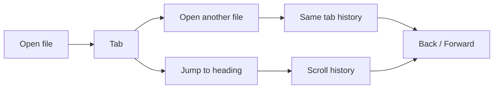
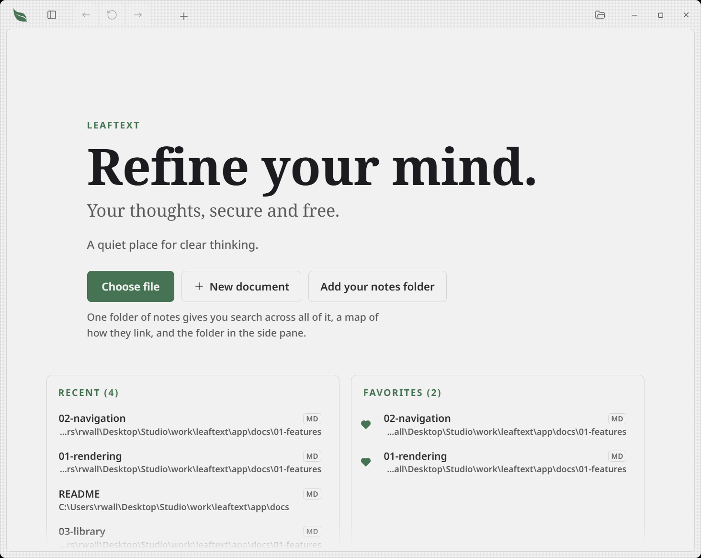
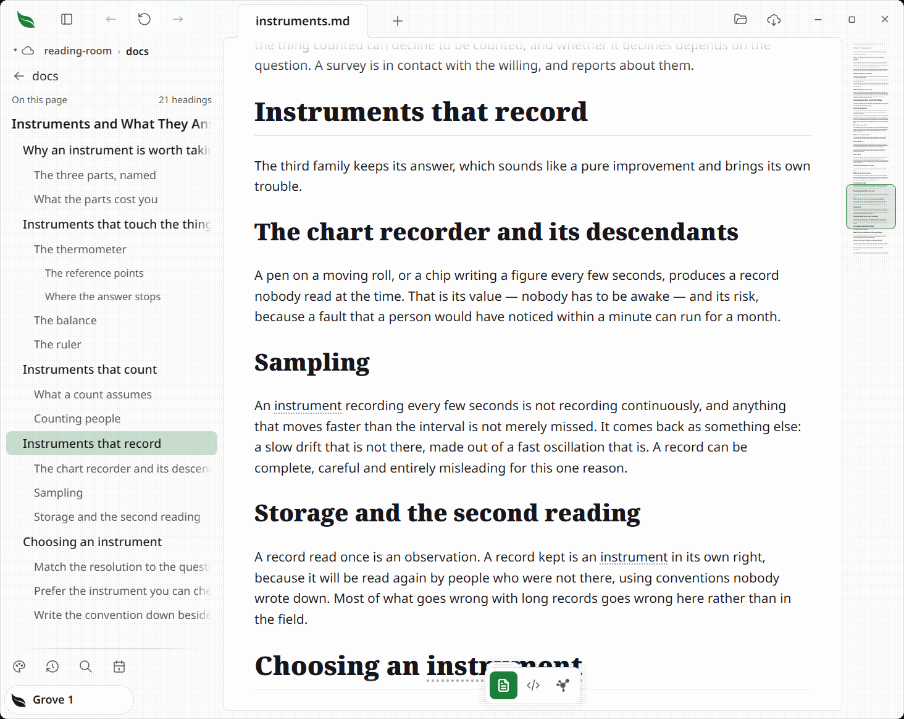
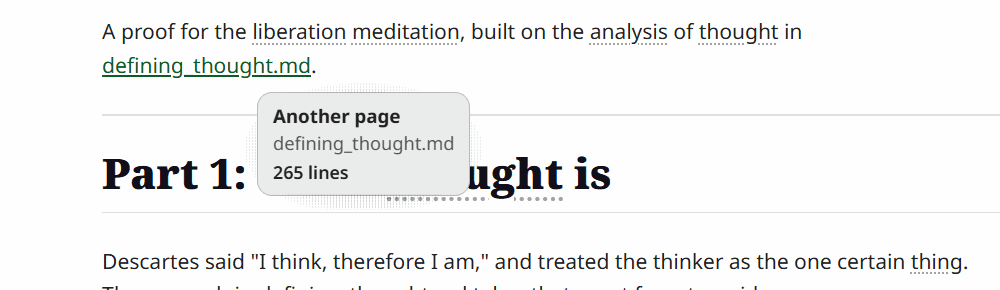
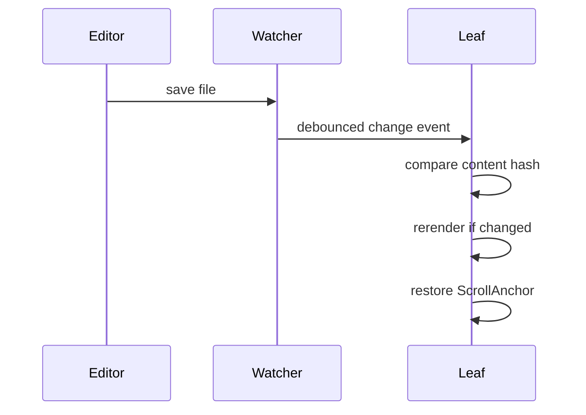

# Navigation

> Never lose your place. Leaftext moves like a browser — tabs, Back and Forward, in-document jumps, and your scroll position kept across reloads.

The navigation model is simple from the outside and fairly careful under the hood. Each tab keeps its own file history and its own in-document scroll history.

## Summary

| Feature | What it means |
| --- | --- |
| [Tabs](#tabs) | Open multiple documents at once |
| [New document](07-editing.md#new-document) | The **+** in the app bar starts a blank page, ready to type |
| [Outline](#outline) | A collapsed table of contents, built from the document's headings, at the top of each page, labeled with the document's line count |
| [Back / Forward](#history) | Move through file history and in-page jumps |
| [Scroll anchors](#restore) | Restore the same reading spot after rerenders |
| [Live reload](#reload) | Reload a changed file without losing your place |
| [Recent files](#recent-files) | Reopen the last 8 files quickly |
| [Loading spinner](#loading) | A spinner appears over the reader while a slow document or view renders |
| [Glossary sheet](#glossary) | Open a glossary term over the page without leaving it |
| [Link hints](#link-hints) | Hover a link to see what kind it is and where it points |
| [Pager](#pager) | Previous / Next buttons at the bottom of each document for reading a folder in order |
| [Single window](#tabs) | A second launch opens the file as a tab in the running window instead of a new copy |
| [Code view](07-editing.md) | Toggle any document to its raw, editable source |

## Model



## Shortcuts

| Action | Windows | macOS |
| --- | --- | --- |
| Open file | `Ctrl+O` | `Cmd+O` |
| Close tab | `Ctrl+W` | `Cmd+W` |
| Back | `Alt+Left` | `Cmd+Left` |
| Forward | `Alt+Right` | `Cmd+Right` |
| Next tab | `Ctrl+Tab` | `Ctrl+Tab` |
| Previous tab | `Ctrl+Shift+Tab` | `Ctrl+Shift+Tab` |
| Save (with [unsaved edits](07-editing.md#save)) | `Ctrl+S` | `Cmd+S` |
| [Undo](07-editing.md#undo) the last reading-view edit | `Ctrl+Z` | `Cmd+Z` |
| Select the page (reading view) | `Ctrl+A` | `Cmd+A` |

Tab cycling is `Ctrl`-based on every platform, including macOS. Mouse side buttons also trigger Back and Forward.

## The chrome

Two bars. The one at the top is about the app; the one floating at the foot of the page is about the document.

### The app bar


The leaf mark at the left is the way home — click it to return to the no-file screen. Beside it sit the library button, Back and Forward, then the tab strip, and at the right Open, **+** ([new document](07-editing.md#new-document)) and Settings. Those three are about the app rather than the document, which is why they are up here and not on the floating toolbar.

On Windows the app bar doubles as the title bar — see [Themes → Windows](06-themes.md#windows).

### The floating toolbar

A small bar floats over the foot of the page, holding the ways of looking at the document you have open, then whatever you can do to it.

| Group | What is in it |
| --- | --- |
| Views | [Reading](01-rendering.md), the [source](07-editing.md#code-view), and the [graph](03-library.md#graph). Exactly one is filled in the accent color: the one you are in |
| Reading tools | Shown only on the reading view, in a recess to the left of the view buttons so the three stay together: the [padlock](07-editing.md#the-padlock) and the [speed reader](05-settings.md#speed-reader) |
| Source tools | Shown only on the code view, in the same recess: the [typing help](07-editing.md#typing-help) wand |
| Edits | [Undo](07-editing.md#undo) and [Save](07-editing.md#save), each appearing only when there is something to undo or save |

**No document, no bar.** The three views are three ways of showing one thing, and the start screen is not that thing — a toggle there would be navigation, which the [library](03-library.md) pane already does better.

**All three views are always enterable.** With the bar up there is a document, and a document can be read, edited as source, and mapped — so no view button is ever dead. The graph used to gray out without a [vault](03-library.md#vaults); it maps the [open document](03-library.md#graph) instead now. The reading tools do appear and disappear with the reading view, because a control for a view you are not in says nothing.

### Tabs

- Opening another file creates another tab, and so does starting a [new document](07-editing.md#new-document).
- Each tab keeps its own document history.
- Each tab also keeps its own scroll history.
- Switching away from a tab and back returns you to where you left it — the same reading position, or, for a tab in the [code view](07-editing.md#code-view), the same spot in the source.
- A tab with [unsaved edits](07-editing.md#save) shows a dot in the corner where its close button sits, until they are saved; pointing at the tab hands that corner back to the button. The two share one spot rather than each taking their own, so a tab never changes size as the pointer crosses it.
- Tabs can be dragged to reorder them.
- Clicking a tab while the [Graph view](03-library.md#graph) is open flies the graph to that document's node and zooms in on it.
- Closing the last tab returns to the home screen. So does clicking the leaf mark at the left of the app bar, which brightens on hover to show it is a control.
- Opening a file while Leaftext is already running (e.g. Explorer "Open with", or double-clicking an [associated file](../02-installation.md#file-associations)) reuses the running window — the file opens as a new tab and the window comes to the front, rather than launching a second copy of the app.

#### When the bar runs out of room

Tabs are never squeezed to make space for the toolbar. As the strip fills, the app bar's buttons fold into a chevron menu one at a time, right to left: the trailing actions first, then Back and Forward, then the window controls. Two never fold — the leaf, which is the way home, and the [library](03-library.md#layout) button, which on a narrow window is the only way to reach the library at all. Widening the window puts each one back where it came from.

While the [library sheet](03-library.md#narrow-windows) is up it covers the page, so the tab strip goes with it.

## Moving between documents

### History

**Files.** Open `README.md`, then click a link to `docs/guide.md`. Back returns to `README.md`. Forward returns to `docs/guide.md`.

**Jumps.** Jump from `#intro` to `#api` inside the same document. Back returns to the earlier reading position instead of switching files.

That second case is why Leaftext keeps scroll history separately from file history.

### Restore

Leaftext stores a reading position as a `ScrollAnchor`:

| Part | Meaning |
| --- | --- |
| `section` | Nearest heading above the top edge |
| `block` | Content block number within that section |
| `offsetY` | Pixel offset from that block |

This is more stable than storing only raw scroll pixels, so the app can usually return to the same paragraph after rerendering.

The same anchor also holds your place while a document is still settling. Images decode, Mermaid diagrams and math render, and the Pager arrives a beat later; each changes the page height, and Leaftext re-pins the reader to its anchor so the text you were reading stays where you left it. Anything that moves the reader therefore records a fresh anchor as it lands — including a click or drag on the [minimap](04-minimap.md) — or the next late arrival would restore the spot you jumped away from.

The anchor is recorded a moment after scrolling stops rather than on every frame of it. Reading it means measuring the document, which on a large file is expensive enough that doing it per wheel click is what makes the wheel feel slow. While a scroll or a drag is in flight the reader's position is yours, so the re-pin stands aside until the gesture settles — re-pinning mid-gesture would pull against the very scroll that is happening.

### Recent files



The no-file home screen shows the last 8 opened files, under the **Choose file** and **New document** buttons.

- Missing files are removed automatically.
- Equivalent path spellings collapse to one entry.
- Clicking a recent file opens it immediately.

### Loading

Opening a document hands it to the Rust side to parse and render before the view comes back, and building the page in the reading view can itself take a moment for a large file. For a big document either half of that is slow, so Leaftext shows a spinner over the reader while the work happens and clears it the instant the new view arrives.

- The spinner covers every path that loads a view: opening a file (from [recent files](#recent-files), the [library](03-library.md), a link, the Open dialog, or drag-and-drop), Back/Forward, switching tabs, and toggling the [code view](07-editing.md#code-view) in either direction.
- It appears immediately when a load starts, so a quick load may show it briefly rather than not at all.
- It overlays the reader without disturbing the [library](03-library.md) pane or the app bar, and lets clicks pass through.
- Re-clicking the tab you are already on does nothing on the host side, so no spinner appears there. Reading-view edits, such as ticking a checkbox, re-render in place without one.
- The [minimap](04-minimap.md#how-it-works) rail carries a spinner of its own. Its thumbnail is a scaled clone of the finished page, so it can only be built once the document has been laid out — it arrives just after the page rather than with it.
- A safety timeout lowers it even if a response never comes, so it can never get stuck on screen.

## Moving within a document

### Outline



Every document opens with an **Outline** — a table of contents built automatically from the document's headings — tucked just under the title. It starts collapsed, so it never crowds the top of the page; click it to expand.

- The collapsed header shows the document's total length — **Outline (312 lines)** — counting the body blocks: paragraphs, headings, list items, quotes, code blocks, tables. The outline's own entries are navigation rather than body, so they don't count, and neither do footnote definitions.
- Entries nest as a bulleted list that mirrors the heading levels, so the shape of the document is visible at a glance.
- Each entry links to its heading, so clicking one jumps straight there.
- It is built from the rendered headings, so it behaves the same for Markdown, [XML](01-rendering.md#xml), [JSON or YAML](01-rendering.md#data-files-json-and-yaml), and [email](01-rendering.md#email-eml).
- It appears whenever a document has a title plus at least one more heading; a document with only a title shows none.

The outline lists the sections within the current document, which makes it a companion to the [minimap](04-minimap.md): the outline is the document's structure as clickable text, the minimap a scaled picture of the whole page.

### Pager


When you open a Markdown, [XML](01-rendering.md#xml), [JSON, YAML](01-rendering.md#data-files-json-and-yaml), or [email](01-rendering.md#email-eml) document that sits inside a folder tree connected by `README.md` files, Leaftext appends a **Previous / Next** bar at the bottom of the page. Clicking a button opens the adjacent document in reading order without creating an extra history entry.

Reading order follows the same depth-first walk the docs viewer uses: inside each folder, non-README documents come first (every renderable format together — Markdown, XML, JSON, YAML, and email — sorted by name), then each subfolder — its README acting as the folder's landing page — followed by that folder's own pages. `README` and `GLOSSARY` files (either extension) are never standalone entries in the sequence.

Working out the Previous / Next links means scanning the folder tree, so Leaftext does it after the document is already on screen rather than blocking the initial render. A placeholder bar shows in its place for the moment it takes, then the real buttons fill in. In a folder with a great many files the page appears immediately and the pager simply arrives a beat later.

The pager is on by default and can be turned off in [Settings](05-settings.md#pager).

### Link hints



Hovering a link shows a small tooltip that names what kind of link it is and shows the exact href it was written with, so you can tell a [glossary](#glossary) term from an in-page jump from an outside site before you click. When the link opens another document, the tooltip also shows how long that document is, in lines, so you know whether you are about to open a short note or a long one.

| Hint | When you see it |
| --- | --- |
| Glossary entry | A `glossary:` term link, or a link to `GLOSSARY.md#term` |
| Full glossary | A bare `glossary:` link that opens the whole glossary |
| In-page jump | A `#fragment` link to a heading on the current page |
| Another page | A relative link to any document Leaftext reads — `.md`, [`.xml`](01-rendering.md#xml), [`.json`, `.yaml`](01-rendering.md#data-files-json-and-yaml), [`.eml`](01-rendering.md#email-eml) (its line count is shown too) |
| External site | An `http://` or `https://` link |
| Email link | A `mailto:` link |
| App link | Any other URL scheme |
| Site path | A root-relative `/path` link |

This is a desktop affordance: it appears only with a mouse (a fine pointer that can hover), and is left off on touch screens. The tooltip follows the cursor, flips to stay on screen near the edges, and hides on scroll or when the window loses focus.

The hint also tells you where a click will land. A link to a document Leaftext reads opens in the reading view, in the current tab, with a history entry — that covers every format it renders, not Markdown alone, so a link from a note to the `.json` beside it stays inside the app. A link to any other local file (an image, a PDF, a spreadsheet) is handed to your operating system to open in whatever owns that type.

## Glossary


A document draws its terms from a shared glossary file. You do not have to link them yourself: wherever a defined term appears in the text, Leaftext links it for you. Clicking one does not switch documents: it opens that single glossary entry in a sheet that slides up over the page you are reading, so you keep your place underneath.

- Terms are matched automatically in every format Leaftext renders — Markdown, [XML](01-rendering.md#xml), [JSON and YAML](01-rendering.md#data-files-json-and-yaml), [email](01-rendering.md#email-eml) — whole words, ignoring case — so the same glossary covers every page with no per-page markup.
- Text that is already a link, or inside code, is left alone, and the glossary file never links its own entries to themselves.
- Dismiss the sheet with its close button, by clicking outside it, with the `Escape` key, or by dragging the grab bar at its top downwards — a short flick is enough, and letting go partway lets it spring back.
- The sheet rises the moment you click the term. A large glossary takes a moment to read, so it opens on a spinner and fills in when the entry is ready; a glossary small enough to answer at once never shows one. If there is no `GLOSSARY.md` to be found, or no entry under that term, the sheet says so instead of spinning.
- A link inside the sheet that points at another glossary term swaps the entry in place; any other link leaves the glossary and follows the link normally.
- A link at the foot of the sheet opens the whole glossary as a page.
- Glossary term links take the surrounding text's color and carry a quiet dotted underline in a dimmed wash of that same color, in every theme and mode — enough to mark an expandable term without pulling the eye away from the prose. Where the prose is already muted, as in a quote, the underline dims further to match.
- The glossary lives at one file, so the whole document set can share a single set of definitions.

### Author a glossary

Write one `GLOSSARY.md` at or above your documents, with a `##` heading per term:

```md
# Glossary

## Minimap

The overview rail down the right edge of the reading view.

## Tab

One open document, with its own Back/Forward history and scroll position.
```

That is all the authoring you need: every mention of *Minimap* or *Tab* across your documents now opens its entry. The app finds the glossary by walking up from the open document to the nearest `GLOSSARY.md`, so it can sit right beside a page or many folders above at the root of a project, and each project's pages bind to that project's own glossary. Because every page draws on the same file, one glossary serves the whole set.

You can still link a term by hand when you want to — using the heading's slug (its text lowercased, spaces turned to hyphens — so `Bottom Sheet` becomes `bottom-sheet`):

```md
Keep your place with the [minimap](glossary:minimap).
```

The `glossary:` link carries no file path, so the same text works from any page no matter how deeply it is nested. A plain relative link to the file also works — `[minimap](GLOSSARY.md#minimap)`, or `[minimap](../GLOSSARY.md#minimap)` from a page one folder down — but you have to count the folders yourself. Both forms open the same sheet as the automatic links.

> [!TIP]
> These docs ship their own glossary, with an entry per feature and subfeature. The links in the [Introduction](../01-introduction.md) — like [minimap](../GLOSSARY.md#minimap) — open this set's [GLOSSARY.md](../GLOSSARY.md); click one to see the sheet in action.

## Reload

When the current file changes on disk, Leaftext reloads it and tries to preserve your place.



Key details:

- The file watcher debounces events with a 200 ms window.
- Leaftext hashes the file contents to skip duplicate reloads, and skips a reload outright when the file already holds exactly what is on screen — the hash is unknown right after a document opens, and the whole folder is watched, so the first event to arrive is usually about something else.
- Reload re-renders through the same pipeline the file opened with — [XML](01-rendering.md#xml) stays XML, [JSON and YAML](01-rendering.md#data-files-json-and-yaml) stay themselves, [email](01-rendering.md#email-eml) stays email, Markdown stays Markdown.
- The parent directory is watched instead of only the file, so atomic-save editors still work.
- Other Markdown files changed in that same folder are indexed live, so the [library](03-library.md#live-updates) pane stays current too.
- Replacing an [image](01-rendering.md#images) the document shows refreshes the picture in place, without a rerender, so the reader does not move.
- Saving from the [code view](07-editing.md#save) does not trigger a reload — the watcher recognizes the app's own write — and a document with [unsaved edits](07-editing.md#external-changes) is never clobbered by an outside change.

## Next

- [Quickstart](../03-quickstart.md) if you want the basics first
- [Library](03-library.md) if you want browsing and search
- [Editing](07-editing.md) if you want to write in the page
- [Architecture](../02-development/01-architecture.md) if you want the implementation details
