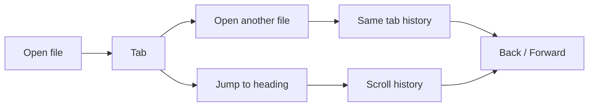
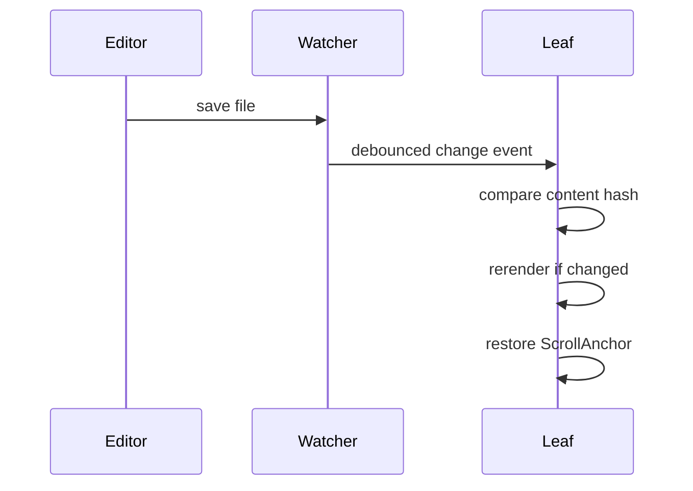

# Navigation

> Never lose your place. Leaftext moves like a browser — tabs, Back and Forward, in-document jumps, and your reading position kept across reloads, tab switches and every step back.

The navigation model is simple from the outside and fairly careful under the hood. Each tab keeps its own file history and its own in-document scroll history.

## Summary

| Feature | What it means |
| --- | --- |
| [Tabs](#tabs) | Open multiple documents at once |
| [New document](07-editing.md#new-document) | The **+** in the app bar starts a blank page, ready to type |
| [Outline](#outline) | The open document's headings, listed in the [library pane](03-library.md) with the one you are reading lit, labeled with how many headings it holds |
| [Back / Forward](#history) | Move through file history and in-page jumps, landing where you were reading, with the page you leave sliding out the way you came |
| [Scroll anchors](#restore) | Restore the same reading spot after rerenders, and on every step of a tab's history |
| [Scrollbars](#scrollbars) | Every bar fades in while its box is being scrolled and out a moment after it stops, and comes back thicker while the pointer rests on it — or stays drawn the whole time, where your machine is set to always show scrollbars |
| [Live reload](#reload) | Reload a changed file without losing your place |
| [Recent files](#recent-files) | Reopen a recently opened file from the home screen, showing the vault you are standing in |
| [Favorites](#favorites) | Favorite a file or folder so it is never lost off the end of Recent, in its own column beside it |
| [Loading spinner](#loading) | A spinner appears over the reader while a slow document or view renders |
| [Export the page](#export-the-page) | Save the page you are reading as one continuous PDF, as a picture of the whole document, or as a web page with its stylesheet, its pictures and its [minimap](04-minimap.md#on-an-exported-page) in a folder beside it — every one of them in the theme on screen |
| [Glossary sheet](#glossary) | Open a glossary term over the page without leaving it |
| [Link hints](#link-hints) | Hover a link to see what kind it is, where it points, the opening of a linked note, and a glossary term's whole entry |
| [The pointer](#the-pointer) | The arrow stays the arrow over every control, and turns into the hand only over a link |
| [What a control does under the pointer](#what-a-control-does-under-the-pointer) | The buttons at the top right, the file rows in the pane and a button written into a document answer with their color, their shape and a hair of lift, over the same beat |
| [Open a link in a new page](#opening-a-link-in-a-new-page) | Ctrl-click, middle-click or right-click a link to open it behind what you are reading |
| [Pager](#pager) | Previous / Next buttons at the bottom of each document for reading a folder in order, filling with the page's own dot texture under the pointer |
| [Single window](#tabs) | A second launch opens the file as a tab in the running window instead of a new copy |
| [When the bar runs out of room](#when-the-bar-runs-out-of-room) | On a window too narrow for the whole app bar, its buttons fold into a chevron menu one at a time — and the window's own close, minimize and maximize stay on the bar |
| [Code view](07-editing.md) | Toggle any document to its raw, editable source |

## Model



## Shortcuts

| Action | Windows | macOS |
| --- | --- | --- |
| Open file | `Ctrl+O` | `Cmd+O` |
| Close tab | `Ctrl+W` | `Cmd+W` |
| Back | `Alt+Left` | `Cmd+Left` |
| Forward | `Alt+Right` | `Cmd+Right` |
| Next tab | `Ctrl+Tab` | `Ctrl+Tab` |
| Previous tab | `Ctrl+Shift+Tab` | `Ctrl+Shift+Tab` |
| Save (with [unsaved edits](07-editing.md#save), your own typing included) | `Ctrl+S` | `Cmd+S` |
| [Undo](07-editing.md#undo) — a word of your typing, then the last reading-view edit | `Ctrl+Z` | `Cmd+Z` |
| [Redo](07-editing.md#undo) a word of typing, or a whole edit, you took back | `Ctrl+Y` or `Ctrl+Shift+Z` | `Cmd+Shift+Z` |
| Select the page — or, with the caret in a block, [a step wider per press](07-editing.md#deleting) | `Ctrl+A` | `Cmd+A` |
| Copy the words highlighted in the document | `Ctrl+C` | `Cmd+C` |
| [Delete](07-editing.md#deleting) a selection that crosses blocks | `Delete` or `Backspace` | `Delete` or `Backspace` |
| [Find](#find-in-this-document) in this document | `Ctrl+F` | `Cmd+F` |
| [Find and replace](#find-in-this-document) | `Ctrl+H` | `Cmd+H` |
| [Put a cursor on every match](#find-in-this-document), from the find field | `Alt+Enter` | `Alt+Enter` |
| [Add a cursor where you click](#find-in-this-document), in the source view | `Ctrl`+click | `Cmd`+click |
| [Bold](07-editing.md#the-format-bar) the highlighted words | `Ctrl+B` | `Cmd+B` |
| [Italic](07-editing.md#the-format-bar) the highlighted words | `Ctrl+I` | `Cmd+I` |
| [Link](07-editing.md#the-format-bar) the highlighted words | `Ctrl+K` | `Cmd+K` |
| [Open a link in a new page](#opening-a-link-in-a-new-page) | `Ctrl`+click | `Cmd`+click |

Tab cycling is `Ctrl`-based on every platform, including macOS. Mouse side buttons also trigger Back and Forward.

## The chrome

Two bars. The one at the top is about the app; the one floating at the foot of the page is about the document.

### The app bar


The leaf mark at the left is the way home — click it to return to the no-file screen. Beside it sit the library button, Back and Forward, then the tab strip, and at the right the palette that opens the [theme picker](06-themes.md#choose), Open, **+** ([new document](07-editing.md#new-document)), and [Export](#export-the-page). Those are about the app rather than the document, which is why they are up here and not on the floating toolbar.

**Open reaches any file, on either platform.** On Windows the dialog carries a list of the [formats the reader opens](03-library.md#file-types), with **All files** at the end for anything else. A Mac dialog has no such list, so it simply shows everything — which is the same answer, since a file whose ending Leaftext does not know is [read as Markdown](01-rendering.md) rather than refused.

### Export the page

The export button in the app bar — shown only while a rendered document is in front of you — asks where the file goes, and which kind of file it is. On Windows the save window carries every kind it can write and the ending on the name is what gets written; on a Mac that window shows no format at all, so a short menu asks first and the window then carries the one you picked. Either way the list is the one the app can actually write on the machine you are on. The reader stays exactly where it is while the save window is open and while the file is rendered: its tabs, bar, pane and toolbar do not move. The button steps aside on the home screen, in the [source view](07-editing.md#code-view) and on the [graph](03-library.md#graph), since none of those is a page to hand over.

A page whose [diagrams](01-rendering.md#mermaid-diagrams) are not all drawn yet has every one of them drawn before anything is asked, so a document exported the moment it opens carries its drawings rather than empty frames the right size. The reading spinner stands over the page while that runs — a few seconds on a document of a dozen diagrams, about fifteen on one of two hundred — and the save window opens when it is done.

**PDF document** writes the page as one continuous page: every screen of it, in the theme on screen, with none of the app's controls and the paper ending at the last line. A document taller than the longest page a PDF can hold — about two hundred inches — is still one page: the whole of it is shrunk to fit that page rather than cut into sheets, because a drawing cannot be split across a cut and every cut left a gap above it.

**PNG picture** writes the whole document as one picture: every screen of it, in the theme on screen, with none of the app's controls — the same document the PDF row writes, at the same width, as pixels. It is the row to pick for pasting the page into a chat, a slide or a web page, none of which will take a PDF. A long document makes a large file; nothing is scaled down to keep it small, because a twentieth-size picture of a document is not a picture of it.

**WebP picture** writes that same picture at about half the file, in the format anything you paste into already reads. It cannot hold a picture more than 16,383 pixels down the page, which a long document passes — there it says so and writes nothing, and the PNG row has no such limit. On a Mac it is not offered at all.

**JPEG picture** writes that same picture again, in the one format every tool takes, for anything that will not accept a WebP. It is the row for a long document as much as for reach: it holds four times what WebP does, and on the pages measured here it is smaller than the PNG — a page four thousand pixels down came to 805 KB against 845 KB, and one twenty thousand down to 1,756 KB against 2,710 KB, where WebP is refused. Either spelling of the ending works, `.jpg` or `.jpeg`. Past what it can hold it says so and writes nothing, and the PNG row takes it.

**Web page** writes what is on screen as a web page anybody can open in a browser — the same theme, the same type, its diagrams drawn and its links live — with its stylesheet and every picture it draws in an `assets` folder beside it. It lays out the way the app does: the sentences hold a comfortable column that grows and shrinks with the browser window, while a wide table or picture takes the room beside it; printing that page from the browser still puts everything back in the column so the sheets come out right. That folder is shared: export a second document into the same place and it joins the first, and a picture whose name is already taken by a different picture is written beside rather than over. Export the same document again and it finds the copies it made last time and points at them, so the folder holds one copy of each picture however many times you export. A document with math in it carries the stylesheet that draws equations too; one without carries neither it nor its fonts. That folder also holds one small script, the [minimap](04-minimap.md#on-an-exported-page): the rail stands down the right edge of the exported page on a window with room for it, and the page is the document and nothing else — no buttons, no settings, nothing fetched over a network.

A quiet note names the file when it is written, and the name is a press — click it to open it in whatever your machine opens that kind with.

**There is no Settings button.** Every control stands where it applies — see [Settings](05-settings.md). The one thing that comes and goes is the [update](05-settings.md#updates) bell, which is in the bar only while there is something to download or install.

The app bar doubles as the title bar on both platforms, and Leaftext draws the window buttons itself on each: squares at its right end on [Windows](06-themes.md#windows), and three dots at its left end on [macOS](06-themes.md#macos), where a Mac's belong. Both fold into the chevron menu when the bar runs out of room.

### The floating toolbar

A small bar floats over the foot of the page, holding the ways of looking at the document you have open, then whatever you can do to it.

| Group | What is in it |
| --- | --- |
| Views | [Reading](01-rendering.md), the [source](07-editing.md#code-view), and the [graph](03-library.md#graph). Exactly one is filled in the accent color: the one you are in |
| Editing tools | A recess to the left of the view buttons, so the three views stay together. It carries the tools of the view you are in: the [padlock](07-editing.md#the-padlock) in both editable views, the [speed reader](05-settings.md#speed-reader) in the reading view, the [typing help](07-editing.md#typing-help) wand in the source. The graph has none, so the recess goes with it |
| Source tools | Shown only on the code view, in the same recess: the [typing help](07-editing.md#typing-help) wand |
| Edits | [Undo](07-editing.md#undo) and [Save](07-editing.md#save), each appearing only when there is something to undo or save |

**No document, no bar.** The three views are three ways of showing one thing, and the start screen is not that thing — a toggle there would be navigation, which the [library](03-library.md) pane already does better.

**All three views are always enterable.** With the bar up there is a document, and a document can be read, edited as source, and mapped — so no view button is ever dead. The graph used to gray out without a [vault](03-library.md#vaults); it maps the [open document](03-library.md#graph) instead now. The reading tools do appear and disappear with the reading view, because a control for a view you are not in says nothing.

### Tabs

- Opening another file creates another tab, and so does starting a [new document](07-editing.md#new-document).
- Reopening Leaftext puts its saved file tabs back in the same order and opens the tab that was in front, at its last reading or source position; the other documents wait to load until you select them. A file that is no longer there does not return unless you had left words unsaved in it, and neither does a [new document](07-editing.md#new-document) nobody typed into.
- A tab you closed the window on with [unsaved edits](07-editing.md#save) comes back with those edits still in it and its dot lit — the front tab and the ones behind it alike, and a [new document](07-editing.md#new-document) with words in it among them, under the name it was wearing and still asking where it goes on its first save. Where the file itself changed on disk in the meantime, the file wins and the tab opens as the disk has it, since writing your old words over somebody else's edit is the worse of the two. Where it has left the disk altogether — deleted, renamed, or sitting on a drive that is not mounted — the tab comes back as a note with no file, wearing the name it had, so the words are still there and the first save asks where to put them. A tab that had followed a link out of the document it was typed in comes back sitting on that document rather than on the page it walked to, since the words belong there and a reopened tab has no Back to press.
- Each tab keeps its own document history, and every step in it remembers where you were reading on that document.
- Each tab also keeps its own scroll history.
- Switching away from a tab and back returns you to where you left it — the same reading position, or, for a tab in the [code view](07-editing.md#code-view), the same spot in the source.
- A tab shows its filename, including its dot extension, such as `email-thread.md`; a long inactive name fades evenly at both sides, while the active tab reveals its whole name. Its close cross shows only when you point at it or the keyboard reaches it, so a strip of tabs is a row of names. The cross fades in over the end with a wash behind it, and neither it nor the [favorite](#favorites) heart in the opposite corner takes any of the tab's room, since neither is drawn at rest.
- A tab with [unsaved edits](07-editing.md#save) shows a dot in the corner where its close button sits, until they are saved; pointing at the tab hands that corner back to the button. The two share one spot rather than each taking their own, so a tab never changes size as the pointer crosses it.
- Both corner buttons take their own click on a tab you are not reading: the cross closes it and the heart marks it, without switching to it first.
- Closing a tab you are not reading leaves the page you are reading exactly where it was — the strip loses the tab and nothing else moves, whether that page is the rendered document or the [source](07-editing.md#code-view). Closing the tab you *are* reading brings the neighbor forward at the place you left it, the same as switching to it would.
- Tabs can be dragged to reorder them, and dragging one leaves the page you are reading exactly where it was — the strip takes the new order and nothing else moves, whether that page is the rendered document or the [source](07-editing.md#code-view).
- Clicking a tab while the [Graph view](03-library.md#graph) is open flies the graph to that document's node and zooms in on it.
- Closing the last tab returns to the home screen. So does clicking the leaf mark at the left of the app bar, which brightens on hover to show it is a control.
- Opening a file while Leaftext is already running (e.g. Explorer "Open with", or double-clicking an [associated file](../02-installation.md#file-associations)) reuses the running window — the file opens as a new tab and the window comes to the front, rather than launching a second copy of the app.

#### When the bar runs out of room

Tabs are never squeezed to make space for the toolbar. As the strip fills — or as the bar itself runs wider than the window, which is what happens on a narrow window with nothing open — the app bar's buttons fold into a chevron menu one at a time, right to left: the trailing actions first, then Back and Forward, then the window controls. Two never fold — the leaf, which is the way home, and the [library](03-library.md#layout) button, which on a narrow window is the only way to reach the library at all. Once a group has gone entirely — the theme, open and new buttons, or Back and Forward — the row closes up over it rather than holding a gap where it stood. Widening the window puts each one back where it came from.

Both halves of that matter on a small window. Closing your last document empties the tab strip, and an empty strip has nothing to run out of — so the bar is measured on its own account as well, and the window's own close, minimize and maximize buttons stay drawn inside the window with the chevron holding whatever will not fit beside them.

The menu reads in its own order, not the order things folded into it: Back, Forward, Themes, Open, New, then the window buttons at the foot. So the controls you open it for are at the top, and close is not the first thing under the pointer. On a Mac that means the three dots stack at the bottom with zoom above and close at the very foot — the reverse of how they read across the bar, since stacked they run top to bottom.

While the [library sheet](03-library.md#narrow-windows) is up it covers the page, so the tab strip goes with it.

## Moving between documents

### History

**Files.** Open `README.md`, then click a link to `docs/guide.md`. Back returns to `README.md`, at the paragraph you left rather than the top of the page. Forward returns to `docs/guide.md`, at the place you left that one.

**Jumps.** Jump from `#intro` to `#api` inside the same document. Back returns to the earlier reading position instead of switching files.

**A renamed file.** [Rename a file](03-library.md#file-actions) and every step that was standing on it follows the new name, in every tab and forward as well as back — so pressing Back onto a document you had already read once lands on it rather than on a message saying it could not be opened. Each step keeps the place you were reading at.

That second case is why Leaftext keeps scroll history separately from file history.

**Which way you went shows.** Following a link brings the new page in from the right while a still picture of the one you left slides off to the left; Back and Forward reverse it, and the page you are leaving carries the words you were reading out with it rather than jumping to its own top first. Going into a folder in the [library](03-library.md#file-tree) pane reads the same way, and the row that steps back out reverses it. Only going somewhere moves: saving, an edit, a file changing on disk, the padlock and clicking a tab all draw as immediately as they always have. With Reduce Motion on, every one of those lands in a single frame.

### Restore

Leaftext stores a reading position as a `ScrollAnchor`:

| Part | Meaning |
| --- | --- |
| `section` | Nearest heading above the top edge |
| `block` | Content block number within that section |
| `offsetY` | Pixel offset from that block |

This is more stable than storing only raw scroll pixels, so the app can usually return to the same paragraph after rerendering.

Every step in a tab's [file history](#history) carries one, written as you navigate off that document, so Back and Forward land where you were reading rather than at the top. A document you have not left yet has no anchor, which is why a first visit starts at the top. A document that fails to open loses its step and its position together, so Back never restores a place on a page it cannot show.

The [map](03-library.md#graph) hides the reading page rather than replacing it, and a hidden page measures nothing — so the anchor it was holding is kept rather than re-read while the map is up, and the place the page was at is taken before the map covers it. A page drawn while the map is already up — which is what the trip in from the [source view](07-editing.md#code-view) does — holds its landing rather than spending it on a page with nothing to measure, and the moment the map steps aside that landing runs. That is what lets the map hand the page back where you were, and the source view open on the lines that were on screen.

The same anchor also holds your place while a document is still settling. Images decode, Mermaid diagrams and math render, and the Pager arrives a beat later; each changes the page height, and Leaftext re-pins the reader to its anchor so the text you were reading stays where you left it. Anything that moves the reader therefore records a fresh anchor as it lands — including a click, a drag or a wheel notch on the [minimap](04-minimap.md) — or the next late arrival would restore the spot you jumped away from.

The anchor is recorded a moment after scrolling stops rather than on every frame of it. Reading it means measuring the document, which on a large file is expensive enough that doing it per wheel click is what makes the wheel feel slow. While a scroll or a drag is in flight the reader's position is yours, so the re-pin stands aside until the gesture settles — re-pinning mid-gesture would pull against the very scroll that is happening.

A re-pin reads your place at the moment it runs, never the moment it was queued. Drawing a page of [Mermaid diagrams](01-rendering.md#mermaid-diagrams) holds the window for a beat at a time, so a re-pin asked for before you scrolled can land after it — and the place it restores has to be where you are now, not where you were.

### Recent files


The no-file home screen lists the files you opened most recently, under the **Choose file** and **New document** buttons — plus **Add your notes folder** until you have a [vault](03-library.md#your-first-vault); the last 50 are kept. Every row shows the file's clean name with its type as a badge and the folder underneath, so you read the name rather than the path. With any [favorites](#favorites) it becomes two boxes side by side, Recent on the left and Favorites on the right. The whole path is still the row's tooltip either way, and a right-click gives the same menu it always did.

- **The three lines at the top change with each visit.** The headline, the line under it and the sentence under that are drawn together from one of three voices — palm leaves and the long history of writing on them, clear thinking, and your files staying files you own — and you get a different one each time you come back to this screen. Nothing under them moves with it: the buttons, both lists, the help line and the version are the same every time.
- **The screen is about the [vault](03-library.md#vaults) you are standing in.** Recent shows that vault's files alone, the way [Favorites](#favorites) beside it does, and the small word over the headline is the vault's name where it otherwise reads **Leaftext**. Switching vaults from the [library](03-library.md#vaults) pane with the home screen up changes both lists and that word with them. Standing outside every vault, both lists show every vault at once, grouped under each vault's name with the files in no vault last.
- Each box is eight rows deep and scrolls, with the app's own thin [bar](#scrollbars) and a soft edge wherever there is more list past it.
- Missing files are removed automatically.
- Equivalent path spellings collapse to one entry.
- Clicking a recent file opens it immediately.

Where the window is too narrow for two columns, each list shows its first five rows with a **Show all** button under it, which opens that list in a sheet from the bottom of the window — drag it down or press Escape to close it.

### Favorites

Recent is a record of where you have been, and anything that fails to open drops off it. A favorite is a choice you made, so it stays until you say otherwise, and it has its own column on the home screen beside Recent.

- **From the tab you are reading.** Point at the tab and a heart appears in its top-left corner: click it to favorite the file, click it again to stop. It is filled when the file is already a favorite, and it fades out a beat after the pointer leaves — a strip of tabs at rest carries no marks, so the list is where you see them all.
- **From a right-click, for anything else.** **Favorite** in the menu, reading **Unfavorite** on one that is already a favorite. It works on a row in the [library](03-library.md) pane, on the page you are reading, on a tab, and on a row in the recent list — and on a folder as well as a file.
- **From the home screen.** Every row in the Favorites column carries a filled heart: click it and the file is unfavorited. The row stays for half a minute, dimmed, and clicking the heart again puts it back — so unfavoriting one is never a click you cannot take back.
- Marking shows straight away and is saved beside the recent list, in the same file.
- A favorite belongs to the [vault](03-library.md#vaults) it was marked inside. Something opened from outside every vault can still be favorited; removing a vault takes its own favorites with it.
- Outside a vault the column shows every vault's favorites at once, under the vault's name; inside one it shows that vault's alone, with no heading. Switching vaults from the [library](03-library.md#vaults) pane with the home screen up changes the column with it, and so does adding, renaming or removing one. A favorite folder opens the [library](03-library.md) pane at that folder rather than opening as a document.
- **A favorite whose file has moved stays, and says so.** Recent drops anything that fails to open; a favorite is a decision you made, so its row is struck through instead, with its folder line kept so you can see where it used to be, and **Find it…** at the end of the row opens the file picker and points that favorite at the file you choose. Nothing is ever repointed for you. A vault whose own folder has gone says so once on its heading, and its rows carry no way out — one file cannot be found inside a folder that is not there.
- **Drag a row to put the list in the order you want.** Press a row and move it: the row is carried under the pointer, the rows around it step aside, and the gap it will drop into shows where it lands. A row never leaves its own vault's group, and the order is saved, so it is the order you find next time. A press that does not move still opens the file.
- With no favorites there is no second column: the home screen is the Recent list on its own.

### Loading

Opening a document hands it to the Rust side to parse and render before the view comes back, and building the page in the reading view can itself take a moment for a large file. For a big document either half of that is slow, so Leaftext shows a spinner over the reader while the work happens and clears it the instant the new view arrives.

- The spinner covers every path that loads a view: opening a file (from [recent files](#recent-files), the [library](03-library.md), a link, the Open dialog, or drag-and-drop), Back/Forward, switching tabs, and toggling the [code view](07-editing.md#code-view) in either direction.
- It appears immediately when a load starts, so a quick load may show it briefly rather than not at all.
- It overlays the reader without disturbing the [library](03-library.md) pane or the app bar, and lets clicks pass through.
- Re-clicking the tab you are already on does nothing on the host side, so no spinner appears there. Reading-view edits, such as ticking a checkbox, re-render in place without one.
- The [minimap](04-minimap.md#how-it-works) rail carries a spinner of its own. Its thumbnail is a scaled clone of the finished page, so it can only be built once the document has been laid out — it arrives just after the page rather than with it.
- A safety timeout lowers it even if a response never comes, so it can never get stuck on screen.

## Moving within a document

### Scrollbars

Every scrollbar in the app fades in while its box is moving and fades out a moment after it stops, and there is only the one kind: the reading page, the [library](03-library.md#browsing) pane, the lists on the home screen, the [theme](06-themes.md) picker's grid of cards, a [glossary](../GLOSSARY.md) entry longer than its sheet, the canvas and the text pane in the [flowchart editor](07-editing.md#the-flowchart-editor) along with its shape picker, and the boxes a document itself brings — a line of code pushed past the page's width, a wide equation, a [frontmatter](01-rendering.md#frontmatter) block and any table too wide for the measure. A scroll Leaftext makes itself brings it up too, when it restores your place or jumps to a find match. Resting the pointer anywhere in the box does not bring it back — but resting it on the narrow strip the bar itself lives in does, and the bar thickens while it is pointed at, so it can be aimed at and dragged; moving away thins it and takes it off again. The space the bar takes is held whether or not it is drawn, so nothing on the page shifts when one arrives, and with the [minimap](04-minimap.md) rail up the reading page draws no bar at all because the rail is that indicator.

Where your machine is set to always show scrollbars — the accessibility setting on Windows, **Show scroll bars: Always** on a Mac — every one of those bars stays drawn instead of fading, from the moment the app starts. Nothing else changes: a bar still thickens under the pointer, it still holds the same space, and the reading page with the rail up still draws none. The setting is read at launch, so turning it on or off takes effect the next time the app starts, and the app has no switch of its own for it.

### Find in this document

`Ctrl+F` opens one find bar at the top right of the page, over whichever view is on screen — the rendered document or the [source](07-editing.md#code-view). `Ctrl+H` opens it with the replace row already down. Pressing the replace button slides that row down under the bar rather than snapping it there — see [collapsible sections](01-rendering.md#collapsible-sections), which is the same motion everything that folds open uses.

- The field opens with whatever you had highlighted, and the counter beside it reads **3 of 41** as you type. Past 999 matches it says `999+`.
- `Enter` steps to the next match, `Shift+Enter` to the previous, and `Escape` closes the bar and hands the keyboard back to the document.
- Every match is washed in the theme's accent color; the one you are on takes the primary, so stepping through is a mark that moves rather than a page of identical stripes.
- Four toggles: **Aa** match case (`Alt+C`), **ab|** whole word (`Alt+W`), **.\*** regular expression (`Alt+R`), and find inside the text you had highlighted (`Alt+L`). A half-typed expression reads `Bad expression` rather than `No results`.
- Every control on the bar is the same size as the buttons in the app bar above it, and on a narrow window the bar keeps itself whole: the field shrinks first, then the buttons wrap under it, and on a window as narrow as a phone the bar spans the page instead of floating in the corner.

Replacing needs the [padlock](07-editing.md#the-padlock) lifted for the view you are in, and the padlocks are separate: unlocking the page you read is not consent to rewrite the file by hand. **Replace** rewrites the match you are on, **All** rewrites every one, and either way it is a single edit — one `Ctrl+Z` puts the whole thing back.

**Put a cursor on every match** — the two-caret button between Next and Replace, or `Alt+Enter` from the field — works in the source view. Every match becomes a selection with the cursor at its end, so the first thing you type overwrites all of them at once and one `Ctrl+Z` puts them all back. It needs the source padlock lifted; with it shut the button says so rather than leaving you with carets that refuse to type. In the source view you can also hold `Ctrl` (`Cmd` on a Mac) and click to put a cursor wherever you click, as many times as you like. In the rendered page the button is still switched off — a cursor per match there is planned work, not shipped behavior.

In the rendered view a replace is written to the file's source, not to the page. That means the odd match cannot be replaced from there: `**dh**arma` reads as one word on screen and is three pieces in the file, so Leaftext says so and leaves it for the source view rather than guessing. Replacing in the rendered view is Markdown only; open the source view for the other formats.

### Outline


Open a document and the [library pane](03-library.md) swaps its file list for that document's **Outline** — its headings, in order, indented by level, with the one you are reading lit. The lit row moves as you scroll, so the pane says where you are as well as what is there.

- Above the list, a back row wearing the folder's name puts the files back.
- Under it, **On this page** names the list, with how many headings are in it at its right — **23 headings** — counted off the rows drawn below, so the number and the list can never disagree.
- **The levels look like levels.** The shallowest headings read largest and boldest; each level in is a step smaller and lighter, and from the third level in they sit in the page's quieter ink. So the shape of a document shows in the type as well as in the indenting, which matters most in a narrow pane where the indents run out.
- Clicking a row jumps to that heading, and the jump joins scroll history, so Back returns to where you were reading.
- Typing in the pane's [search box](03-library.md#search) replaces the outline with the results; clearing the box brings it back.
- It is built from the rendered headings, so it behaves the same for Markdown, [XML](01-rendering.md#xml), [JSON or YAML](01-rendering.md#data-files-json-and-yaml), and [email](01-rendering.md#email-eml).
- It appears whenever a document has a title plus at least one more heading; a document with only a title leaves the file list showing.

The outline lists the sections within the current document, which makes it a companion to the [minimap](04-minimap.md): the outline is the document's structure as clickable text, the minimap a scaled picture of the whole page.

### Pager


When you open a Markdown, [XML](01-rendering.md#xml), [JSON, YAML](01-rendering.md#data-files-json-and-yaml), or [email](01-rendering.md#email-eml) document that sits inside a folder tree connected by `README.md` files, Leaftext appends a **Previous / Next** bar at the bottom of the page. Clicking a button opens the adjacent document in reading order without creating an extra history entry.

Reading order follows the same depth-first walk the docs viewer uses: inside each folder, non-README documents come first (every renderable format together — Markdown, XML, JSON, YAML, and email — sorted by name), then each subfolder — its README acting as the folder's landing page — followed by that folder's own pages. `README` and `GLOSSARY` files (either extension) are never standalone entries in the sequence.

Working out the Previous / Next links means scanning the folder tree, so Leaftext does it after the document is already on screen rather than blocking the initial render. A placeholder bar shows in its place for the moment it takes, then the real buttons fill in. In a folder with a great many files the page appears immediately and the pager simply arrives a beat later.

Point at either button and it fills with the same fine dot texture the code blocks and table headers on that page wear, so it reads as one of the page's own surfaces rather than a panel laid over it, and the document name on it stays plain. The [hover tooltip](#link-hints) gives it the same card any other document link gets — that it opens another page, the address of that page, and how long it is — and sits clear of the button rather than over it. A middle click and the right-click menu treat it as a page too.

The pager is always there; it is not a [setting](05-settings.md#pager).

### Link hints


Hovering a link shows a small tooltip that names what kind of link it is and shows the exact href it was written with, so you can tell a [glossary](#glossary) term from an in-page jump from an outside site before you click. When the link opens another document, the tooltip shows that document above the same detail rows, along with its length in lines — and where the address names a heading, it shows that heading's own section rather than the top of the file: the heading, everything under it, and nothing of the next section of the same rank. A heading that has since been renamed, or an address naming no section at all, shows the document's opening. A [glossary](#glossary) term does the same thing at reading size: the entry itself is drawn in the card, at the words' own size rather than shrunk to a picture, so most terms can be read without pressing anything. A long entry stops at about three fifths of the window, fades out over the cut, and says the press opens the rest; a term the glossary has not got shows the kind and address rows alone. No line count is shown for one, because the number would be the whole glossary file's. A bare `glossary:` link with no term after it is that whole file rather than one entry, so it draws the file's opening shrunk to a picture with its length under it, the same card the same file linked by name gets. It opens with a dot-textured loading space and keeps one size while the opening arrives; website links keep the text-only tooltip, so a hover never contacts a site. A link whose page has been deleted, renamed, or cannot be read drops that space and settles on the kind and address rows, so it never leaves you pointing at a loading mark that will not finish.

Whatever the file is, the card draws it the way its own tab would. A link to a [settings or workflow file](01-rendering.md#data-files-json-and-yaml), a [feed](01-rendering.md#xml) or a [saved email](01-rendering.md#email-eml) shows the headings and rows the press opens, not that file's characters run together as prose — and a data file whose first line is three dashes shows its own opening rather than wearing a Markdown note's metadata box. A data file larger than a megabyte drops the picture and keeps the kind, address and length rows, since drawing one that big would hold the window up.

A [Mermaid diagram](01-rendering.md#mermaid-diagrams) in that opening is drawn in the tooltip too. While it is being drawn its own spot holds the same empty box with a spinner in it that the reading view gives a diagram it has not drawn yet, and the words above and below it are readable the whole time; the drawing then takes that spot. A diagram too tall to read at the size the tooltip can give it — a flowchart running down a whole page — settles into a thin strip with its name in the corner instead, so the rest of the opening still reads on past it. A diagram the tooltip has drawn once is not drawn again, and one the reading view has already drawn costs the tooltip nothing.

| Hint | When you see it |
| --- | --- |
| Glossary entry | A `glossary:` term link, or a link to `GLOSSARY.md#term`. The entry itself is drawn in the card |
| Full glossary | A bare `glossary:` link that opens the whole glossary. It draws the file's opening and its length, the same as that file linked by name |
| In-page jump | A `#fragment` link to a heading on the current page |
| Another page | A link to any document Leaftext reads — `.md`, [`.xml`](01-rendering.md#xml), [`.json`, `.yaml`](01-rendering.md#data-files-json-and-yaml), [`.eml`](01-rendering.md#email-eml) — including a [Previous / Next](#pager) button (its line count is shown too) |
| External site | An `http://` or `https://` link |
| Email link | A `mailto:` link |
| Opens in another app | A link to a local file Leaftext does not read — a PDF, a picture, a saved web page, a spreadsheet. The address under it is where that file actually sits, worked out from the folder the document is in, so you can tell a live link from one pointing at nothing |
| Goes nowhere | A link written with an address this app does not follow: another program's own scheme, or a phone number. It is not painted like a link at all — see below |

This is a desktop affordance: it appears only with a mouse (a fine pointer that can hover), and is left off on touch screens. The tooltip follows the cursor, flips to stay on screen near the edges, and hides on scroll, when the window loses focus, when you [right-click the link it is describing](#opening-a-link-in-a-new-page), or the moment a new page renders — clicking the link it describes included. Over a Previous / Next button it stands clear of the whole button instead of following the cursor into it, so it never covers the document name printed on it.

A link the app will not follow does not wear the link color, the hover underline or the hand: its words stay the document's own with a dotted line under them, and the hint says the address it was written with is not one this app follows. So a dead link reads as dead before you click it rather than after. A brace-wrapped [button](01-rendering.md#buttons-leaf-extension) written that way stops drawing as a button for the same reason.

The hint also tells you where a click will land. A link to a document Leaftext reads opens in the reading view, in the current tab, with a history entry — that covers every format it renders, not Markdown alone, so a link from a note to the `.json` beside it stays inside the app. A link to any other local file (an image, a PDF, a spreadsheet, a saved web page) is handed to your operating system to open in whatever owns that type, and the link is worked out against the folder the document sits in first, so a link written `../designs/map.html` opens the file at that place rather than nothing. A whole path works the same way, written from the drive letter (`C:\notes\plan.md`) or as a `file://` address, and a link naming a file the system would run asks before it runs it. Where no file is there, the app says so in the corner and names where it looked, rather than leaving you unsure whether the link was broken or the click was missed.

A link naming something your machine would **run** rather than open — a program, an installer, a script — asks before it does anything, naming the file, in the same box the app asks before it deletes one. Answer no and nothing is sent. Notes travel in folders, archives and shared vaults, and a link that starts a program looks like every other link until you rest on it.

### The pointer

The pointer keeps the arrow over everything you can press — buttons, tabs, menu rows, files in the [library](03-library.md#browsing) pane, the steps of the folder path, the window's own three dots. It turns into the hand only over a link in the document you are reading, so the shape says one thing: this goes somewhere else. Every other shape still does its own work — the caret over words you can [type in](07-editing.md#inline-editing-the-reading-view), the open hand over a block you can drag, the double arrow over a [column edge](01-rendering.md#tables) you can widen, the cross over a picture you are cropping.

### What a control does under the pointer

Point at one of the icon buttons at the top right of the bar, at a file row in the [library](03-library.md#browsing) pane, or at a [button written into a document](01-rendering.md#buttons-leaf-extension), and it answers rather than sitting still. The color arrives over a beat, as it does on every control in the app; on these three the shape and the height answer with it. A file row and a document button round their ends fully while the pointer is on them, and all three lift a hair off the surface they sit on, which reads on the light themes and is nearly invisible on the dark ones. The mark at the head of a file row leans a little the way the row opens, and the drawing inside a bar button rises with the button; the label and the box never move, so nothing beside them shifts and no row changes height.

The corner is the one part that arrives at once rather than over the beat: there is nothing between a slightly rounded end and a fully rounded one for the eye to watch on a control this size. Everything else — the fill, the ink, the edge, the lift and the drawing — travels together and reverses the moment the pointer leaves. With [Reduce Motion](05-settings.md#reduce-motion) on, all of it arrives in one frame.

The response stops there. The file you have open keeps its own tint and its own shape while you point at it, so what is open still reads as open; a document button whose link goes nowhere is drawn as words rather than as a button and takes no lift; and the keyboard's own ring is unchanged.

### Opening a link in a new page

A plain click follows a link in the [tab](#tabs) you are reading, so coming back means a trip through [Back](#history). Hold `Ctrl` (`Cmd` on macOS) as you click, or click with the middle button, and the linked document opens as a new tab behind the one you are in: you keep your place, and the document waits in the tab strip until you go to it. `Shift` and `Alt` are not part of the gesture.

This works on a link to any document Leaftext reads — the `Another page` hint above — and on the [Previous / Next](#pager) buttons under a document. An outside site has no page here to open, so the gesture follows it the way a plain click does, into your browser; an in-page jump has nowhere to go and simply jumps. A document that is already open in another tab does not get a second one, and you are not moved to it — you asked to stay where you are.

Right-click a link for the same thing by name, plus copying it. The pointer has to be resting on the link for the menu to be about the link, so the [hint](#link-hints) that rest raised is already up — it goes as the menu opens, and stays down while the menu is up:

| Item | What it does |
| --- | --- |
| Open | Follows the link, as a plain click does. It says where it is sending you when that is out of Leaftext: **Open in browser** on an outside link, **Open in another app** on a file Leaftext does not read, and **Open in your mail app** on an email address, which come off the same answer the [hint](#link-hints) over that link gives |
| Open in new page | Opens it as a tab behind this one |
| Copy link | Copies the link exactly as it is written in the document |
| Copy link text | Copies the words the link is written on |
| Reveal file | Shows the file it points at in Explorer or Finder |
| Copy path | Copies the full path of the file it points at |

The last four items are the same actions the [library pane's menu](03-library.md#file-actions) offers on a file, and **Reveal file** and **Copy path** [say so the same way](03-library.md#file-actions) when the machine refuses them. **Open in new page** needs a page in this app to open, so it is left out on an outside link, on an in-page jump, and on a link to a local file Leaftext does not read, rather than shown dead. **Reveal file** and **Copy path** ask a different question — is there a file behind this link — so they are there for a PDF or a saved web page beside your note as much as for a note, and left out only where there is no file at all. While you are [editing a block](07-editing.md#editing-in-the-page), a right-click keeps the text menu it has there.

## Glossary


A document draws its terms from a shared glossary file. You do not have to link them yourself: wherever a defined term appears in the text, Leaftext links it for you. Clicking one does not switch documents: it opens that single glossary entry in a sheet that slides up over the page you are reading, so you keep your place underneath.

- Terms are matched automatically in every format Leaftext renders — Markdown, [XML](01-rendering.md#xml), [JSON and YAML](01-rendering.md#data-files-json-and-yaml), [email](01-rendering.md#email-eml) — whole words, ignoring case — so the same glossary covers every page with no per-page markup.
- Text that is already a link, or inside code, is left alone, and the glossary file never links its own entries to themselves.
- Dismiss the sheet with its close button, by clicking outside it, with the `Escape` key, or by dragging the grab bar at its top downwards — a short flick is enough, and letting go partway lets it spring back.
- The sheet rises the moment you click the term. A large glossary takes a moment to read, so it opens on a spinner and fills in when the entry is ready; a glossary small enough to answer at once never shows one. If there is no `GLOSSARY.md` to be found, or no entry under that term, the sheet says so instead of spinning.
- A link inside the sheet that points at another glossary term swaps the entry in place; any other link leaves the glossary and follows the link normally.
- An entry carrying a [Mermaid diagram](01-rendering.md#mermaid-diagrams) shows it as a thin strip with the word `MERMAID` in its corner rather than drawing it, and the rest of the entry reads on below. The sheet is not the reading page, so nothing there can be zoomed, panned, fitted to the window, exported or opened as source, and a drawing you could do none of those things to is worth less than the room it takes.
- Resting on a term without clicking draws its entry in the [hover card](#link-hints), so a short one is read where you are and the sheet is left for the long ones.
- A link at the foot of the sheet opens the whole glossary as a page.
- Glossary term links take the surrounding text's color and carry a quiet dotted underline in a dimmed wash of that same color, in every theme and mode — enough to mark an expandable term without pulling the eye away from the prose. Where the prose is already muted, as in a quote, the underline dims further to match.
- The glossary lives at one file, so the whole document set can share a single set of definitions.

### Author a glossary

Write one `GLOSSARY.md` at or above your documents, with a `##` heading per term. Capitals in the file name do not matter — `GLOSSARY.md`, `Glossary.md` and `glossary.md` are all found, on every kind of disk:

```md
# Glossary

## Minimap

The overview rail down the right edge of the reading view.

## Tab

One open document, with its own Back/Forward history and scroll position.
```

That is all the authoring you need: every mention of *Minimap* or *Tab* across your documents now opens its entry. The app finds the glossary by walking up from the open document, reading each folder and taking the first file whose name is `GLOSSARY.md` however it is capitalized, so it can sit right beside a page or many folders above at the root of a project, and each project's pages bind to that project's own glossary. Because every page draws on the same file, one glossary serves the whole set.

You can still link a term by hand when you want to — using the heading's slug (its text lowercased, spaces turned to hyphens — so `Bottom Sheet` becomes `bottom-sheet`):

```md
Keep your place with the [minimap](glossary:minimap).
```

The `glossary:` link carries no file path, so the same text works from any page no matter how deeply it is nested. A plain relative link to the file also works — `[minimap](GLOSSARY.md#minimap)`, or `[minimap](../GLOSSARY.md#minimap)` from a page one folder down — but you have to count the folders yourself. Both forms open the same sheet as the automatic links.

> [!TIP]
> These docs ship their own glossary, with an entry per feature and subfeature. The links in the [Introduction](../01-introduction.md) — like [minimap](../GLOSSARY.md#minimap) — open this set's [GLOSSARY.md](../GLOSSARY.md); click one to see the sheet in action.

## Reload

When the current file changes on disk, Leaftext reloads it and tries to preserve your place.



Key details:

- The file watcher debounces events with a 200 ms window.
- Leaftext hashes the file contents to skip duplicate reloads, and skips a reload outright when the file already holds exactly what is on screen — the hash is unknown right after a document opens, and the whole folder is watched, so the first event to arrive is usually about something else.
- Reload re-renders through the same pipeline the file opened with — [XML](01-rendering.md#xml) stays XML, [JSON and YAML](01-rendering.md#data-files-json-and-yaml) stay themselves, [email](01-rendering.md#email-eml) stays email, Markdown stays Markdown.
- The parent directory is watched instead of only the file, so atomic-save editors still work.
- Other Markdown files changed in that same folder are indexed live, so the [library](03-library.md#live-updates) pane stays current too.
- Replacing an [image](01-rendering.md#images) the document shows refreshes the picture in place, without a rerender, so the reader does not move.
- A [new document](07-editing.md#new-document) is showing no file at all, so nothing on disk reloads it — a file of its own name sitting in the folder Leaftext was started in is a different document, and opens as one.
- A change that lands while a **different tab** is in front is picked up when you come back to that tab, whether or not you had ticked a box or edited there — arriving at a document reads the file it names.
- Saving from the [code view](07-editing.md#save) does not trigger a reload — the watcher recognizes the app's own write — and a document with [unsaved edits](07-editing.md#external-changes) is never clobbered by an outside change.

## Next

- [Quickstart](../03-quickstart.md) if you want the basics first
- [Library](03-library.md) if you want browsing and search
- [Editing](07-editing.md) if you want to write in the page
- [Architecture](../02-development/01-architecture.md) if you want the implementation details
