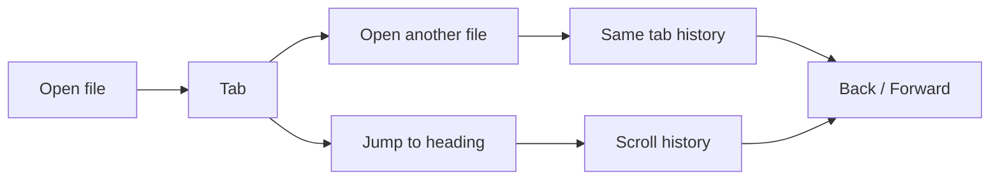
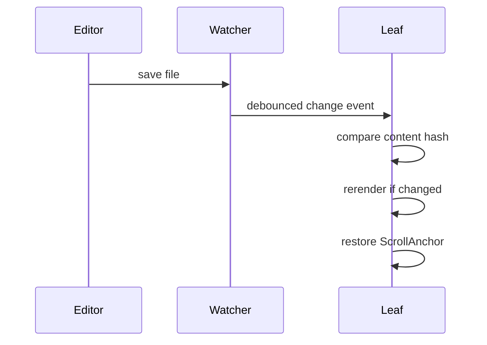

# Navigation

> leaftext keeps browser-like history for Markdown reading: tabs, Back/Forward, in-document jumps, and scroll restoration after reloads.

The navigation model is simple from the outside and fairly careful under the hood. Each tab keeps its own file history and its own in-document scroll history.

## Summary

| Feature | What it means |
| --- | --- |
| Tabs | Open multiple documents at once |
| Outline | A collapsed table of contents, built from the document's headings, at the top of each page, labelled with the document's line count |
| Back / Forward | Move through file history and in-page jumps |
| Scroll anchors | Restore the same reading spot after rerenders |
| Live reload | Reload a changed file without losing your place |
| Recent files | Reopen the last 8 files quickly |
| Glossary sheet | Open a glossary term over the page without leaving it |
| Link hints | Hover a link to see what kind it is and where it points |
| Pager | Previous / Next buttons at the bottom of each document for reading a folder in order |
| Single window | A second launch opens the file as a tab in the running window instead of a new copy |

## Model



## Shortcuts

| Action | Windows / Linux | macOS |
| --- | --- | --- |
| Open file | `Ctrl+O` | `Cmd+O` |
| Close tab | `Ctrl+W` | `Cmd+W` |
| Back | `Alt+Left` | `Cmd+Left` |
| Forward | `Alt+Right` | `Cmd+Right` |
| Next tab | `Ctrl+Tab` | `Ctrl+Tab` |
| Previous tab | `Ctrl+Shift+Tab` | `Ctrl+Shift+Tab` |

Tab cycling is `Ctrl`-based on every platform, including macOS. Mouse side buttons also trigger Back and Forward.

## Tabs

- Opening another file creates another tab.
- Each tab keeps its own document history.
- Each tab also keeps its own scroll history.
- Tabs can be dragged to reorder them.
- Clicking a tab while the [Graph view](03-library.md#graph) is open flies the graph to that document's node and zooms in on it.
- Closing the last tab returns to the home screen.
- Opening a file while leaftext is already running (e.g. Explorer "Open with", or double-clicking a `.md`/`.xml`) reuses the running window — the file opens as a new tab and the window comes to the front, rather than launching a second copy of the app.

## History

### Files

Open `README.md`, then click a link to `docs/guide.md`. Back returns to `README.md`. Forward returns to `docs/guide.md`.

### Jumps

Jump from `#intro` to `#api` inside the same document. Back returns to the earlier reading position instead of switching files.

That second case is why leaftext keeps scroll history separately from file history.

## Restore

leaftext stores a reading position as a `ScrollAnchor`:

| Part | Meaning |
| --- | --- |
| `section` | Nearest heading above the top edge |
| `block` | Content block number within that section |
| `offsetY` | Pixel offset from that block |

This is more stable than storing only raw scroll pixels, so the app can usually return to the same paragraph after rerendering.

## Reload

When the current file changes on disk, leaftext reloads it and tries to preserve your place.



Key details:

- The file watcher debounces events with a 200 ms window.
- leaftext hashes the file contents to skip duplicate reloads.
- Reload re-renders through the same pipeline the file opened with — [TEI XML](01-rendering.md#tei-xml-84000-translations) stays TEI, Markdown stays Markdown.
- The parent directory is watched instead of only the file, so atomic-save editors still work.
- Other Markdown files changed in that same folder are indexed live, so the [library](03-library.md#live-updates) pane stays current too.

## Recent files

The no-file home screen shows the last 8 opened files.

- Missing files are removed automatically.
- Equivalent path spellings collapse to one entry.
- Clicking a recent file opens it immediately.

## Glossary

A document draws its terms from a shared glossary file. You do not have to link them yourself: wherever a defined term appears in the text, leaftext links it for you. Clicking one does not switch documents: it opens that single glossary entry in a sheet that slides up over the page you are reading, so you keep your place underneath.

- Terms are matched automatically in both Markdown and TEI XML documents — whole words, ignoring case — so the same glossary covers every page with no per-page markup.
- Text that is already a link, or inside code, is left alone, and the glossary file never links its own entries to themselves.
- Dismiss the sheet with its close button, by clicking outside it, or with the `Escape` key.
- A link inside the sheet that points at another glossary term swaps the entry in place; any other link leaves the glossary and follows the link normally.
- A link at the foot of the sheet opens the whole glossary as a page.
- Glossary term links take the surrounding text's colour and carry a quiet dotted underline in a dimmed wash of that same colour, in every theme and mode — enough to mark an expandable term without pulling the eye away from the prose. Where the prose is already muted, as in a quote, the underline dims further to match.
- The glossary lives at one file, so the whole document set can share a single set of definitions.

### Author a glossary

Write one `GLOSSARY.md` at or above your documents, with a `##` heading per term:

```md
# Glossary

## Minimap

The overview rail down the right edge of the reading view.

## Tab

One open document, with its own Back/Forward history and scroll position.
```

That is all the authoring you need: every mention of *Minimap* or *Tab* across your documents now opens its entry. The app finds the glossary by walking up from the open document to the nearest `GLOSSARY.md`, so it can sit right beside a page or many folders above at the root of a project, and each project's pages bind to that project's own glossary. Because every page draws on the same file, one glossary serves the whole set.

You can still link a term by hand when you want to — using the heading's slug (its text lowercased, spaces turned to hyphens — so `Bottom Sheet` becomes `bottom-sheet`):

```md
Keep your place with the [minimap](glossary:minimap).
```

The `glossary:` link carries no file path, so the same text works from any page no matter how deeply it is nested. A plain relative link to the file also works — `[minimap](GLOSSARY.md#minimap)`, or `[minimap](../GLOSSARY.md#minimap)` from a page one folder down — but you have to count the folders yourself. Both forms open the same sheet as the automatic links.

> [!TIP]
> These docs ship their own glossary. The links in the [Introduction](../01-introduction.md) — like [minimap](../GLOSSARY.md#minimap) — open this set's [GLOSSARY.md](../GLOSSARY.md); click one to see the sheet in action.

## Outline

Every document opens with an **Outline** — a table of contents built automatically from the document's headings — tucked just under the title. It starts collapsed, so it never crowds the top of the page; click it to expand.

- The collapsed header shows the document's total length — **Outline (312 lines)** — counted in the same running block numbers as the [line gutter](01-rendering.md#inline-html), so the count matches the last gutter number on the page.
- Entries nest as a bulleted list that mirrors the heading levels, so the shape of the document is visible at a glance.
- Each entry links to its heading, so clicking one jumps straight there.
- It is built from the rendered headings, so it behaves the same for Markdown and [TEI XML](01-rendering.md#tei-xml-84000-translations).
- It appears whenever a document has a title plus at least one more heading; a document with only a title shows none.

The outline lists the sections within the current document, which makes it a companion to the [minimap](04-minimap.md): the outline is the document's structure as clickable text, the minimap a scaled picture of the whole page.

## Pager

When you open a Markdown or TEI XML document that sits inside a folder tree connected by `README.md` files, leaftext appends a **Previous / Next** bar at the bottom of the page. Clicking a button opens the adjacent document in reading order without creating an extra history entry.

Reading order follows the same depth-first walk the docs viewer uses: inside each folder, non-README documents come first (Markdown and XML together, sorted by name), then each subfolder — its README acting as the folder's landing page — followed by that folder's own pages. `README` and `GLOSSARY` files (either extension) are never standalone entries in the sequence.

Working out the Previous / Next links means scanning the folder tree, so leaftext does it after the document is already on screen rather than blocking the initial render. A placeholder bar shows in its place for the moment it takes, then the real buttons fill in. In a folder with a great many files the page appears immediately and the pager simply arrives a beat later.

The pager is on by default and can be turned off in [Settings](05-settings.md#pager).

## Link hints

Hovering a link shows a small tooltip that names what kind of link it is and shows the exact href it was written with, so you can tell a [glossary](#glossary) term from an in-page jump from an outside site before you click. When the link opens another document, the tooltip also shows how long that document is, in lines, so you know whether you are about to open a short note or a long one.

| Hint | When you see it |
| --- | --- |
| Glossary entry | A `glossary:` term link, or a link to `GLOSSARY.md#term` |
| Full glossary | A bare `glossary:` link that opens the whole glossary |
| In-page jump | A `#fragment` link to a heading on the current page |
| Another page | A relative link to another `.md` document (its line count is shown too) |
| External site | An `http://` or `https://` link |
| Email link | A `mailto:` link |
| App link | Any other URL scheme |
| Site path | A root-relative `/path` link |

This is a desktop affordance: it appears only with a mouse (a fine pointer that can hover), and is left off on touch screens. The tooltip follows the cursor, flips to stay on screen near the edges, and hides on scroll or when the window loses focus.

## Next

- [Quickstart](../03-quickstart.md) if you want the basics first
- [Library](03-library.md) if you want browsing and search
- [Architecture](../02-development/01-architecture.md) if you want the implementation details
