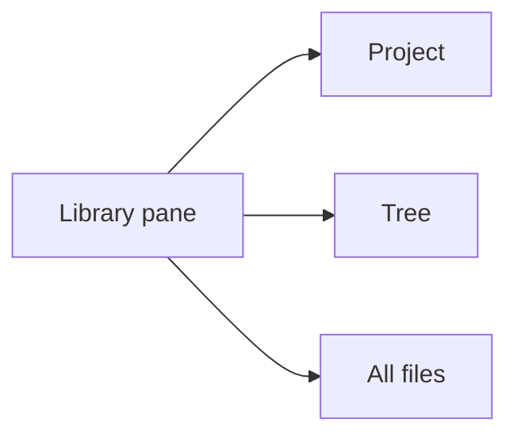
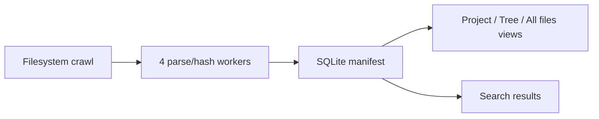

# Library

> The library pane lets you browse and search Markdown files from a local SQLite index, with Project, Tree, and All files views.

The library is the part of leaftext that helps you find documents, not just read the one you already opened. It lives in a left-side pane and is backed by a local indexer.

## Summary

| Feature | What you get |
| --- | --- |
| Project view | One folder at a time, drilled into the current project |
| Tree view | Nested folder hierarchy |
| All files view | One alphabetized file list |
| Search | Filename and content search |
| File actions | Right-click a file to open, cut/copy, copy path, rename, reveal, view properties, or delete |

## Views

### Project

Best when you want to stay focused on one folder.

- Click folders to drill in.
- Use the back arrow to move up.
- Opening a file also points Project view at that file's folder.

### Tree

Best when you want the whole hierarchy visible.

- Folders expand and collapse independently.
- Expanded state is saved.
- Folders with no Markdown files are pruned.

### All files

Best when you know the filename but not the path. (Labelled **All files** in the view picker.)

- One alphabetized list
- No folder nesting

## Search

Search matches both file names and document content.

| Search type | Behavior |
| --- | --- |
| Name matches | Listed first |
| Content matches | Ranked with BM25 and shown with snippets |
| Result limit | Top 50 |
| CJK text | Prefix matching works for unspaced Han text |

Example:

- Query `release` might match `release-notes.md` first by filename.
- It can also match a paragraph inside `roadmap.md`, with a snippet preview.

Opening a content result jumps to the nearest heading.

## File actions

Right-click a file row for a context menu of file actions:

| Action | What it does |
| --- | --- |
| Open | Opens the file in the reader |
| Cut | Puts the file on the system clipboard to move on paste |
| Copy | Puts the file on the system clipboard to copy on paste |
| Copy path | Copies the file's full path as text |
| Rename | Edits the name inline; press Enter to apply, Escape to cancel |
| Reveal file | Shows the file in your OS file manager |
| Properties | Opens the OS file-properties view |
| Delete | Moves the file to the Recycle Bin / Trash |

Cut and Copy place the file itself on the system clipboard, so you paste it in your file manager (Explorer, Finder). Delete is reversible — the file goes to the Recycle Bin or Trash, not gone for good. Reveal and Properties map to each OS:

- Windows: Explorer; the file Properties dialog.
- macOS: Finder; Get Info.
- Linux: the default file manager; Properties falls back to revealing the file.

> [!NOTE]
> Clipboard "Copy"/"Cut" and "Properties" are best-effort on Linux, where behavior varies by desktop.

## Live updates

The library pane keeps up with changes on disk, so a file you just created shows up without a manual rescan.

- The same file watcher that drives live reload watches two places: the open document's folder, and — while you are in [Project view](#project) — the folder you are browsing.
- The Project-view folder is watched recursively, so a Markdown file added in it or any of its subfolders is indexed immediately and the pane refreshes, even when no document is open.
- A Markdown file created or edited in the open document's folder is indexed the same way.
- Renaming or deleting a file from the right-click menu updates the pane right away.
- Moving, renaming, or deleting a folder outside the app syncs the affected subtree immediately — new files are indexed and removed files are forgotten without a manual rescan.
- Folders outside both watched locations appear after the next full crawl, or as soon as you open a file from them.

## Indexing

## Facts

| Item | Value |
| --- | --- |
| Storage | `manifest.db` |
| Worker pool | 4 parallel parse/hash workers |
| Large-file cutoff | Files over 2 MB are skipped |
| DB mode | SQLite WAL |
| Progress throttle | 150 ms |
| Full tree refresh throttle | 1500 ms |

## Skips

### Status

- unreadable files
- files over 2 MB
- missing files after a successful rescan

### Folders

Common heavy or generated folders are skipped, including:

- `.git`
- `node_modules`
- `target`
- `vendor`
- `dist`
- `build`
- `.venv`
- `__pycache__`

Root-level system directories are also skipped where appropriate, such as `Windows`, `Program Files`, `AppData`, `Library`, `proc`, and `sys`.

Symlinks and Windows reparse points are not descended.

## Layout

| Behavior | Rule |
| --- | --- |
| Snap shut | Drag narrower than 40 px |
| Reader minimum | Reader stays at least 360 px wide |
| Small window | Pane auto-hides if space is too tight |

Saved library state includes:

- `library_closed`
- `library_width`
- `library_view`
- `library_project_path`
- `library_expanded`

## Toggle

Indexing is off by default.

When enabled:

1. A background crawl starts right away — and again on each app launch while the setting stays on.
2. Search and browse expand as the manifest fills in.

When disabled:

- No background crawl runs.
- Existing manifest data still shows.
- Files you open manually are still indexed.

## Next

- [Settings](05-settings.md)
- [Navigation](02-navigation.md)
- [Architecture](../02-development/01-architecture.md)
