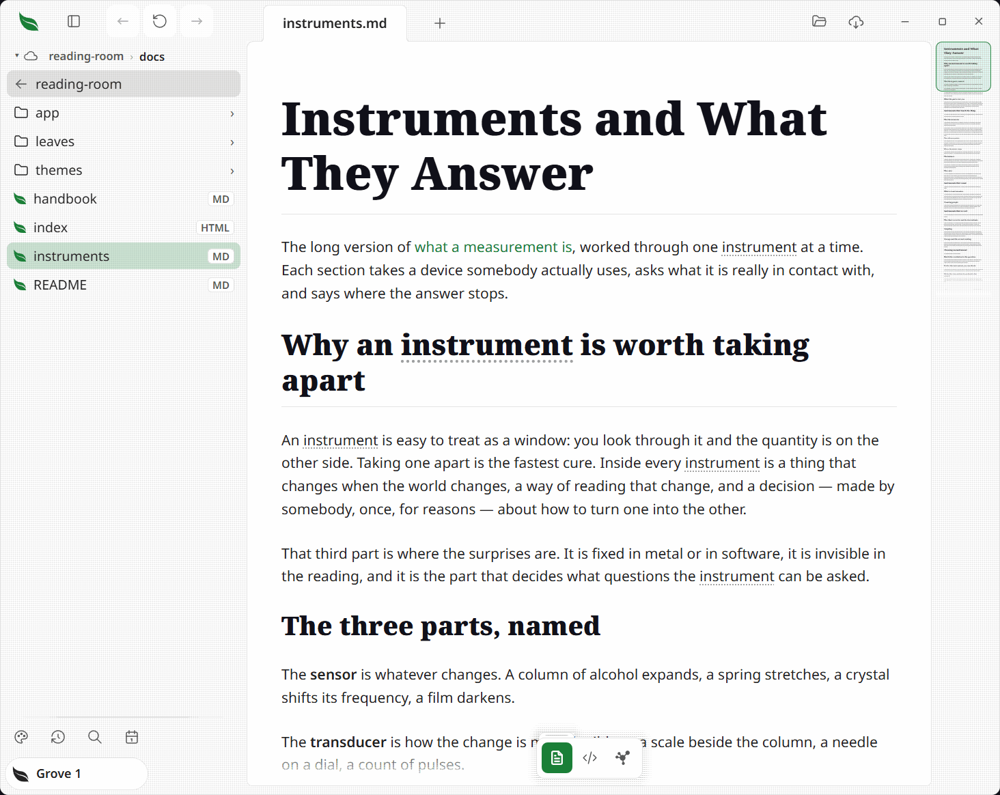
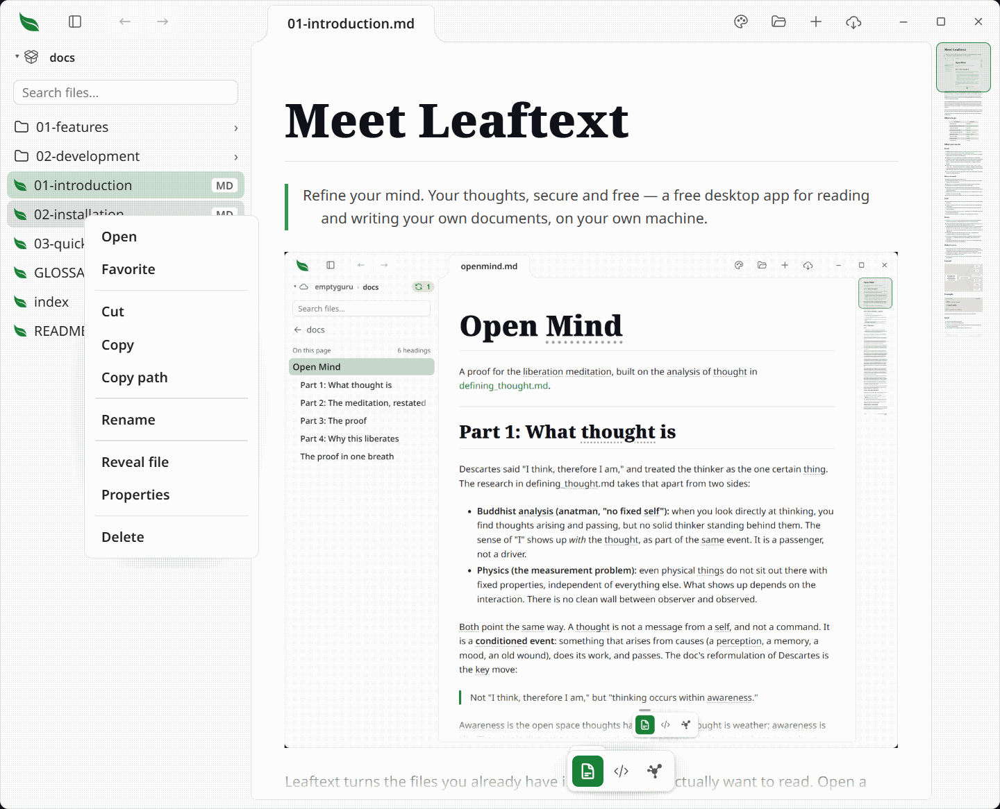
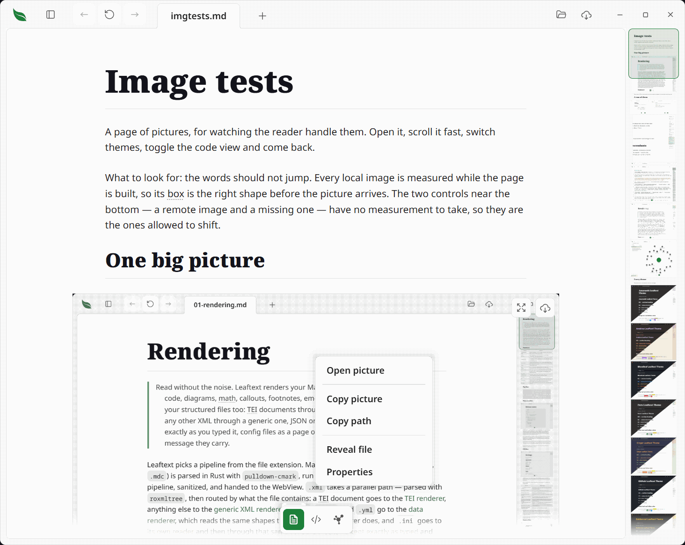
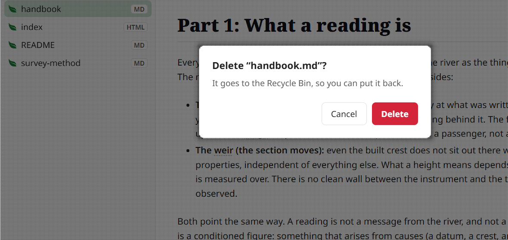
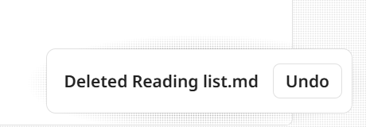
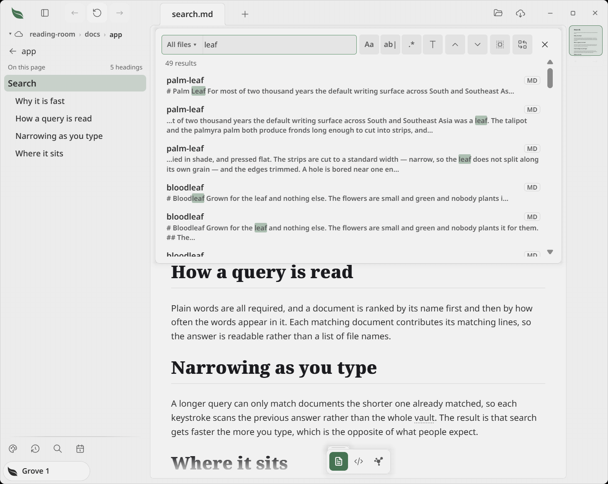
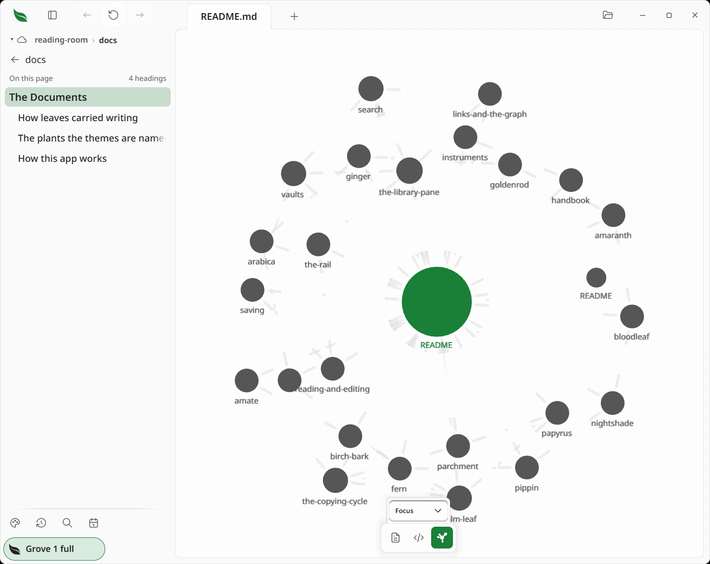
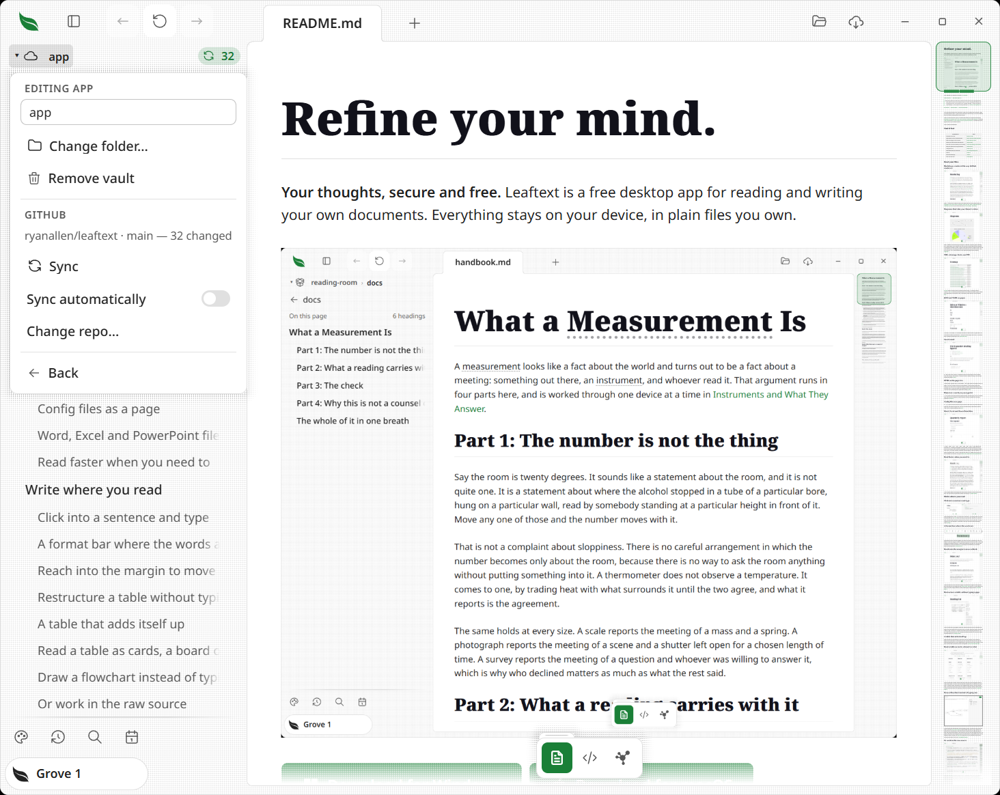
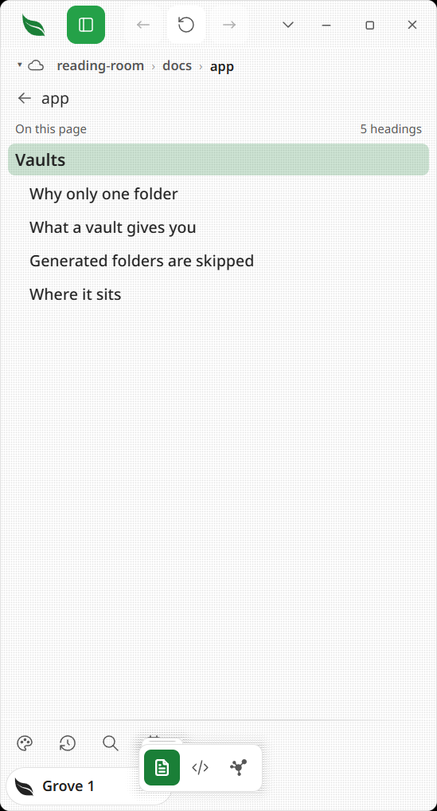

# Library

> Point Leaftext at a folder and it becomes a vault: a browsable file tree, a searchable body of text, and a map of how those documents link to each other. Nothing is crawled, nothing is written into your folder, and a vault can sync itself to GitHub.

The library is the part of Leaftext that helps you find documents, not just read the one you already opened. It lives in a left-side pane, and everything it shows is read from disk when you ask for it.



## Summary

| Feature | What you get |
| --- | --- |
| [Vaults](#vaults) | A folder you name as a library root. The switcher beside the breadcrumb creates, edits and moves between them |
| [First-launch bubble](#the-bubble-on-your-first-launch) | One bubble points at the switcher the first time you open the pane, and goes for good the moment you point at that button. A sheet takes it down, unmet, and it returns once the last one closes |
| [Your first vault](#your-first-vault) | With no vault yet, the start screen offers to add your notes folder, and the pane says once what a vault buys you |
| [File tree](#file-tree) | One folder at a time, with a breadcrumb showing where you are and a row that steps back out; every folder you open appears at once |
| [The open document's headings](#the-open-documents-headings) | Open a document and the pane holds its outline instead of the files, the page's own title first and the heading you are reading lit; a back row puts the files back |
| [Breadcrumb](#file-tree) | The folder path above the search box; every crumb steps back to that level, and what does not fit collapses into a `…` menu |
| [Search](#search) | Filename and content search across the active vault |
| [Skipped folders](#skipped-folders) | A folder a machine filled — build output, a package cache — is listed and openable, and not read or watched. The search line says when one was left out |
| [Filtering](#filtering) | More than words in the search box: `#work status:open due:<friday -draft` |
| [Other names](#other-names) | A note's `aliases` field: every name in it works wherever the file's own name works |
| [Graph](#graph) | A force-directed map of how documents link to each other, shown on the page rather than in the pane |
| [Cloud folders](#your-cloud-is-already-a-folder) | Dropbox, OneDrive, iCloud Drive, Box, Nextcloud and Google Drive become vaults on their own when their app is on this machine, and their rows wear a cloud |
| [GitHub sync](#github-sync) | A vault can be a git repository that pushes to GitHub, with a sync button in its own header — and a repository can be [cloned](#clone-a-repository) into a new vault |
| [File actions](#file-actions) | Right-click a file or the page you are reading for the actions that fit it |
| [Picture actions](#right-click-a-picture) | Right-click a picture for its own actions: open it big, copy it, find its file, and take it out of an unlocked page |
| [Deleting](#deleting-asks-first-and-can-be-taken-back) | Delete asks before it goes, and offers the file back for a few seconds afterward — on the message, or with Ctrl+Z |
| [Folder actions](#folders-and-the-space-around-them) | Right-click a folder — or the empty space in the pane — to paste, reveal it, or see its properties |
| [Narrow windows](#narrow-windows) | Too tight for a pane beside the page? The library slides in over it as a full-width sheet |

## Vaults


A **vault** is a folder you have told Leaftext to treat as a library root. It is the unit that search and syncing work over, and it is what makes the [graph](#graph) bigger — but not what makes the graph possible.

The button at the left of the breadcrumb opens the vault switcher. The same button appears over the start screen whenever a vault exists, so switching to Library never leaves you there. What it wears says what you are in: **this machine** for the whole library, a **box** for a vault whose files only live here, and a **cloud** when saving in that vault also reaches somewhere else — [GitHub](#github-sync), or a [cloud folder](#your-cloud-is-already-a-folder). Its mark stays the regular weight and sits apart from its name.

While the list is open, the button and the vault's name beside it light as one shape, because what you pick changes the whole pane — the name, the path, the file tree and what search reads — rather than the icon you pressed. Vaults read A to Z, ignoring capitals. The name is still a place: clicking it goes to the vault's top folder.

- **Library** is the no-vault state, marked with the machine rather than a box because it is not a collection — the pane starts at your drive roots and browses anywhere. Search is unavailable, because it has no bounded set of words to read. The graph still works: it maps the open document instead of a vault.
- **A vault** roots the pane at that folder. Everything below it is browsable, searchable and mappable.
- **New vault…** opens a folder picker; the folder's name becomes the vault's name.
- **Clone a repository…** takes a git address and makes the clone a vault. See [below](#clone-a-repository).
- The settings button appears when you point at a vault row or reach it with the keyboard, and opens a panel to rename it, point it at a different folder, remove it, or connect it to [GitHub](#github-sync).

> [!NOTE]
> **Nothing is written into your folder.** A vault is a row in Leaftext's own database, not a marker file. Removing a vault forgets it; the folder and its files are untouched.

### The bubble on your first launch

A caret and a mark is not much to go on, so the first time you open Leaftext with the pane showing, a small bubble floats over the window with a chevron aimed at that button, saying **"Pick which folder the list below shows."**

It goes the moment you point at the button, and it never comes back — pressing the button does the same. The bubble itself ignores the pointer, so moving across it on the way somewhere else neither takes the words away nor gets in the way of what is under it, and a [menu](#file-actions) opened into the space it is standing in is drawn over it rather than under. There is no close button and no timer.

One bubble per launch at most, with a quiet launch in between, and nothing at all once you have met them. With the pane shut there is no bubble, and that launch is not spent — you get it the next time the pane is open.

Anything that stands over the whole window takes it down while it is up. The glossary, the theme picker, the start screen's list and the flowchart editor all slide over the window, and a [picture](01-rendering.md#images), a [table](07-editing.md#inline-editing-the-reading-view) or a [diagram](01-rendering.md#mermaid-diagrams) opened on the whole window covers it the same way — so a bubble left standing would point at a button that view is covering, with no way to reach it and no way to put the bubble away. It steps aside instead, unmet, and comes back against wherever its button now is once the last of them has gone — one opened on top of another keeps it away until both have gone. The launch is not spent, and the promise is still there to meet.

### Your first vault

Until there is a vault, the start screen carries a third button beside Choose file and New document: **Add your notes folder**, with one line under the row saying what a folder buys — search across all of it, a map of how the notes link, and the folder in the pane. It opens the same folder picker **New vault…** does. Once a vault exists the button goes, because from then on the name over the headline is the [switcher](#vaults) and **New vault…** is one press inside it.

The pane says it once too. A reader who has met the [bubble](#the-bubble-on-your-first-launch) and still has no vault of their own finds a short box at the top of the file list: what a vault is, what it buys, and the same button. It sits inside the list, so nothing above it moves. Picking a folder retires it, and so does opening the vault list — either way it never comes back.

A [cloud folder](#your-cloud-is-already-a-folder) that made itself a vault does not count as one you made, so the box still shows. A folder you picked yourself out of your Dropbox reads the same way, so that one reader may meet the box once.

### Your cloud is already a folder

If you have the Dropbox, OneDrive, iCloud Drive, Box, Nextcloud or Google Drive app installed, that cloud is a real folder on this machine — so **Leaftext makes it a vault for you**. There is nothing to press: the folders are there in the switcher the first time you open it, named after themselves, and each wears a cloud because saving in one goes wherever that client sends it.

Leaftext holds no account and no password for any of them. **Their app does the syncing; Leaftext only reads and writes the files** — so there is no refresh to wait for here, and a file that has not arrived yet is one their app has not finished with.

Only what is really there is added: a client you do not have is not listed, and neither is one whose folder has been deleted. Where a client records having been moved — Dropbox, OneDrive, Nextcloud — that record is what gets read, so a Dropbox living somewhere other than the default is still found. Nothing is scanned to do it; each is a named place, checked.

Remove one and it comes back the next time Leaftext looks. A vault is a row in a list, not a copy of anything, and it is a folder you have — the alternative is remembering a refusal forever to save you a row.

Google Drive is found on macOS only. On Windows it mounts as a drive letter you choose and records nowhere which one, and guessing would mean offering somebody else's disk — use **New vault…** and pick it.

A vault *inside* one of these folders wears the cloud too. Where the files end up is what the mark is about, and a folder under Dropbox syncs exactly as Dropbox does.

## Browsing

### File tree

The pane lists one folder at a time — the folder you are in, not a whole hierarchy.

- Click a folder row — or its `›` chevron — to go into it. The folder you open is on screen in one frame, with nothing fading and nothing sliding.
- The row above the list steps back out one level. So does a crumb.
- The **breadcrumb** above the search box is the path you are on: `Vajrayana › docs › features`. Click any crumb to step back to that level. It shows as much of the path as fits the band, so widening the pane reveals more crumbs and dragging the divider refits it mid-drag. Whatever does not fit collapses behind a `…` button that opens a menu of the skipped folders.
- Folders sort before files, each alphabetized. Every folder is listed, including the ones whose names start with a dot and the ones a shortcut points at.
- Pointing at a row washes it and nothing else — no shadow, no change of shape, nothing sliding — [what a control does under the pointer](02-navigation.md#what-a-control-does-under-the-pointer). The row you have open keeps its own tint instead, so what is open still reads as open.
- Opening a file moves the pane to that file's folder and highlights the row. A file inside a vault switches to that vault first; a file in none switches to the whole library.
- The folder you are in is saved, so a restart reopens it. If the folder has gone, the pane falls back to the top of the vault.

Each call reads exactly one directory, so nothing below what you opened is ever touched.

### The open document's headings

Opening a document swaps the file list for that document's [outline](02-navigation.md#outline) — its headings, in order, starting with the page's own title and indented by level under it, with the one you are reading lit as you scroll. Clicking a row jumps to that heading.

- A back row above the list wears the folder's name and puts the files back, the same way the row above a folder listing steps out of it.
- Under that row, **On this page** names the list, with how many headings it holds at its right. Each level reads a step smaller than the one above it, and the levels below the second sit in quieter ink, so the shape of the document shows without counting the indents.
- Typing in the [search box](#search) replaces the outline with the results; clearing the box brings it back.
- A document with only a title, or none, has no outline, so the files stay where they are.

### File types

The pane lists Markdown (`.md`, `.markdown`, `.mdown`, `.mdc` — a [Cursor](https://cursor.com) project rule is Markdown with a [field block](07-editing.md#the-fields-at-the-top-of-a-note) at the top), [HTML](01-rendering.md#html-files) (`.html`, `.htm`), [XML](01-rendering.md#xml) (`.xml`), [JSON and YAML](01-rendering.md#data-files-json-and-yaml) (`.json`, `.yaml`, `.yml`), [plain text](01-rendering.md#plain-text-files) (`.txt`), [INI](01-rendering.md#ini-files) (`.ini`), [email](01-rendering.md#email-eml) (`.eml`, `.mht`, `.mhtml`), and [Word, Excel, PowerPoint and OpenDocument](01-rendering.md#office-and-opendocument-files) (`.docx`, `.xlsx`, `.pptx`, `.odt`, `.ods`, `.odp`). [Source files](01-rendering.md#source-files) open when named without becoming library documents, vault-search text, graph nodes, or Previous/Next pages. Anything else is left alone. Where that empties the pane, the line in its place says how many files are in the folder, so a folder of pictures reads as a folder of pictures rather than a folder Leaftext lost.

Data files are searchable by name and title but draw no [graph](#graph) edges at all — not even to [web addresses](#web-addresses). A string inside a `.json`, `.yaml` or `.ini` is a value, and scanning one as prose would invent links nobody wrote. A `.txt` draws none for the other half of the same reason: its words are the words somebody typed, not Markdown to be scanned for links. Emails draw none either — their bodies are transfer-coded in the file, so a scan would read base64, not links. They still appear as nodes.

### Skipped folders

The pane lists every folder there is. A name starting with a dot, a build folder, a shortcut to somewhere else — all of them are rows you can open, because a folder you can see in Explorer or Finder should be a folder you can open here. A shortcut opens onto whatever it points at, the same as it does there.

Two things are left out. At the top of a drive, the operating system's own folders — `Windows`, `Program Files`, `AppData`, `Library` and the rest — are skipped, and only there: a folder of yours with one of those names, anywhere else, is listed. And a shortcut pointing at nothing is not a folder to open.

Search and the [graph](#graph) go almost as wide. A note in a folder whose name starts with a dot is findable and on the map, and a shortcut is refused, because one can point back at a folder above it and make the walk run forever.

The other thing that walk refuses is a folder a machine filled: one that declares itself a cache, or one named `target`, `node_modules`, `build`, `dist`, `vendor`, `venv`, `.venv`, `__pycache__`, `.next`, `.gradle` or `Pods`. A vault that is also a folder you build in can hold a hundred generated files for every note you wrote, and reading and watching all of them costs a third of your computer while you sit still. The pane still lists these folders and you can still open one; what changes is that search does not read inside them, and a change inside one is not something Leaftext goes and looks at. When a search leaves any of them out, the line above the results says how many and names them if you rest on it. A document you have actually opened from inside one still updates when it changes on disk.

## File actions



Right-click a file row for a context menu of file actions:

| Action | What it does |
| --- | --- |
| Open | Opens the file in the reader |
| Favorite | Pins the file to the top of the pane, and reads **Unfavorite** on one already there |
| Cut | Puts the file on the system clipboard to move on paste |
| Copy | Puts the file on the system clipboard to copy on paste |
| Copy path | Copies the file's full path as text |
| Rename | Edits the name inline; press Enter to apply, Escape to cancel. The same box opens over a page [headed with its own file name](07-editing.md#renaming-from-the-heading) |
| Reveal file | Shows the file in your OS file manager |
| Properties | Opens the OS file-properties view |
| Delete | Asks first, then moves the file to the Recycle Bin / Trash — and offers it back |

Right-click anywhere on the rendered page, including the blank space around its text, for the actions about the document you are reading: **Favorite** or **Unfavorite**, **Copy path**, **Reveal file**, **Properties**, and **Delete**. With words highlighted, **Copy** leads the menu and puts exactly those words on the clipboard — `Ctrl+C`, or `Cmd+C` on a Mac, does the same thing without the menu. **Open**, **Cut**, **Copy** and **Rename** stay on a file row because they act on a row in a folder. A link inside a document has [its own menu](02-navigation.md#opening-a-link-in-a-new-page), and a block being typed in keeps its text menu.

Reveal and Properties map to each OS:

- Windows: Explorer; the file Properties dialog.
- macOS: Finder; Get Info, which brings Finder to the front so its window is the one you are looking at.

### Right-click a picture



A picture kept on your own disk answers for itself. Right-click one in the page and the menu is about the picture, not the note around it:

| Action | What it does |
| --- | --- |
| Open picture | Opens it on the whole window, the same view the expand button over a picture opens — including a picture sitting inside a sentence, which has no button of its own |
| Copy picture | Puts the picture itself on the clipboard, as pixels to paste into a message or a document. Every kind the page can draw copies, because what crosses is a PNG the page's own drawing wrote |
| Copy path | Copies the picture's full path as text |
| Reveal file | Shows the picture in your OS file manager, sitting where it is kept |
| Properties | Opens the OS file-properties view for the picture |
| Delete picture | Takes the picture out of the document. Only while the [padlock](07-editing.md) is open, and only for a picture on a line of its own |

- **Delete picture leaves the file alone.** It removes the picture from the note, as one press of undo, and nothing is written until you save. The picture on your disk is untouched.
- **A picture inside a sentence has no Delete row.** The only piece of source it belongs to is the sentence around it, so removing it would take the words with it.
- **A picture already open on the whole window** keeps Copy picture, Copy path, Reveal file and Properties, and loses the two rows that have nowhere left to go.
- **A picture from the web, one written into the document as data, and one Leaftext cannot find** get no picture menu, because none of these rows has a file to act on.
- **A picture wrapped in a link** keeps the link's own menu, because the link is what a click on it opens.

Where either window will not open, a message in the bottom-right corner says so, so the menu item never just appears to do nothing. **Cut, Copy and Copy path say so the same way.** A clipboard another program is holding open is an ordinary thing for a machine to be doing, and a copy that did not happen is otherwise only discovered at a paste in another app, minutes later, with nothing to connect it back.

### Deleting asks first, and can be taken back



Delete does not act on the click. It asks — naming the file and saying where it goes — and the safe answer is where the pointer already is. Escape or a click on the dimmed page cancels; Enter deletes.



Once the file has gone, a message in the bottom-right corner says so and carries an **Undo** button. Press it and the file goes back to the folder it came from, under its own name. **Ctrl+Z** does the same thing while that message is up, unless you are typing — anything you are editing keeps the key.

The offer lasts as long as the message and covers one delete. After it goes the file is still in the Recycle Bin or the Trash, so nothing is lost by letting it pass; you just put it back the way you would any other file.

Two things stop an undo, and it says which: the file is no longer in the bin, or something else has taken its name in the meantime. It never writes over the newer file.

### Folders, and the space around them

Right-clicking a **folder row** — or the empty space below the rows, which stands for the folder you are browsing — offers what a place can do rather than what a document can:

| Action | What it does |
| --- | --- |
| Open folder | Goes into it. Only on a folder row; the empty space is already the folder you are in |
| Favorite | Pins the folder to the top of the pane, and reads **Unfavorite** on one already there. Only on a folder row |
| Paste | Puts what you last cut or copied into this folder. Only shown when there is something to paste |
| Reveal folder | Shows the folder in your OS file manager |
| Properties | Opens the OS folder-properties view |

### Cut, copy, paste

Cut or Copy a file, then Paste it into a folder to move or copy it there. A cut is used up by the paste; a copy can be pasted again.

Two things are worth knowing:

- **Nothing is overwritten.** Pasting where the name is already taken refuses and says so, rather than replacing what is there.
- **This clipboard is Leaftext's own.** Cut and Copy also put the file on the *system* clipboard, so you can paste it in Explorer or Finder — but the reverse does not hold: a file you copied in your file manager is not what Paste here acts on.

Copying a whole folder is not supported; a folder can be pasted only as a move (Cut, then Paste).

## Search



Search covers the active vault. With no vault the field is hidden rather than left to return nothing — a box that looks like it works and does not is worse than no box.

Once you have typed, a cross at the field's right end clears the search and brings the file tree back. Escape does the same after you have opened a result; if [Find in this document](02-navigation.md#find-in-this-document) is open, its first Escape closes that bar instead.

| Search type | Behavior |
| --- | --- |
| Name matches | Ranked first, and by how much of the name you typed: the whole name, then the start of it, then the start of a word in it, then buried inside one |
| Its [other names](#other-names) | Counted as names, on the same scale — a note's `aliases` entry matched end to end is worth what its file name matched end to end is worth. The row says which name matched |
| Folder names | Counted, and weakly — everything under `notes/` matches "notes" |
| Content matches | Ranked by how often the terms appear **for the document's size**, so a long file cannot out-count a one-page note by being long |
| A match in a heading | Outranks the same word in a paragraph |
| Multiple terms | Every term must appear, in a name, the folder or the body |
| More than words | The box takes a [filter](#filtering) — `#work status:open due:<friday -draft` |
| Rows per file | Up to three, one per place the word is |
| Result limit | The best 50 files. Past that the count says so — "84 results in the first 50 files" |
| Folders left out | Named in the same line, with how many — "12 results · 1 folder of generated files not read". Rest on the line to see which. See [Skipped folders](#skipped-folders) |
| While the vault is still being read | Rows arrive in batches, a turning ring sits in the count line, and the count says what it has so far |

Opening a result lands on the line the match is on. Documents whose source the pane cannot place a line in — anything but Markdown — fall back to the nearest heading above the match.

Asking the same thing twice costs nothing: the last answer is kept and handed straight back while the query and the vault's text are both unchanged, which is what happens when you walk the folder tree with a search still in the box. Typing one more letter costs almost nothing either — only the files that matched the shorter word can match the longer one, so those are the only ones read again. Anything else, including a letter deleted or a file saved while you type, reads the vault afresh.

To search **inside** the document you are reading rather than across the vault, see [Find in this document](02-navigation.md#find-in-this-document).

The text search reads is the same copy the [graph](#graph) reads: one pass over the vault, held in memory, patched a file at a time when you save the note you are reading, tick a box in it, or the [watcher](#live-updates) sees another file change, and dropped when you move to a different folder or quit. A read still running is stopped at the same moment, so leaving a big folder hands the machine straight back rather than finishing a pass nobody is waiting on, and the vault you switched to starts reading right away. Naming the folder you are already in — **New vault…** on a folder that is already a vault, or **Change folder…** accepting the folder it already shows — is not moving, so that vault keeps what it has read and a read still running carries on. There is no index on disk, so nothing can go stale relative to your files.

The first search after you open a vault is the one that pays for that pass, and how long it takes is your disk rather than the matching — a vault read once already answers in milliseconds, and the same vault untouched since the machine started can take a minute. So the first one answers as it reads. Even the folder listing that has to finish before the vault can be read smallest-first no longer holds everything up: the first handful of documents the listing walks past are read straight away, so matches can be on screen before Leaftext has finished finding out what is in the folder. Those early rows are a taste rather than an answer, and one of them can vanish when the settled list arrives. A line above the results carries a turning ring while the vault is still being read, matches appear underneath as batches of documents land, and the count says what it has so far. Rows already on screen keep their place and stay clickable while more arrive; the ranking is settled once, on the last answer, which is when the ring goes. A search you run while an older query's results are still up is marked the same way, so the pane never shows you an answer to a question you have moved on from. The [map](#graph) still waits for the whole read, because a picture redrawn three times a second is not one anybody can look at.

## Filtering

The search box takes more than words.

| You type | You get |
| --- | --- |
| `dharma` | the word, in a name, one of its [other names](#other-names), the folder path or the text |
| `"the dharma bums"` | those words in that order |
| `-draft` | not that. It goes in front of anything, not just a word — `-status:open` works |
| `#work` | the note carries that tag, or one under it like `#work/reports` |
| `status:open` | a [frontmatter field](01-rendering.md#frontmatter) with that value |
| `status:` | the field is set, whatever it says |
| `due:<friday` | a date field before that day |
| `rating:>4` | a number field over that. `<`, `>`, `<=` and `>=` all work |
| `ext:md` | a file of that kind |
| `in:notes/2026` | inside that folder, or anything under it |
| `task:open` | the document holds an unfinished `- [ ]`; `task:done` wants every box in it ticked |
| `a OR b` | either. `OR` and `AND` are the only reserved words, and only in capitals — a note called `or` is still found by typing `or` |
| `(a OR b) -c` | grouped |

A date can be `today`, `tomorrow`, `yesterday`, a weekday name (`friday` means the next one, and today when today is a Friday), `2026-08-10`, or `last7d` / `next7d` for any number of days. The day it counts from is your machine's, not a server's.

**Nothing you type is an error.** A search box spends most of its life holding half a filter, so every unfinished shape means something: an unclosed quote runs to the end of what you typed, an unclosed bracket groups to the end, a stray `)` is ignored, and a trailing `OR` drops with the side you did type still standing. Inside quotes nothing is special, so `"-draft"` and `"#work"` find those characters.

A colon only starts a field when what is in front of it looks like a field name and what follows does not start with a slash — so `C:\Users\me`, `https://leaftext.com` and `12:30` are all still findable text rather than filters that match nothing.

**It says what it understood.** Type anything past plain words and a line appears under the box reading the filter back — `tagged work, status is open, due before 2026-08-07, not draft` — and naming any field the vault has never set. A filter on a field nobody uses matches nothing, and an empty list that really means "there is no such field" is the one thing a filter must not do quietly.

**It completes as you type.** The field names your vault actually uses, and the values each one holds, are offered under the box. Arrows walk the list, Enter or Tab takes one, Escape closes it — and only then does a second Escape clear the field.

## Other names

A note can answer to more than the name of its file. Give it an `aliases` field and every name in the list works everywhere the file's own name works:

```markdown
---
aliases:
  - Mozart
  - W. A. Mozart
---
```

Now `[[Mozart]]` reaches `Wolfgang Amadeus Mozart.md` — it draws that edge on the map, finds the note in [search](#search), previews it on hover, and appears in the `[[` popup with the file it opens named beside it. Written `aliases: [Mozart, W. A. Mozart]` on one line, or as a single `aliases: Mozart`, it reads the same. This is the same field [Obsidian](https://obsidian.md/help/properties) uses, so a vault written there opens here with its links intact.

**A name with a comma in it goes in quotes.** On one line, `aliases: ["Smith, John", Jack]` is two names — the quotes run until their pair, so the comma inside belongs to the name and `[[Smith, John]]` finds it. An apostrophe is left alone: `[a, don't, b]` is three names, because a quote only opens a run where a name starts. A list written a line each needs no quotes at all.

A few rules, so a preferred name can never quietly take a real one:

- **A file name always wins.** If one note is called `Mozart.md` and another prefers the name, `[[Mozart]]` opens the file.
- **Between two notes preferring one name**, the first found wins, and the code view's [broken-link check](07-editing.md#typing-help) says which note the link opens and which others wanted it.
- **A node on the map keeps its file's name** — a node labeled with a preferred name is one you cannot find by the name on disk. Hover it to see the rest.
- **Thirty-two per note.** Past that they are ignored, and the check marks the `aliases` line to say how many there were.

It works outside a vault too: for a document in a plain folder, Leaftext reads the top of each file beside it — the field block and no further — for up to 500 files. One folder, never the tree below it.

## Graph



A force-directed relationship map. Each **node** is one of your documents or a [web address](#web-addresses) one of them links to; each **edge** is a link that resolves — a Markdown link, an `<a href>`, a `[[wiki]]` link matched by file name or by one of the note's [other names](#other-names), a TEI `target=`, or a bare URL in the text.

It is a **view of the page**, not a panel — reach it from the [floating toolbar](02-navigation.md#the-floating-toolbar) under the document, beside reading and the source view. All it needs is a document open. It does **not** need a vault.

### What it maps

What it draws over depends on where the open document lives, and you never choose between them:

- **Inside your active vault** — the map is of the whole vault. Every document in it is a node, so you see what links *to* the document you are on as well as what it links to, and `[[wiki]]` names resolve against the whole collection.
- **Anywhere else** — the map is of that document: itself, the documents in its folder, and whatever it links to, wherever those live. A link is followed one hop out; nothing below the folder is read.

The second map is **smaller, not wrong**. A document only ever records what it links to — what links *back* is written in somebody else's file — so reading the folder is what recovers incoming links, and it stops there. A link to a *document* outside the set simply draws no line. [Web addresses](#web-addresses) are unaffected — those are nodes in their own right, so a document's outbound links show up either way. Put the folder in a vault and the map widens.

> [!NOTE]
> Neither map reads anything you did not point at. The vault's map reads the folder you named. A document's map reads that document, one folder listing, and one file per link. Opening the map on a file sitting at `C:\` does not walk your drive.

### Moving around it

- The map **opens framed on everything it drew** — the tightest zoom that still holds the whole layout, centered. Two documents fill the view; two thousand shrink to fit. The first pan, zoom, drag or flight hands the view over to you, and it stops reframing — including across leaving it: go and read a document, come back, and you are looking at the same corner at the same zoom. A framing you never touched is framed afresh, and so is a map of something else.
- While the layout settles the view **follows only what leaves the frame**, then frames everything once more when it comes to rest. A force layout breathes as it works, and a camera refitting on every frame of that put the pumping on screen.
- The document you are reading is highlighted in the accent color and pulled larger.
- **Names** float in dim gray beneath the nodes. They stay a fixed size as you zoom and are decluttered by fit: where the layout is open every name shows, and where nodes crowd only the ones that clear their neighbors do. The document you are on always keeps its name, and hovering shows the hovered node's name and its neighbors'.
- **Edges point the way the link was written.** An arrowhead sits where the line meets the document being linked *to*. Two documents that link each other get one line with a head at both ends, not two lines on top of each other. Heads are left off a very dense map, and while you are zoomed far out — at that size they are ink and nothing else.
- **Click** a node to open that document and **keep the map** — it redraws around what you opened and flies to its node, so you can carry on following links from there. **Hover** to light up a node's direct links and dim the rest.
- **Drag** a node to reposition it, **drag the background** to pan, **scroll** to zoom.
- Opening a document from the pane while the map is up **keeps the map up** too, and moves the highlight. Changing what you are looking at is not a reason to change how you are looking at it.
- Closing the last tab closes the map with it: the start screen is not one of a document's views.
- Editing a document the map covers **redraws it in place**: every node keeps its position, your pan and zoom are kept, and the layout eases into what changed rather than laying itself out again. An edit that draws the same map — a word typed into a document that links nowhere new — changes nothing on screen at all.
- Leaving the map puts the page back where you were reading. Press **Reading** and you are on the paragraph you left; press **Source** and it opens on the lines that were on screen rather than at line 1, and a source view you were already in comes back to the same scroll. That holds whichever view the map was opened from: open it from the source view and **Reading** lands on the paragraph those lines were, rather than at the top of the page.
- Building the map shows the same spinner a slow document does — including the redraw after a node click, which builds a new map. Leaving the map shows it too: open a search hit or switch to the [source](07-editing.md#code-view) and the map holds until its replacement is ready rather than dropping to a half-drawn page, with the wait shown on top of it.

### How much it draws

How many documents it draws is set by the [Graph size](05-settings.md#graph-size) setting — from a tight **Focus** neighborhood (the open document and its direct links) up to **Everything**. Smaller sizes render faster; larger ones stay responsive by easing the layout and repainting less often as it settles.

### Web addresses

A `http`/`https` link is a node too, drawn as a **ring with a dot at its center** rather than a filled disc, and labeled by its domain — `reddit.com`, not the whole URL, which stays in the tooltip. **Clicking one opens your browser and leaves the map exactly as it is** — no redraw, because nothing here replaced the document you are on.

They are found wherever the reader can click one: written out as `[text](https://…)`, in `<https://…>` angle brackets, in an `<a href>`, and **bare in the text**, by the same finder that turns bare URLs into links when the document is rendered. So the graph and the page can't disagree about what a link is.

**Two documents citing one page share one node** — the point of drawing them. The scheme and host are matched case-insensitively and a `#fragment` or trailing slash is ignored, so `https://Example.org/a/`, `https://example.org/a` and `https://example.org/a#notes` are one page.

- Email addresses are not nodes. Neither is any other scheme — `mailto:`, `file:`, a custom one.
- One document contributes at most **25** web addresses. A bibliography is a real document, and without a cap it would bury the notes around it.

## GitHub sync



A vault can be a git repository that pushes to GitHub. Open a vault's settings from the switcher to see where it stands. The panel stays open while you go elsewhere — the row that opens a browser leaves it standing, and switching away and back leaves it there with whatever you had typed in it — so pasting an address you had to fetch is one trip rather than two. The lists it opens over, the vaults and the folders the path swallowed, close with the window the way any menu does.

### What it needs

**git is the only requirement.** Leaftext never holds a token: it runs the `git` already on your machine, which already knows who you are and how to sign in.

| What is installed | What the panel offers |
| --- | --- |
| git and [`gh`](https://cli.github.com) | **Create a private repo** — one click, made and pushed |
| git alone | **Create it on GitHub ↗** — opens GitHub with the name filled in; paste the address back and the panel points the vault at it |
| neither | A link to install git, and nothing else |

On Windows, Git for Windows installs Git Credential Manager and sets it as the default, so the first push opens a browser once and never asks again. On macOS the bundled credential helper cannot sign in to GitHub any more, so `gh` or Git Credential Manager has to be installed; the panel says so rather than letting a push fail.

The panel also warns before the fact about the two things git needs and often lacks, and each warning carries its own way out rather than stopping at the diagnosis.

**No identity.** Two fields and a **Set who I am** button under the warning. What you type is written to git's settings for the whole machine — the same place the warning is read from, so a press that works is a press that clears it, and somebody with no identity at all sets it once rather than once per vault. An empty field, or one starting with a dash, is refused before git is run.

**No way to sign in.** A sentence naming what fixes it — install [`gh`](https://cli.github.com) and run `gh auth login`, or a credential manager — and **How to sign in ↗**, which opens GitHub's own page on it. It is a link and never a button: every git Leaftext runs has its prompts shut off and no console to hold a conversation in, so signing in is something you do, never something the app does for you.

**And a failed sync says which of them to press.** Where git's own words name the cause — nothing signed in, or nobody to commit as — the panel says so and points at the fix above it, instead of handing over git's first printed line untranslated. Where they name neither, git's line stands as it is: a network that is down has no button here, and pointing at one would send you to press the wrong thing.

### Clone a repository

**Clone a repository…** in the vault switcher takes a git address, asks where it should go, and makes the clone a vault. Paste `https://github.com/owner/repo.git` or the `git@` form; the folder you pick is the *parent*, and the repository gets its own folder inside it named after itself.

Nothing of yours is at risk if it goes wrong: git makes that folder and removes it again if the clone fails, so a broken clone leaves nothing behind and no vault is registered. A name already taken in the folder you picked is refused rather than cloned into.

Again there is no sign-in of Leaftext's own. A public repository just works; a private one works when your own git can already reach it, and says what is missing when it cannot — Leaftext never puts up a password box, because a prompt behind a window it cannot show is the one thing worse than a clear refusal.

### Changing the repository

The settings panel names the address the vault points at now. **Change repo…** opens a field for a new one, with **Save** and **Cancel**: nothing changes until you press Save, and the address it replaces is offered back with one press in case the change was a mistake.

Setting or changing the address only points the vault — it never pushes on its own. Sending your files is always a separate, deliberate [Sync](#syncing), so naming a repository can never overwrite what is already in it. Leaftext also refuses to act on a repository the vault folder merely sits *inside*; it works only on a repository the folder is the root of.

### Syncing

**Sync** commits everything changed, pulls with a rebase, and pushes. Commit messages describe the change — `Update README.md`, or `Update 4 files` — and carry no mention of the app.

A **sync button appears at the end of the vault's breadcrumb** whenever there is work that has not reached GitHub, carrying the count. It spins while it works and fades out still spinning — more slowly under [Reduce Motion](05-settings.md#reduce-motion), which slows every spinner rather than stopping it — and a growl in the corner says where the push landed. It is absent when there is nothing to send.

The count is uncommitted changes plus unpushed commits — both answerable from disk. Whether the *remote* has moved needs a fetch, so it is not checked in the background; behind-counts appear in the vault's settings panel and after a sync, where you have asked for them.

> [!IMPORTANT]
> A rebase that hits a conflict is undone before the sync returns. There is no merge view in a reader, so the panel says what happened and leaves the folder as it found it, for you to resolve in git.

### Repositories inside repositories

A vault whose folder already holds a repository somewhere below it — a project vault with the code in `app/` — has that named in the panel. Creating a repository at the vault root adds those nested ones to a new `.gitignore`, with the reason written beside them: each has its own remote, and tracking one from outside records a pointer nobody else can resolve.

A vault sitting *inside* someone else's repository is told so too. Creating a repository there is legal and common, but it should not be a surprise afterwards.

## Live updates

The pane keeps up with changes on disk, so a file you just created shows up without a refresh.

- The same file watcher that drives live reload watches the active vault **recursively**, plus the open document's folder when it sits outside the vault. With no vault, only the folder you are browsing is watched, and not recursively — browsing a drive root should not subscribe to the whole drive.
- A file added, renamed or removed in the folder you are looking at refreshes the list. A read that describes exactly what is already on screen leaves the rows where they are, so a row can never be replaced under your finger mid-click.
- A change inside a `.git` folder is ignored outright. Nothing in there is a document to open or a row to draw, and reading a repository's state runs `git`, which writes there — so treating those writes as news is the app answering itself for ever.
- A change inside a folder that holds generated files is ignored the same way, for the same reason: it is not a document and not a row, and a build rewriting tens of thousands of files at once is the one thing measured taking a third of a computer while nobody was touching the window. See [Skipped folders](#skipped-folders) for which folders those are. The exception is the folder the open document sits in, so a file you are actually reading out of one still reloads when it changes.
- Something *you* did — a [paste, rename or delete](#file-actions) — refreshes the list the moment it lands, rather than waiting on the watcher to notice.
- The vault's in-memory text is patched for the one file that changed, so [search](#search) and the [graph](#graph) stay current without re-reading the vault. Saving the note you are reading takes the same path, so the words you just wrote are findable at once rather than after the vault has been read again. So does a checkbox you tick in the page, in a list or inside a table, which writes the file straight away and with no press of Save behind it. Only a document whose text actually moved counts: a vault is a folder you work in, and git writing to itself, a saved image or an editor's temp file are not changes to your documents.
- A folder rewritten wholesale under the window — a branch switch, a folder sync, a pull — arrives as one debounced batch, and the pane is re-read once for the batch rather than once per file. Each changed file's text is still patched into the vault, and the [graph](#graph) is redrawn at most once for the whole batch.
- A change that lands while the vault is still being read is held until that read finishes, then applied once. The pass under way is reading every file as it was when it started, so a change folded into it would either be thrown away by the batch that replaces the first rows or carried back stale by a later one. Search can answer with the old words for the rest of that read; the answer it settles on when the ring goes has the change in it.
- A [graph of one document](#graph) rather than a vault holds nothing in memory to patch, so it is simply read again — a folder listing and a file per link, which is cheap enough not to cache. It cannot go stale, and a redraw that produces the same picture never reaches the screen.
- The [sync count](#syncing) is re-read too, whether the change was to the document you are editing or to any other file in the vault — and again whenever the window is focused, which is what catches a commit you made in a terminal: that writes nothing but the repository's own bookkeeping, which the watcher ignores.

## Layout

| Behavior | Rule |
| --- | --- |
| Toggle | The panel button in the app bar, left of Back, opens and closes the pane. It never folds into the app bar's overflow menu, so it is reachable at every window size |
| Motion | Opening springs slightly past its width and settles; closing slams to the page's padding, bounces off it once and seats there, the pane's contents fading with the travel. The pane, the tabs above it and the page edge move as one, dragging the divider tracks the pointer exactly, and under [Reduce Motion](05-settings.md#reduce-motion) both land instantly |
| Opening width | 240 px, or the width of the buttons at the left end of the app bar where those come to more — the leaf, the panel button and the history arrows, and on macOS the window's own three dots beside them. That group is sized to the pane so the tab strip begins at the pane's edge, and a pane opening inside it would leave the first tab over the page. A width you dragged to is restored exactly as you left it, at any size |
| Snap shut | Drag narrower than 40 px |
| Reader minimum | Reader stays at least 360 px wide |
| Small window | Too tight for a pane beside the page, so the library becomes a full-width sheet over it — see [Narrow windows](#narrow-windows) |

Saved library state includes:

- `library_closed`
- `library_width`
- `graph_scope`
- `library_project_path`

The active vault is saved in `manifest.db` beside the vault list, not in [settings](05-settings.md).

### Narrow windows



Below the point where a pane and a usable reader both fit, the library stops being a column beside the page and becomes a sheet over it. The same panel button opens it: it slides in from the left at full width, covering the document, with the path and search box in their usual places at the top — or arrives in place, with no slide, under [Reduce Motion](05-settings.md#reduce-motion). Picking a document dismisses it, since the page you just opened is behind it. The app bar stays above the sheet, so the button that opened it also closes it.

The sheet is not saved. It describes the current view rather than a preference, so widening the window puts the pane back beside the page and there is no sheet to restore.

## Facts

| Item | Value |
| --- | --- |
| Vault registry | `manifest.db` — the vaults you have named, and which one is active |
| Vault text | Held in memory for the active vault only; dropped when the folder you are in changes, and on quit |
| Documents read | Up to 25,000 per vault, or 32 MB of text — whichever comes first, smallest documents first |
| Folders not read | A folder that declares itself a cache, and eleven names a build tool picks. See [Skipped folders](#skipped-folders) |
| Search results | Top 50 |
| Folder listing | One directory per click |
| First-launch bubbles | One per launch at most, with a quiet launch between; each one shows until you point at what it points at, then never again. A [sheet](#the-bubble-on-your-first-launch) takes it down, unmet, until the last one closes |
| The pane's vault introduction | Shown once, to a reader with no vault outside their cloud folders; retired by picking a folder or opening the vault list |

> [!NOTE]
> `manifest.db` keeps its name from when it held a file index. It no longer does — anything that reads a document reads the disk. What it holds now is the list of folders you called vaults, which is why losing it loses that list.

## Next

- [Settings](05-settings.md)
- [Navigation](02-navigation.md#the-floating-toolbar)
- [Architecture](../02-development/01-architecture.md)
