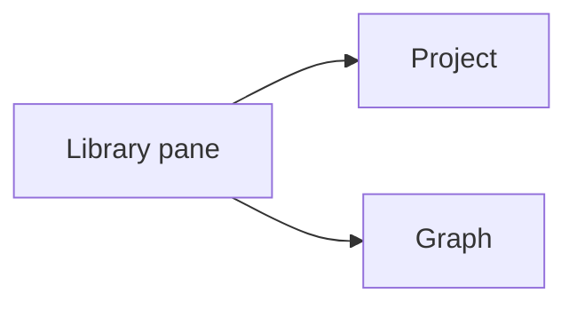
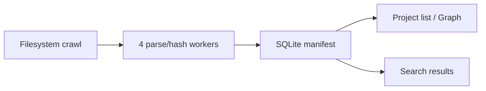

# Library

> The library pane lets you browse and search your documents from a local SQLite index: a Project file list with a breadcrumb path, plus a Graph relationship map behind one icon.

The library is the part of leaftext that helps you find documents, not just read the one you already opened. It lives in a left-side pane and is backed by a local indexer.

## Summary

| Feature | What you get |
| --- | --- |
| Project view | One folder at a time, with a breadcrumb showing where you are (the default view) |
| Breadcrumb | The folder path above the search box; every crumb steps back out to that level |
| Graph view | A force-directed map of how your documents link to each other, toggled by an icon |
| Search | Filename and content search, scoped to the folder the pane is showing |
| File actions | Right-click a file to open, cut/copy, copy path, rename, reveal, view properties, or delete |

## Views

The pane has two states: the **Project** file list, which is where it opens, and the **Graph**. The graph toggle sits at the right end of the breadcrumb band; the choice is remembered across restarts.

### Project

The file list. Folders are entered one at a time, so the pane shows one folder's contents rather than a whole hierarchy at once.

- Click a folder row — or its `›` chevron — to go into it.
- The **breadcrumb** above the search box is the path you are on: `Library › docs › features`. Click any crumb to step back out to that level. A long path keeps its root and last two folders and elides the middle behind a `…` that names what it swallowed.
- Folders sort before files, each alphabetized. Folders with no indexed documents are pruned.
- Opening a file moves the pane into that file's folder and highlights the row, so the pane always shows where the document you are reading lives.
- The folder you are in is saved, so a restart reopens it. If a rescan drops that folder, the pane falls back to the library root.

### Graph

A force-directed relationship map of your library: each **node** is a document, each **edge** is a link that resolves from one indexed document to another (a Markdown link, or a `[[wiki]]` link matched by filename). It answers "how does this fit with everything else?" rather than "where is this file?".

- The document you are reading is highlighted in the accent colour and pulled larger, so you can always spot where you are.
- **Names** float in dim grey beneath the nodes, so you can read the map without hovering. They stay a fixed size as you zoom and are decluttered by fit: where the layout is open every name shows, and where nodes crowd together only the ones that clear their neighbours do — most-connected documents keep their labels first. Zooming into a busy region spreads its nodes apart and reveals more names. The document you are on always keeps its name, and hovering always shows the hovered node's name and its neighbours'.
- **Click** a node to open that document. **Hover** a node to light up its direct links and dim the rest.
- **Drag** a node to reposition it, **drag the background** to pan, and **scroll** to zoom.
- **Click a document's tab** in the tab bar and the graph flies to that document's node and zooms in on it. Clicking the tab you are already on rebuilds the map from the current index, so it always reflects the latest links rather than staying on a stale view.
- Resizing the pane re-fits the map to the new size; it no longer waits for a view switch.
- Switching back to the file list lands on the open document's folder, not wherever the list was left.

How many documents the map draws is set by the [Graph size](05-settings.md#graph-size) setting — from a tight **Focus** neighborhood (the open document and its direct links) up to **Everything** (every indexed document). Smaller sizes render faster; the larger sizes are tuned to stay responsive by easing the layout and repainting less often as it settles.

> [!NOTE]
> With nothing open — the start screen — the **Focus** size seeds the map from your [recent files](02-navigation.md#recent-files) and their links, so the graph is never empty just because no document is active.

## Search

Search matches both file names and document content.

| Search type | Behavior |
| --- | --- |
| Name matches | Listed first |
| Content matches | Ranked with BM25 and shown with snippets |
| Result limit | Top 50 |
| CJK text | Prefix matching works for unspaced Han text |

Example:

- Query `release` might match `release-notes.md` first by filename.
- It can also match a paragraph inside `roadmap.md`, with a snippet preview.

Opening a content result jumps to the nearest heading.

### Search scope

Search reaches exactly as far as the pane shows — there is no separate control:

| Where you are | What search covers |
| --- | --- |
| Inside a folder | The files in that folder, including its subfolders |
| At the library root | The whole indexed library |
| [Graph](#graph) | The documents currently drawn (set by the [Graph size](05-settings.md#graph-size)) |

Because a folder and the graph both show a subset, searching from them stays inside that subset — a search in a graph focused on one document only turns up matches from that document's neighborhood. The filter runs in the query itself, so a scoped match ranked below the top 50 of a library-wide search still surfaces. Entering a folder, stepping back out through a crumb, or switching views re-runs the current query under the new reach. A scoped set larger than 1,500 documents searches the whole library instead.

## File actions

Right-click a file row for a context menu of file actions:

| Action | What it does |
| --- | --- |
| Open | Opens the file in the reader |
| Cut | Puts the file on the system clipboard to move on paste |
| Copy | Puts the file on the system clipboard to copy on paste |
| Copy path | Copies the file's full path as text |
| Rename | Edits the name inline; press Enter to apply, Escape to cancel |
| Reveal file | Shows the file in your OS file manager |
| Properties | Opens the OS file-properties view |
| Delete | Moves the file to the Recycle Bin / Trash |

Cut and Copy place the file itself on the system clipboard, so you paste it in your file manager (Explorer, Finder). Delete is reversible — the file goes to the Recycle Bin or Trash, not gone for good. Reveal and Properties map to each OS:

- Windows: Explorer; the file Properties dialog.
- macOS: Finder; Get Info.
- Linux: the default file manager; Properties falls back to revealing the file.

> [!NOTE]
> Clipboard "Copy"/"Cut" and "Properties" are best-effort on Linux, where behavior varies by desktop.

## Live updates

The library pane keeps up with changes on disk, so a file you just created shows up without a manual rescan.

- The same file watcher that drives live reload watches two places: the open document's folder, and — while the [file list](#project) is up — the folder you are browsing.
- The browsed folder is watched recursively, so a document added in it or any of its subfolders is indexed immediately and the pane refreshes, even when no document is open.
- A document created or edited in the open document's folder is indexed the same way.
- Renaming or deleting a file from the right-click menu updates the pane right away.
- Moving, renaming, or deleting a folder outside the app syncs the affected subtree immediately — new files are indexed and removed files are forgotten without a manual rescan.
- Folders outside both watched locations appear after the next full crawl, or as soon as you open a file from them.

## Indexing

## Facts

| Item | Value |
| --- | --- |
| Storage | `manifest.db` |
| Worker pool | 4 parallel parse/hash workers |
| Large-file indexing | Files over 2 MB are indexed from their first 2 MB, not skipped |
| DB mode | SQLite WAL |
| Progress throttle | 150 ms |
| Full tree refresh throttle | 1500 ms |

## Skips

### Status

- unreadable files (binary or non-UTF-8)
- missing files after a successful rescan

A file over 2 MB is **not** skipped: it is indexed from its first 2 MB — so its title, headings, and the start of its content are searchable and it appears in every view — while the reader still opens the whole file. Only search coverage stops at the 2 MB mark.

### Folders

Common heavy or generated folders are skipped, including:

- `.git`
- `node_modules`
- `target`
- `vendor`
- `dist`
- `build`
- `.venv`
- `__pycache__`

Root-level system directories are also skipped where appropriate, such as `Windows`, `Program Files`, `AppData`, `Library`, `proc`, and `sys`.

Symlinks and Windows reparse points are not descended.

## Layout

| Behavior | Rule |
| --- | --- |
| Toggle | The panel button in the app bar, left of Back, opens and closes the pane |
| Snap shut | Drag narrower than 40 px |
| Reader minimum | Reader stays at least 360 px wide |
| Small window | Pane auto-hides if space is too tight |

Saved library state includes:

- `library_closed`
- `library_width`
- `library_view`
- `graph_scope`
- `library_project_path`

## Toggle

Indexing is off by default.

When enabled:

1. A background crawl starts right away — and again on each app launch while the setting stays on.
2. Search and browse expand as the manifest fills in.

When disabled:

- No background crawl runs.
- Existing manifest data still shows.
- Files you open manually are still indexed.

## Next

- [Settings](05-settings.md)
- [Navigation](02-navigation.md)
- [Architecture](../02-development/01-architecture.md)
