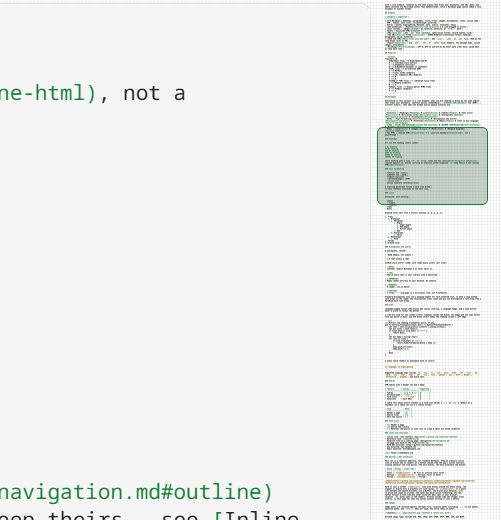

# Minimap

> Take in the whole page at once. A tiny version of your document runs down the side — real text, not abstract bars — with a marker showing where you are. Click to jump to any section; drag the marker to scroll.

## Summary

| Feature | What you get |
| --- | --- |
| [Real text](#how-it-works) | A scaled clone of the rendered page, not a synthesized pattern of lines — so you recognize a section by its shape |
| [Viewport indicator](#how-it-works) | A box marking what is on screen; click the rail to jump, drag the box to scroll |
| [Laid out like the page](#how-it-works) | The clone is given the reading column's own width, so a wide table in the thumbnail wraps where it wraps on the page and the picture ends where the document ends |
| [Whether it appears](#whether-the-rail-appears) | Skipped entirely for an empty document; shown for every format, including XML, JSON and YAML |
| [The code view's rail](#the-code-views-minimap) | The editor's own map of the source, always present there |
| [Responsive widths](#responsive-behavior) | The lane narrows with the window, and is never hidden |
| [Toggle](#toggling-the-minimap) | On by default; **Settings** turns it off and the page widens out |

## What it is

The minimap is a scaled side-rail showing the actual document beside the reading view. It sits outside the page rather than on it — the page's border stops 4 px short and the rail stands on the same textured chrome as the [library](03-library.md) pane and the app bar, held off the window edge by the same gutter the page card is. It gives you spatial orientation in long documents and lets you jump to any section by clicking or dragging. Because it is a real rendering of the page, you can recognize where you are from the shape of the text itself: a heading, a code block, a verse, a dense paragraph.

## How it works

The minimap clones the rendered document and shrinks it to the rail width with a CSS transform — a `scale(...)` to the rail width, plus a vertical nudge so the thumbnail lines up with where the real content begins — the way a code editor's minimap does. The clone is laid out inside a box the same width as the reading column and carrying the same container query, so anything in the document that measures itself against that column wraps in the thumbnail exactly as it wraps on the page. A [wide table](01-rendering.md#tables) is the one thing that does, and without that box it measured the whole window instead: every wide table in the thumbnail was drawn wider than the page draws it, so the picture wrapped less, ended short of the bottom of the rail, and a click low on it landed further down the document than it pointed. What you see in the rail is a real (very small) copy of the page, so the text that is actually there is what shows up. The clone is stripped of links, and of ids so nothing in it is focusable or duplicated for assistive technology — except the ids inside a diagram, which it keeps: a [Mermaid diagram](01-rendering.md#mermaid-diagrams) scopes its own colors and arrowheads to its SVG's id, so a stripped copy drew black shapes with no arrowheads. It inherits the active theme through the shared stylesheet, so switching light/dark needs no rebuild. A diagram nobody has drawn yet is a blank block of the right height in the rail, and never a spinner — dozens of them turning down a rail a few hundred pixels wide is motion with nothing behind it.

On a document taller than the rail, the clone holds the slice the rail can actually show rather than the whole page. The rail is a few hundred pixels over a thumbnail that on a large glossary is hundreds of thousands of pixels tall, so a whole-document clone is almost entirely off-screen — a second copy of every element on the page, which is enough to make each wheel click cost the better part of a second. The window carries a rail's worth of document above and below what is visible, so you can scroll that far before it is rebuilt. Where the window reaches the first or last block of the document it is measured to the document's own ends rather than to those blocks' edges: the space above the first block and below the last is the page's own padding, which no clone of the blocks can hold, so sitting at the very top or the very foot is inside the window and not a reason to rebuild. It is still a clone of the real rendering, so the rail shows real text rather than a synthesized pattern of lines; and on a document the rail can show in full the window *is* the whole document, which is why none of this depends on a size threshold.

A viewport indicator overlays the portion currently visible; as you scroll, it moves in lockstep. When the document is taller than the rail, the thumbnail itself slides inside the rail (again, like a code editor) so the region around your position stays in view. Clicking anywhere on the rail scrolls the reader to that point in the document; dragging the indicator keeps the grabbed point under the cursor. Either way the point you land on becomes the reader's recorded position (see [Restore](02-navigation.md#restore)), so content that settles afterwards — images, diagrams, the [Pager](02-navigation.md#pager) — cannot pull you back to where you started.

The clone is rebuilt only when it needs to be — when the document's content changes (live reload, or code highlighting, Mermaid diagrams, and math settling in), when images finish loading, when the rail resizes, when the reading column's own width changes, and when scrolling or a drag leaves the window it was built for. The reading column is on that list separately because it keeps growing with the window after the text has stopped widening at its measure, and a clone laid out against the old width would draw a wide table at the wrong size. A `
` opening inside the rail's own clone is not a change to the document: inserting a clone that holds an open one makes the browser announce it, and answering that announcement made the rail rebuild off its own thumbnail, once an animation frame, for as long as the file was open. Scrolling otherwise writes three inline values and nothing else:

- The indicator's `top` — where the visible region sits within the rail
- The indicator's `height` — the reader window at the thumbnail's scale
- The thumbnail lane's `transform` — slides the thumbnail inside the rail on tall documents (a `transform`, not `top`: the lane moves every frame, and moving it by a layout property made the browser re-lay-out the page to do it)

Each of those is written straight onto the element that draws it, never as a CSS custom property on the rail around them. A custom property inherits, so one write on the rail re-resolves style across every element of the clone underneath — a couple of thousand of them on an ordinary document, which measured 78ms a write against a fraction of a millisecond for writing to the element itself. The rail's own height is written the same way, onto the track.

A `requestAnimationFrame`-throttled loop writes those on scroll, and reads no geometry at all while doing it. The rail's measurements — the document's height, the thumbnail's scale, the rail's own height — change only when the content or the window does, so they are cached and dropped by the things that can change them; scrolling changes none of them. Re-measuring per wheel click instead forces a fresh layout of the entire document, which on a large file is the whole difference between a rail that follows the wheel and one that answers a second later. The indicator's position and travel come from the reader's exact scroll position over its scrollable height, and the indicator's height is the reader window scaled to the rail — so click-to-scroll and the indicator stay aligned with the thumbnail on documents of any length.

> [!NOTE]
> The thumbnail is a second, scaled-down layout, so it cannot exist until the document itself has been laid out. Until it does the rail shows a small spinner rather than an empty lane — on a large document that build is a visible wait, and a blank rail beside a finished page reads as one that failed rather than one still working. The rail keeps that spinner while any [Mermaid diagram](01-rendering.md#mermaid-diagrams) in the document has still to be measured, since the thumbnail is a clone of the page and a diagram nobody has drawn yet has nothing for the clone to take. Every diagram is drawn once after the page settles, so that is one wait that ends when the last block knows its height, rather than a spinner returning on every scroll into diagrams that have not been drawn.

## Whether the rail appears

The Rust side produces a small `DocumentMinimap` for each document whose only job now is to report a positive line count: an empty or zero-line document reports `0` and the rail is skipped entirely. That count is the only part of the model the page is sent — the thumbnail comes from the clone, so the model's per-line detail would be megabytes of payload on a large document that nothing reads. [XML](01-rendering.md#xml) and [JSON/YAML](01-rendering.md#data-files-json-and-yaml) documents report their count from the rendered block HTML (they have no Markdown source to line-scan), so an opened `.xml`, `.json`, or `.yaml` file gets the same real-text rail as a Markdown file — the thumbnail itself is always the live clone, whatever the source format.

## The code view's minimap

The [code view](07-editing.md#code-view) has a rail of its own — the editor's, not this one. It draws the source rather than cloning a page, which is what lets it stay honest on a file far too large to lay out twice, and it is always present there: with no scrollbar in the source view, the rail is how you see where you are. The reader's rail and the editor's are two implementations of one idea, so they are dressed alike — the same viewport box, the same border and rounding, the same width and standing-off from the page.

Both rails are **chrome, not page**: they stand on the window's textured surface beside the card, and the page's own right border is the line between the two. In the code view that means the editor paints no background out there, the map's own drawing surface is transparent, and the editor casts no scroll shadow across the rail's top — so the chrome's dot grain shows through between the lines of the map, and the map reads as text on the window rather than as a second, differently-colored page.

> [!NOTE]
> The reading view's rail is a real clone of the page; the code view's is the editor's drawing of the source. They look and behave alike on purpose, but the [minimap setting](#toggling-the-minimap) governs only the first — the code view always has its rail.

## Responsive behavior

The minimap adjusts its preview lane width depending on the available space:

| Breakpoint | Preview width |
| ---------- | ------------- |
| > 900 px   | 68 px         |
| 601–900 px | 46 px         |
| ≤ 600 px   | 38 px         |

On screens narrower than 600 px the minimap gutters shrink alongside the preview lane, keeping the reading column as wide as possible. The minimap is never hidden on small screens — it remains the primary scroll affordance at every window size.

## Always there

The minimap is not a choice. There is nothing to switch and nothing saved: it is the reader's scroll indicator at every window size, so turning it off left a page with no answer to "where am I in this".

The rail still comes and goes with the document — there is none on the home screen, and none while the [graph](03-library.md#graph) is up. With no rail its column collapses to zero and the page widens back out to the window gutter, so no empty band remains, and the reader's own thin [scrollbar](02-navigation.md#scrollbars) comes back — drawn while the page is being scrolled and gone a moment after it stops. While the rail is present the scrollbar stays hidden, because the rail is that indicator.

> [!TIP]
> Use the minimap to quickly gauge document length and find dense sections at a glance. Because it is a real rendering of the page, headings, code blocks, verse, and dense paragraphs each keep their own shape — so you can pick out section breaks and dense passages in the rail from the layout itself, without reading a word.

## Next

- [Navigation → Outline](02-navigation.md#outline) — the rail's companion: the document's structure as clickable text
- [Settings → Minimap](05-settings.md#minimap) — why it stopped being a preference
- [Editing → Code view](07-editing.md#code-view) — the view the second rail belongs to
