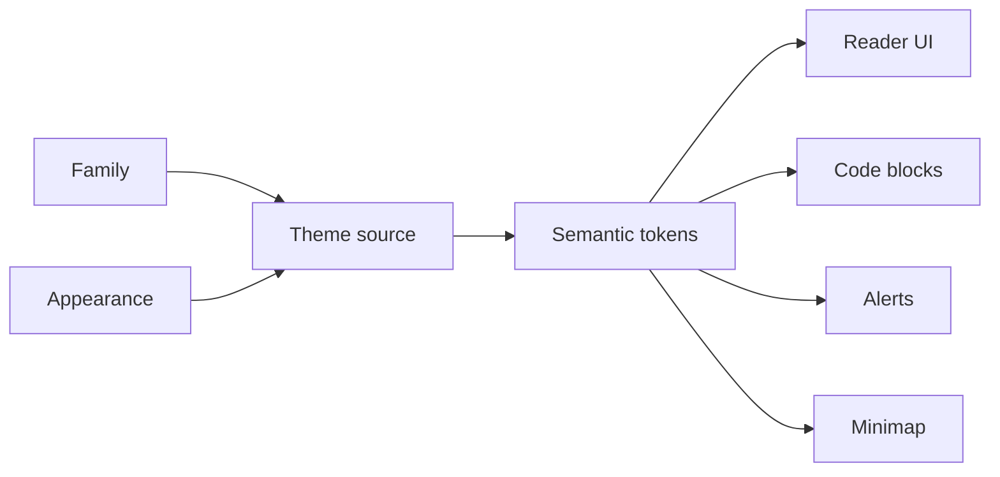

# Themes

> leaftext themes have two axes — a **family** (the palette) and an **appearance** (light or dark) — built on a semantic token contract that is checked when the theme CSS is compiled at launch, so the reader, code blocks, alerts, and minimap stay visually consistent. Fonts are fetched from Google Fonts on demand rather than bundled.

From the user side, themes are simple: open the theme picker, tap a family, pick an appearance, and the app updates immediately. Under the hood every family covers the full `--leaf-*` token set, and the active family's font is loaded from Google Fonts the moment you switch to it.

## Families

Pick a family in the theme picker. Five ship, listed alphabetically, with **Fern** as the default:

| Family | Palette |
| --- | --- |
| Dracula | The classic Dracula palette (light "Alucard" and dark) |
| Fern | **Default.** An Obsidian-based palette with a fern-green cast |
| GitHub | GitHub's light/dark palette, in its own system-font stack |
| Græy | An Obsidian-based neutral greyscale palette |
| Obsidian | Obsidian's default light/dark base ramps with a violet accent |

A sixth picker entry, **Random**, is a preference rather than a palette — see [Random](#random).

## Random

The last entry in the theme picker is **Random**. It is not a palette; it is a preference that draws a concrete family at each launch, so the app opens in a different theme every time. The draw is a no-repeat cycle: every family shows once before any repeats, and when the cycle resets it avoids immediately repeating the family you just saw. The families already used in the current cycle are remembered across restarts (saved as `theme_random_used` in `settings.json`), so quitting and relaunching keeps the rotation going rather than starting over. The picker keeps showing Random as selected — the concrete family it resolved to for this session drives the actual colors.

## Appearance

Each family has a light and a dark variant; the Appearance control picks which:

| Appearance | What it does |
| --- | --- |
| System | Follows the OS light/dark preference, updating live |
| Light | Forces the family's light variant |
| Dark | Forces the family's dark variant |
| Daylight | Light between 09:00 and 18:00 local time, dark otherwise |

## Model

## Choose

Open **Settings**, then **Theme** to slide up the theme picker. It lists every family as a button — plus [Random](#random) at the end — with an Appearance control (System / Light / Dark / Daylight) at the top. Changes apply immediately and are saved as `theme_family` and `theme_mode` in `settings.json` (see [Settings](05-settings.md#options)).

## Fonts

leaftext does not bundle fonts. Instead, the active theme's font is fetched from **Google Fonts** when the theme activates, and the WebView caches it on disk so later launches are instant:

- The default font is **Noto** (Noto Sans for body, Noto Serif for headings, Noto Sans Mono for code) — the same faces leaftext has always used, now fetched rather than shipped in the binary.
- The **GitHub** family is the exception: it uses your OS's native font stack (like github.com) and fetches nothing.
- Switching families swaps the font link, so the font changes with the theme.
- Every font stack lists system fallbacks, so text is readable immediately while the web font loads — and stays readable offline, falling back until you have loaded the font online once.

## Tokens

The semantic token set covers:

- app chrome
- document text
- headings and links
- blockquotes and alerts
- code surfaces and syntax colors
- minimap colors
- focus and selection styling

If a theme source misses one required token, leaftext fails the contract check instead of silently rendering with broken fallback colors. See [Theming](../02-development/04-theming.md#the-token-contract) for the full contract.

## Add your own

The theme picker links to the project on GitHub for making your own theme. A theme is pure data — a map of contract tokens to values plus a font block — authored as a file under `themes/` and compiled into the bundle, so it can be validated against the contract without injecting third-party CSS. See [Theming → Adding a theme](../02-development/04-theming.md#adding-a-theme) for the full recipe.

## CSS

The compiled stylesheet is assembled in this order:

1. Compiled `--leaf-*` theme mappings (each family's palette, plus its font-family stacks)
2. The `:root` alias layer — the radius/shadow scales and the short component names the UI consumes
3. App CSS for layout and components

Every palette is pure data, compiled from [`themes.json`](../02-development/04-theming.md#palettes-are-data-themesjson); the font *files* still load separately from Google Fonts per the active theme. The ordering keeps one stable semantic layer so the app can swap themes quickly.

## Windows

On Windows, leaftext uses a frameless window with its own title bar rather than the native one, so nothing the OS draws sits above the app. The app bar doubles as the title bar: drag it to move the window, double-click to maximize or restore, and its right edge carries the minimize / maximize / close buttons (close turns red on hover). The taskbar still shows the leaf icon, and the window border follows the theme's divider color so the app reads as a distinct surface against the desktop.

## Next

- [Settings](05-settings.md)
- [Theming](../02-development/04-theming.md)
