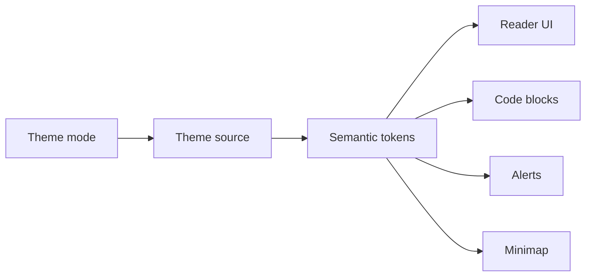

# Themes

> leaftext offers four theme modes — System, Light, Dark, and Dracula — built on three palettes, and applies them through a semantic token contract checked when the theme CSS is compiled at launch, so the reader, code blocks, alerts, and minimap stay visually consistent.

From the user side, themes are simple: pick one in Settings and the app updates immediately. Under the hood, every theme has to cover the full `--leaf-*` token set.

## Modes

| Theme | What it does |
| --- | --- |
| System | Follows OS light/dark preference |
| Light | GitHub Primer light palette |
| Dark | GitHub Primer dark palette |
| Dracula | Dedicated Dracula palette |

## Model

## Choose

Open **Settings** and choose one of:

- `System`
- `Light`
- `Dark`
- `Dracula`

The change applies immediately and is saved as `theme_mode` in `settings.json`.

## Uses

### System

Use this if you want leaftext to follow the OS automatically.

### Light

Use this if you want a GitHub-like bright reading surface.

### Dark

Use this if you want a GitHub-like dark reading surface.

### Dracula

Use this if you want a stronger, custom dark palette not derived from Primer.

## Tokens

The semantic token set covers:

- app chrome
- document text
- headings and links
- blockquotes and alerts
- code surfaces and syntax colors
- minimap colors
- focus and selection styling

If a theme source misses one required token, leaftext fails the contract check instead of silently rendering with broken fallback colors.

## CSS

1. Noto font faces
2. Primer light/dark primitives
3. Compiled `--leaf-*` theme mappings
4. App CSS for layout and components

That ordering lets the app swap themes quickly while keeping one stable semantic layer.

## Windows

On Windows, leaftext also repaints the native title bar to match the active theme where the OS allows it. The title bar is painted the exact page color so it reads as part of the background in every theme, with its text color chosen by the background's brightness to stay legible. The window border is drawn in the theme's divider color so the app still reads as a distinct surface against the desktop, and the reader's own app bar carries the divider below the caption.

## Next

- [Settings](05-settings.md)
- [Theming](../02-development/04-theming.md)
