# Themes

> Make it look like yours. Pick a **family** (the palette) and an **appearance** (light or dark), and everything moves together — text, code, callouts, minimap — because every theme fills the same semantic token contract, checked when the theme CSS is compiled at launch. Each family's font is fetched from Google Fonts the first time you choose it, rather than bundled.

From the user side, themes are simple: open the theme picker, tap a family, pick an appearance, and the app updates immediately. Under the hood every family covers the full `--lt-*` token set, and the active family's font is loaded from Google Fonts the moment you switch to it.

## Families

Pick a family in the theme picker. Eleven ship, listed alphabetically. A fresh install opens on [Random](#random) family with a [Daylight](#appearance) appearance; **Fern** is the fallback family if a saved choice can't be read. Each family is a plain Markdown file that opens with a screenshot of its own palette — browse them all in the [**themes gallery**](https://github.com/ryanallen/leaftext/blob/main/themes/README.md), which shows that preview plus a light-vs-dark swatch table per family, or open one below:

| Family | Palette |
| --- | --- |
| [Amaranth](https://github.com/ryanallen/leaftext/blob/main/themes/amaranth.md) | Clean light/dark base ramps with a violet accent |
| [Arabica](https://github.com/ryanallen/leaftext/blob/main/themes/arabica.md) | A coffee palette — creamy latte light, dark-roast espresso dark — with an AnuPpuccin mauve accent |
| [Bloodleaf](https://github.com/ryanallen/leaftext/blob/main/themes/bloodleaf.md) | Blood-red veins on a white ground — an over-exposed white light with a red accent and a sky-blue second hue, against a blue-black night dark |
| [Fern](https://github.com/ryanallen/leaftext/blob/main/themes/fern.md) | **Fallback family.** An Amaranth-based palette with a fern-green cast |
| [Ginger](https://github.com/ryanallen/leaftext/blob/main/themes/ginger.md) | A warm palette — cream light, cool slate dark — with a ginger-orange accent |
| [GitHub](https://github.com/ryanallen/leaftext/blob/main/themes/github.md) | GitHub's light/dark palette, in its own system-font stack |
| [Goldenrod](https://github.com/ryanallen/leaftext/blob/main/themes/goldenrod.md) | A stark black-and-gold palette — honey-on-white light, near-black dark — with a golden-yellow accent |
| [Halcyon](https://github.com/ryanallen/leaftext/blob/main/themes/halcyon.md) | A calm, clean palette with one blue accent and a cool blue-gray dark mode |
| [Nightshade](https://github.com/ryanallen/leaftext/blob/main/themes/nightshade.md) | The classic Dracula palette (light "Alucard" and dark) |
| [Pippin](https://github.com/ryanallen/leaftext/blob/main/themes/pippin.md) | A crisp, macOS-style palette — clean neutral grays with a system-blue accent |
| [Sage](https://github.com/ryanallen/leaftext/blob/main/themes/sage.md) | A neutral grayscale palette with a muted-blue (Minimal-style) accent |

A twelfth picker entry, **Random**, is a preference rather than a palette — see [Random](#random).

## Previews

Every family rendering the same reference document, split diagonally so the light variant sits above the dark one. These are the previews each family file carries at the top.

### Amaranth

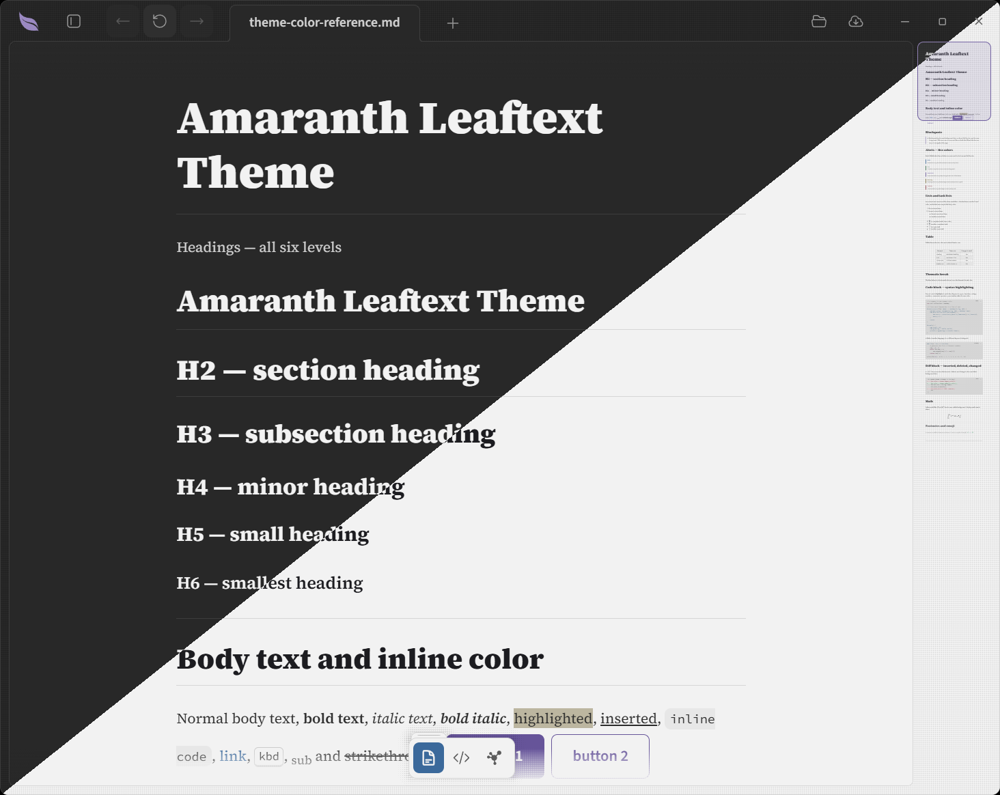

### Arabica

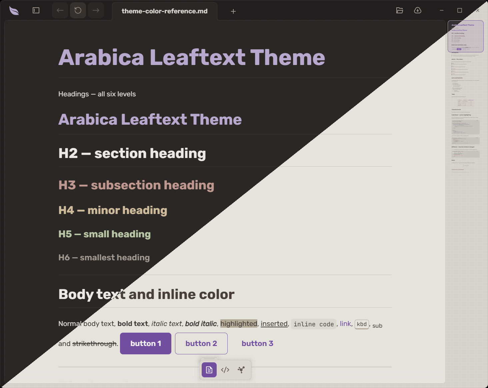

### Bloodleaf

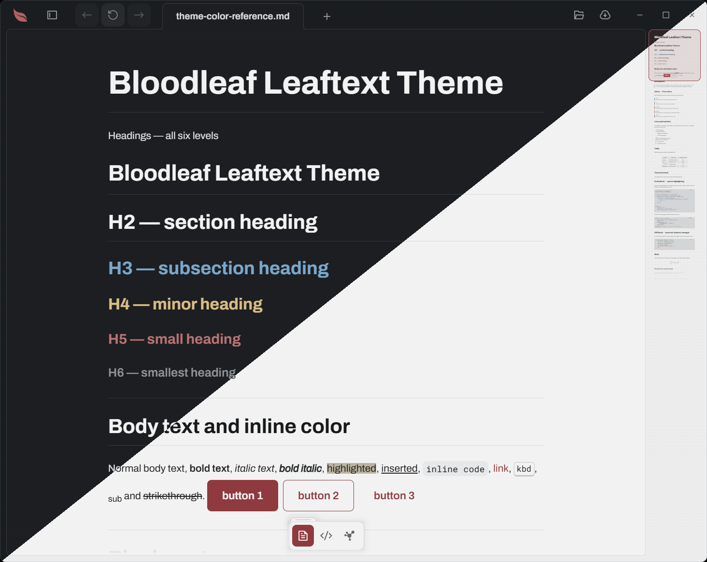

### Fern

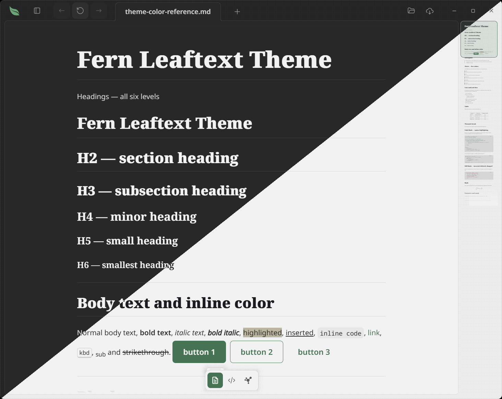

### Ginger

### GitHub

### Goldenrod

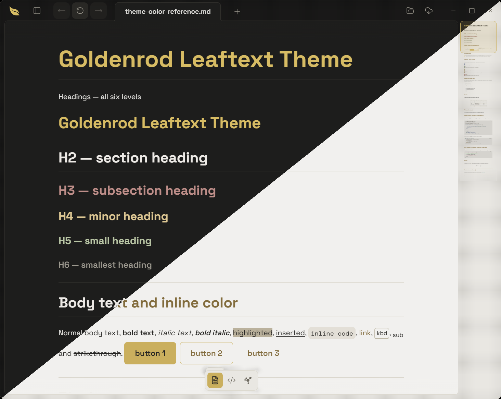

### Halcyon

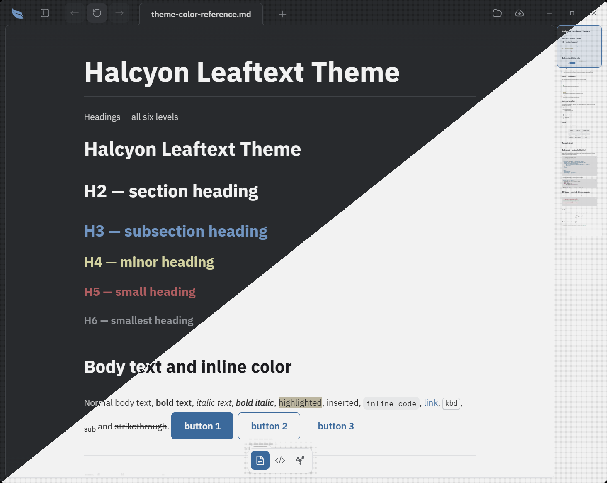

### Nightshade

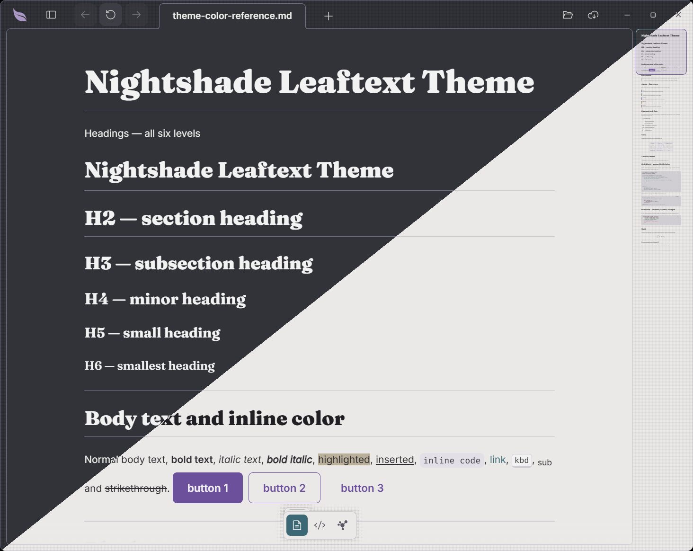

### Pippin

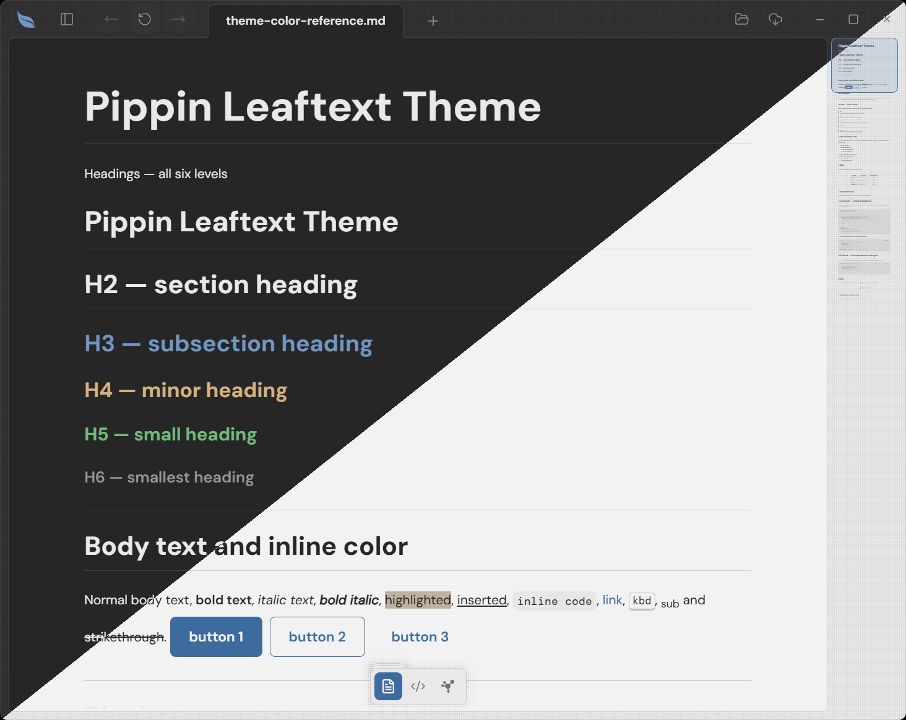

### Sage

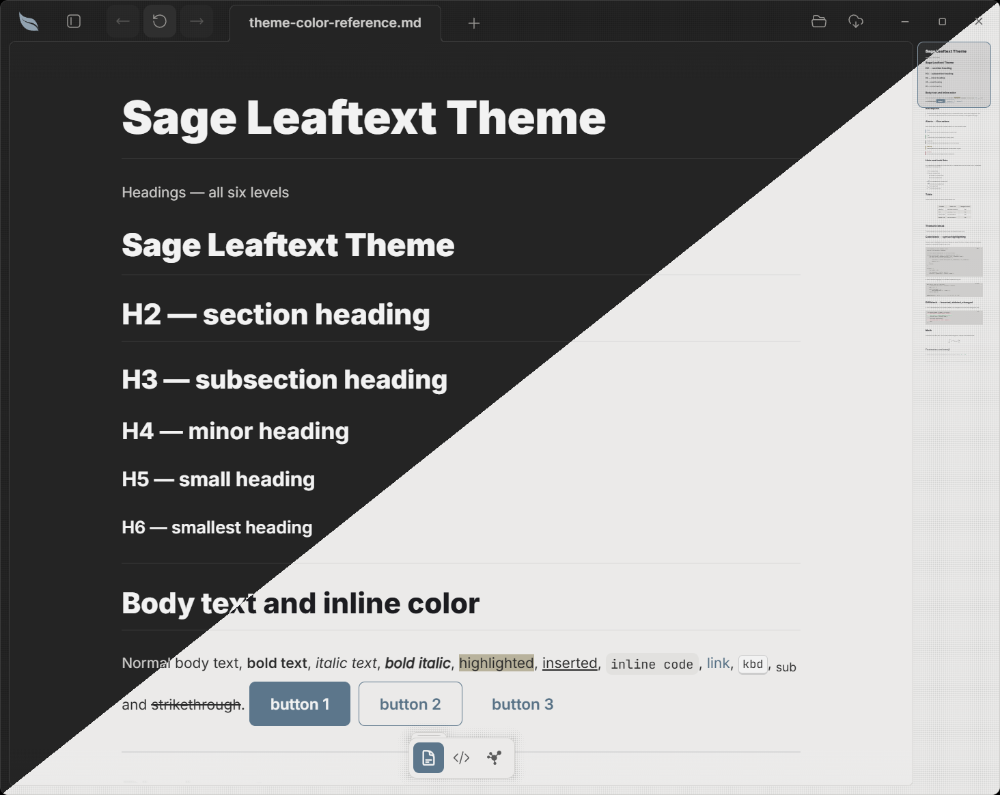

## Random

The last entry in the theme picker is **Random**. It is not a palette; it is a preference that draws a concrete family at each launch, so the app opens in a different theme every time. The draw is a no-repeat cycle: every family shows once before any repeats, and when the cycle resets it avoids immediately repeating the family you just saw. The families already used in the current cycle are remembered across restarts (saved as `theme_random_used` in `settings.json`), so quitting and relaunching keeps the rotation going rather than starting over. The picker keeps showing Random as selected — the concrete family it resolved to for this session drives the actual colors. While the picker is open, the Random card previews the pool it draws from: it morphs through every theme's colors and font, one every half second, with only its name staying "Random".

## Appearance

Each family has a light and a dark variant; the Appearance control picks which:

| Appearance | What it does |
| --- | --- |
| System | Follows the OS light/dark preference, updating live |
| Light | Forces the family's light variant |
| Dark | Forces the family's dark variant |
| Daylight | Light between 09:00 and 18:00 local time, dark otherwise |

## Model

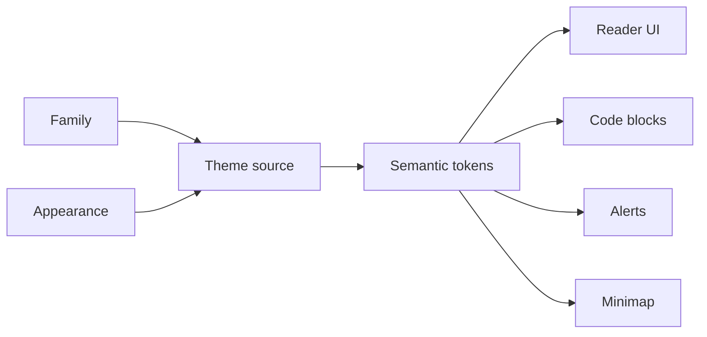

## Choose

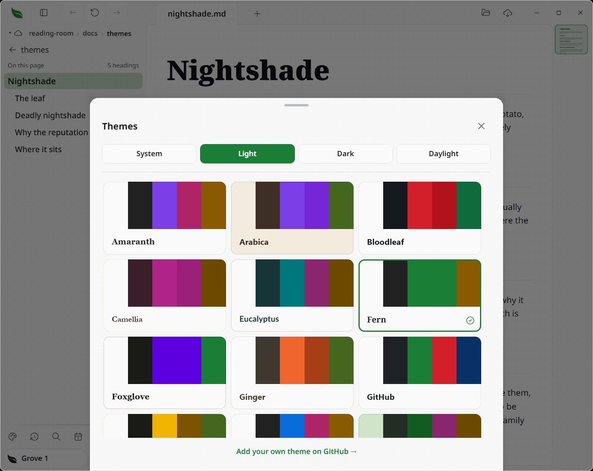

Open **Settings**, then **Theme** to slide up the theme picker. It lists every family as a preview card — plus [Random](#random) at the end — with an Appearance control (System / Light / Dark / Daylight) at the top. Each card wears its own theme: the theme's paper and ink, a strip of five swatches (background, text, brand, and two code colors), and the theme's heading font, all following the current appearance. Changes apply immediately and are saved as `theme_family` and `theme_mode` in `settings.json` (see [Settings](05-settings.md#options)). Close the picker with its close button, by clicking outside it, with `Escape`, or by dragging the grab bar at its top downwards — the same [bottom sheet](../GLOSSARY.md#bottom-sheet) the glossary uses.

## Fonts

Leaftext does not bundle fonts. Instead, the active theme's font is fetched from **Google Fonts** when the theme activates, and the WebView caches it on disk so later launches are instant:

- Each family carries its own type: **Fern** uses Noto (Sans/Serif/Sans Mono); **Nightshade** pairs Fraunces headings with Inter and Fira Code; **Halcyon** uses IBM Plex Sans/Mono; **Amaranth** uses the Source family (Serif 4 / Sans 3 / Code Pro); **Sage** uses Inter with JetBrains Mono; **Arabica** pairs Rubik with JetBrains Mono; **Goldenrod** pairs Space Grotesk with Space Mono; **Ginger** pairs Nunito with Inconsolata; **Pippin** pairs DM Sans with DM Mono; **Bloodleaf** pairs Archivo with Roboto Mono.
- The **GitHub** family is the exception: it uses your OS's native font stack (like github.com) and fetches nothing.
- Switching families swaps the font link, so the font changes with the theme.
- The theme picker is the exception to loading only the active font: while it is open it loads every theme's font so each card shows its real type, then drops them all on close, so the app never carries them at rest. A card keeps the app font (and shows a spinner) until its own font arrives, then swaps.
- Every font stack lists system fallbacks, so text is readable immediately while the web font loads — and stays readable offline, falling back until you have loaded the font online once.

## Tokens

The semantic token set covers:

- app chrome
- document text
- headings (a base color plus a per-level color for `h2`–`h6`, so a theme can tint deeper headings) and links
- blockquotes and alerts
- code surfaces and syntax colors
- minimap colors
- focus and selection styling

If a theme source misses one required token, Leaftext fails the contract check instead of silently rendering with broken fallback colors. See [Theming](../02-development/04-theming.md#the-token-contract) for the full contract.

## Diagrams

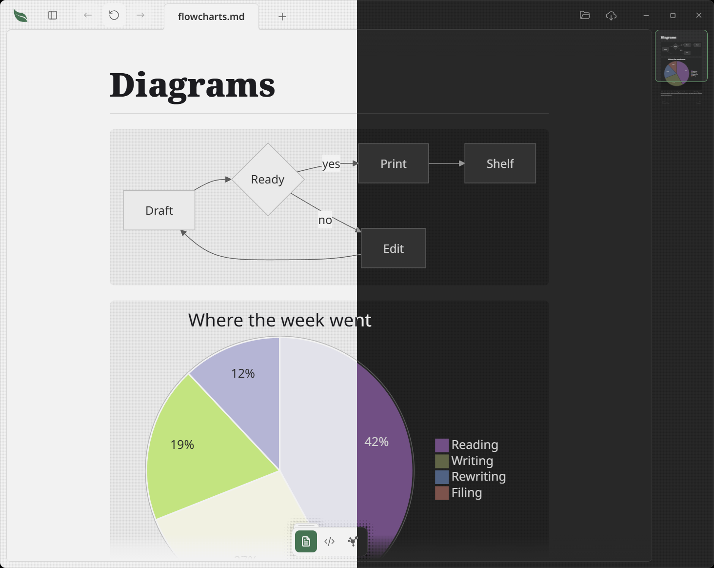

[Mermaid diagrams](01-rendering.md#mermaid-diagrams) are drawn in the theme's own colors, so every family themes every kind of diagram without saying anything about diagrams at all:

- **Boxes and subgraphs** take the theme's muted and sunken surfaces, with document ink for their labels — so a large flowchart reads as part of the page rather than a foreign object dropped on it.
- **Arrows, axis lines and borders** take the muted ink and border colors.
- **Categorical colors** — the twelve a pie chart, timeline, mindmap, kanban board or git graph cycles through — are the theme's primary hue turned around the color wheel, twelve steps of 150° so that neighboring items land on opposite colors rather than near-identical ones. Every entry is held to the same weight, not the same lightness, which is what lets one ink read on all twelve.
- **State colors** mean what they mean elsewhere in the app: a Gantt chart's active bar is the accent, its done bar the success color, its critical bar the danger color, and today's line the same.
- **Labels** are set in the theme's body font, the same face as the words around the diagram.
- **Text printed inside a colored fill** — a Gantt bar's label, a plotted point — takes whichever of the theme's inks reads best on that fill, measured for contrast rather than assumed. A brand color is often a mid tone that neither white nor black sits comfortably on, so the ink is chosen per color and per theme.

Switching theme redraws every diagram on the page: an SVG already drawn holds its colors as literal values, so the only way to recolor one is to draw it again.

Every theme is gated on this. `theme_compiler_gates_diagram_colors_for_every_source` re-derives the pairs a diagram makes across all 22 sources — labels at 4.5:1, arrows at 3:1, and every colored fill required to have a readable ink — so a palette that would make diagrams unreadable fails `just verify` rather than shipping.

One known rough edge: a **mindmap** can clip a long node label. Mermaid sizes that box from its own measurement of the text, and it comes out short of the theme's font. The other diagram types are unaffected.

## Add your own

The theme picker links to the project on GitHub for making your own theme. A theme is pure data — a map of contract tokens to values plus a font block — authored as a file under `themes/` and compiled into the bundle, so it can be validated against the contract without injecting third-party CSS. See [Theming → Adding a theme](../02-development/04-theming.md#adding-a-theme) for the full recipe.

## See them all

[**leaftext.com/gallery.html**](https://leaftext.com/gallery.html) draws every theme on one page — all 81 colors, every icon, and every part of the interface — with a switcher for the family and for light or dark. It is built from the same files the app is, by `just bundle-gallery`, so it cannot show you a theme the app does not have.

## CSS

The compiled stylesheet is assembled in this order:

1. Compiled `--lt-*` theme mappings (each family's palette, plus its font-family stacks)
2. The stylesheet's own `:root` block — the radius scale, the type scale, the layout metrics: one value each, whatever theme is on
3. App CSS for layout and components

Every palette is pure data, compiled from [`themes.md`](../02-development/04-theming.md#palettes-are-data-themesmd); the font *files* still load separately from Google Fonts per the active theme. The ordering keeps one stable semantic layer so the app can swap themes quickly.

## Windows

On Windows, Leaftext uses a frameless window with its own title bar rather than the native one, so nothing the OS draws sits above the app. The app bar doubles as the title bar: drag it to move the window, double-click to maximize or restore, and its right edge carries the minimize / maximize / close buttons, which take the same rounded hover chip as the other toolbar icons (close turns red instead of the accent color). The taskbar still shows the leaf icon, and the window border follows the theme's divider color so the app reads as a distinct surface against the desktop.

## Next

- [Settings](05-settings.md)
- [Theming](../02-development/04-theming.md)
