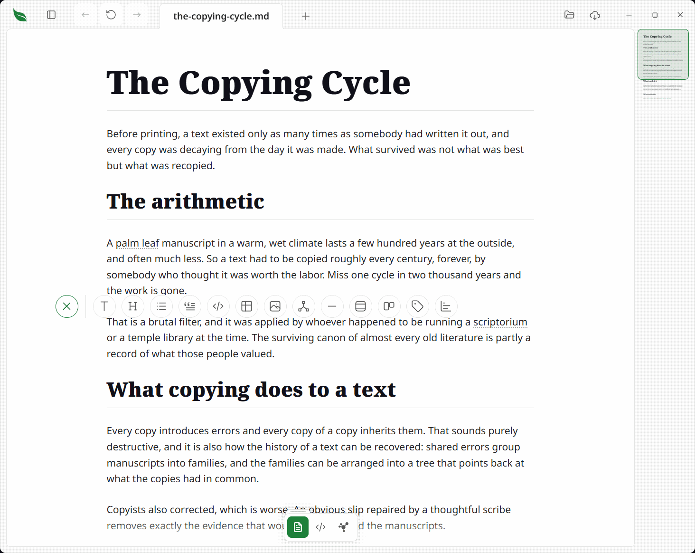
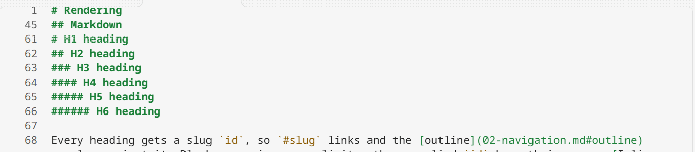

# Editing

> Write where you read. Click into a sentence and type, or drop to the raw source — both write back to the same file, and nothing saves until you say so.

Leaftext is reading-first, but it is also editable. You can edit **in the reading view itself** — click into a sentence and type, toggle a checkbox — and the change is written back into the source at exactly that spot. When you would rather work in the raw text, the **code view** swaps the page for the file's actual source — Markdown, XML, JSON, YAML, or a raw email. Both paths share one source of truth and one green **Save** button. There is no autosave for text edits: nothing touches your file until you say so — the one exception is ticking a checkbox, which saves on the spot.


## Summary

| Feature | What it means |
| --- | --- |
| [New document](#new-document) | The **+** in the app bar (and on the home screen) starts a blank page, its reading view unlocked and ready to type |
| [Save As](#new-document) | A new document has no file until its first save, which asks where to put it |
| [Inline editing](#inline-editing-the-reading-view) | Click into the rendered page and edit it directly — see [Formats](#formats) for what each one allows |
| [Typing on XML as words](#inline-editing-the-reading-view) | Press a sentence in an [XML](01-rendering.md#xml) document and type on it where it is drawn, with the tags left alone; a block whose drawn words are not the file's own bytes opens its source instead and says why |
| [Typing in a cell of an XML table](#inline-editing-the-reading-view) | Press a cell holding one plain value and type on it where it is drawn; the rest of the file is untouched, and the grid never swaps for markup |
| [Block editing](#inline-editing-the-reading-view) | `Enter` splits a block or starts a new one; `Backspace` at the start merges into the block above |
| [Taking a block away](#deleting) | Clear a paragraph or heading of its text and the whole line goes — no bare `##` left standing |
| [Taking several away](#deleting) | Highlight across blocks and `Delete` removes the lot; whatever survives at each end joins into one block |
| [Picking a section](#deleting) | `Ctrl+A` with the caret in a block widens a step per press: the block, then the heading and everything under it, then the page |
| [The fields at the top](#the-fields-at-the-top-of-a-note) | Click a value in a note's field block and change it, pick a date, tick a box, add and drop tag chips, rename a key, add a field or take one away — and start a block on a note that has none |
| [The block gutter](#the-block-gutter) | A handle and a plus in the page's left margin: drag a block to reorder it, or add one on the empty line |
| [Adding a block](#adding-a-block) | The plus opens a row of kinds — text, heading, list, quote, code, table, image, flowchart, divider |
| [Inserting an image](#images) | The image button asks for a file or an address; nothing is copied, and the picture stays where you keep it |
| [Drawing a flowchart](#the-flowchart-editor) | The flowchart button, and the one in any drawn diagram's corner, open a canvas beside the Mermaid text |
| [A box's link, icon or picture](#what-it-can-draw) | A selected box has a field for each: where clicking it goes, one of the app's own drawings by name, and a picture beside the document or at an address |
| [Exporting a diagram](#export) | The flowchart sheet writes the diagram out as its own file — Markdown or PNG |
| [The format bar](#the-format-bar) | Highlight words and a bar appears over them: bold, italic, strikethrough, code, link, then text, bigger/smaller heading and quote for the whole block |
| [Interactive checkboxes](#inline-editing-the-reading-view) | Click a task checkbox — in a list or a table cell — to check or uncheck it; it saves on the spot and works even with editing off |
| [A table keeps its spacing](#inline-editing-the-reading-view) | Type in one cell and only that cell is rewritten, so a table you lined up by hand stays lined up |
| [Full-window tables](#inline-editing-the-reading-view) | Open a safe Markdown table on the whole window; it keeps the same look and scrolls sideways with Ctrl or Command and the wheel |
| [Undo](#undo) | An Undo button (and `Ctrl+Z` / `Cmd+Z`) steps back through reading-view edits, a word at a time while you are typing; `Ctrl+Y` or `Ctrl+Shift+Z` walks the words forward again |
| [The padlock](#the-padlock) | Two padlocks, one for the reading view and one for the source, each remembered. Both start locked, except in a [new document](#new-document) — and checkboxes toggle either way |
| [Replacing text](02-navigation.md#find-in-this-document) | The find bar's Replace and All write through the same padlock as typing does — in the reading view as one splice of the source, so one Undo puts it all back |
| [Code view](#code-view) | Toggle the rendered page to the raw source and back |
| [Your place is kept](#code-view) | Toggling between the two views holds your position, and toggling back and forth returns you to the exact spot |
| [Highlighting](#code-view) | The source is colored in the active [theme](06-themes.md)'s syntax colors — Markdown, XML, YAML and JSON; a raw [email](01-rendering.md#email-eml) shows as uncolored text |
| [Color squares](#code-view) | A color written in the source carries a small square of itself in the line beside it — hex, `rgb()` or `hsl()` |
| [Line numbers](#code-view) | A gutter numbers each source line, staying pinned when long lines wrap |
| [Wrapped lines](#code-view) | Long lines wrap; the code view never scrolls sideways |
| [Minimap](04-minimap.md#the-code-views-minimap) | The editor's own minimap rail, drawn on the window's chrome beside the page |
| [Pinned headings](#pinned-headings) | In Markdown source, the headings you are reading under stay at the top edge as you scroll; click one to jump to it |
| [Editing the source](#editing-the-source) | Type directly; undo/redo, selection, clipboard, and IME all work, and `Tab` indents instead of moving focus. A multi-megabyte file stays responsive |
| [Typing help](#typing-help) | Monaco's IntelliSense, answered from your own notes: type `[[` to see them, `#` for headings, hover a wikilink for a preview — and broken links get a wavy underline |
| [Save](#save) | A green **Save** button (or `Ctrl+S` / `Cmd+S`) appears from the first keystroke, and writes the words on screen without clicking out of them |
| [Unsaved marker](#save) | A tab with unsaved edits shows a dot beside its name, from the first keystroke |

## New document

The **+** beside Open in the app bar starts a blank document in a new tab. The home screen carries the same button beside **Choose file**.

- It opens in the reading view, whose [padlock](#the-padlock) is turned off for you, with the caret on the first line — there is nothing to click before you type. `Enter` starts the next paragraph, as it does anywhere else in the reading view.
- It has **no file** yet. The tab is called *Untitled* (*Untitled 2*, and so on, when one is already open), and nothing is written anywhere until you say so.
- The first **Save** opens your operating system's Save dialog: choose a folder and a name, and from then on it saves like any other document. Close the dialog without choosing and nothing is written.
- Once it is saved, the tab, the window title, and [Recent files](02-navigation.md#recent-files) all take the real name, and you can keep typing — the padlock is a setting, not something the new name resets.

## Writing in the page

### Inline editing (the reading view)

The rendered page is a live editor. The **source stays the single source of truth** — every edit is anchored to the exact byte range of the source it came from and spliced back there, so what you see and what is saved never drift apart. Editing is intentional per block and never rewrites parts of the file you did not touch.

- **Click into a sentence and type.** Paragraphs, headings, **lists, tables, and block quotes** edit in place with their styling intact — bold stays bold, links stay links, table pipes, list markers, and `>` prefixes are rewritten for you — and your change is written back into the Markdown at that spot. Interactive **checkboxes** toggle their `[ ]` / `[x]` marker in the source, in task lists and [table cells](01-rendering.md#tables) alike. A checkbox is a quick action rather than an edit: it saves to disk immediately, records no undo step, and stays clickable even when reading-view editing is turned off.
- **A table keeps the spacing you gave it.** Type in one cell and that cell's own text is what changes — every other row, and the `| --- |` divider under the header, is left exactly as you wrote it, so a table you lined up by hand stays lined up. The cell keeps its own padding too: the pipe to its left never moves, and the one to its right moves only by however much longer or shorter your text is. Clicking a checkbox in a cell works the same way. An edit that changes the table's *shape* — adding or dropping a column — still rewrites the whole thing, and the `:---` / `:---:` / `---:` alignment markers survive that rewrite, rebuilt from the alignment each column is already drawn with. See [Tables](01-rendering.md#tables).
- **A table opens on the whole window.** Hover its top-right expand button to give a wide table the room it needs; the larger copy keeps the original cells' borders, fills and spacing, and does not change the file. Hold `Ctrl` or `Cmd` while using the wheel to scroll it sideways. Press `Escape`, click the dimmed page, or use the close button to return to the document. The header still moves or double-clicks the window on a custom title bar.
- **Blocks behave like a block editor.** `Enter` splits a block at the caret — a split heading stays a heading at the same level — or starts a fresh paragraph when pressed at the end (keep pressing to keep writing). `Shift+Enter` inserts a line break, and `Backspace` at the very start of a block merges it into the one above, with the caret staying put. In a list, `Enter` adds an item and `Backspace` joins items.
- **Every other block edits its exact source.** Code blocks, [alerts](01-rendering.md#blockquotes-and-alerts), loose lists, blocks with images, footnotes, or math, and blocks containing raw HTML tags outside a small safe set (links, line breaks, bold, italic, strikethrough, inline code, and the inline HTML tags Leaftext can rebuild exactly — `<abbr>`, `<kbd>`, `<mark>`, `<ins>`, `<sub>`, `<sup>`, `<span>`, and `<div>`) open their raw source in place when you click them, then splice back on the way out.
- **[XML](01-rendering.md#xml) types on its words wherever the words are the file's own bytes.** Press a sentence and a caret lands in it: what you type is spliced between that element's own tags, and the tags are never part of the edit. Where the drawn words are not the file's bytes — inline markup the page flattened into text, an entity the file spells another way, spacing the renderer tidied — the block opens its exact source instead, the way it always did, and a line says why the markup appeared. `Enter` ends the element at the caret and carries on in another of the same one, its tags and attributes included; pressed at the end of the words it opens a blank line inside another of the same element. A section heading and a document's alternate-language title line take a caret but no `Enter`, because a second one of either is not drawn.
- **A cell of an XML table types on its words as well.** A table drawn from a run of records — a sitemap's addresses and dates, a feed's entries — takes a caret in any cell whose words are one element's own bytes, and what you type is written into that element alone: no other row of the file moves. A cell drawn from a value inside a tag, one joining two values with a comma, a column a record has nothing for, and the column headings across the top are none of them the file's own words, so they answer a press with nothing. The table itself is never swapped for its markup, whatever you press — the whole file's text is in the code view.
- **A comment types on its words too.** The [fold](01-rendering.md#xml) holding a note in an XML file takes a caret in the words themselves, with the `<!--` and `-->` marks left off the page and untouched in the file. Nothing is escaped either way, so an ampersand you type is an ampersand in the file. Two dashes in a row would end the comment early and stop the file opening, so typing them — or leaving a dash at the end — is refused, with a line saying so, and the words go back to what the file has.
- **A code block hands you the code, not the fences.** Click into one and you get what is inside the ``` ``` ``` lines; the fences and the language tag stay out of reach, so there is no way to backspace through them and lose the block. Delete every line and you still have an empty code block. An indented code block has no fences to hide, and neither does an unterminated one — those open whole, as before.
- **A diagram edits as its diagram.** A rendered [Mermaid diagram](01-rendering.md#mermaid-diagrams) carries two buttons in its corner, shown on hover: one swaps it for the Mermaid behind it, on the same code tint as any other source block, and the other opens it in [the flowchart editor](#the-flowchart-editor). Click away from the source and it is drawn again. A press on the drawing itself moves it — see [zoom and pan](01-rendering.md#mermaid-diagrams) — which is why the source opens from a button rather than from a click.
- **The field block at the top edits too**, in its own way — see [the fields at the top of a note](#the-fields-at-the-top-of-a-note). It is drawn by the reader rather than being a block of the document, so it takes no caret and no gutter handle; every paragraph, heading, list and table below it edits exactly as it would in a note with no fields.
- **Nothing is ever mangled.** A block only edits WYSIWYG when its rendered form can be turned back into the identical source; anything else edits its source directly. Either way the edit is a precise splice, and the [live reload](02-navigation.md#reload) watcher recognizes your own save so it never fights it.
- **Nothing is drawn around the line you are typing in.** No ring, no box. The caret says where you are, and a page whose whole point is that it is a page should not turn into a form when you touch it. A block showing its raw source is the exception: its code tint is what says *this is source*.
- Edits raise the same green **Save** button and unsaved-dot as the code view, and save the same way — from your first keystroke, without clicking out of what you are typing in. **Save**, **Undo** and `Ctrl+S` all act on the words on screen, and the typing itself reaches the document at every pause, so an outside change arriving mid-sentence no longer takes it away.
- The reading view opens **locked**: clicks do not enter edit mode until you say so. See [The padlock](#the-padlock).

### Editing an email

An [email](01-rendering.md#email-eml) edits where you read it too, wherever the file says the same words the page draws. That is most of an ordinary message: the subject, each row of the header card, and every paragraph of a plain-text body.

- **Click a header value or a paragraph and type.** The words stay as they are drawn and take a caret, exactly as a note's paragraph does, and what you type is written over that part of the message and nothing else. Line endings survive: a message written the Windows way stays written that way.
- **`Enter` splits a paragraph** and leaves a blank line between the halves, and `Shift`+`Enter` adds one more line to the same paragraph. A header value is one line of the file, so it takes neither.
- **The margin handle moves a paragraph** within one plain-text body, and the **+** on an empty line adds another paragraph. Neither is offered on a header row: a header's value sits inside a labeled line, so moving it would leave the label behind.
- **What cannot be opened says why.** A body coded into the file, and a header folded over two lines or written as an encoded word, are drawn but not editable here; clicking one says so and points at the [code view](#code-view), which edits the whole message as it stands.
- **A message that can prove nothing has no reading padlock at all** — see [The padlock](#the-padlock).
- **There is no bar over selected text.** Its buttons write Markdown, and Markdown in a message is just characters, so it stays hidden here.

### The fields at the top of a note

A note's [field block](01-rendering.md#frontmatter) — the `title`, `status`, `due` and `tags` between the two `---` lines — is edited where you read it, with the reading padlock open. There is no save button of its own: a change raises the same green **Save** as any other edit in the page, and `Ctrl+Z` steps back through them.


- **Click a value and type.** `Enter` keeps it, `Escape` abandons it, and clicking away keeps it. `Ctrl+S` from inside the box keeps it and saves the file with it.
- **The control matches the field.** A date opens a calendar. A checkbox is a real box you tick. A list draws one chip per item, each with a cross, and a `+` for the next one. Everything else is a plain box. The app never guesses a control for a value it cannot read — a field pinned as a date but holding `sometime` keeps its plain box rather than opening a picker that would blank it.
- **Click a field's name to rename it.** The value, its quoting and its place in the block all stay where they were. A name the block already uses is refused, since two fields of one name is a note that half reads.
- **A cross at the end of a row takes the field away**, shown when you point at the row. `Ctrl+Z` puts it back.
- **"Add a field" under the last row** asks for a name and a value side by side. Four names are offered as you type — `aliases`, `cssclasses`, `tags` and `leaftext-types`, the four the app itself reads — and anything else is still typed freely.
- **A note with no fields can start one.** Rest the pointer in the strip above the first line and the [gutter](#the-block-gutter)'s plus appears, reading *Add frontmatter*. Press it and the same name-and-value pair opens; filling it writes the two `---` lines and the first field together, and leaving it empty writes nothing at all.
- **A chip can hold a comma.** Type `Smith, John` and it is one chip and one name. On a list written `[a, b]` the app puts quotes around it so it reads back as one, leaving the other items exactly as they were; the one thing it will not write there is an item carrying a comma *and* both a `"` and a `'`, which no quote can wrap — put that one in a list written a line each.
- **Your file keeps its shape.** Every change is a splice over that one field's own bytes, so comments, blank lines, the order of the fields, the case of each key and the quotes around a value all survive exactly as they were. A list stays in the form it was written in: `[a, b]` stays on one line, and a `- item` list keeps its own indent. Removing the last field takes the two `---` lines with it rather than leaving an empty pair.
- **A locked page shows none of it** — no edit box, no cross, no add row, and the block reads exactly as it did before.

### Deleting

Taking something out of a document is not the same as emptying it of words. Clear the text out of a paragraph and there should be no paragraph left — not an empty one, and certainly not the leftovers of the one that was there.

- **An emptied block goes.** Delete the last word out of a paragraph or a heading, click away, and the whole line is removed from the file along with the blank line that separated it from the next one. A heading does not leave its `##` behind. The blank lines either side do not stack up: the two neighbors end up exactly one apart, and an extra blank line somebody had put above the block stays where it was.
- **A highlight can cross blocks.** Drag from one paragraph into the next and the selection follows, through headings, code blocks and tables alike — so it can be copied or deleted in one go. A block only becomes typable when you click into it, which is what lets the drag leave it; click into one and it is an editor again, and the page around it goes back to being selectable when you click away.
- **`Delete` and `Backspace` work across blocks.** Highlight from the middle of one paragraph to the middle of another and press either: everything between them goes, and the two surviving halves join into one block. It keeps the kind of whichever end kept its own words, so a heading cut part way is still a heading. The caret lands at the join.
- **Anything that cannot be cut in half goes whole.** A code block, a table, a list, a picture, a diagram — a selection that touches one takes all of it rather than leaving a half the app cannot write back. That is what somebody dragging across a code block means anyway.
- **It is one edit.** However many blocks the highlight covered, one press of [Undo](#undo) — the button or `Ctrl+Z` — puts all of it back.
- **The whole document can go.** Empty the last block and the file is empty, and the page comes back as a blank one — a title and a line to type on, the same as a [new document](#new-document).
- **Selecting a section takes two presses.** With the caret in a block, `Ctrl+A` (`Cmd+A`) widens a step at a time: the first press selects the block you are in, the second the **section** — the nearest heading at or above you and everything under it, down to the next heading of any size — and the third the whole page. Move the caret and the next press starts at the block again. From outside a block it is one press and the whole page, as it always was.
- **A code block's inside is not a block.** Clear the code out of a fence and you have an empty fence, not a missing one — see [above](#inline-editing-the-reading-view).
- Deleting is behind the same [padlock](#the-padlock) as typing. A locked page can still be selected and copied, and `Ctrl+A` on one selects the page in one press.

### The block gutter


Hover a block and two controls appear in the page's left margin: a **handle** to drag it by, and a **plus** for adding one. They act through the same source ranges every other edit uses, so this is a view onto your file rather than a second idea of the document — which is why one gutter serves every format that qualifies.

- **The margin is live.** Run the pointer down the gutter strip itself and the controls follow whichever line you are level with, blocks and the spaces between them alike. You never have to hover the words first and slide left.
- **Drag to reorder.** Take the handle and the block lifts off the page and follows the pointer, while its neighbors slide aside to open the gap it will land in. Drop it there. `Escape` puts it back. Only the blocks' own text moves through their own slots — the blank lines, indentation and punctuation between them stay where they are.
- **It stays available while you write.** Hover any other block mid-edit and its handle is there; the margin reaches the line you are typing in too, so that one can be dragged as well. Drag after typing and the line you were on is saved first, then moved — one gesture, both edits.
- **Markdown and XML only.** A block can only be moved when its recorded range is the whole block. In JSON and YAML a range covers a *value* and not its key, so moving one would leave the key behind — those formats get no gutter at all, only the click-to-edit they already had.

### Adding a block



The plus stands on empty lines, never on a line that already says something — beside a written line it would be offering to write over it. So:

- **On a blank line**, the plus is right there.
- **While you are typing**, it waits on the line below. Press it to save the line you are on and choose what the next one is, in one go — no `Enter`, no clicking out first. Clicking that empty space instead just starts typing there, as body text.
- **Between any two blocks**, hover the space and the plus appears in it. Clicking the space starts a line there too.
- **Never over something the page drew.** The [outline](02-navigation.md#outline) and the pager are not part of your document, so no clickable space is offered across them — clicking the outline opens the outline, unlocked or not.

Press it and a row of kinds fans out over the empty line, unfurling rather than appearing — the same motion as [everything else that folds open](01-rendering.md#collapsible-sections):

| | What you get |
| --- | --- |
| Text | An empty paragraph |
| Heading | An empty `##` heading |
| List | An empty list item |
| Quote | An empty block quote |
| Code block | An empty fence, edited as source |
| Table | A two-column table with empty cells |
| Image | [The image box](#images) |
| Flowchart | [The flowchart editor](#the-flowchart-editor) |
| Divider | A horizontal rule |

The first four **open** a block rather than writing one: you get an empty block of that kind showing gray placeholder wording, and **nothing reaches the file until your first keystroke**. Pick Heading and change your mind and the page is as it was — no stray word left in the document. Picking a kind on a line that is already empty just changes what that line is, rather than adding a second one.

In [XML](01-rendering.md#xml) the row offers what the renderer drawing your file can draw, so a TEI document and every other kind of XML get different lists — one has verse and no tables, the other tables and no verse, and offering a kind the page will not draw is how a click lands nothing.

| | TEI | Every other XML |
| --- | --- | --- |
| Text | A paragraph | An element under the name of the block you pressed the plus beside |
| Heading | A section with its heading | A section with its heading |
| Row | — | One more record on the table above, when the plus is under one |
| Verse | A line of verse | — |
| Comment | A comment | A comment |

Every one of them but the comment **opens** a line to type on, the way the first four above do: what you type is committed inside the tags on your first keystroke, and typing nothing writes nothing. `Enter` carries on with whatever comes next there — another verse line, another row, another element of the same name, and a paragraph under a heading. A heading is written as the section its own heading names, because that is the only shape either renderer draws as a heading. Row is offered only under a table, and writes another record of the kind already in it with your words in its first column; a table whose columns are all attributes is offered no row, since there is nothing in it to type into. The comment is written straight in and drawn as [a comment fold](01-rendering.md#xml).

#### Images

The image button does not write a placeholder path for you to correct. It asks:

- **Choose file** opens your operating system's picker, filtered to what a page can draw.
- Or paste an **address** for a picture on the web and press `Enter`.

A picked file is **never copied anywhere** — the picture stays where you keep it. What goes into the document is where it already is: written relative to the document when it sits under the same folder, so the pair survive being moved or shared together, and as a full path when it does not. A path holding a space or a bracket is written in Markdown's `<…>` form, so it cannot end early.

### The format bar


Highlight words in an unlocked Markdown page and a small bar appears over them.

- **Bold**, *italic*, ~~strikethrough~~, `code`, and **link** apply to the highlighted words. A button lights up when the words already carry that format, so the bar says what they are as much as what they could be — press it again to take it off.
- **Link** opens a box for the address, filled in with the link already there if there is one. `Enter` applies it; an empty box takes the link away.
- **Text**, a **bigger** and a **smaller** heading, and **Quote** act on the whole block the highlight sits in. They appear only where the block is a paragraph, heading, or quote.
- These don't toggle — **a button with nowhere to go grays out**, so every press is a straight answer. **Text** is the way out of a heading or a quote, and grays out on body text.
- The two **H**s are the same glyph at two sizes, and they move **one level per press**: `######` → `#####` → … → `#`. All six levels are reachable, so a document can carry as many `#` headings as you want. The bigger H grays out at `#` and the smaller at `######`.
- On body text or a quote, the bigger H makes it a `##` heading — the ordinary section heading, with `#` one more press away. The smaller H grays out there, since body text has no size to shrink.
- `Ctrl+B` / `Cmd+B`, `Ctrl+I` / `Cmd+I` and `Ctrl+K` / `Cmd+K` do the first three without the bar. `Escape` dismisses it.

The formatting is written into the page as you would expect it in Markdown — `**bold**`, `*italic*`, `~~strikethrough~~`, `` `code` ``, `[text](address)` — and saved with the block, by the same splice as any other inline edit.

### The padlock

Whether a document can be typed into is a padlock in the recess beside the view buttons on the [floating toolbar](02-navigation.md#the-floating-toolbar). A shut padlock means read-only; an open one means you can type.

- **There are two of them, one per editable view.** The reading view has its own and the [code view](#code-view) has its own, and they are independent — unlocking the page you read is not consent to rewrite the file by hand, and unlocking the source does not open the rendered page under your cursor. The button in the bar holds whichever one the view you are in belongs to, and its tooltip says which: *the page* or *the source*.
- **Both open locked**, and both are remembered ([settings](05-settings.md#the-padlocks)). Reading is the default posture, and one click is a cheap price for not editing a file by brushing it. A [new document](#new-document) is the exception: it was created to be written in, so it opens with the reading view already unlocked. The source keeps its own answer.
- **Checkboxes toggle either way.** Ticking a box is a quick action that auto-saves and records no undo, not text editing.
- **The reading view's padlock is absent on a page nothing can be typed into.** An [email](01-rendering.md#email-eml) whose every part is coded into the file proves nothing to open, so the button leaves the recess rather than standing there answering a press with nothing. The source keeps its padlock on every document.
- Flipping the reading view's padlock commits whatever block was mid-edit rather than discarding it, and leaves you where you were reading — the same words are on screen either way.
- Typing into a locked source is refused rather than swallowed: the keystroke does nothing and a message in the corner says the source is locked and where the padlock is.

The recess holds the tools of the view you are in — the padlock in both, the [speed reader](05-settings.md#speed-reader) in the reading view, the [typing help](#typing-help) wand in the source. None of them is filled in the accent color: that treatment means "this is the view you are in", and a setting inside a view must not wear it.

### Undo

Reading-view edits are undoable, step by step.

- Every inline edit — a typed change, a block split or merge — records one undo step, and a run of typing is one step however long you pause in the middle of it. An **Undo** button appears beside Save whenever there is a step to take back, and disappears when there is nothing left to undo. (Checkbox toggles are the exception: they auto-save and are not undoable.)
- Click it, or press `Ctrl+Z` (`Cmd+Z` on macOS), to revert the most recent edit. With the caret in a block you are typing in, the keystroke takes back a word at a time rather than a letter: a group ends at a space or a punctuation mark, when you move the caret somewhere else, and after two seconds of stillness. `Ctrl+Y` or `Ctrl+Shift+Z` (`Cmd+Shift+Z`) walks those groups forward again, up to the newest words you typed; typing something new drops whatever was ahead. Once a block's groups are spent the same key takes back the last whole edit, including a [delete](#deleting) that removed several blocks. The **Undo** button always means the last whole edit, so pressed mid-sentence it takes back the whole run of typing.
- A successful **Save** makes the current text the new baseline and clears the undo history, so Undo only ever steps back through edits made since your last save — it never walks you below saved text.
- [The flowchart editor](#the-flowchart-editor) keeps its own history while it is open, because everything you do in there arrives here as a single edit.
- A file you just deleted from the [library pane](03-library.md#deleting-asks-first-and-can-be-taken-back) takes the key first, while the message offering it back is still on screen. That is a file coming out of the Recycle Bin, not a text edit, and it is the only thing here that does not touch the document you are reading.

## The flowchart editor


A flowchart is a [Mermaid](01-rendering.md#mermaid-diagrams) block like any other, and it can always be written as text. It can also be drawn. There are two ways in:

- The **flowchart** button in the [insert row](#adding-a-block), which starts a new one.
- The **flowchart button** on a diagram already in the page, shown when you hover it. The button beside it opens the same diagram as Mermaid text instead.

Either opens a full-window sheet with two panes: a **canvas** on the left and the **Mermaid text** on the right. They are peers over one diagram — draw on the canvas and the text follows; type in the text and the canvas follows. Drag the bar between them to give either pane more room; arrow keys move it too, and a double-click puts it back. **Nothing is written until Save**, which writes the whole block as one edit, so the document's [Undo](#undo) puts the diagram back in one press. **Cancel writes nothing.** Save asks where the diagram goes at the moment you press it, not when the sheet opened, so a change to the same file underneath you moves the write with it; where the block the sheet was opened over has gone entirely, Save says so and leaves the sheet standing, with the text pane still holding everything you drew.

The canvas is Mermaid's own drawing of your diagram, not a second picture of it — the same renderer the page uses, so what you are working on is exactly what the document will show. Selection rings and **+** handles are laid over it. When Mermaid refuses a diagram it says why under the canvas, which is the one place this differs from a page: a document marks a failed diagram and moves on, an editor has to tell you.

### Drawing

Everything is done on the canvas itself.

- **Double-click empty space** to add a box. The picker slides up from the bottom of the sheet: a field for the name, then every shape under a heading for what it is for — basics, steps, start and stop, in and out, by hand, data, documents, notes — alphabetical inside each. Type the name first or leave it and rename later; picking a shape never overwrites what you typed.
- **Hover a box** for its **+** handles. Click one and the same picker opens; the box you choose arrives already joined on that side. Drag a handle onto another box instead and it connects the two.
- **Select a box or a line** and the picker opens on it, holding its name and every shape it could be instead — the same sheet, so choosing a shape and changing one read the same way. Drag the sheet's grab bar down to park it out of the way, or close it with the **X**.
- **Double-click a box** — or press `Enter` with it selected — to rename it in place.
- **Drag a box onto a line** to move it into that line: `A → B` becomes `A → this → B`, and the chain it came from closes up behind it. Drop it on another box to move it beside that one, inside a group's box to put it in that group, or outside one to take it out.
- **Select a line** and both its ends become handles: drag either onto a different box to point it somewhere else.
- **Right-click anything** for the same actions in words, plus duplicate, flip a line, take a box out of its chain, and everything to do with groups: put a box in a new one, move it to another, take it out, rename the group, or remove the group and keep the boxes.
- **Delete** removes whatever is selected. `Ctrl+Z` / `Cmd+Z` steps back inside the sheet, and `Ctrl+Shift+Z` or `Ctrl+Y` steps forward — separate from the document's own undo, which only sees the finished diagram.

A line at the top of the pane says what the thing under your pointer is for, and what letting go of a drag would do.

### Which way it runs

A chart has one direction, and the first box is what decides it: while there is only one box it carries **four** + handles, and the one you take sets the chart running that way. From the second box on it carries **two** — the next step and the one before — so nothing can spin a settled diagram round by accident. **Flow** at the top of the sheet turns it after that.

### Where the boxes go

**Nothing about position is stored in your document**, so Mermaid lays the diagram out fresh every time. Dragging a box still moves it under your pointer and still means something — it changes where the box sits in the order — but it settles back into place on release rather than staying where you dropped it. Since Mermaid does the placing here and in the page, what you see is what the document will draw.

The canvas fits the diagram when it opens and centers it. Drag empty space to move it — any diagram, not only one too big for the pane, so a picture can be pushed out from under the picker — and use the zoom buttons or `Ctrl` + scroll. They are the same lens, frame and lens buttons a [drawn diagram](01-rendering.md#mermaid-diagrams) carries in the page, and the middle one puts it back where it started.

The sheet is the whole window, so its header stands in for the app bar while it is open: drag empty space along it to move the window, double-click to maximize.

### Export

**Export** at the top of the sheet writes the diagram out as a file of its own. It never touches the document you opened it from — Save is still the only thing that writes into the page — and it asks where the file goes.

- **Markdown** — the Mermaid text in a `mermaid` fence, as a document of its own.
- **PNG** — the drawing as a picture, at twice life size, on the page color behind it. The page hands the host raw pixels and the host writes the file: a diagram is flat fill and few colors, so it goes out as a palette image, one byte a pixel and exactly the colors drawn.

There is no SVG. Mermaid's SVG is a web page in an SVG's clothing — a stylesheet keyed to a generated id, labels that are really HTML, a font list full of CSS keywords no font is named after — and drawing programs read those as instructions they cannot follow.

### What it can draw

The canvas models the whole of Mermaid's flowchart language:

- **Forty-seven shapes** — the fourteen the brackets spell, and the thirty-three only `A@{ shape: … }` can reach. The picker groups them by what they are for and hovering one says what it means. Both spellings are read, along with every other name Mermaid answers to for a shape, and a box is written back the shorter of its two ways.
- **Connectors** — solid, dotted, thick or invisible, with an arrow, nothing, a circle or a cross at the end, or the same at both ends. Any of them can carry a label, be stretched to push a box further down the layout (`A ---> B`), be given a name, and be animated.
- **Subgraphs** — nesting, a `direction` of their own, and arrows pointing at the group itself. A box says which group it is in, so reordering never moves it out of one.
- **Labels** — quoted, unquoted, with Markdown inside the quotes, and broken across two lines.
- **Color** — `classDef`, `class`, `:::name`, `style` and `linkStyle` are read onto the box or the line they paint and written back off it, so deleting a box takes its color with it. The canvas has no color picker; it carries what your diagram already says.
- **A link, an icon or a picture on a box** — a selected box has a field for each. The link is where clicking the box goes, written back as `click A "…"`; the icon is one of the app's own drawings by name (`leaf:back`); the picture is a file beside the document or an address. A box carrying a link wears a dotted ring on the canvas, because a link is the one of the three that shows nothing.
- **Front matter, `%%{init}%%` directives and comments** written in the block are carried through a save untouched.

### What it refuses

The canvas fails closed: a diagram it cannot fully model opens with the canvas switched off, and the **text pane still edits it normally**. It never quietly drops the half it did not understand, and one unmodeled line switches the canvas off for the whole diagram rather than half of it. One thing does that:

| In the diagram | Example |
| --- | --- |
| A box given a size or a place of its own | `A@{ shape: rect, w: 40, h: 20 }`, `A@{ pos: "t" }` |

The canvas does not keep a layout, so a save would drop those two silently. `click A call fn()` is the other thing it will not act on: it is read, written back, and does nothing — the page renders diagrams at Mermaid's strict level with no `unsafe-eval`, so a document cannot name a function inside the app and have it run. When the canvas does switch off it names the line that stopped it and what on that line did, rather than leaving you to find it.

**Every other kind of Mermaid diagram** — sequence, class, state, pie, Gantt and the rest — opens the same sheet as a **live preview** beside its text: drawn as you type, pannable and zoomable, but without handles, because the canvas draws flowcharts. Export works on all of them.

> [!NOTE]
> Saving rewrites the block in one spelling: always `flowchart` rather than `graph`, every label quoted, every box declared on its own line, and each shape spelled the shorter of its two ways. It is the same diagram and it renders identically anywhere Mermaid runs — but a file you hand-wrote will come back tidied. The sheet says so above the text pane.

## Working in the source

### Code view


The toggle is the code-brackets button on the [floating toolbar](02-navigation.md#the-floating-toolbar) under the page, beside reading and the [graph](03-library.md#graph). Click it and the rendered page is replaced by the file's raw source; click the reading button to come back.

Opening another document while you are in the source view opens **that** document in the source view. The view is where you are working, not a property of the file you picked.

- The source is colored in the active [theme](06-themes.md#tokens)'s own syntax colors, so the code view looks like the rest of the app rather than like a foreign editor dropped into it: headings and list markers in the keyword color and bold, bold and italic text at their real weight and slant, inline and fenced code in the string color, links in the link color, block quotes in the comment color. An [XML](01-rendering.md#xml) file shows its tags and attribute names in their own colors, and a [YAML](01-rendering.md#data-files-json-and-yaml) file its keys, values and punctuation. A [JSON](01-rendering.md#data-files-json-and-yaml) file is colored the same way YAML is — the same color for a key in both, because they sit in the same view — and its `//` and `/* */` comments are colored too, even though JSON has no comments: a file carrying one is exactly the file the reading view refuses to parse, so this is where its author lands. A raw [email](01-rendering.md#email-eml) opens as uncolored text; it still edits, wraps, and gets the rail and the line numbers. Switching theme or flipping light/dark re-colors the open source in place.
- **A color carries a small square of itself**, drawn in the line immediately before the value, so a palette can be read as colors rather than as six characters at a time. Hex in its three-, four-, six- and eight-digit forms, and `rgb()`, `rgba()`, `hsl()` and `hsla()` written with commas or with spaces. Two things deliberately draw nothing: a word that happens to name a color, because "red", "gold" and "orange" are ordinary English and a square beside every one of them in prose is noise; and a three- or four-digit hex made only of digits, because `#123` in a Markdown file is an [issue reference](01-rendering.md#github-references). The square is a mark, not a button — there is no color picker behind it, and a value is changed by typing it.
- Long lines wrap instead of scrolling sideways, and the gutter numbers *source* lines — a wrapped line keeps one number, pinned to its first row. The gutter widens to fit the highest number in the file, and the numbers stand clear of the page's left border rather than against it.
- The rail on the right is the editor's own [minimap](04-minimap.md#the-code-views-minimap): a scaled drawing of the source, with the same viewport box the reading view's rail uses. Drag the box or click the rail to move. It stands on the window's textured chrome, not on the page — the page's right border is the line between them.
- Toggling keeps your place: the code view opens on the source line of the block you were reading, and toggling back lands the reading view on that same block. Switching to another tab and back does too — a tab left in the code view comes back in the code view, scrolled to where you left it.
- **Toggling back and forth stays put.** Working out where you are in the other view can only be approximate — the two views wrap the same file to different heights, so a position has to be rounded to the nearest block or line, and rounding the same place twice does not return it unchanged. So when you toggle away and straight back without scrolling in between, the view you return to takes back the exact position it handed over, rather than a position worked out a second time. Scroll while you are there and the block-for-line landing takes over again, which is what you want then.

### Editing the source

The code view is a real editor surface: unlock it with the [padlock](#the-padlock), then click anywhere and type. It is Monaco — the editor Visual Studio Code is built on — compiled into the app rather than fetched from anywhere, and loaded the first time you open the source view. That first toggle spends a moment on the spinner; every one after it is immediate.

- Locked, it still scrolls, selects and copies — it only refuses the typing, and says so in the corner rather than letting the keystroke vanish.
- Selection, caret movement, undo and redo (`Ctrl+Z` / `Cmd+Z`, `Ctrl+Y` / `Cmd+Shift+Z`), clipboard (`Ctrl+C` / `X` / `V`), and your platform's IME are the editor's own. `Tab` indents at the caret rather than moving focus.
- Color follows your typing: the source is tokenized as you go, so a construct takes its color the moment you finish typing it.
- A multi-megabyte file types and scrolls like a short one, because only the lines on screen are ever drawn. Earlier versions carried a hand-built surface to manage that; the editor does it now.
- What reaches the host is the edit, not the file: the offset, how much was removed, and what was typed. Sending a multi-megabyte buffer on every pause in typing cost a fifth of a second of it. The message carries the buffer's new length too, so if the host's copy ever disagreed it would ask for the whole text again rather than splice into a buffer it no longer understood.
- Each tab keeps its own edit buffer: switching tabs, toggling back to the reading view, or closing the window never loses unsaved work. Closing carries the words into the [saved session](05-settings.md#example) and the next launch puts them back, with one press of undo standing between them and the file as you last saved it.
- The reading view renders the *buffer*, not the disk — toggle back before saving and you see your edits rendered.

### Pinned headings



Scroll a Markdown file in the [code view](#code-view) and the heading you are under stays at the top edge instead of scrolling away, so you can always see where you are.

- A **deeper** heading stacks below the one above it: inside `## Why this exists` under `# Architectural opportunities`, both are pinned, in that order — the trail down to where you are. A heading at the **same level or above** replaces the one it matches rather than stacking, so the trail never repeats itself. Five rows is the limit.
- Each row is the source line itself — its own line number, its own syntax colors — so what is pinned reads exactly as it does in the file. As a section ends, its row is pushed up and off by the next heading arriving beneath it.
- **Click a row to jump to it.** The heading lands where its row was standing, so the line you clicked does not move.
- The rows sit above the page's top fade, with a soft dissolve of their own for the text sliding under them.
- Markdown only. [XML, JSON, and YAML](01-rendering.md#xml) have no headings, and their structure is nesting rather than a trail.

### Typing help


While you type Markdown in the code view, the editor can offer what Leaftext already knows — the same knowledge the [graph](03-library.md#graph) and [search](03-library.md#search) run on, so it only ever sees what you pointed it at: the active [vault](03-library.md#vaults), or the document's own folder when no vault holds it.

This is **IntelliSense** — the completion popup, hover card and squiggly underline [Monaco](#editing-the-source) brings from Visual Studio Code. Monaco draws them; Leaftext supplies the answers, and they are your notes rather than code. The docs call it *typing help* because that is what it does for prose.

- **Type `[[`** and a popup lists your notes — the whole vault, or the folder beside the document. A note's [other names](03-library.md#other-names) are listed too, each saying which file it opens. Keep typing to filter; pick one and the link closes itself.
- **Type `[[Note#`** for that note's headings, or **`](#`** for the open document's own anchors. Anchors are the exact ones the [reading view](01-rendering.md#headings) gives its headings, so a completed link always lands.
- **Hover a `[[wikilink]]`** for a card with the note's opening lines.
- **Broken links get a wavy underline** — a moment after you stop typing, links whose file does not exist and wiki names no note answers to are marked, with a plain-words message on hover. The same underline says when two notes answer to one name, and when a note lists more [other names](03-library.md#other-names) than are used.

It never interrupts prose: suggestions appear only on those triggers, never as you type ordinary words. The **wand** on the [floating toolbar](02-navigation.md#the-floating-toolbar) — in the recess beside the view buttons, the code view's counterpart to the reading view's [padlock](#the-padlock) — turns the whole thing on and off. On by default, remembered across restarts ([settings](05-settings.md#typing-help)).

## Saving

### Save

Saving is always explicit.

- With no unsaved changes there is no save control at all. From your first keystroke, a green **Save** button appears on the [floating toolbar](02-navigation.md#the-floating-toolbar) and the tab shows a dot beside its name — typing in the page counts, with nothing clicked out of. Take that typing back to where it started and both go out again.
- Click **Save** or press `Ctrl+S` (`Cmd+S` on macOS) to write the buffer to disk. Whatever you are typing goes in first, so what is written is the words on screen. The button and dot clear on success.
- A [new document](#new-document) has no file yet, so its first save asks where to put it before writing anything.
- Closing the window does not save, and does not throw the edits away either: they travel in the [saved session](05-settings.md#example) and are back, with the dot, at the next launch. Only the close carries them — a window left open writes nothing of what you have typed.
- A save does not bounce the view: the file watcher recognizes the app's own write and skips the [live reload](02-navigation.md#reload) it would otherwise trigger.
- A file is written in the [encoding it was read in](01-rendering.md#file-encodings). A UTF-16 document stays UTF-16; a file with no byte order mark does not gain one.

### External changes

The [live reload](02-navigation.md#reload) watcher keeps working alongside editing:

- With a **clean** buffer, an outside change reloads as usual — and if the code view is open, the source refreshes in place.
- With **unsaved edits**, an outside change never clobbers the buffer: your edits stay, and saving writes them over the file. Typing in the page is an unsaved edit as you type it, so a change landing mid-sentence leaves your words alone.

## Formats

The [code view](#code-view) edits every format Leaftext opens, as the whole-file source editor: Markdown (`.md`, `.markdown`, `.mdown`), [XML](01-rendering.md#xml) (`.xml`), [JSON and YAML](01-rendering.md#data-files-json-and-yaml) (`.json`, `.yaml`, `.yml`), and [email](01-rendering.md#email-eml) (`.eml`, `.mht`, `.mhtml`).

What the *reading view* offers differs by format, because a block can only be edited in place when the app knows the exact bytes it came from:

| Format | In the reading view |
|---|---|
| Markdown text blocks | Edit WYSIWYG — type in the rendered page, styling intact. [Block gutter](#the-block-gutter) and [format bar](#the-format-bar) |
| Markdown blocks that cannot round-trip losslessly | Edit their exact source in place. [Block gutter](#the-block-gutter) |
| Markdown blocks the page never draws — an HTML comment, a `<script>` or `<style>` block | Nothing is drawn for them, so there is nothing to click; edited in the code view. Every other block in the document stays editable around them |
| XML blocks whose drawn words are the file's own bytes | Type on the words where they are drawn; the edit is spliced between the element's own tags. A comment is the same, between its `<!--` marks. [Block gutter](#the-block-gutter) |
| Every other XML block | Edit its exact source in place, with a line saying why the markup appeared. [Block gutter](#the-block-gutter) |
| JSON | Edit their exact source in place |
| YAML plain values | Edit their exact source in place |
| YAML lists, tables, quoted strings, block scalars | Read-only; edited in the code view |
| YAML aliases (`*name`) and keys with no value | Read-only; edited in the code view |
| Email lines and paragraphs the page can write back byte for byte | Type on the words where they are drawn |
| Every other part of a message — a packed body, a folded or coded header line | Read-only in the page, and a press says so; edited in the code view |

### Editing data files

A data file is edited as *source*, never as rendered text. Click a JSON value in the reading view and you get the real thing — `"0.1.380"` with its quotes — which is what keeps an edit from turning a string into something the file no longer parses as.

That only works where the byte range is certain, so Leaftext offers it only where it is:

- **JSON** — everywhere. The reader knows precisely where each value begins and ends, so every value is click-to-edit.
- **YAML plain values** — where proven. A plain scalar's source text is checked character-for-character against the value it parsed to; when they match, the range is exact and the value is editable.
- **Everything else in YAML** — read-only in the reading view. A quoted string or a block scalar (`|`, `>`) carries quotes or an indicator that its value does not, and nothing can prove where a YAML list or mapping *ends* — its closing position points at whatever token came next. Rather than splice an edit over a guessed range and corrupt the file, Leaftext offers no inline editor and leaves these to the code view.
- **An alias, and a key with nothing after it** — read-only for the same reason. `b: *x` shows the value written up at `&x`, so the only text an edit could replace is on the anchor's line, not the alias's. And a key with no value has no text at all: typing into the gap after `key:` would write `key:x`, which is one scalar rather than a key and a value.
- **No [block gutter](#the-block-gutter) in either.** A data range covers a value, not the key naming it, so dragging one would leave its key behind and inserting between two would land outside the syntax that gives them meaning.

> [!NOTE]
> This is a deliberate floor, not a gap to work around: a range that is off by one byte writes an edit into the wrong place silently. Where the range cannot be proved, the code view edits the file with the full source in front of you.

## Next

- [Rendering](01-rendering.md) for what the saved Markdown renders as
- [Navigation](02-navigation.md) for tabs, history, and live reload
- [Minimap](04-minimap.md#the-code-views-minimap) for the rail beside the source
