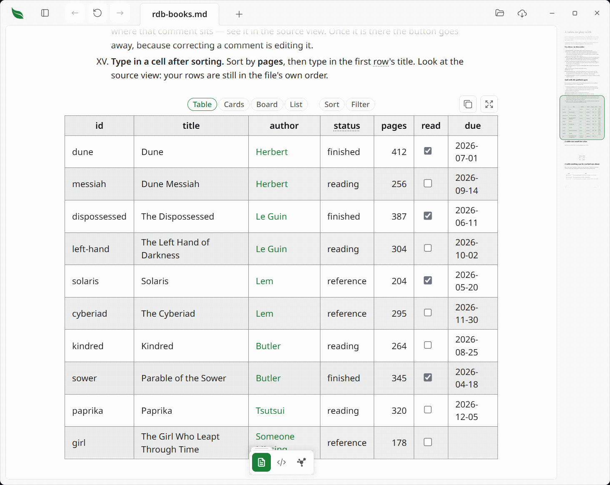
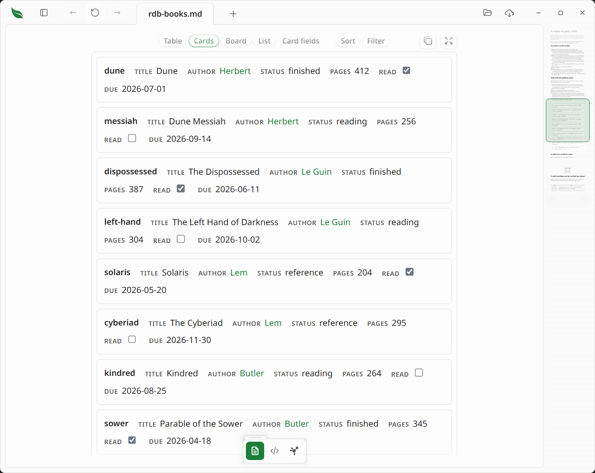
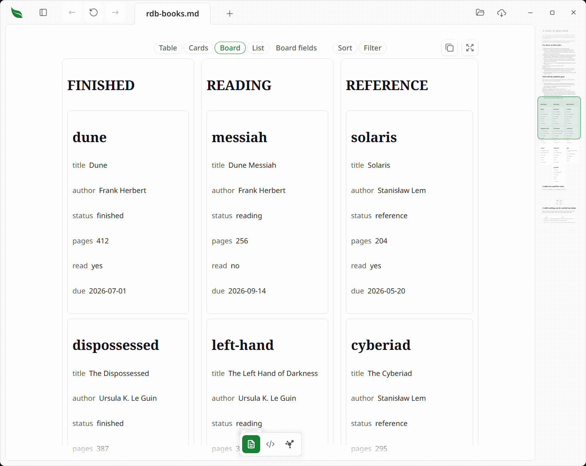

# Relational tables

> Turn an ordinary Markdown table into cards, a board or a linked record view without giving up the file.

Leaftext calls this **RDB**: a [relational table](../GLOSSARY.md#relational-table) view over a Markdown table. The table remains ordinary [GFM](../GLOSSARY.md#gfm), so it opens everywhere it did before. The desktop app adds the view while you read it; it does not move your records into a separate database or create a companion file.

## Open a relational table

Point at a [table](01-rendering.md#tables) with a header row and at least two body rows. A quiet bar appears above it with **Table**, **Cards**, **Board**, **List**, **Sort**, **Filter** and **Describe**. The layout on screen is marked. A smaller table stays an ordinary table.

The view works from the values already in the table. Leaftext recognizes numbers, ISO dates, task checkboxes, short repeated values, lone images and links to another table. A column it cannot recognize stays text.

## Views, sort and filter

**Table** is the Markdown table as written. **Cards** shows one record per card. **Board** groups cards by a short list of values such as a status or stage. **List** shows a record name and one trailing field. The field button beside a view says which columns it is using for as long as the document stays open.

Sorting, filtering and changing the layout only change what is drawn. They write no file, setting or saved view, and reopening the document restores the table as written. Sorting from a cell's right-click menu in [Editing](07-editing.md#editing-a-table) is different: that action deliberately reorders the file.

Sort a column once for ascending order, again for descending order and a third time to restore the file's order. Numbers, ISO dates and task checkboxes sort by their values; other columns sort as words. A filter offers a value list for a short-choice column, a range for a number or date, and words for other columns. More than one filter can apply at once.

## Relations

A Markdown link in a cell can point to a row in another table. For example, `[Le Guin](authors.md#le-guin)` points to the row whose first-column value is `le-guin` in `authors.md`. The link continues to open normally in GitHub, Obsidian and other Markdown readers; Leaftext adds the row lookup when it can read the target.

Point at the relation to see the row it found. A red relation means the target row is not there. A dashed gray relation means the target file is outside the set Leaftext has read, so it may still contain the row.

## Describe a table

You do not have to set up a relational table. If Leaftext guesses a column wrong, press **Describe**. It writes an optional `leaf:table` HTML comment directly above the table with the type, key or relation correction. The comment is hidden in Leaftext, GitHub, Obsidian and VS Code; a malformed comment is ignored rather than partly applied.

## Editing a relational table

Open the [reading-view padlock](07-editing.md#the-padlock) to edit. A date, a value from a short list or a relation can open a picker instead of a caret. Dragging a board card to another column changes that row's grouping cell. Each action writes only the cell that changed and is one Undo step.

The relational view is available in the desktop app. Published and exported pages remain ordinary Markdown tables, because they have no local document set to resolve relations against.
