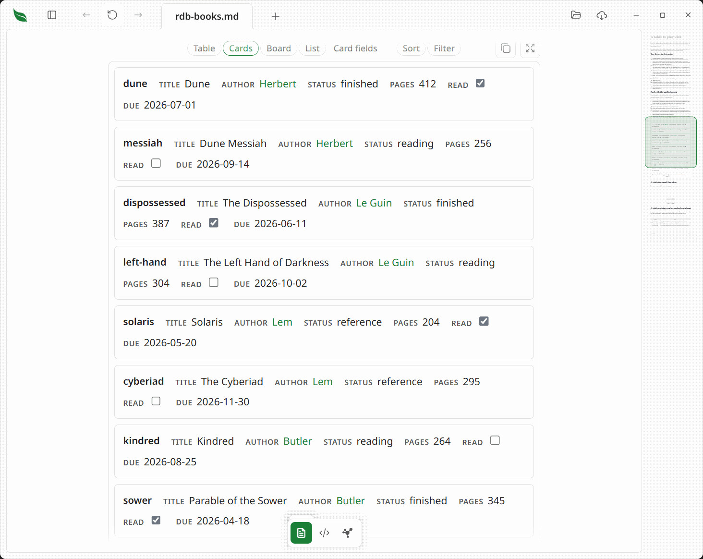
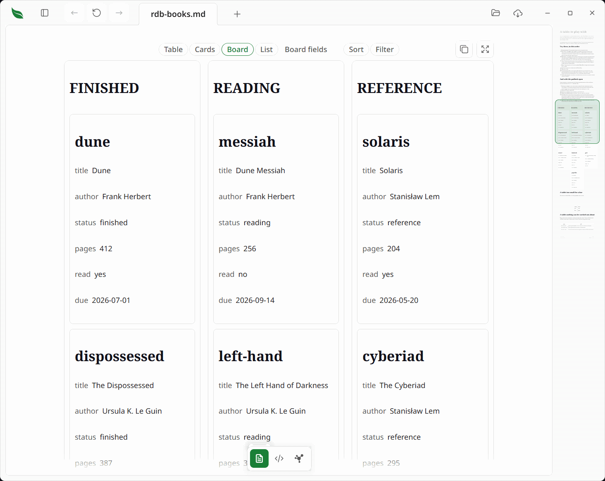

# Relational tables

> Turn an ordinary Markdown table into cards, a board or a linked record view without giving up the file.

Put each row's key in the first column and write a relation as a link to the row with that key in another note, and Leaftext reads the table as linked records.

Leaftext calls this **RDB**: a [relational table](../GLOSSARY.md#relational-table) view over a Markdown table. The table remains ordinary [GFM](../GLOSSARY.md#gfm), so it opens everywhere it did before. Leaftext adds the view while you read it — in the desktop app, on a published Leaftext site and in a document embedded in another product — it does not move your records into a separate database or create a companion file.

## Open a relational table

Point at a [table](01-rendering.md#tables) with a header row and at least two body rows. A quiet bar appears above it with **Table**, **Cards**, **Board**, **List**, **Sort**, **Filter** and **Describe**, centered over the table, and the copy and whole-window buttons at the same bar's right end. The layout on screen is marked. A smaller table stays an ordinary table, with only those two buttons in the bar.

The view works from the values already in the table. Leaftext recognizes numbers, ISO dates, task checkboxes, short repeated values, lone images and links to another table. A column it cannot recognize stays text.

## Views, sort and filter

**Table** is the Markdown table as written. **Cards** shows one record per card. **Board** groups cards by a short list of values such as a status or stage. **List** shows a record name and one trailing field. The field button beside a view says which columns it is using for as long as the document stays open.

A view you set stays set while the document is open, including when the file changes underneath. Editing a cell, dragging a card between board columns, or another program writing the file all redraw the page, and the layout, sort, filters and chosen fields come back with it — with any record that changed drawn as it now reads. Adding or deleting a table above the one you are looking at is the exception: the view is a table's place in the document, so the table you set it on is no longer at that place and it comes back as an ordinary table.

Sorting, filtering and changing the layout only change what is drawn. They write no file, setting or saved view, and reopening the document restores the table as written. Sorting from a cell's right-click menu in [Editing](07-editing.md#editing-a-table) is different: that action deliberately reorders the file.

Sort a column once for ascending order, again for descending order and a third time to restore the file's order. Numbers, ISO dates and task checkboxes sort by their values; other columns sort as words. A filter offers a value list for a short-choice column, a range for a number or date, and words for other columns. More than one filter can apply at once.

## Relations

A Markdown link in a cell can point to a row in another table. For example, `[Le Guin](authors.md#le-guin)` points to the row whose first-column value is `le-guin` in `authors.md`. The link continues to open normally in GitHub, Obsidian and other Markdown readers; Leaftext adds the row lookup when it can read the target.

A relation is labeled by the target row's name. Where the first column is written as words — `| Name | Born |` with `Le Guin | 1929` — the name is that first cell, so the link above reads Le Guin. Where the first column is written as its own address — `| id | Name |` with `le-guin | Ursula K. Le Guin` — the label is the next filled cell, Ursula K. Le Guin. The same name is shown when you point at the relation, offered in a relation cell's picker, and listed in a column that shows which rows point back.

Point at the relation to see the row it found, and press it to open the target file on that row — the first row whose first cell reads as the address, unless a heading of the same name comes first. A red relation means the target row is not there. A dashed gray relation means the target file is outside the set Leaftext has read, so it may still contain the row.

## Describe a table

You do not have to set up a relational table. If Leaftext guesses a column wrong, press **Describe**. It writes an optional `leaf:table` HTML comment directly above the table with the type, key or relation correction. The comment is hidden in Leaftext, GitHub, Obsidian and VS Code; a malformed comment is ignored rather than partly applied.

## Editing a relational table

Open the [reading-view padlock](07-editing.md#the-padlock) to edit. A date, a value from a short list or a relation can open a picker instead of a caret. Dragging a board card to another column changes that row's grouping cell. Each action writes only the cell that changed and is one Undo step.

### Point at a row without typing its address

Press an empty cell in a column that holds only relations or nothing yet. A menu opens under the cell with a search box: type part of a name, and the rows of every table in the vault — or, outside a vault, in the notes around this one — whose name holds those words are listed under the note they come from. Pick one and the cell becomes a link to that row, written relative to this note so it opens anywhere. Press Enter without picking a row to type the words into the cell instead, or Escape to leave it.

To point words that are already written at a row — a cell holding plain words, or a phrase in a paragraph — select them and press the link button on the format bar. Type part of a name instead of an address and the same rows are listed under the box; pick one to link the words to it. An address typed or pasted into the box is written as it always was.

## On a published site and in an embed

The same bar works on a Leaftext site published to the web and on a document embedded in another product: **Table**, **Cards**, **Board**, **List**, **Sort**, **Filter** and **Describe** all do what they do in the desktop app.

A published site resolves relations only among the pages it serves. A link to a row in another page of the site becomes a relation; a link to a page the site does not publish reads as a red relation, because that page is not there. A site reads at most 64 pages for one table, and a relation into a page past that reads as a dashed gray relation rather than a broken one.

An embedded document holds only itself, so it reads no other document: its link columns stay ordinary links, and every other view, sort and filter works as usual.

The search box that lists rows from other notes is the desktop app's: on a site or in an embed the menu offers the rows the column already points into, and typed words filter those.
