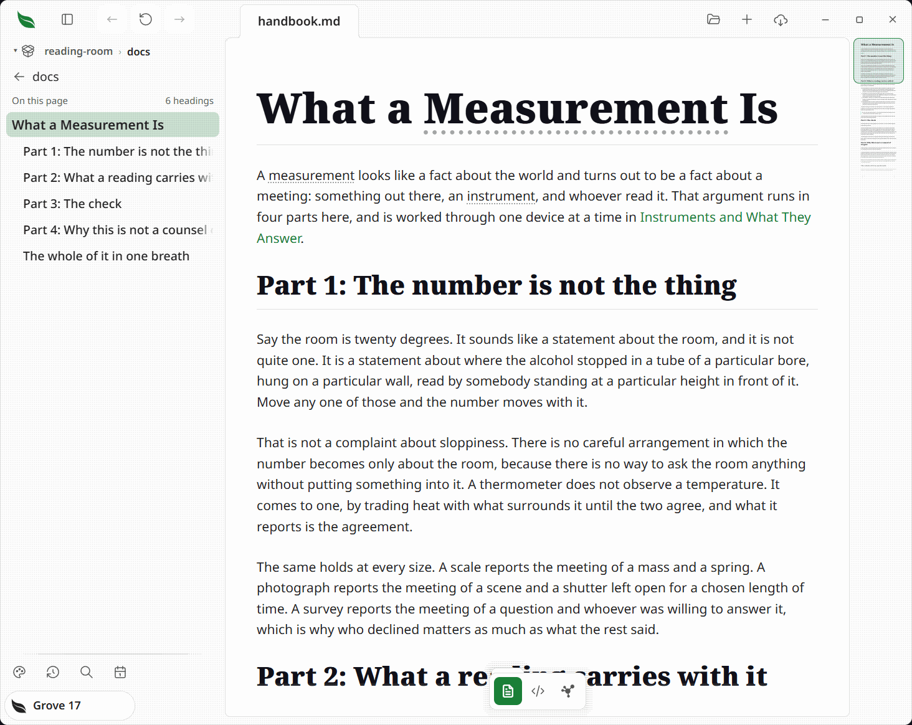

# Your own AI agent in Leaftext

> Connect an agent on your computer to the document open in Leaftext.



Leaftext's installed app can answer an agent through MCP. Keep Leaftext open, add the app as a tool server in your agent's settings, and the agent can read the document, edit and save it, tick tasks, search the active vault, inspect links, export the page, and use the other tools the app offers.

## Connect on Windows

Replace `YOUR_NAME` with your Windows account folder name and add this server to your agent's MCP settings:

```json
{
  "mcpServers": {
    "leaftext": {
      "command": "C:\\Users\\YOUR_NAME\\AppData\\Local\\Programs\\leaftext\\bin\\leaftext.exe",
      "args": ["--mcp"]
    }
  }
}
```

## Connect on a Mac

Add this server to your agent's MCP settings:

```json
{
  "mcpServers": {
    "leaftext": {
      "command": "/Applications/leaftext.app/Contents/MacOS/leaftext",
      "args": ["--mcp"]
    }
  }
}
```

Your agent's settings decide which calls need your approval. Leaftext offers every tool to the agent and shows no approval box of its own. The `leaftext_eval` tool runs any JavaScript inside Leaftext's page, so give an agent access to it only when you trust that agent with the open document and app.

## Work on a document

Ask the agent to use `leaftext_doc` to read a file in Leaftext. It opens that file in the window and answers its text, task list, and fingerprint. To edit, the agent sends that fingerprint with `leaftext_edit`, waits for the page with `leaftext_idle`, then uses `leaftext_save` to write the file. To tick a checkbox, it uses `leaftext_toggle_task` with the task's place in the list; that action writes the file immediately.

The tools reach the Leaftext copy running under your account. If it is closed, the agent gets a clear answer that Leaftext is not running.
