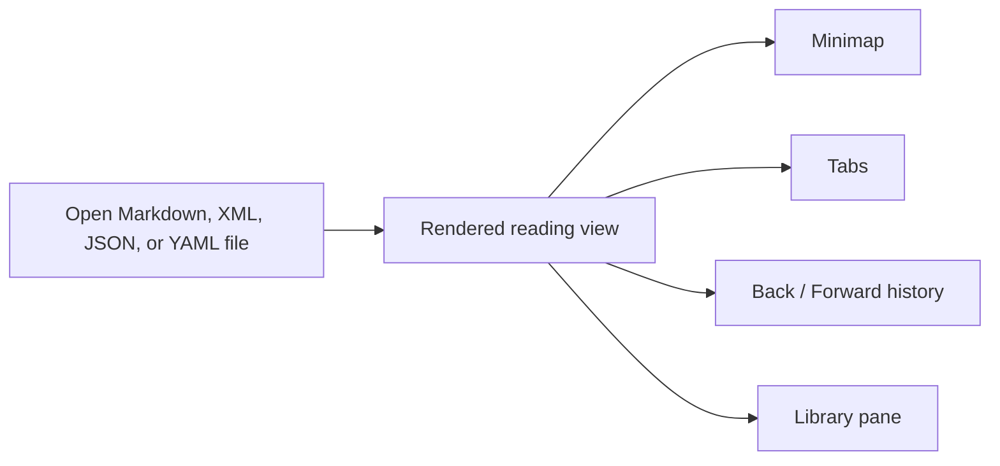

# Meet Leaf Text

> Refine your mind. Your thoughts, secure and free — a free desktop app for reading and writing your own documents, on your own machine.

Leaf Text turns the files you already have into pages you actually want to read. Open a Markdown, [XML](01-features/01-rendering.md#xml), [JSON, or YAML](01-features/01-rendering.md#data-files-json-and-yaml) document on macOS or Windows and it renders clean and calm. Keep your place with [tabs](01-features/02-navigation.md#tabs), [history](01-features/02-navigation.md#history), a [minimap](01-features/04-minimap.md), and a searchable [library](01-features/03-library.md). When something needs changing, [click into the sentence and type](01-features/07-editing.md#inline-editing-the-reading-view) — or drop to the raw source in the [code view](01-features/07-editing.md#code-view) — then [save](01-features/07-editing.md#save) when you're ready.

**Your thoughts stay yours.** No account, no cloud, no telemetry. Your documents never leave your device, and they stay plain Markdown, XML, JSON, and YAML that any other app can open, so you're never locked in.

New to the terms? Words like [minimap](GLOSSARY.md#minimap) and [frontmatter](GLOSSARY.md#frontmatter) link into the [glossary](GLOSSARY.md#glossary) — clicking one opens its entry in a [bottom sheet](GLOSSARY.md#bottom-sheet) over this page instead of taking you away from it.

## Overview

| You want to... | Start here |
| --- | --- |
| Install the app | [Installation](02-installation.md) |
| Open your first file | [Quickstart](03-quickstart.md) |
| Check rendering support | [Rendering](01-features/01-rendering.md) |
| Change the look | [Themes](01-features/06-themes.md) |
| Learn the app model | [Navigation](01-features/02-navigation.md) |

## What you can do

- Read Markdown and [XML](01-features/01-rendering.md#xml) without opening an editor — [sitemaps, feeds, and config files](01-features/01-rendering.md#any-xml) as readable pages, [84000 TEI translations](01-features/01-rendering.md#tei-xml-84000-translations) as translations.
- Read [JSON and YAML](01-features/01-rendering.md#data-files-json-and-yaml) as pages too — a lock file, a CI workflow, or a Kubernetes manifest as headed sections, aligned fields, and record tables instead of punctuation.
- See [CommonMark, GFM](01-features/01-rendering.md), [diagrams](01-features/01-rendering.md#mermaid-diagrams), [math](01-features/01-rendering.md#math), [callouts](01-features/01-rendering.md#blockquotes-and-alerts), [footnotes](01-features/01-rendering.md#footnotes), [emoji](01-features/01-rendering.md#emoji), and your own images, rendered the way GitHub renders them.
- Keep several documents open at once in [tabs](01-features/02-navigation.md#tabs).
- Jump to any section from the [outline](01-features/02-navigation.md#outline) at the top of each document.
- Move [back and forward](01-features/02-navigation.md#history) through documents and in-page jumps, like a browser.
- Find anything you've written in the [library pane](01-features/03-library.md), or see how it connects in the [graph view](01-features/03-library.md#graph).
- Edit a file in another app and Leaf Text [picks up the change](01-features/02-navigation.md#reload) without losing your place.
- [Write where you read](01-features/07-editing.md#inline-editing-the-reading-view): click into a sentence and type, split and merge blocks with `Enter` and `Backspace`, tick checkboxes, and [undo](01-features/07-editing.md#undo) step by step.
- Switch any document to its raw source in the [code view](01-features/07-editing.md#code-view) — highlighted, line-numbered, editable — and [save](01-features/07-editing.md#save) only when you say so.
- Turn on [Speed Reader](01-features/05-settings.md#speed-reader) to dim the page back and mark each word's start, so your eye follows the reading path down.

## Layout



## Example

~~~md
# Release Notes

> [!TIP]
> Drag this file into Leaf Text.

- [x] Ship docs refresh
- [ ] Review screenshots

```ts
console.log("Hello from Leaf Text");
```
~~~

That file opens as a formatted document, not as source code in an editor.

## Next

- [Quickstart](03-quickstart.md) shows the actual reading flow.
- [Rendering](01-features/01-rendering.md) shows what Markdown syntax, XML structure, and JSON/YAML shapes the app renders.
- [Library](01-features/03-library.md) explains [vaults](01-features/03-library.md#vaults), search, the [graph](01-features/03-library.md#graph), and [GitHub sync](01-features/03-library.md#github-sync).
