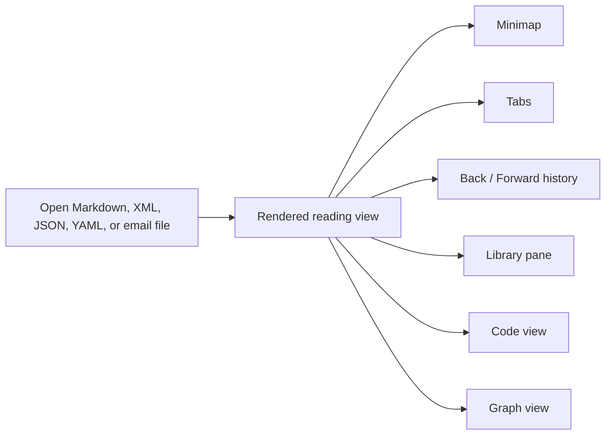

# Meet Leaftext

> Refine your mind. Your thoughts, secure and free — a free desktop app for reading and writing your own documents, on your own machine.


Leaftext turns the files you already have into pages you actually want to read. Open a Markdown, [XML](01-features/01-rendering.md#xml), [JSON, or YAML](01-features/01-rendering.md#data-files-json-and-yaml) document — or a [saved email](01-features/01-rendering.md#email-eml) — on macOS or Windows and it renders clean and calm. Keep your place with [tabs](01-features/02-navigation.md#tabs), [history](01-features/02-navigation.md#history), a [minimap](01-features/04-minimap.md), and a searchable [library](01-features/03-library.md). When something needs changing, [click into the sentence and type](01-features/07-editing.md#inline-editing-the-reading-view) — or drop to the raw source in the [code view](01-features/07-editing.md#code-view) — then [save](01-features/07-editing.md#save) when you're ready.

**Your thoughts stay yours.** No account, no cloud, no telemetry. Your documents never leave your device, and they stay plain Markdown, XML, JSON, YAML, and email files that any other app can open, so you're never locked in.

New to the terms? Words like [minimap](GLOSSARY.md#minimap) and [frontmatter](GLOSSARY.md#frontmatter) link into the [glossary](GLOSSARY.md#glossary) — clicking one opens its entry in a [bottom sheet](GLOSSARY.md#bottom-sheet) over this page instead of taking you away from it. The glossary carries one entry per feature and subfeature, so it doubles as an index of the whole app.

## Where to go

| You want to... | Start here |
| --- | --- |
| Install the app | [Installation](02-installation.md#install) |
| Get past the Mac first-launch block | [Mac blocks the first launch](02-installation.md#mac-blocks-the-first-launch) |
| Open your first file | [Quickstart](03-quickstart.md) |
| Check rendering support | [Rendering](01-features/01-rendering.md#summary) |
| Learn the keyboard shortcuts | [Navigation → Shortcuts](01-features/02-navigation.md#shortcuts) |
| Search your notes | [Library → Search](01-features/03-library.md#search) |
| Write in the page | [Editing](01-features/07-editing.md) |
| Change the look | [Themes](01-features/06-themes.md) |
| Look a word up | [Glossary](GLOSSARY.md) |

## What you can do

### Read

- Read Markdown as GitHub renders it — [CommonMark and GFM](01-features/01-rendering.md), [highlighted code](01-features/01-rendering.md#code), [diagrams](01-features/01-rendering.md#mermaid-diagrams), [math](01-features/01-rendering.md#math), [callouts](01-features/01-rendering.md#blockquotes-and-alerts), [footnotes](01-features/01-rendering.md#footnotes), [emoji](01-features/01-rendering.md#emoji), and your own [images](01-features/01-rendering.md#images).
- Read [XML](01-features/01-rendering.md#xml) without opening an editor — [sitemaps, feeds, and config files](01-features/01-rendering.md#any-xml) as readable pages, [84000 TEI translations](01-features/01-rendering.md#tei-xml-84000-translations) as translations.
- Read [JSON and YAML](01-features/01-rendering.md#data-files-json-and-yaml) as pages too — a lock file, a CI workflow, or a Kubernetes manifest as headed sections, aligned fields, and record tables instead of punctuation.
- Open a [saved email](01-features/01-rendering.md#email-eml) (`.eml` from Gmail, Outlook, or Apple Mail) as the message it carries — headers, body, inline images, and attachments — instead of a wall of base64.
- Turn on [Speed Reader](01-features/05-settings.md#speed-reader) to dim the page back and mark each word's start, so your eye follows the reading path down.

### Move around

- Keep several documents open at once in [tabs](01-features/02-navigation.md#tabs).
- Jump to any section from the [outline](01-features/02-navigation.md#outline) at the top of each document, or from the [minimap](01-features/04-minimap.md) rail beside it.
- Move [back and forward](01-features/02-navigation.md#history) through documents and in-page jumps, like a browser.
- Read a folder in order with the [pager](01-features/02-navigation.md#pager) at the foot of each page.
- Hover a link for a [hint](01-features/02-navigation.md#link-hints) saying what kind it is, where it goes, and how long that document is.
- Define a word once in a [glossary](01-features/02-navigation.md#glossary) and every mention of it, in every document, opens the entry in a sheet over the page.
- Edit a file in another app and Leaftext [picks up the change](01-features/02-navigation.md#reload) without losing your place.

### Find

- Point Leaftext at a folder to make it a [vault](01-features/03-library.md#vaults) — the unit search, syncing, and the graph work over.
- Browse it a folder at a time in the [library pane](01-features/03-library.md#file-tree), with a breadcrumb that always says where you are.
- [Search](01-features/03-library.md#search) names and contents across the vault, with snippets. No index on disk, and nothing uploaded.
- See how it all connects in the [graph view](01-features/03-library.md#graph) — documents, the links between them, and the web addresses they cite.
- Push a vault to GitHub with [sync](01-features/03-library.md#github-sync), using the `git` already on your machine.

### Write

- [Write where you read](01-features/07-editing.md#inline-editing-the-reading-view): click into a sentence and type, split and merge blocks with `Enter` and `Backspace`, tick checkboxes, and [undo and redo](01-features/07-editing.md#undo) step by step.
- Restructure without leaving the page: drag a block by its handle in the [margin](01-features/07-editing.md#the-block-gutter), [add one](01-features/07-editing.md#adding-a-block) on the empty line below, and highlight words for a [format bar](01-features/07-editing.md#the-format-bar).
- Draw a flowchart instead of typing one in the [flowchart editor](01-features/07-editing.md#the-flowchart-editor) — a canvas beside the Mermaid text, both kept in step — open any diagram already in a page the same way, and [export](01-features/07-editing.md#export) one as its own Markdown file or picture.
- Switch any document to its raw source in the [code view](01-features/07-editing.md#code-view) — highlighted, line-numbered, editable — and [save](01-features/07-editing.md#save) only when you say so.
- Get [typing help](01-features/07-editing.md#typing-help) while you write there: Monaco's IntelliSense, answered from your own notes — `[[` completes a note name, `#` a heading, and a broken link is underlined.
- Start from nothing with the **+** in the app bar: a [new document](01-features/07-editing.md#new-document) opens ready to type, and its first save is where you choose the file.

### Make it yours

- Pick one of [eleven themes](01-features/06-themes.md#families), each in light and dark, plus System and Daylight. See them all first at [**leaftext.com/gallery.html**](https://leaftext.com/gallery.html) — every theme, color, icon and part of the interface on one page, with a switcher for the family and for light or dark.
- Everything moves together — text, code, callouts, [diagrams](01-features/06-themes.md#diagrams), minimap — because every theme fills the same [token contract](01-features/06-themes.md#tokens).
- Turn the [minimap](01-features/05-settings.md#minimap), the [pager](01-features/05-settings.md#pager), and [typing help](01-features/05-settings.md#typing-help) on or off; all of it saves to a [JSON file](01-features/05-settings.md#files) you can read.

## Layout



## Example

~~~md
# Release Notes

> [!TIP]
> Drag this file into Leaftext.

- [x] Ship docs refresh
- [ ] Review screenshots

```ts
console.log("Hello from Leaftext");
```
~~~

That file opens as a formatted document, not as source code in an editor.

## Next

- [Installation](02-installation.md) if you have not got it yet.
- [Quickstart](03-quickstart.md) shows the actual reading flow.
- [Rendering](01-features/01-rendering.md) shows what Markdown syntax, XML structure, JSON/YAML shapes, and [email files](01-features/01-rendering.md#email-eml) the app renders.
- [Library](01-features/03-library.md) explains [vaults](01-features/03-library.md#vaults), search, the [graph](01-features/03-library.md#graph), and [GitHub sync](01-features/03-library.md#github-sync).
