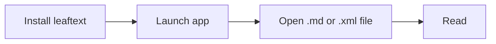

# Installation

> Download the build for your platform from GitHub Releases, install it, and open a Markdown or XML file.

leaftext ships prebuilt binaries for macOS, Windows, and Linux. There is no account, no plugin setup, and no extra runtime to configure first.

## Platforms

| Platform | Package | Notes |
| --- | --- | --- |
| macOS | `.dmg` | Universal (Apple Silicon + Intel) |
| Windows | `.msi` | Windows 10+ 64-bit |
| Linux | `.tar.gz` | Extract and run the binary inside |

Download the latest build from [GitHub Releases](https://github.com/ryanallen/leaftext/releases).

## Install

### macOS

1. Download the latest `.dmg`.
2. Open it.
3. Drag `leaftext.app` into `Applications`.
4. Eject the DMG.

If macOS blocks the first launch because the app is from an unidentified developer:

```sh
xattr -cr /Applications/leaftext.app
```

> [!TIP]
> You only need to run that command once per installed app bundle.

### Windows

1. Download the latest `.msi`.
2. Run the installer. It shows one screen: the install folder, with **Change...** to pick another. Click **Install** and approve the Windows elevation prompt.
3. Launch leaftext from the Start Menu.

Default installed path:

```text
C:\Program Files\leaftext\bin\leaftext.exe
```

WebView2 data lives here:

```text
%LOCALAPPDATA%\ryanallen\leaftext\data\webview2
```

That keeps runtime data writable without needing admin rights after install.

### Linux

1. Download the `.tar.gz` build.
2. Extract it.
3. Run the binary inside.

```sh
tar -xzf leaftext-*-linux-x86_64.tar.gz
cd leaftext-*-linux-x86_64
./leaftext
```

> [!NOTE]
> leaftext uses WebKitGTK on Linux. If the app does not launch, check that your system has a compatible WebKitGTK runtime installed.

## Launch



Use `Ctrl+O` on Windows/Linux or `Cmd+O` on macOS to open your first file.

## Updates

leaftext checks GitHub Releases for a newer version each time it launches. When one is available, a dot appears over the Settings button and a green **Update to v…** button appears at the top of the [Settings](01-features/05-settings.md) menu; clicking it opens that release's page so you can download the new build. The check is silent and skipped when offline, and it never blocks startup.

## FAQ

### Admin rights

No for normal use. On Windows, app data lives under your user profile — `%APPDATA%\ryanallen\leaftext` for settings and recent files, `%LOCALAPPDATA%\ryanallen\leaftext` for the WebView2 cache and the library index — not beside the executable in `Program Files`.

### Data paths

See [Settings](01-features/05-settings.md#paths).

### Next

Go to [Quickstart](03-quickstart.md).
