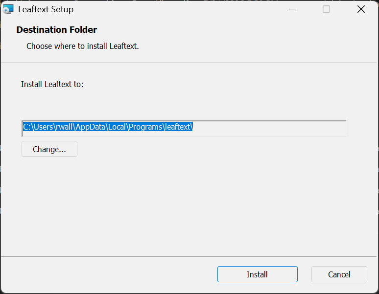
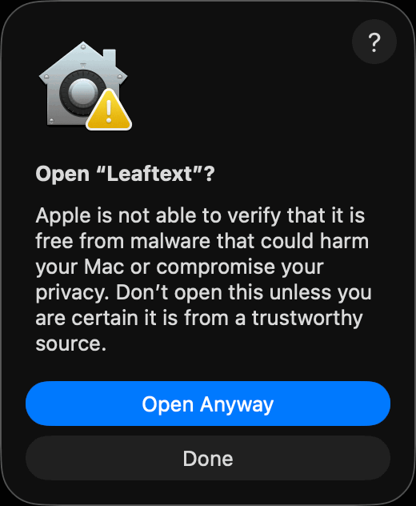
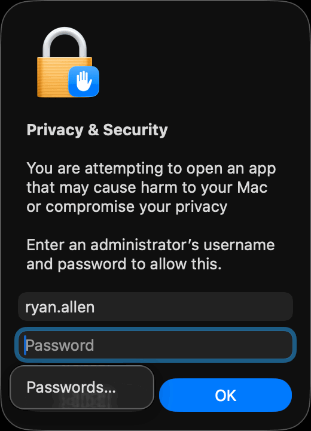
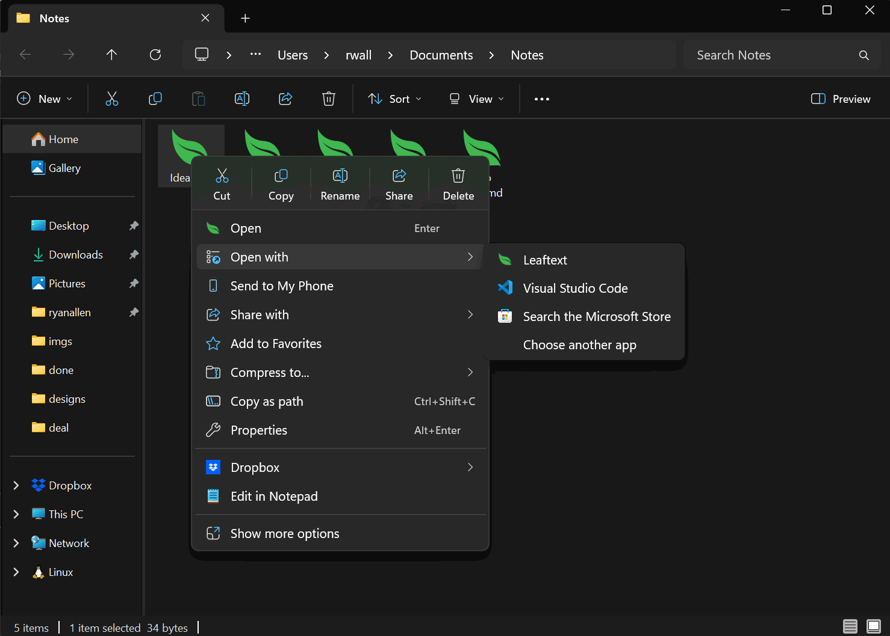

# Installation

> Download the installer for your platform, run it, and open a Markdown, HTML, XML, JSON, YAML, or email file.

Leaftext is free, and it ships ready to run on macOS and Windows. There's no account to create, no plugins to pick, and no runtime to install first — download it, open it, and it works.

The one snag is the same one every small app hits: neither Apple nor Microsoft has been paid to vouch for it, so each one warns you the first time. Both warnings are cleared in a few clicks, once — [macOS](#mac-blocks-the-first-launch), [Windows](#windows-warns-before-it-runs).

## Platforms

| Platform | Package | Notes |
| --- | --- | --- |
| macOS | `.dmg` | Universal (Apple Silicon + Intel). First launch [needs unblocking](#mac-blocks-the-first-launch) |
| Windows | `.exe` | Windows 10+ 64-bit. Installer [may warn once](#windows-warns-before-it-runs) |
| Windows | `.msi` | The same install, for a machine where you would rather Windows itself managed it |

Every file on the release page is an installer you can run — no checksums, nothing published for the updater alone. Take the `.exe` on Windows: it is the file the front page hands out, and it is the one no machine's policy refuses. The `.msi` is the same install managed by Windows Installer, which [some machines are set to block](#windows-refuses-the-msi). The [in-app updater](#updates) then keeps taking whichever file put Leaftext on the machine, so there is nothing to choose twice.

**[Download for Windows →](https://github.com/ryanallen/leaftext/releases/latest/download/leaftext-windows-x86_64.exe)** · **[Download for macOS →](https://github.com/ryanallen/leaftext/releases/latest/download/leaftext-macos-universal.dmg)** — then follow the steps for your platform below.

## Install

### macOS


**1. Download** the file ending in `-macos-universal.dmg` — **[the disk image →](https://github.com/ryanallen/leaftext/releases/latest/download/leaftext-macos-universal.dmg)**. One file covers both Apple Silicon and Intel Macs.

**2. Open the downloaded file.** A window opens showing the leaf app on one side and an **Applications** folder on the other.

**3. Drag the app onto Applications.** That is the install.

**4. Eject the disk image** — click the ⏏ beside its name in the Finder sidebar. You can delete the `.dmg` afterwards.

**5. Open Leaftext** from Applications or Launchpad. **The first launch will be refused** — that is expected, and clearing it takes five short steps. See [Mac blocks the first launch](#mac-blocks-the-first-launch).

### Windows



**1. Download** the file ending in `.exe` — **[the installer →](https://github.com/ryanallen/leaftext/releases/latest/download/leaftext-windows-x86_64.exe)**. It needs 64-bit Windows 10 or later. If you would rather Windows itself managed the install, take **[the `.msi` →](https://github.com/ryanallen/leaftext/releases/latest/download/leaftext-windows-x86_64.msi)** instead; both lay down exactly the same thing.

**2. Run the installer.** If a full-screen **Windows protected your PC** box appears, click **More info** → **Run anyway** — see [Windows warns before it runs](#windows-warns-before-it-runs). If you took the `.msi` and a small box says **the system administrator has set policies to prevent this installation**, take the `.exe` — see [Windows refuses the MSI](#windows-refuses-the-msi).

**3. Click Install.** The installer shows one screen: the install folder, with **Change...** to pick another. There is no elevation prompt and no confirmation screen — Leaftext installs for the current user, and when it is done the setup window closes and **Leaftext opens in its place**. The `.exe` installer draws the same single screen, in the same place, with the same two buttons, and opens the app the same way.

**4. Every launch after that** is the Start Menu entry, or the Windows key and the app's name.

## The first-launch warnings

Both platforms warn once, for the same reason, and neither warning is about what is in the file.

### Mac blocks the first launch


macOS refuses the first launch and says it "cannot be opened" or that Apple "could not verify it is free of malware". **This is expected and it is not a report of anything found in the app.** Apple charges a yearly developer fee to have an app *notarized*; Leaftext is free and is not enrolled, so macOS treats it the way it treats everything unnotarized. Nothing was scanned and nothing was flagged.

Let it through once and it opens normally forever after. Either route works.

**The easy way — no Terminal**

1. Double-click **Leaftext** in Applications. macOS refuses. Click **Done** (or **Cancel**).
2. Open **System Settings** → **Privacy & Security**.
3. Scroll to the **Security** section near the bottom. A line names Leaftext as blocked, with an **Open Anyway** button. Click it.



4. A box asks **Open "Leaftext"?** and repeats the warning. Click **Open Anyway**.



5. Enter an administrator name and password — or use Touch ID if your Mac offers it — and click **OK**.

Leaftext opens, and every launch after this one is a normal double-click.

> [!TIP]
> On macOS 12 and earlier the same thing is one step: right-click (or Control-click) the app in Applications, choose **Open**, then **Open** again in the box that appears.

**The Terminal way**

If the button is not there, open Terminal (press `Cmd+Space`, type `Terminal`, press Return), paste this line, and press Return:

```sh
xattr -cr /Applications/leaftext.app
```

That removes the "downloaded from the internet" tag macOS attaches to the file. Then open the app normally.

> [!TIP]
> Either way, you only do this once per installed app bundle.

### Windows warns before it runs


Windows may show a full-screen **Windows protected your PC** box the first time you run the installer, because neither Windows file is signed with a paid certificate. Click **More info**, then **Run anyway**. Your browser may also make you keep the download — choose **Keep** if it asks. Browsers press harder on an unsigned `.exe` than on an `.msi`, so expect one more click if you take that one; it is the same warning about the same missing certificate.

### Windows refuses the MSI

Some managed machines are set to refuse Windows Installer packages outright. The box is small, comes from **Windows Installer** rather than from Leaftext, and says **the system administrator has set policies to prevent this installation**. It appears before the installer's own screen, and no certificate would change it: the refusal is about the kind of file, not about who made it.

**[Download the file ending in `.exe` →](https://github.com/ryanallen/leaftext/releases/latest/download/leaftext-windows-x86_64.exe)** instead. It installs Leaftext the same way into the same folder, with the same Start Menu entry and the same file associations, and it never touches Windows Installer. From there everything below is identical, updates included.

If that file is refused too, the machine is enforcing a different rule again — one about unsigned programs — and only whoever manages it can allow it through.

## Where it goes

Leaftext installs into your user profile on both platforms, which is what lets it update itself without ever asking for administrator rights.

| Platform | The app | Its data |
| --- | --- | --- |
| macOS | `/Applications/leaftext.app` | `~/Library/Application Support/com.ryanallen.leaftext` |
| Windows | `%LOCALAPPDATA%\Programs\leaftext\bin\leaftext.exe` | `%APPDATA%\ryanallen\leaftext\config` and `%LOCALAPPDATA%\ryanallen\leaftext\data` |

On Windows, **Change...** during the install puts the app wherever you like, and later updates keep it there. The WebView2 browser data sits under the data folder:

```text
%LOCALAPPDATA%\ryanallen\leaftext\data\webview2
```

The data folders are independent of where the app is installed, so reinstalling or moving it keeps your settings, [recent files](01-features/02-navigation.md#recent-files), and [vaults](01-features/03-library.md#vaults). The full per-platform list is in [Settings → Paths](01-features/05-settings.md#paths).

> [!NOTE]
> The installer adds one Start Menu entry and no desktop shortcut. Drag it to the desktop or taskbar if you want it there too.

> [!IMPORTANT]
> **Upgrading from v0.1.364 or earlier: uninstall the old version first.** Those installed into `C:\Program Files` for the whole machine, and a per-user package has no authority to remove one. Install the new version without doing so and you will have two copies. Uninstall from **Settings → Apps**, then install.

## File associations



Installing registers Leaftext as a handler for every extension it reads — `.md`, `.markdown`, `.mdown`, `.mdc`, `.html`, `.htm`, `.xml`, `.json`, `.yaml`, `.yml`, `.eml`, `.mht`, and `.mhtml` — so those files carry the leaf icon and appear under **Open with**. On Windows the entries are per-user (`HKCU`), like the install itself. HTML remains assigned to the browser unless you choose Leaftext.

An extension no app has claimed opens in Leaftext on its own. One that already has a default app keeps it — neither installer overrides a choice you or another app made, so `.json` stays with your editor and `.eml` with your mail app until you say otherwise. To switch:

- **Windows** — right-click a file, **Open with** → **Choose another app** → **Leaftext** → *Always use this app*. Or **Settings** → **Apps** → **Default apps** → **Leaftext**.
- **macOS** — select a file, **Get Info** → **Open with** → **Leaftext** → **Change All…**

Double-clicking a file while Leaftext is already open adds it as a [tab](01-features/02-navigation.md#tabs) in the running window rather than starting a second copy.

> [!NOTE]
> Explorer and Finder cache icons. A newly registered icon sometimes only appears after the shell refreshes — signing out and back in is the reliable way to force it.

## Launch


Use `Ctrl+O` on Windows or `Cmd+O` on macOS to open your first file. The [Quickstart](03-quickstart.md) takes it from there.

## Updates


Leaftext checks GitHub Releases for a newer version at every launch, and re-checks in the background at most every six hours while the window stays open. When one is available, **a bell appears in the app bar** — it is not there otherwise, so its presence is the whole message. Clicking it drops a panel holding one button, and nothing else.

The new installer downloads in the background; a download that arrives short or oversized is discarded rather than kept. While it runs, the bell wears a spinning ring and the button shows a spinner and its percentage. Once the installer is staged and verified the ring becomes a green dot and the button reads **Restart to update**.

**Then quit and reopen, and you are on the new version.** The install happens at launch, before any window opens, because Windows cannot replace a running executable — the app hands off to a detached helper that waits for it to exit, installs, and starts the new build. On macOS that means mounting the disk image, copying the bundle out, and swapping it in. Nothing is prompted for, and nothing interrupts you mid-read. **Restart to update** remains on the button for anyone who would rather not wait for the next launch.

**An update brings the app back by itself, the way the install opens it** — you never install and then go looking for Leaftext, and one window comes back, never two.

Each version is installed automatically once. If an install fails, that version then waits for a deliberate click instead of being retried forever. There is no setting for any of this: staying current is what the app does.

**On Windows, updates arrive as whichever file you installed from.** A copy installed from the `.msi` keeps taking `.msi` updates, and a copy installed from the `.exe` keeps taking `.exe` ones — decided when it was installed, not by a preference. So a machine that refuses Windows Installer packages is never handed one.

**The app only speaks when it can act.** A check that found nothing, could not reach GitHub, was rate-limited, or found a release carrying no installer for your platform says nothing at all — the bell stays away. There is nothing you could do about any of those, and a panel reporting them read as the app asking for work it should be doing itself. Startup is never blocked by any of this, and being offline changes nothing you can see. The version you are running is at the foot of the [home screen](03-quickstart.md).

## Uninstall

- **macOS** — drag `leaftext.app` from Applications to the Trash. Your documents are untouched; the app's own data stays in `~/Library/Application Support/com.ryanallen.leaftext` until you delete that folder too.
- **Windows** — **Settings** → **Apps** → **Leaftext** → **Uninstall**. Same story: your files and folders are yours, and only the app is removed. Both Windows installers put Leaftext in that list and both are removed from there.

Nothing you wrote is inside Leaftext. Every document is the plain file you already had, in the folder you put it in.

## FAQ

### Is the warning a virus alert

No. Both warnings are about *who paid whom*, not about what is in the file. macOS and Windows check whether an app carries a certificate from a paid developer program; Leaftext is free and carries none, so both systems say they cannot vouch for it. Nothing was scanned, and nothing was found. Clearing it takes a few clicks, once — [macOS](#mac-blocks-the-first-launch), [Windows](#windows-warns-before-it-runs).

### Does it need administrator rights

No, never. Leaftext installs into your user profile and runs from there, so neither installing nor updating needs administrator rights. See [Where it goes](#where-it-goes).

### Does it need an internet connection

Only for two things, neither of which carries your words: checking GitHub for a newer version, and fetching a [theme's font](01-features/06-themes.md#fonts) from Google Fonts the first time you pick that theme. Reading, writing, searching, and diagrams all work offline.

### Where are my settings stored

See [Settings → Paths](01-features/05-settings.md#paths).

### Can I install it on Linux

No. Leaftext builds for macOS and Windows only.

## Next

- [Quickstart](03-quickstart.md) — open your first file.
- [Settings](01-features/05-settings.md) — every preference and where it lives.
