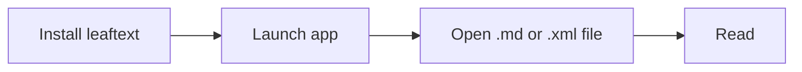

# Installation

> Download the build for your platform from GitHub Releases, install it, and open a Markdown or XML file.

leaftext ships prebuilt binaries for macOS and Windows. There is no account, no plugin setup, and no extra runtime to configure first.

## Platforms

| Platform | Package | Notes |
| --- | --- | --- |
| macOS | `.dmg` | Universal (Apple Silicon + Intel) |
| Windows | `.msi` | Windows 10+ 64-bit |

Each release also carries a `.blake3` checksum beside every download, and a `.app.zip` of the macOS bundle. Those are what the [in-app updater](#updates) fetches and verifies; installing by hand needs only the `.dmg` or `.msi`.

Download the latest build from [GitHub Releases](https://github.com/ryanallen/leaftext/releases).

## Install

### macOS

1. Download the latest `.dmg`.
2. Open it.
3. Drag `leaftext.app` into `Applications`.
4. Eject the DMG.

If macOS blocks the first launch because the app is from an unidentified developer:

```sh
xattr -cr /Applications/leaftext.app
```

> [!TIP]
> You only need to run that command once per installed app bundle.

### Windows

1. Download the latest `.msi`.
2. Run the installer. It shows one screen: the install folder, with **Change...** to pick another. Click **Install** and approve the Windows elevation prompt. There is no confirmation screen — the window closes once the install finishes.
3. Launch `leaftext.exe` from the install folder, or open any `.md` file with it.

Default installed path:

```text
C:\Program Files\leaftext\bin\leaftext.exe
```

WebView2 data lives here:

```text
%LOCALAPPDATA%\ryanallen\leaftext\data\webview2
```

That keeps runtime data writable without needing admin rights after install.

> [!NOTE]
> The installer adds no Start Menu entry and no desktop shortcut. Pin `leaftext.exe` yourself if you want one.

> [!IMPORTANT]
> v0.1.363 briefly installed into `%LOCALAPPDATA%\Programs\leaftext` instead. That was withdrawn. If you installed it, a later version removes that copy for you automatically, with nothing to approve.

## Launch



Use `Ctrl+O` on Windows or `Cmd+O` on macOS to open your first file.

## Updates

leaftext checks GitHub Releases for a newer version, at most once every six hours. When one is available, a dot appears over the Settings button and a button appears at the top of the [Settings](01-features/05-settings.md#updates) menu.

With **Download updates** on (the default), the new installer downloads in the background and is checked against the `.blake3` digest published with the release; a download that does not match is discarded. The button then reads **Restart to update**, and clicking it closes leaftext, installs, and reopens it.

Nothing installs on its own. The download is automatic; the install is always a button you press. Turning **Download updates** off keeps the check but nothing is fetched — the button just opens the release page, and you install by hand.

The check is silent and skipped when offline, and it never blocks startup.

## FAQ

### Admin rights

No for normal use. On Windows, app data lives under your user profile — `%APPDATA%\ryanallen\leaftext` for settings and recent files, `%LOCALAPPDATA%\ryanallen\leaftext` for the WebView2 cache and the library index — not beside the executable in `Program Files`.

### Data paths

See [Settings](01-features/05-settings.md#paths).

### Next

Go to [Quickstart](03-quickstart.md).
