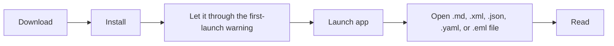

# Installation

> Download the build for your platform from GitHub Releases, install it, and open a Markdown, XML, JSON, YAML, or email file.

Leaftext is free, and it ships ready to run on macOS and Windows. There's no account to create, no plugins to pick, and no runtime to install first — download it, open it, and it works.

The one snag is the same one every small app hits: neither Apple nor Microsoft has been paid to vouch for it, so each one warns you the first time. Both warnings are cleared in a few clicks, once — [macOS](#mac-blocks-the-first-launch), [Windows](#windows-warns-before-it-runs).

## Platforms

| Platform | Package | Notes |
| --- | --- | --- |
| macOS | `.dmg` | Universal (Apple Silicon + Intel). First launch [needs unblocking](#mac-blocks-the-first-launch) |
| Windows | `.msi` | Windows 10+ 64-bit. Installer [may warn once](#windows-warns-before-it-runs) |

A release is those two files and nothing else. The [in-app updater](#updates) installs the same `.dmg` or `.msi` you would download by hand, so there is never a file on the release page whose purpose has to be explained.

**[Download the latest release →](https://github.com/ryanallen/leaftext/releases/latest)** — then follow the steps for your platform below.

## Install

### macOS

**1. Download** the file ending in `-macos-universal.dmg` from the [latest release](https://github.com/ryanallen/leaftext/releases/latest). One file covers both Apple Silicon and Intel Macs.

**2. Open the downloaded file.** A window opens showing the leaf app on one side and an **Applications** folder on the other.

**3. Drag the app onto Applications.** That is the install.

**4. Eject the disk image** — click the ⏏ beside its name in the Finder sidebar. You can delete the `.dmg` afterwards.

**5. Open Leaftext** from Applications or Launchpad. **The first launch will be refused** — that is expected, and clearing it takes about four clicks. See [Mac blocks the first launch](#mac-blocks-the-first-launch).

### Windows

**1. Download** the file ending in `.msi` from the [latest release](https://github.com/ryanallen/leaftext/releases/latest). It needs 64-bit Windows 10 or later.

**2. Run the installer.** If a blue **Windows protected your PC** box appears, click **More info** → **Run anyway** — see [Windows warns before it runs](#windows-warns-before-it-runs).

**3. Click Install.** The installer shows one screen: the install folder, with **Change...** to pick another. There is no elevation prompt and no confirmation screen — Leaftext installs for the current user, and the window closes once the install finishes.

**4. Launch Leaftext** from the Start Menu, or press the Windows key and type its name.

## Mac blocks the first launch

macOS refuses the first launch and says it "cannot be opened" or that Apple "could not verify it is free of malware". **This is expected and it is not a report of anything found in the app.** Apple charges a yearly developer fee to have an app *notarized*; Leaftext is free and is not enrolled, so macOS treats it the way it treats everything unnotarized. Nothing was scanned and nothing was flagged.

Let it through once and it opens normally forever after. Either route works.

**The easy way — no Terminal**

1. Double-click **Leaftext** in Applications. macOS refuses. Click **Done** (or **Cancel**).
2. Open **System Settings** → **Privacy & Security**.
3. Scroll to the **Security** section near the bottom. A line names Leaftext as blocked, with an **Open Anyway** button. Click it.
4. Confirm with Touch ID or your password, then click **Open** in the last box.

Leaftext opens, and every launch after this one is a normal double-click.

> [!TIP]
> On macOS 12 and earlier the same thing is one step: right-click (or Control-click) the app in Applications, choose **Open**, then **Open** again in the box that appears.

**The Terminal way**

If the button is not there, open Terminal (press `Cmd+Space`, type `Terminal`, press Return), paste this line, and press Return:

```sh
xattr -cr /Applications/leaftext.app
```

That removes the "downloaded from the internet" tag macOS attaches to the file. Then open the app normally.

> [!TIP]
> Either way, you only do this once per installed app bundle.

## Windows warns before it runs

Windows may show a blue **Windows protected your PC** box the first time you run the installer, because the MSI is not signed with a paid certificate. Click **More info**, then **Run anyway**. Your browser may also make you keep the download — choose **Keep** if it asks.

Default installed path, though **Change...** puts it wherever you like and later updates keep it there:

```text
%LOCALAPPDATA%\Programs\leaftext\bin\leaftext.exe
```

## File associations

Installing registers Leaftext as a handler for every extension it reads — `.md`, `.markdown`, `.mdown`, `.xml`, `.json`, `.yaml`, `.yml`, `.eml`, `.mht`, and `.mhtml` — so those files carry the leaf icon and appear under **Open with**. On Windows the entries are per-user (`HKCU`), like the install itself.

An extension no app has claimed opens in Leaftext on its own. One that already has a default app keeps it — neither installer overrides a choice you or another app made, so `.json` stays with your editor and `.eml` with your mail app until you say otherwise. To switch:

- **Windows** — right-click a file, **Open with** → **Choose another app** → **Leaftext** → *Always use this app*. Or **Settings** → **Apps** → **Default apps** → **Leaftext**.
- **macOS** — select a file, **Get Info** → **Open with** → **Leaftext** → **Change All…**

> [!NOTE]
> Explorer and Finder cache icons. A newly registered icon sometimes only appears after the shell refreshes — signing out and back in is the reliable way to force it.

WebView2 data lives here:

```text
%LOCALAPPDATA%\ryanallen\leaftext\data\webview2
```

Leaftext never needs administrator rights — not to install, not to update.

> [!NOTE]
> The installer adds one Start Menu entry and no desktop shortcut. Drag it to the desktop or taskbar if you want it there too.

> [!IMPORTANT]
> **Upgrading from v0.1.364 or earlier: uninstall the old version first.** Those installed into `C:\Program Files` for the whole machine, and a per-user package has no authority to remove one. Install the new version without doing so and you will have two copies. Uninstall from **Settings → Apps**, then install.

## Launch



Use `Ctrl+O` on Windows or `Cmd+O` on macOS to open your first file.

## Updates

Leaftext checks GitHub Releases for a newer version at every launch, and re-checks in the background at most every six hours while the window stays open. When one is available, a green dot appears over the Settings button and a button appears at the top of the [Settings](01-features/05-settings.md#updates) menu.

The new installer downloads in the background; a download that arrives short or oversized is discarded rather than kept. While it runs, the button shows a spinner and its percentage and the dot becomes a spinning ring.

**Then quit and reopen, and you are on the new version.** The install happens at launch, before any window opens, because Windows cannot replace a running executable — the app hands off to a detached helper that waits for it to exit, installs, and starts the new build. On macOS that means mounting the disk image, copying the bundle out, and swapping it in. Nothing is prompted for, and nothing interrupts you mid-read. **Restart to update** remains on the button for anyone who would rather not wait for the next launch.

Each version is installed automatically once. If an install fails, the next launch says so and names the reason, and that version then waits for a deliberate click instead of being retried forever. There is no setting for any of this: staying current is what the app does. If a release publishes no installer for your platform, the button opens the release page and you install by hand.

The update status at the foot of the Settings panel always reports the outcome — up to date, when it last checked, or what went wrong — including an install that failed after a restart, which is otherwise invisible because the installer runs after Leaftext exits. Clicking it forces a fresh check at any time. Startup is never blocked by any of this, and being offline only changes what that line says.

## FAQ

### Is the warning a virus alert

No. Both warnings are about *who paid whom*, not about what is in the file. macOS and Windows check whether an app carries a certificate from a paid developer program; Leaftext is free and carries none, so both systems say they cannot vouch for it. Nothing was scanned, and nothing was found. Clearing it takes a few clicks, once — [macOS](#mac-blocks-the-first-launch), [Windows](#windows-warns-before-it-runs).

### Admin rights

No, never. Leaftext installs into your user profile and runs from there, so neither installing nor updating needs administrator rights. App data lives alongside it: `%APPDATA%\ryanallen\leaftext\config` for settings and recent files, `%LOCALAPPDATA%\ryanallen\leaftext\data` for the WebView2 cache and the library index.

### Data paths

See [Settings](01-features/05-settings.md#paths).

### Next

Go to [Quickstart](03-quickstart.md).
