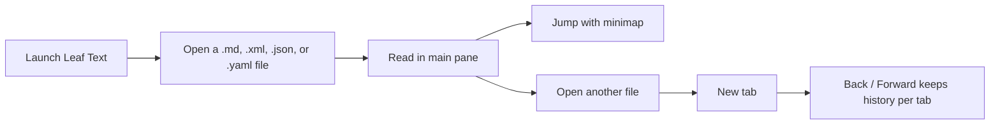

# Quickstart

> Open your first file and get comfortable with [tabs](01-features/02-navigation.md#tabs), [history](01-features/02-navigation.md#history), the [minimap](01-features/04-minimap.md), and the [library](01-features/03-library.md) — a few minutes, start to finish.

There's nothing to set up. No account, no folder to designate, no plugins to choose. Point Leaf Text at a file you already have and start reading. This page walks the shortest useful path: open a file, read it, move around, and come back to it later.

## Start

1. Press `Ctrl+O` on Windows or `Cmd+O` on macOS.
2. Pick any `.md`, `.xml`, `.json`, `.yaml`, or `.yml` file.
3. Scroll the document.
4. Use the minimap on the right to jump.
5. Open another file to create a new tab.

## Flow



## Open

| Method | How |
| --- | --- |
| Keyboard | `Ctrl+O` / `Cmd+O` |
| Drag and drop | Drop a `.md`, `.xml`, `.json`, `.yaml`, or `.yml` file onto the window |
| Recent files | Click a file on the no-file home screen |
| Command line / Open with | Launch Leaf Text with a file path |

> [!TIP]
> Recent files keeps the last 8 opened files, so reopening a doc is usually one click.

## UI

| Area | What it does |
| --- | --- |
| Tab bar | Keeps multiple documents open |
| Main reader | Shows the rendered Markdown, [XML](01-features/01-rendering.md#xml), or [JSON/YAML](01-features/01-rendering.md#data-files-json-and-yaml) |
| Outline | A collapsed list of the document's headings at the top, labeled with the document's line count, for jumping to a section |
| Minimap | Shows the whole document and your current viewport |
| Back / Forward | Moves through document and scroll history |
| Code view | Toggles the page to its raw, editable source — see [Editing](01-features/07-editing.md) |
| Save | A green button that appears when the source has [unsaved edits](01-features/07-editing.md#save) |
| Library pane | Browse a folder, [search](01-features/03-library.md#search) a [vault](01-features/03-library.md#vaults)'s text, and [map](01-features/03-library.md#graph) how its documents link |

## Basics

### New tab

Press `Ctrl+O` / `Cmd+O` again. Leaf Text opens the next file in a new tab instead of replacing the current one.

### Jump

Click a heading in the document or click a spot in the minimap. That jump is added to scroll history, so Back takes you to the previous reading position.

### History

| Action | Windows | macOS |
| --- | --- | --- |
| Back | `Alt+Left` | `Cmd+Left` |
| Forward | `Alt+Right` | `Cmd+Right` |
| Close tab | `Ctrl+W` | `Cmd+W` |
| Save ([unsaved edits](01-features/07-editing.md#save)) | `Ctrl+S` | `Cmd+S` |
| [Undo](01-features/07-editing.md#undo) the last edit | `Ctrl+Z` | `Cmd+Z` |

Mouse side buttons also trigger Back and Forward on Windows.

### Edit

Click into any sentence and type — the rendered page [edits in place](01-features/07-editing.md#inline-editing-the-reading-view), checkboxes toggle, and the green **Save** button appears. For the raw source instead, click the code-brackets button left of Settings. The [Editing](01-features/07-editing.md) page covers the whole flow.

### Reopen

Close the last tab and you will land on the no-file view again, where recent files are listed for quick reopening.

## Demo

Save this as `demo.md` and open it:

~~~md
# Demo

## Checklist

- [x] Open file
- [ ] Read docs

> [!NOTE]
> This is a callout.

```rust
fn main() {
    println!("Leaf Text");
}
```
~~~

That single file lets you verify headings, task lists, callouts, and syntax highlighting.

## Next

- [Rendering](01-features/01-rendering.md) for supported syntax and examples
- [Navigation](01-features/02-navigation.md) for tabs, history, and live reload
- [Library](01-features/03-library.md) for [vaults](01-features/03-library.md#vaults), search, and [GitHub sync](01-features/03-library.md#github-sync)
