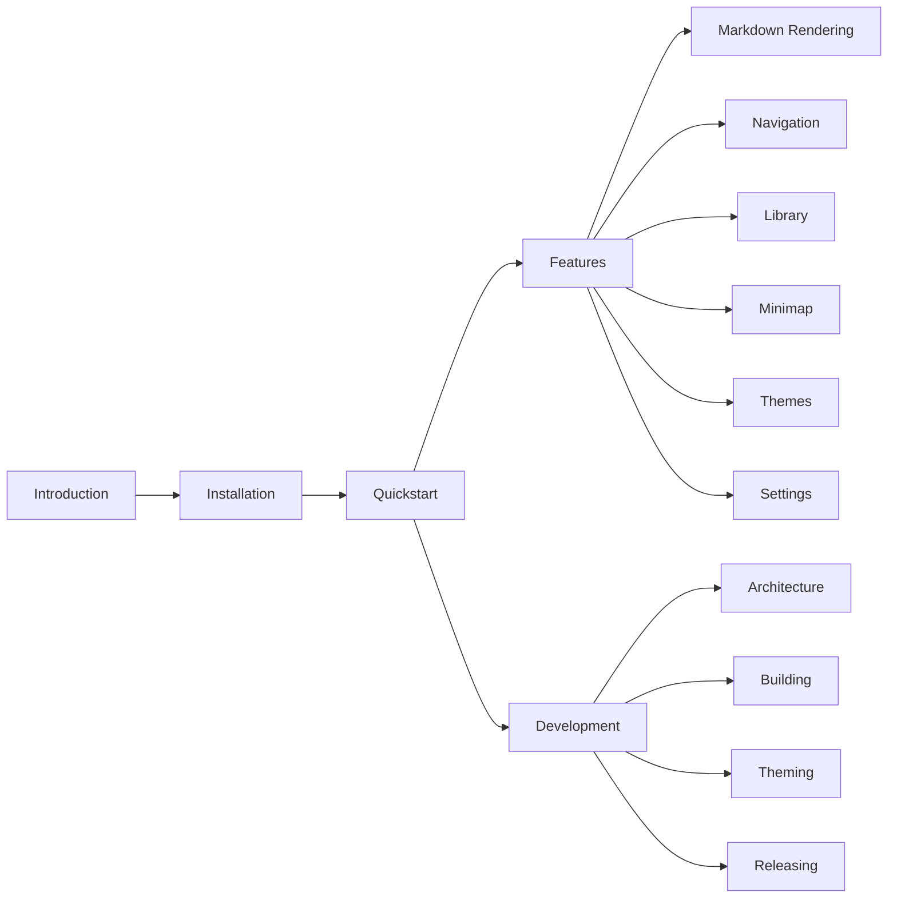

# leaftext documentation

> Everything in `docs/` — what each page covers, how the pages fit together, and how the folder becomes [leaftext.com/docs](https://leaftext.com/docs).

leaftext is a desktop reader for Markdown and TEI XML: open a local file, get a clean rendered view, and keep your place with tabs, history, a minimap, and a searchable library. These docs cover the whole app, from installing a release build to the compile-time theme contract.

## Map



## Start here

| Page | What it covers |
| --- | --- |
| [Introduction](introduction.md) | What leaftext is, the feature overview, and where to go for each task |
| [Installation](installation.md) | Prebuilt downloads for macOS (`.dmg`), Windows (`.msi`), and Linux (`.tar.gz`), plus data paths and first-launch notes |
| [Quickstart](quickstart.md) | The smallest useful path through the app: open a file, read, jump, and reopen — with the core shortcuts |

## Features

How the app behaves, page by page:

| Page | What it covers |
| --- | --- |
| [Markdown Rendering](features/markdown-rendering.md) | The full supported syntax with live examples: CommonMark, GFM, syntax highlighting, Mermaid, math, alerts, footnotes, emoji, block permalinks, local images, and TEI XML (84000 translations) |
| [Navigation](features/navigation.md) | Tabs, Back/Forward history, the outline, scroll anchors, live reload, recent files, link hints, the pager, and the single-window rule |
| [Library](features/library.md) | The left-side pane backed by a local SQLite index: Project, Tree, and Flat views, filename and content search, and file actions |
| [Minimap](features/minimap.md) | The scaled real-text document clone in the side rail: how it renders, when it rebuilds, responsive widths, and the on/off toggle |
| [Themes](features/themes.md) | The four theme modes — System, Light, Dark, Dracula — and how they apply through the semantic token contract |
| [Settings](features/settings.md) | Every preference, its default, and the JSON files on disk that store them |

## Development

For anyone building, extending, or releasing leaftext:

| Page | What it covers |
| --- | --- |
| [Architecture](development/architecture.md) | The Rust binary end to end: tao windowing, wry WebView, the Markdown pipeline, the IPC bridge, the background indexer, and every source file's role |
| [Building](development/building.md) | Toolchain prerequisites, platform WebView dependencies, and the `just verify` suite |
| [Theming](development/theming.md) | The compile-time contract of ~100 `--leaf-*` CSS custom properties, the theme sources, and how the CSS is compiled and validated |
| [Releasing](development/releasing.md) | `just release <version>`: the version bump, the tag push, and the CI builds it triggers on all three platforms |

## Shared reference

- [Glossary](GLOSSARY.md) — one shared glossary for all pages. Linking a term like `[minimap](GLOSSARY.md#minimap)` opens the entry in a bottom sheet over the current page instead of navigating away.

## How this folder ships

These pages are plain Markdown, but the folder is also a deployable site:

| File | Role |
| --- | --- |
| `index.html` | The docs shell at leaftext.com/docs — loads the shared site styles and applies the saved theme before first paint |
| `docs.js` | Fills the sidebar navigation and renders the page chosen by the URL route |
| `docs.css` | Docs-only chrome: the sidebar and the page pager |
| `render-docs-check.mjs` | Headless smoke test — renders every `.md` file here with the site renderer and fails loudly on errors or empty output |

Before shipping doc changes, run the check from the repo root:

```sh
node docs/render-docs-check.mjs
```

> [!TIP]
> Every page here is readable two ways: rendered on the website, or opened directly in leaftext itself — the app these docs describe.
