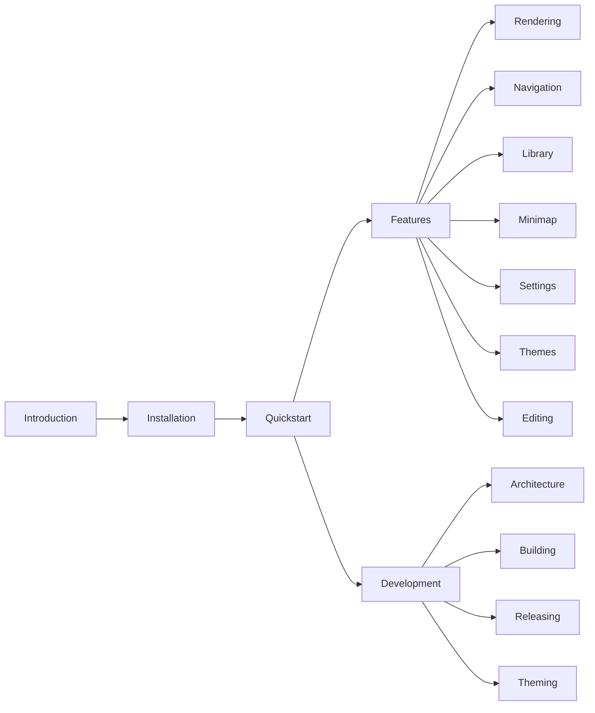

# Leaftext documentation

> Everything in `docs/` — what each page covers, how the pages fit together, and how the folder becomes [leaftext.com/docs](https://leaftext.com/docs).

Leaftext is a free desktop app for reading and writing your own documents. Open a local Markdown, HTML, XML, JSON, YAML, plain text (`.txt`), config (`.ini`), source, email (`.eml`), or Word, Excel, PowerPoint or OpenDocument (`.docx`, `.docm`, `.xlsx`, `.xlsm`, `.pptx`, `.pptm`, `.odt`, `.ods`, `.odp`) file, get a clean rendered view, write straight into the page, and keep your place with tabs, history, a minimap, and a searchable library. Nothing leaves your device. These docs cover the whole app, from installing it to the startup-validated theme contract behind the scenes.

## Map



## Start here

| Page | What it covers |
| --- | --- |
| [Introduction](01-introduction.md) | What Leaftext is, the feature overview, and where to go for each task |
| [Installation](02-installation.md) | Step-by-step installs for macOS (`.dmg`) and Windows (`.msi`), how to get past the [first-launch block on a Mac](02-installation.md#mac-blocks-the-first-launch), [file associations](02-installation.md#file-associations), [updates](01-features/05-settings.md#updates), and data paths |
| [Quickstart](03-quickstart.md) | The smallest useful path through the app: open a file, read, jump, and reopen — with the core shortcuts |

## Features

How the app behaves, page by page. They are numbered in reading order, and each one ends with where to go next.

| Page | What it covers |
| --- | --- |
| [Rendering](01-features/01-rendering.md) | The full supported syntax with live examples: CommonMark, GFM, syntax highlighting, Mermaid, math, alerts, footnotes, emoji, Leaf buttons, local images, XML (any file, plus 84000 TEI translations), JSON/YAML, email (`.eml`), and file encodings |
| [Navigation](01-features/02-navigation.md) | Tabs, Back/Forward history, the toolbar, the outline, scroll anchors, live reload, recent files, the glossary sheet, link hints, the pager, and the single-window rule |
| [Library](01-features/03-library.md) | The left-side pane: vaults, the file tree and its breadcrumb, search, the filter syntax, the graph view, GitHub sync, file actions, live updates, and narrow-window layout |
| [Minimap](01-features/04-minimap.md) | The scaled real-text document clone in the side rail: how it renders, when it rebuilds, the code view's own rail, responsive widths, and the on/off toggle |
| [Settings](01-features/05-settings.md) | Every preference, its default, and the JSON files on disk that store them — including [updates](01-features/05-settings.md#updates) and [paths](01-features/05-settings.md#paths) |
| [Themes](01-features/06-themes.md) | The eleven families (Amaranth, Arabica, Bloodleaf, Fern, Ginger, GitHub, Goldenrod, Halcyon, Nightshade, Pippin, Sage), light/dark/System/Daylight appearance, on-demand Google Fonts, diagram colors, and the semantic token contract. All eleven are drawn on one page at [leaftext.com/gallery.html](https://leaftext.com/gallery.html) |
| [Editing](01-features/07-editing.md) | Writing in the rendered page (blocks, the gutter, the format bar, the flowchart editor), the raw-source code view with typing help, and the explicit Save flow |

### Which page answers which question

| Question | Page |
| --- | --- |
| Does it render *this* syntax? | [Rendering](01-features/01-rendering.md#summary) |
| Can it open my `.xml` / `.json` / `.yaml` / `.eml`? | [Rendering](01-features/01-rendering.md#xml) |
| How do I keep several documents open? | [Navigation → Tabs](01-features/02-navigation.md#tabs) |
| What are the keyboard shortcuts? | [Navigation → Shortcuts](01-features/02-navigation.md#shortcuts) |
| How do I search my notes? | [Library → Search](01-features/03-library.md#search) |
| Can I filter by tag, field or date? | [Library → Filtering](01-features/03-library.md#filtering) |
| What is a vault, and do I need one? | [Library → Vaults](01-features/03-library.md#vaults) |
| How do I push my notes to GitHub? | [Library → GitHub sync](01-features/03-library.md#github-sync) |
| How do I edit without leaving the page? | [Editing → Inline editing](01-features/07-editing.md#inline-editing-the-reading-view) |
| Why can't I click into this block? | [Editing → Formats](01-features/07-editing.md#formats) |
| How do I draw a flowchart? | [Editing → The flowchart editor](01-features/07-editing.md#the-flowchart-editor) |
| Where are my settings stored? | [Settings → Paths](01-features/05-settings.md#paths) |
| How do updates work? | [Settings → Updates](01-features/05-settings.md#updates) |
| How do I change the look? | [Themes → Choose](01-features/06-themes.md#choose) |
| What do the themes actually look like? | [leaftext.com/gallery.html](https://leaftext.com/gallery.html) — every theme, color, icon and control on one page |

## Development

For anyone building, extending, or releasing Leaftext:

| Page | What it covers |
| --- | --- |
| [Architecture](02-development/01-architecture.md) | The Rust binary end to end: tao windowing, wry WebView, the Markdown pipeline, the XML, JSON/YAML, and email renderers, the IPC bridge, the vault registry, the git integration, and every source file's role |
| [Building](02-development/02-building.md) | Toolchain prerequisites, platform WebView dependencies, and the `just verify` suite |
| [Releasing](02-development/03-releasing.md) | `just release <version>`: the version bump, the tag push, and the CI builds it triggers on Windows and macOS |
| [Theming](02-development/04-theming.md) | The startup-validated contract of 82 `--lt-*` CSS custom properties, 81 of them required, the theme sources, and how the CSS is compiled and validated |
| [Design system](02-development/05-design-system.md) | Where every value in the interface comes from: the four files under `design/`, the icons, the components, the gallery, and the checks that fail the build on a hand-written value |
| [Screenshots](02-development/06-screenshots.md) | One row per picture in `imgs/`: what it shows and what takes it, so a fault common to all of them can be fixed as a batch |
| [Workflow](02-development/07-workflow.md) | How a change moves from a written plan to a release: the skills that carry it, the test every phase owes, where each test lives, and the gate before it ships |
| [Hostile documents](02-development/08-security.md) | What every format reader owes untrusted bytes: bounded claims and work, errors instead of panics, passive content, least authority, and the current limits of all fifteen readers |

## Shared reference

| Page | What it covers |
| --- | --- |
| [Glossary](GLOSSARY.md) | Every word Leaftext uses for a part of itself, alphabetically — one entry per feature and subfeature |

The glossary is not an ordinary page: every term in it is matched automatically wherever it appears across these docs, and clicking one opens that entry in a bottom sheet over the page you are reading rather than navigating away. Linking one by hand works too — `[minimap](GLOSSARY.md#minimap)`.

The front page at leaftext.com reads this same file, one folder up, so this is the only copy and it stays here. `just check-site` fails on a page that asks for it anywhere else.

## How this folder ships

These pages are plain Markdown, but the folder is also a deployable site:

| File | Role |
| --- | --- |
| `index.html` | The docs shell at leaftext.com/docs — names where the renderer and its stylesheet are served from, loads the shared site styles and applies the saved theme before first paint |
| `docs.js` | Fills the sidebar navigation and renders the page chosen by the URL route. After paint it links every term [GLOSSARY.md](GLOSSARY.md) defines, so a term opens in a sheet over the page the same way it does in the app — not on the glossary itself, where each heading would link to the entry it already is |
| `docs.css` | Docs-only chrome: the sidebar |
| `render-docs-check.mjs` | Headless smoke test — renders every `.md` file here through the app's own renderer, the module the published site draws with, and fails loudly on errors or empty output. It needs `just build-web` first, which is why it is not part of `just verify` |

### Page order and file names

The sidebar is built from the real file tree, not from a hand-written list. A leading number orders a file or folder and is stripped from the label and the URL, so `01-features/07-editing.md` is shown as **Editing** and addressed as `#/features/editing`. Add a page and the nav follows; renumber one and its address does not change.

Before shipping doc changes, run the check from the repo root:

```sh
just build-web
node docs/render-docs-check.mjs
```

> [!TIP]
> Every page here is readable two ways: rendered on the website, or opened directly in Leaftext itself — the app these docs describe.
