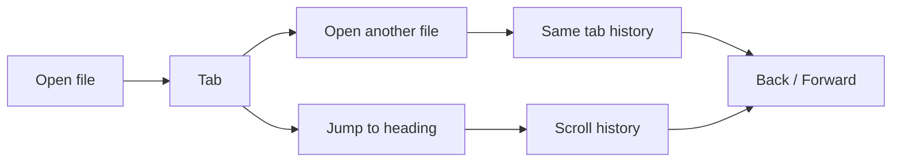
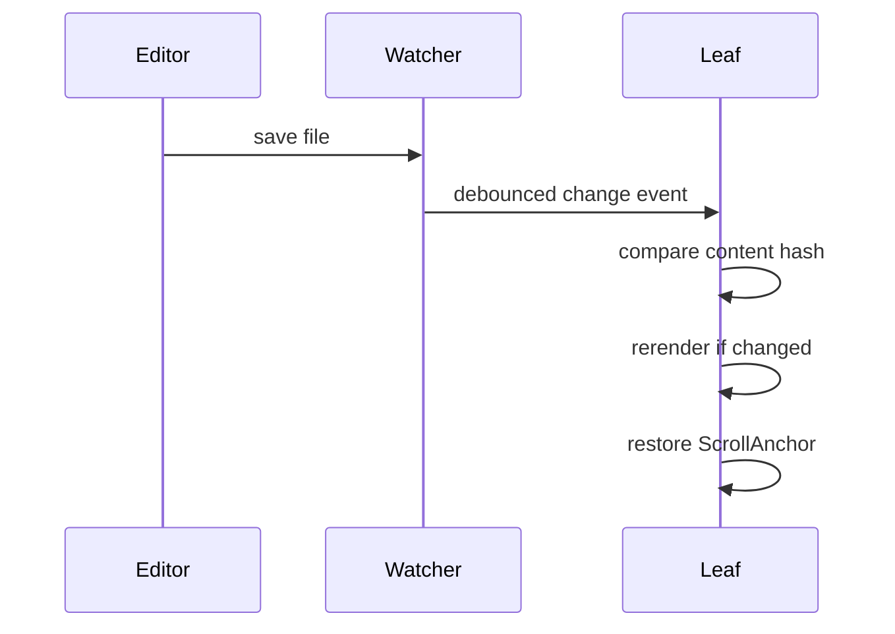

# Navigation

> leaftext keeps browser-like history for Markdown reading: tabs, Back/Forward, in-document jumps, and scroll restoration after reloads.

The navigation model is simple from the outside and fairly careful under the hood. Each tab keeps its own file history and its own in-document scroll history.

## Summary

| Feature | What it means |
| --- | --- |
| Tabs | Open multiple documents at once |
| Back / Forward | Move through file history and in-page jumps |
| Scroll anchors | Restore the same reading spot after rerenders |
| Live reload | Reload a changed file without losing your place |
| Recent files | Reopen the last 8 files quickly |
| Glossary sheet | Open a glossary term over the page without leaving it |
| Link hints | Hover a link to see what kind it is and where it points |
| Pager | Previous / Next buttons at the bottom of each document for reading a folder in order |

## Model



## Shortcuts

| Action | Windows / Linux | macOS |
| --- | --- | --- |
| Open file | `Ctrl+O` | `Cmd+O` |
| Close tab | `Ctrl+W` | `Cmd+W` |
| Back | `Alt+Left` | `Cmd+Left` |
| Forward | `Alt+Right` | `Cmd+Right` |

Mouse side buttons also trigger Back and Forward on Windows and Linux.

## Tabs

- Opening another file creates another tab.
- Each tab keeps its own document history.
- Each tab also keeps its own scroll history.
- Tabs can be dragged to reorder them.
- Closing the last tab returns to the home screen.

## History

### Files

Open `README.md`, then click a link to `docs/guide.md`. Back returns to `README.md`. Forward returns to `docs/guide.md`.

### Jumps

Jump from `#intro` to `#api` inside the same document. Back returns to the earlier reading position instead of switching files.

That second case is why leaftext keeps scroll history separately from file history.

## Restore

leaftext stores a reading position as a `ScrollAnchor`:

| Part | Meaning |
| --- | --- |
| `section` | Nearest heading above the top edge |
| `block` | Content block number within that section |
| `offsetY` | Pixel offset from that block |

This is more stable than storing only raw scroll pixels, so the app can usually return to the same paragraph after rerendering.

## Reload

When the current file changes on disk, leaftext reloads it and tries to preserve your place.



Key details:

- The file watcher debounces events with a 200 ms window.
- leaftext hashes the file contents to skip duplicate reloads.
- The parent directory is watched instead of only the file, so atomic-save editors still work.
- Other Markdown files changed in that same folder are indexed live, so the [library](library.md#live-updates) pane stays current too.

## Recent files

The no-file home screen shows the last 8 opened files.

- Missing files are removed automatically.
- Equivalent path spellings collapse to one entry.
- Clicking a recent file opens it immediately.

## Glossary

A document can link a term to a shared glossary file. The simplest form is a `glossary:` link that names just the term, such as `[minimap](glossary:minimap)`. Clicking one does not switch documents: it opens that single glossary entry in a sheet that slides up over the page you are reading, so you keep your place underneath.

- Dismiss the sheet with its close button, by clicking outside it, or with the `Escape` key.
- A link inside the sheet that points at another glossary term swaps the entry in place; any other link leaves the glossary and follows the link normally.
- A link at the foot of the sheet opens the whole glossary as a page.
- Glossary term links show a dotted underline in every theme and mode, so an expandable term is easy to spot.
- The glossary lives at one file, so the whole document set can share a single set of definitions.

### Author a glossary

Write one `GLOSSARY.md` next to your documents, with a `##` heading per term:

```md
# Glossary

## Minimap

The overview rail down the right edge of the reading view.

## Tab

One open document, with its own Back/Forward history and scroll position.
```

Then link a term from any page using the heading's slug (its text lowercased, spaces turned to hyphens — so `Bottom Sheet` becomes `bottom-sheet`):

```md
Keep your place with the [minimap](glossary:minimap).
```

The `glossary:` link carries no file path, so the same text works from any page no matter how deeply it is nested. The app finds the glossary by walking up from the open document to the nearest `GLOSSARY.md`, so each project's pages bind to that project's own glossary. Because every page points at the same file, one glossary serves the whole set.

A plain relative link to the file also works — `[minimap](GLOSSARY.md#minimap)`, or `[minimap](../GLOSSARY.md#minimap)` from a page one folder down — but you have to count the folders yourself. The `glossary:` form avoids that.

> [!TIP]
> These docs ship their own glossary. The links in the [Introduction](../introduction.md) — like [minimap](../GLOSSARY.md#minimap) — open this set's [GLOSSARY.md](../GLOSSARY.md); click one to see the sheet in action.

## Pager

When you open a Markdown document that sits inside a folder tree connected by `README.md` files, leaftext appends a **Previous / Next** bar at the bottom of the page. Clicking a button opens the adjacent document in reading order without creating an extra history entry.

Reading order follows the same depth-first walk the docs viewer uses: inside each folder, non-README files come first (sorted by name), then each subfolder — its README acting as the folder's landing page — followed by that folder's own pages. `README.md` and `GLOSSARY.md` are never standalone entries in the sequence.

Working out the Previous / Next links means scanning the folder tree, so leaftext does it after the document is already on screen rather than blocking the initial render. A placeholder bar shows in its place for the moment it takes, then the real buttons fill in. In a folder with a great many files the page appears immediately and the pager simply arrives a beat later.

The pager is on by default and can be turned off in [Settings](settings.md#pager).

## Link hints

Hovering a link shows a small tooltip that names what kind of link it is and shows the exact href it was written with, so you can tell a [glossary](#glossary) term from an in-page jump from an outside site before you click.

| Hint | When you see it |
| --- | --- |
| Glossary entry | A `glossary:` term link, or a link to `GLOSSARY.md#term` |
| Full glossary | A bare `glossary:` link that opens the whole glossary |
| In-page jump | A `#fragment` link to a heading on the current page |
| Another page | A relative link to another `.md` document |
| External site | An `http://` or `https://` link |
| Email link | A `mailto:` link |
| App link | Any other URL scheme |
| Site path | A root-relative `/path` link |

This is a desktop affordance: it appears only with a mouse (a fine pointer that can hover), and is left off on touch screens. The tooltip follows the cursor, flips to stay on screen near the edges, and hides on scroll or when the window loses focus.

## Next

- [Quickstart](../quickstart.md) if you want the basics first
- [Library](library.md) if you want browsing and search
- [Architecture](../development/architecture.md) if you want the implementation details
