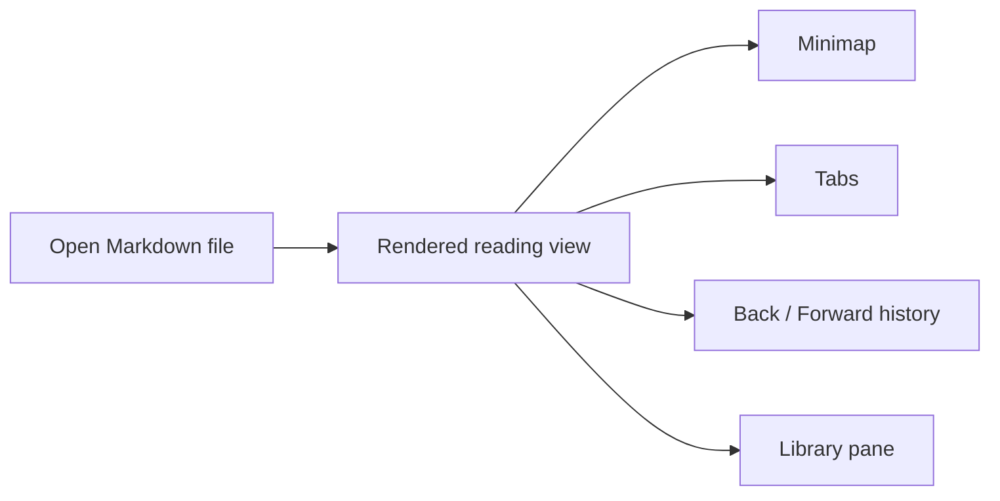

# Meet leaftext

> A desktop reader for Markdown files: fast to open, easy to scan, and focused on reading instead of editing.

leaftext is a desktop app for reading local Markdown on macOS, Windows, and Linux. Open a file, get a clean rendered view, and keep your place with [tabs](features/navigation.md#tabs), [history](features/navigation.md#history), a [minimap](features/minimap.md), and a searchable [library](features/library.md).

New to the terms? Words like [minimap](GLOSSARY.md#minimap) and [frontmatter](GLOSSARY.md#frontmatter) link into the [glossary](GLOSSARY.md#glossary) — clicking one opens its entry in a [bottom sheet](GLOSSARY.md#bottom-sheet) over this page instead of taking you away from it.

## Overview

| You want to... | Start here |
| --- | --- |
| Install the app | [Installation](installation.md) |
| Open your first file | [Quickstart](quickstart.md) |
| Check rendering support | [Markdown Rendering](features/markdown-rendering.md) |
| Change the look | [Themes](features/themes.md) |
| Learn the app model | [Navigation](features/navigation.md) |

## Features

- Read Markdown without opening an editor.
- [Render](features/markdown-rendering.md) CommonMark, GFM, [Mermaid](features/markdown-rendering.md#mermaid-diagrams), [math](features/markdown-rendering.md#math), [alerts](features/markdown-rendering.md#blockquotes-and-alerts), [footnotes](features/markdown-rendering.md#footnotes), [emoji](features/markdown-rendering.md#emoji), and local images.
- Keep multiple documents open in [tabs](features/navigation.md#tabs).
- Move [back and forward](features/navigation.md#history) through documents and in-page jumps.
- Browse indexed Markdown files in the [library pane](features/library.md).
- [Reload](features/navigation.md#reload) the current file when it changes on disk.
- Enable [Speed Reader](features/settings.md#speed-reader) to dim prose text, quiet links, and add bold lead anchors so the reading path pops against the background.

## Layout



## Example

~~~md
# Release Notes

> [!TIP]
> Drag this file into leaftext.

- [x] Ship docs refresh
- [ ] Review screenshots

```ts
console.log("Hello from leaftext");
```
~~~

That file opens as a formatted document, not as source code in an editor.

## Next

- [Quickstart](quickstart.md) shows the actual reading flow.
- [Markdown Rendering](features/markdown-rendering.md) shows what syntax works.
- [Library](features/library.md) explains search, indexing, and the side pane.
