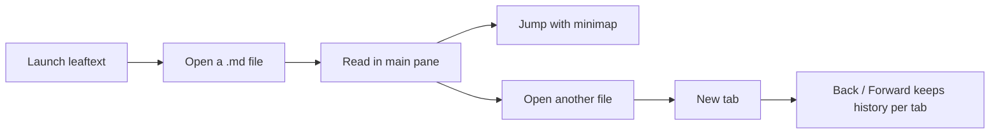

# Quickstart

> Open a Markdown file, learn the core controls, and get comfortable with [tabs](features/navigation.md#tabs), [history](features/navigation.md#history), the [minimap](features/minimap.md), and the [library](features/library.md) in a few minutes.

leaftext is meant to be usable immediately. This page shows the smallest useful path through the app: open a file, read it, move around, and reopen it later.

## Start

1. Press `Ctrl+O` on Windows/Linux or `Cmd+O` on macOS.
2. Pick any `.md` file.
3. Scroll the document.
4. Use the minimap on the right to jump.
5. Open another file to create a new tab.

## Flow



## Open

| Method | How |
| --- | --- |
| Keyboard | `Ctrl+O` / `Cmd+O` |
| Drag and drop | Drop a `.md` file onto the window |
| Recent files | Click a file on the no-file home screen |
| Command line / Open with | Launch leaftext with a file path |

> [!TIP]
> Recent files keeps the last 8 opened files, so reopening a doc is usually one click.

## UI

| Area | What it does |
| --- | --- |
| Tab bar | Keeps multiple documents open |
| Main reader | Shows the rendered Markdown |
| Minimap | Shows the whole document and your current viewport |
| Back / Forward | Moves through document and scroll history |
| Library pane | Lets you browse and search indexed Markdown files |

## Basics

### New tab

Press `Ctrl+O` / `Cmd+O` again. leaftext opens the next file in a new tab instead of replacing the current one.

### Jump

Click a heading in the document or click a spot in the minimap. That jump is added to scroll history, so Back takes you to the previous reading position.

### History

| Action | Windows / Linux | macOS |
| --- | --- | --- |
| Back | `Alt+Left` | `Cmd+Left` |
| Forward | `Alt+Right` | `Cmd+Right` |
| Close tab | `Ctrl+W` | `Cmd+W` |

Mouse side buttons also trigger Back and Forward on Windows and Linux.

### Reopen

Close the last tab and you will land on the no-file view again, where recent files are listed for quick reopening.

## Demo

Save this as `demo.md` and open it:

~~~md
# Demo

## Checklist

- [x] Open file
- [ ] Read docs

> [!NOTE]
> This is a callout.

```rust
fn main() {
    println!("leaftext");
}
```
~~~

That single file lets you verify headings, task lists, callouts, and syntax highlighting.

## Next

- [Markdown Rendering](features/markdown-rendering.md) for supported syntax and examples
- [Navigation](features/navigation.md) for tabs, history, and live reload
- [Library](features/library.md) for search and indexing
