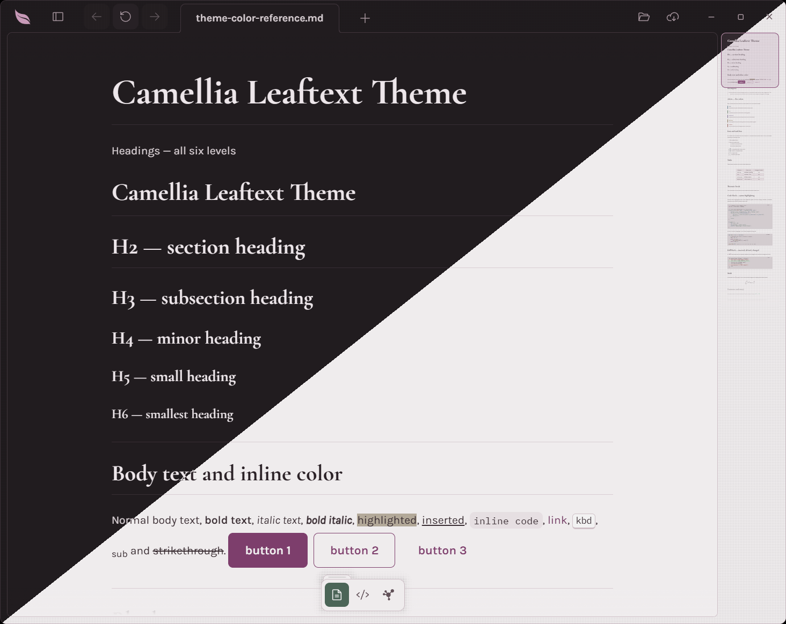
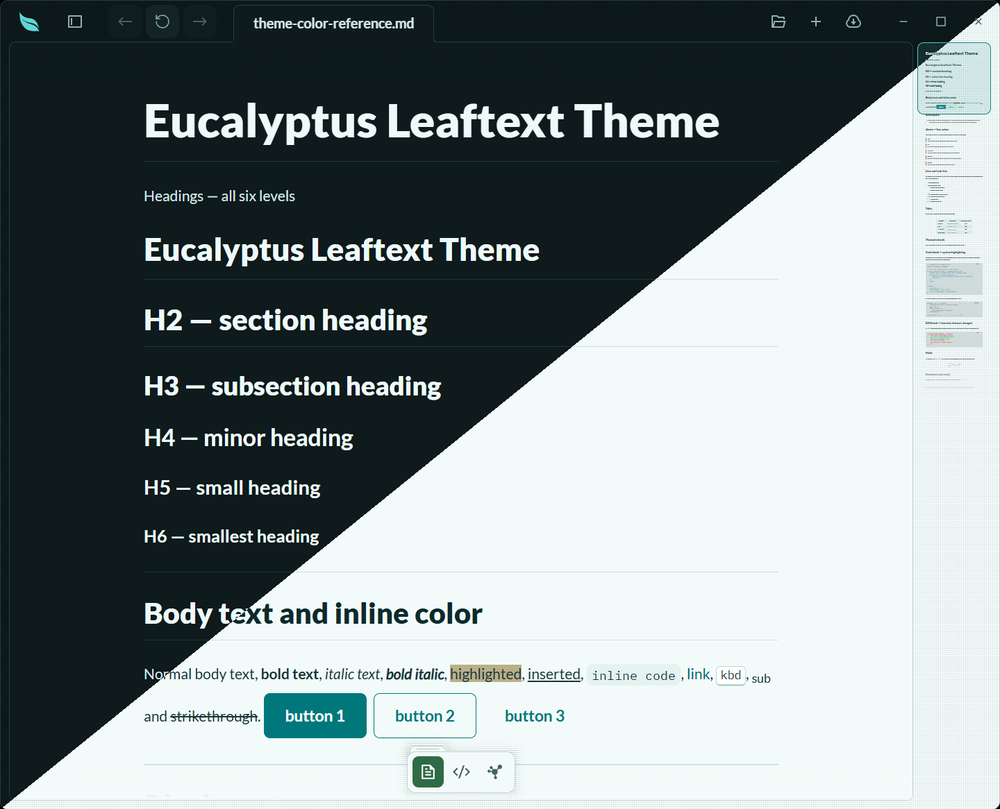
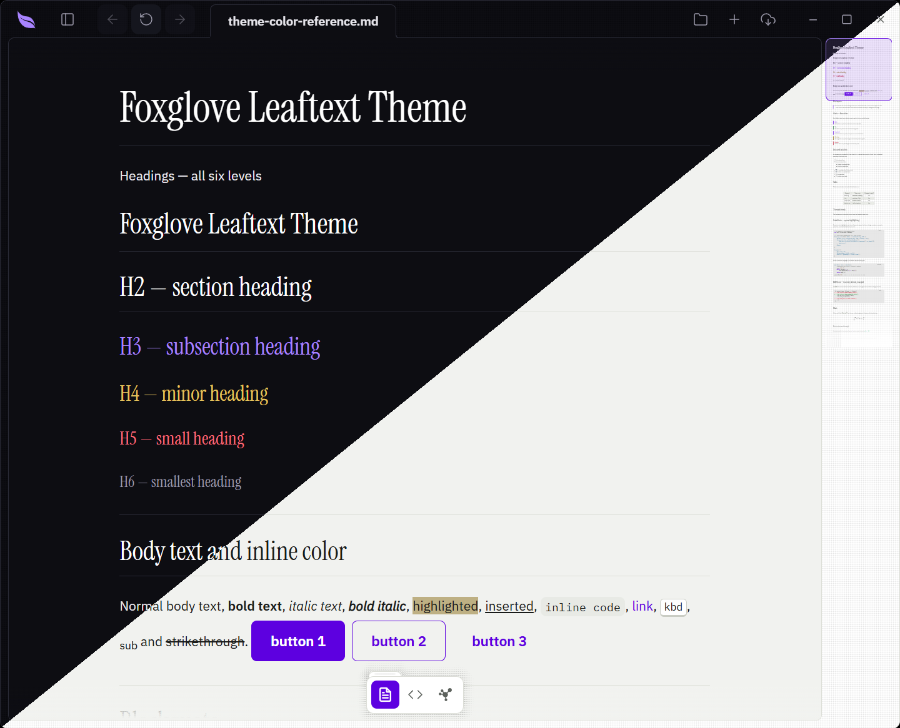
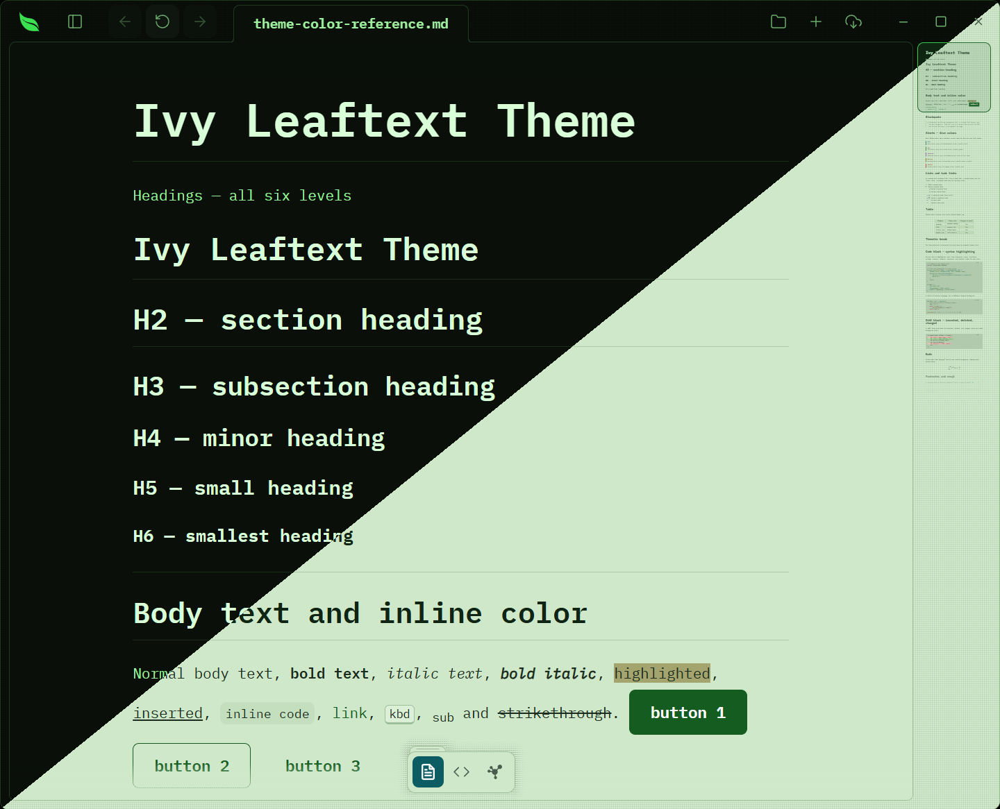
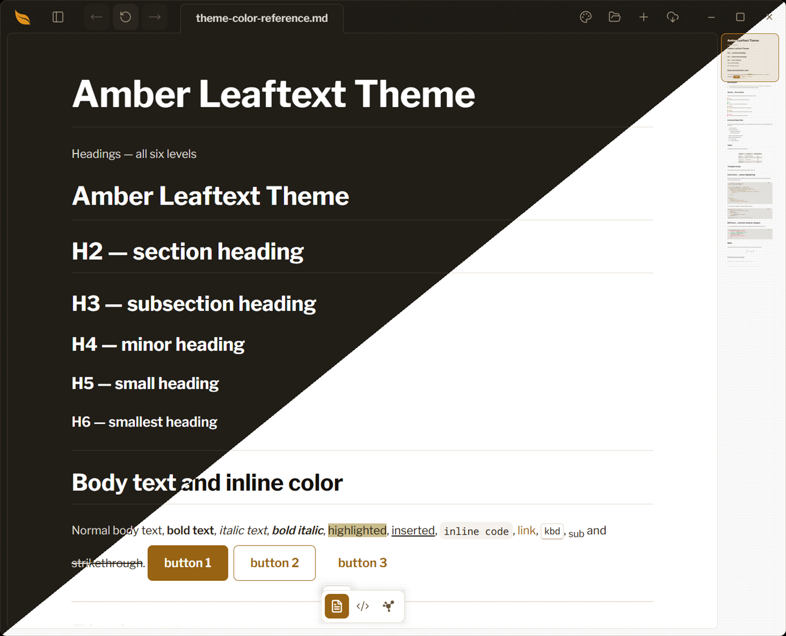
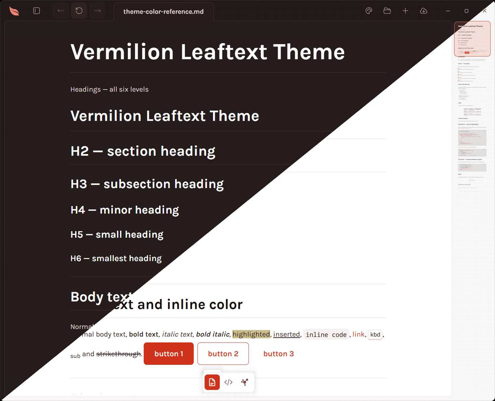

<!-- Generated by scripts/bundle-themes.mjs from the *.md files in this folder.
     Do not edit by hand; edit a family file and run `just bundle-themes`. -->

# Leaftext themes

Every theme in Leaftext is plain data — one Markdown file per family, right here in this folder. Because they are Markdown, they render as the color tables below in Leaf itself and at [leaftext.com/themes](https://leaftext.com/themes).

15 families ship free and 6 more are earned with seeds in the Grove, listed alphabetically (the order the theme picker uses). Each links to its full file; the screenshot is the same document split across the light and dark variants, and the table previews the key colors — every family also defines the full 84-color contract inside its file.

4 of the 84 are optional, and a family that says nothing about one gets another of its own colors copied in: `hover-tint`, the ink every fill under the pointer is mixed from, takes the quiet-text color; `primary-ink` and `accent-ink`, the inks printed on those two fills, take the primary and the accent themselves; and `markdown-table-row-background`, the band every other table row wears, takes the sunken surface. Set `hover-tint`, as Goldenrod does, and every menu row, toolbar button and file in the pane washes in that hue instead.

Mermaid diagrams take these same tokens, so a family says nothing about diagrams and gets them anyway: boxes the muted surface, subgraphs the sunken one, arrows the muted foreground, and a Gantt chart the theme's own active / done / critical colors. Text printed inside one of those fills takes whichever of the theme's inks reads on it, measured rather than assumed. The twelve-color categorical scale a mindmap or pie chart cycles through is the family's own primary, its hue stepped around the wheel with every entry held to the same weight, so one ink reads on all twelve.

## Gallery

### Amaranth

[`amaranth.md`](amaranth.md) · Heading **Source Serif 4** · Body **Source Sans 3** · Reading **Source Serif 4** · Code **Source Code Pro** · Google Fonts

| Role       | Light     | Dark      |
| ---------- | --------- | --------- |
| Background | `#ffffff` | `#1e1e1e` |
| Foreground | `#222222` | `#dadada` |
| Heading    | `#11111a` | `#ffffff` |
| Primary    | `#6d45e0` | `#a882ff` |
| Accent     | `#086ddd` | `#4c9dff` |
| Link       | `#086ddd` | `#4c9dff` |
| Success    | `#087a34` | `#44cf6e` |
| Warning    | `#8a6d00` | `#e0de71` |
| Danger     | `#d3243a` | `#fb4f55` |
| Border     | `#e0e0e0` | `#363636` |

### Arabica

[`arabica.md`](arabica.md) · Heading **Rubik** · Body **Rubik** · Code **JetBrains Mono** · Google Fonts

| Role       | Light     | Dark      |
| ---------- | --------- | --------- |
| Background | `#f5ece0` | `#241c17` |
| Foreground | `#3d2f26` | `#ece0d2` |
| Heading    | `#8839ef` | `#cba6f7` |
| Primary    | `#8839ef` | `#cba6f7` |
| Accent     | `#8839ef` | `#cba6f7` |
| Link       | `#8839ef` | `#cba6f7` |
| Success    | `#46671f` | `#b7d38a` |
| Warning    | `#8a5a12` | `#e8c07a` |
| Danger     | `#c0392b` | `#e8917f` |
| Border     | `#dbcab4` | `#3a2d23` |

### Birch

Earned with seeds in the Grove, under Foraging: its card joins the picker once Birch mode is bought.

[`birch.md`](birch.md) · Heading **Public Sans** · Body **Public Sans** · Code **Noto Sans Mono** · Google Fonts

| Role       | Light     | Dark      |
| ---------- | --------- | --------- |
| Background | `#ffffff` | `#1e1e1e` |
| Foreground | `#222222` | `#dadada` |
| Heading    | `#121212` | `#ffffff` |
| Primary    | `#6e6e6e` | `#a2a2a2` |
| Accent     | `#6e6e6e` | `#bbbbbb` |
| Link       | `#6e6e6e` | `#bbbbbb` |
| Success    | `#087a34` | `#44cf6e` |
| Warning    | `#8a6d00` | `#e0de71` |
| Danger     | `#d3243a` | `#fb4f55` |
| Border     | `#e0e0e0` | `#363636` |

### Bloodleaf

[`bloodleaf.md`](bloodleaf.md) · Heading **Archivo** · Body **Archivo** · Code **Roboto Mono** · Google Fonts

| Role       | Light     | Dark      |
| ---------- | --------- | --------- |
| Background | `#ffffff` | `#0f141a` |
| Foreground | `#15181c` | `#dfe6ee` |
| Heading    | `#0c0f12` | `#ffffff` |
| Primary    | `#d81e28` | `#ff4b52` |
| Accent     | `#d81e28` | `#ff4b52` |
| Link       | `#d81e28` | `#ff6b70` |
| Success    | `#1a7a3a` | `#3fd07a` |
| Warning    | `#8a6100` | `#ffc043` |
| Danger     | `#b81420` | `#ff5f63` |
| Border     | `#dde5ec` | `#28323d` |

### Camellia

[`camellia.md`](camellia.md) · Heading **Cormorant Garamond** · Body **Karla** · Code **IBM Plex Mono** · Google Fonts

| Role       | Light     | Dark      |
| ---------- | --------- | --------- |
| Background | `#fff7fa` | `#1a1016` |
| Foreground | `#3a1f2b` | `#e8d4de` |
| Heading    | `#2a1520` | `#fff0f8` |
| Primary    | `#b0248a` | `#f58fd0` |
| Accent     | `#2f6a4a` | `#8fd4a8` |
| Link       | `#9a1f78` | `#f58fd0` |
| Success    | `#2d6e31` | `#8fdc8a` |
| Warning    | `#7a5200` | `#e8c872` |
| Danger     | `#b42318` | `#ff8a7a` |
| Border     | `#e3c2d1` | `#43293a` |

### Eucalyptus

[`eucalyptus.md`](eucalyptus.md) · Heading **Lato** · Body **Lato** · Code **IBM Plex Mono** · Google Fonts

| Role       | Light     | Dark      |
| ---------- | --------- | --------- |
| Background | `#f3fbfa` | `#0e1a1c` |
| Foreground | `#173536` | `#d5e7e6` |
| Heading    | `#0d2a2b` | `#eefaf9` |
| Primary    | `#00787b` | `#5fd6d2` |
| Accent     | `#2f6b45` | `#9ad08a` |
| Link       | `#00696c` | `#5fd6d2` |
| Success    | `#2d6e31` | `#8fdc8a` |
| Warning    | `#765300` | `#e8c872` |
| Danger     | `#b3261e` | `#ff8a80` |
| Border     | `#b9d6d2` | `#24403f` |

### Fern

[`fern.md`](fern.md) · Heading **Noto Serif** · Body **Noto Sans** · Code **Noto Sans Mono** · Google Fonts

| Role       | Light     | Dark      |
| ---------- | --------- | --------- |
| Background | `#ffffff` | `#1e1e1e` |
| Foreground | `#222222` | `#dadada` |
| Heading    | `#11111a` | `#ffffff` |
| Primary    | `#1a7f37` | `#3fb950` |
| Accent     | `#1a7f37` | `#56d364` |
| Link       | `#1a7f37` | `#56d364` |
| Success    | `#087a34` | `#44cf6e` |
| Warning    | `#8a6d00` | `#e0de71` |
| Danger     | `#d3243a` | `#fb4f55` |
| Border     | `#e0e0e0` | `#363636` |

### Foxglove

[`foxglove.md`](foxglove.md) · Heading **Instrument Serif** · Body **IBM Plex Sans** · Code **IBM Plex Mono** · Google Fonts

| Role       | Light     | Dark      |
| ---------- | --------- | --------- |
| Background | `#f1f2ef` | `#0d0d12` |
| Foreground | `#191b19` | `#e9e8ee` |
| Heading    | `#191b19` | `#ffffff` |
| Primary    | `#5d00e0` | `#a883ff` |
| Accent     | `#5d00e0` | `#a883ff` |
| Link       | `#5d00e0` | `#a883ff` |
| Success    | `#1b7236` | `#5fd38a` |
| Warning    | `#805f00` | `#e6c35c` |
| Danger     | `#c0233a` | `#ff6b7a` |
| Border     | `#dcded7` | `#2a2b37` |

### Ginger

[`ginger.md`](ginger.md) · Heading **Nunito** · Body **Nunito** · Code **Inconsolata** · Google Fonts

| Role       | Light     | Dark      |
| ---------- | --------- | --------- |
| Background | `#fdf7ef` | `#2a2d3d` |
| Foreground | `#43382e` | `#c6ceef` |
| Heading    | `#b5461a` | `#f2934e` |
| Primary    | `#f0662e` | `#f2934e` |
| Accent     | `#f0662e` | `#f2934e` |
| Link       | `#b5461a` | `#f2934e` |
| Success    | `#46671f` | `#38c68d` |
| Warning    | `#8a5e12` | `#f9e2af` |
| Danger     | `#c0392b` | `#ff777f` |
| Border     | `#e6dac6` | `#414559` |

### GitHub

[`github.md`](github.md) · Heading **-apple-system** · Body **-apple-system** · Code **ui-monospace** · System fonts

| Role       | Light     | Dark      |
| ---------- | --------- | --------- |
| Background | `#ffffff` | `#0d1117` |
| Foreground | `#1f2328` | `#f0f6fc` |
| Heading    | `#1f2328` | `#f0f6fc` |
| Primary    | `#1f883d` | `#238636` |
| Accent     | `#0969da` | `#4493f8` |
| Link       | `#0969da` | `#4493f8` |
| Success    | `#1a7f37` | `#3fb950` |
| Warning    | `#9a6700` | `#d29922` |
| Danger     | `#d1242f` | `#f85149` |
| Border     | `#d1d9e0` | `#39435f` |

### Goldenrod

[`goldenrod.md`](goldenrod.md) · Heading **Space Grotesk** · Body **Space Grotesk** · Code **Space Mono** · Google Fonts

| Role       | Light     | Dark      |
| ---------- | --------- | --------- |
| Background | `#fffdf7` | `#131210` |
| Foreground | `#1c1a15` | `#eceae2` |
| Heading    | `#1c1a15` | `#ffc300` |
| Primary    | `#f0b400` | `#ffc300` |
| Accent     | `#f0b400` | `#ffc300` |
| Link       | `#9a6800` | `#ffc300` |
| Success    | `#46671f` | `#b7d38a` |
| Warning    | `#8a6000` | `#ffce5a` |
| Danger     | `#c0392b` | `#f0857a` |
| Border     | `#e6ddc6` | `#2b2820` |

### Halcyon

[`halcyon.md`](halcyon.md) · Heading **IBM Plex Sans** · Body **IBM Plex Sans** · Code **IBM Plex Mono** · Google Fonts

| Role       | Light     | Dark      |
| ---------- | --------- | --------- |
| Background | `#ffffff` | `#1c2127` |
| Foreground | `#222222` | `#dadada` |
| Heading    | `#11111a` | `#ffffff` |
| Primary    | `#086ddd` | `#4c9dff` |
| Accent     | `#086ddd` | `#4c9dff` |
| Link       | `#086ddd` | `#4c9dff` |
| Success    | `#087a34` | `#44cf6e` |
| Warning    | `#8a6d00` | `#e0de71` |
| Danger     | `#d3243a` | `#fb5d62` |
| Border     | `#e6e9ee` | `#353b44` |

### Ivy

[`ivy.md`](ivy.md) · Heading **IBM Plex Mono** · Body **IBM Plex Mono** · Code **IBM Plex Mono** · Google Fonts

| Role       | Light     | Dark      |
| ---------- | --------- | --------- |
| Background | `#cfe8c9` | `#0a0f0a` |
| Foreground | `#1b2b1d` | `#9ff29f` |
| Heading    | `#0f2413` | `#d9ffd9` |
| Primary    | `#145c20` | `#3ae04f` |
| Accent     | `#0b5d63` | `#7ff0e0` |
| Link       | `#145c20` | `#3ae04f` |
| Success    | `#145c20` | `#3ae04f` |
| Warning    | `#6e5200` | `#e8d07a` |
| Danger     | `#a3161c` | `#ff6b6b` |
| Border     | `#9dbf97` | `#1f3a1f` |

### Laurel

Earned with seeds in the Grove, under Foraging: its card joins the picker once Laurel mode is bought.

[`laurel.md`](laurel.md) · Heading **Figtree** · Body **Figtree** · Code **Noto Sans Mono** · Google Fonts

| Role       | Light     | Dark      |
| ---------- | --------- | --------- |
| Background | `#ffffff` | `#17201a` |
| Foreground | `#15261a` | `#d0ddd4` |
| Heading    | `#0b140e` | `#ffffff` |
| Primary    | `#108031` | `#17bb48` |
| Accent     | `#108031` | `#1bd753` |
| Link       | `#108031` | `#1bd753` |
| Success    | `#087a34` | `#44cf6e` |
| Warning    | `#8a6d00` | `#e0de71` |
| Danger     | `#d3243a` | `#fb4f55` |
| Border     | `#d1e5d7` | `#2a3a2f` |

### Lavender

Earned with seeds in the Grove, under Foraging: its card joins the picker once Lavender mode is bought.

[`lavender.md`](lavender.md) · Heading **Outfit** · Body **Outfit** · Code **Noto Sans Mono** · Google Fonts

| Role       | Light     | Dark      |
| ---------- | --------- | --------- |
| Background | `#ffffff` | `#211c27` |
| Foreground | `#281d34` | `#ddd8e3` |
| Heading    | `#150f1b` | `#ffffff` |
| Primary    | `#9043e8` | `#bc8ef1` |
| Accent     | `#9043e8` | `#ceadf5` |
| Link       | `#9043e8` | `#ceadf5` |
| Success    | `#087a34` | `#44cf6e` |
| Warning    | `#8a6d00` | `#e0de71` |
| Danger     | `#d3243a` | `#fb4f55` |
| Border     | `#e4ddec` | `#3b3246` |

### Nightshade

[`nightshade.md`](nightshade.md) · Heading **Fraunces** · Body **Inter** · Code **Fira Code** · Google Fonts

| Role       | Light     | Dark      |
| ---------- | --------- | --------- |
| Background | `#f7f5ef` | `#282a36` |
| Foreground | `#26222e` | `#f8f8f2` |
| Heading    | `#171320` | `#ffffff` |
| Primary    | `#7b3fe4` | `#bd93f9` |
| Accent     | `#0c6f8c` | `#8be9fd` |
| Link       | `#0c6f8c` | `#8be9fd` |
| Success    | `#1c7d3f` | `#50fa7b` |
| Warning    | `#956600` | `#f1fa8c` |
| Danger     | `#cf2e3f` | `#ff8f8f` |
| Border     | `#d8d0e6` | `#6272a4` |

### Pippin

[`pippin.md`](pippin.md) · Heading **DM Sans** · Body **DM Sans** · Code **DM Mono** · Google Fonts

| Role       | Light     | Dark      |
| ---------- | --------- | --------- |
| Background | `#ffffff` | `#1c1c1e` |
| Foreground | `#1d1d1f` | `#f5f5f7` |
| Heading    | `#1d1d1f` | `#f5f5f7` |
| Primary    | `#0a6fe0` | `#4a9eff` |
| Accent     | `#0a6fe0` | `#4a9eff` |
| Link       | `#0a63c9` | `#4a9eff` |
| Success    | `#1f7a34` | `#32d74b` |
| Warning    | `#a05a00` | `#ffb340` |
| Danger     | `#d70015` | `#ff5c52` |
| Border     | `#d8d8dd` | `#3a3a3c` |

### Saffron

Earned with seeds in the Grove, under Foraging: its card joins the picker once Saffron mode is bought.

[`saffron.md`](saffron.md) · Heading **Libre Franklin** · Body **Libre Franklin** · Code **Noto Sans Mono** · Google Fonts

| Role       | Light     | Dark      |
| ---------- | --------- | --------- |
| Background | `#ffffff` | `#211e18` |
| Foreground | `#282117` | `#ded9d2` |
| Heading    | `#15110c` | `#ffffff` |
| Primary    | `#986313` | `#e0911c` |
| Accent     | `#986313` | `#eab059` |
| Link       | `#986313` | `#eab059` |
| Success    | `#087a34` | `#44cf6e` |
| Warning    | `#8a6d00` | `#e0de71` |
| Danger     | `#d3243a` | `#fb4f55` |
| Border     | `#e7dfd4` | `#3c352b` |

### Sage

[`sage.md`](sage.md) · Heading **Inter** · Body **Inter** · Code **JetBrains Mono** · Google Fonts

| Role       | Light     | Dark      |
| ---------- | --------- | --------- |
| Background | `#f7f6f4` | `#1a1a1a` |
| Foreground | `#222222` | `#d6d4d0` |
| Heading    | `#11111a` | `#ffffff` |
| Primary    | `#3f7aa8` | `#82a9c9` |
| Accent     | `#3f7aa8` | `#82a9c9` |
| Link       | `#3f7aa8` | `#82a9c9` |
| Success    | `#087a34` | `#44cf6e` |
| Warning    | `#8a6d00` | `#e0de71` |
| Danger     | `#d3243a` | `#fb4f55` |
| Border     | `#dcdad5` | `#363636` |

### Sumac

Earned with seeds in the Grove, under Foraging: its card joins the picker once Sumac mode is bought.

[`sumac.md`](sumac.md) · Heading **Karla** · Body **Karla** · Code **Noto Sans Mono** · Google Fonts

| Role       | Light     | Dark      |
| ---------- | --------- | --------- |
| Background | `#ffffff` | `#251c1b` |
| Foreground | `#301e1b` | `#e2d8d7` |
| Heading    | `#19100e` | `#ffffff` |
| Primary    | `#cf321a` | `#ee8575` |
| Accent     | `#cf321a` | `#f3a89d` |
| Link       | `#cf321a` | `#f3a89d` |
| Success    | `#087a34` | `#44cf6e` |
| Warning    | `#8a6d00` | `#e0de71` |
| Danger     | `#d3243a` | `#fb4f55` |
| Border     | `#ebdddb` | `#423230` |

### Woad

Earned with seeds in the Grove, under Foraging: its card joins the picker once Woad mode is bought.

[`woad.md`](woad.md) · Heading **Manrope** · Body **Manrope** · Code **Noto Sans Mono** · Google Fonts

| Role       | Light     | Dark      |
| ---------- | --------- | --------- |
| Background | `#ffffff` | `#1b1e25` |
| Foreground | `#1b222f` | `#d6dae1` |
| Heading    | `#0e1219` | `#ffffff` |
| Primary    | `#2068e3` | `#77a3ee` |
| Accent     | `#2068e3` | `#9cbcf3` |
| Link       | `#2068e3` | `#9cbcf3` |
| Success    | `#087a34` | `#44cf6e` |
| Warning    | `#8a6d00` | `#e0de71` |
| Danger     | `#d3243a` | `#fb4f55` |
| Border     | `#dbe0eb` | `#303642` |

## Adding or editing a theme

Copy an existing file (say `fern.md`), rename it to `<your-id>.md`, and edit the `# Name` heading, the `**Family ID:**` line (it must match the filename), the `## Fonts` table, and the `## Light` / `## Dark` token tables. Optionally add a preview screenshot as a standalone `` line under the heading — it shows up in the file itself and in this gallery. Then run `just bundle-themes` to recompile the embedded bundle and regenerate this gallery, and `just verify` to run the contract and contrast checks.
