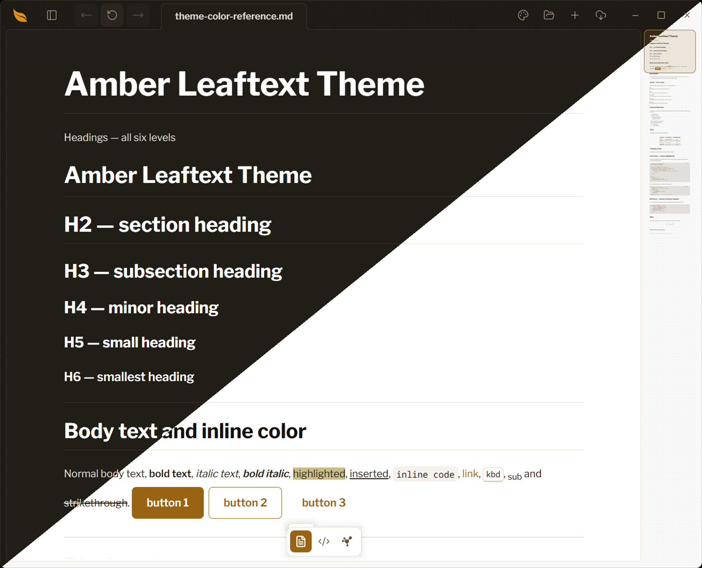

# Amber

**Family ID:** `amber`

**Pack:** `lucide`

**Earned:** Amber mode, in Foraging

One hue, amber: every surface, border, heading and accent is a shade of it, and danger, warning and success keep their own colors so an action still says what it will do.

## Fonts

| Role    | Stack |
| ------- | ----- |
| Heading | `"Libre Franklin", -apple-system, BlinkMacSystemFont, "Segoe UI", Helvetica, Arial, sans-serif, "Apple Color Emoji", "Segoe UI Emoji"` |
| Body    | `"Libre Franklin", -apple-system, BlinkMacSystemFont, "Segoe UI", Helvetica, Arial, sans-serif, "Apple Color Emoji", "Segoe UI Emoji"` |
| Code    | `"Noto Sans Mono", ui-monospace, SFMono-Regular, Consolas, "Liberation Mono", Menlo, monospace` |
| Google  | `https://fonts.googleapis.com/css2?family=Libre+Franklin:wght@400;500;600;700&family=Noto+Sans+Mono:wght@400;500;600;700&display=swap` |

## Light

| Token                                   | Value                     |
| --------------------------------------- | ------------------------- |
| background                              | `#ffffff`                 |
| foreground                              | `#282117`                 |
| surface                                 | `#ffffff`                 |
| surface-elevated                        | `#ffffff`                 |
| surface-muted                           | `#f8f6f2`                 |
| surface-sunken                          | `#f3f0ea`                 |
| border                                  | `#e7dfd4`                 |
| border-strong                           | `#cbbba3`                 |
| muted-foreground                        | `#66543a`                 |
| primary                                 | `#986313`                 |
| primary-foreground                      | `#ffffff`                 |
| accent                                  | `#986313`                 |
| accent-foreground                       | `#ffffff`                 |
| danger                                  | `#d3243a`                 |
| danger-foreground                       | `#ffffff`                 |
| warning                                 | `#8a6d00`                 |
| success                                 | `#087a34`                 |
| success-foreground                      | `#ffffff`                 |
| done                                    | `#986313`                 |
| link                                    | `#986313`                 |
| link-hover                              | `#6c460d`                 |
| editor-inline-code-background           | `#f5f2ed`                 |
| editor-inline-code-foreground           | `#282117`                 |
| editor-code-background                  | `#f8f6f2`                 |
| editor-code-foreground                  | `#282117`                 |
| editor-code-border                      | `#e7dfd4`                 |
| editor-code-selection-background        | `#f7e1c1`                 |
| editor-code-selection-foreground        | `#282117`                 |
| markdown-background                     | `#ffffff`                 |
| markdown-foreground                     | `#282117`                 |
| markdown-heading                        | `#15110c`                 |
| markdown-heading-2                      | `#15110c`                 |
| markdown-heading-3                      | `#15110c`                 |
| markdown-heading-4                      | `#15110c`                 |
| markdown-heading-5                      | `#15110c`                 |
| markdown-heading-6                      | `#15110c`                 |
| markdown-rule                           | `#e7dfd4`                 |
| markdown-link                           | `#986313`                 |
| markdown-blockquote-border              | `#c68118`                 |
| markdown-blockquote-foreground          | `#50422d`                 |
| markdown-alert-note                     | `#986313`                 |
| markdown-alert-tip                      | `#087a34`                 |
| markdown-alert-important                | `#986313`                 |
| markdown-alert-warning                  | `#8a6d00`                 |
| markdown-alert-caution                  | `#d3243a`                 |
| markdown-badge-background               | `#f2eee7`                 |
| markdown-badge-foreground               | `#282117`                 |
| markdown-table-border                   | `#a2865b`                 |
| markdown-thematic-break                 | `#e7dfd4`                 |
| markdown-math-inline-background         | `#f2eee7`                 |
| markdown-keyboard-background            | `#ffffff`                 |
| markdown-keyboard-border                | `#ddd3c3`                 |
| minimap-viewport-border                 | `#986313`                 |
| minimap-viewport-background             | `rgba(152, 99, 19, 0.14)` |
| navigation-button-hover-background      | `#c27e18`                 |
| navigation-button-disabled-background   | `#f2eee7`                 |
| navigation-button-disabled-foreground   | `#ae9570`                 |
| navigation-recent-border                | `#e7dfd4`                 |
| navigation-recent-item-foreground       | `#282117`                 |
| navigation-recent-item-hover-foreground | `#986313`                 |
| focus-ring                              | `#c68118`                 |
| focus-selection-background              | `#f9e6cb`                 |
| focus-selection-foreground              | `#282117`                 |
| syntax-background                       | `#f8f6f2`                 |
| syntax-foreground                       | `#282117`                 |
| syntax-comment                          | `#6c593d`                 |
| syntax-keyword                          | `#986313`                 |
| syntax-string                           | `#8a5a11`                 |
| syntax-number                           | `#754c0e`                 |
| syntax-function                         | `#825410`                 |
| syntax-variable                         | `#282117`                 |
| syntax-type                             | `#825410`                 |
| syntax-operator                         | `#986313`                 |
| syntax-punctuation                      | `#574831`                 |
| syntax-inserted                         | `#0a6a2f`                 |
| syntax-inserted-background              | `#d6f2de`                 |
| syntax-deleted                          | `#a01a2a`                 |
| syntax-deleted-background               | `#fbdde1`                 |
| syntax-changed                          | `#7a5200`                 |
| syntax-changed-background               | `#f7ecc9`                 |
| accent-ink                              | `#825410`                 |

## Dark

| Token                                   | Value                      |
| --------------------------------------- | -------------------------- |
| background                              | `#211e18`                  |
| foreground                              | `#ded9d2`                  |
| surface                                 | `#211e18`                  |
| surface-elevated                        | `#2a251e`                  |
| surface-muted                           | `#2e2922`                  |
| surface-sunken                          | `#1b1813`                  |
| border                                  | `#3c352b`                  |
| border-strong                           | `#5e5444`                  |
| muted-foreground                        | `#a59783`                  |
| primary                                 | `#e0911c`                  |
| primary-foreground                      | `#211e18`                  |
| accent                                  | `#eab059`                  |
| accent-foreground                       | `#211e18`                  |
| danger                                  | `#fb4f55`                  |
| danger-foreground                       | `#1e1e1e`                  |
| warning                                 | `#e0de71`                  |
| success                                 | `#44cf6e`                  |
| success-foreground                      | `#1e1e1e`                  |
| done                                    | `#e0911c`                  |
| link                                    | `#eab059`                  |
| link-hover                              | `#eebf78`                  |
| editor-inline-code-background           | `#2e2922`                  |
| editor-inline-code-foreground           | `#ded9d2`                  |
| editor-code-background                  | `#1b1813`                  |
| editor-code-foreground                  | `#ded9d2`                  |
| editor-code-border                      | `#3c352b`                  |
| editor-code-selection-background        | `#51350a`                  |
| editor-code-selection-foreground        | `#ffffff`                  |
| markdown-background                     | `#211e18`                  |
| markdown-foreground                     | `#ded9d2`                  |
| markdown-heading                        | `#ffffff`                  |
| markdown-heading-2                      | `#ffffff`                  |
| markdown-heading-3                      | `#ffffff`                  |
| markdown-heading-4                      | `#ffffff`                  |
| markdown-heading-5                      | `#ffffff`                  |
| markdown-heading-6                      | `#ffffff`                  |
| markdown-rule                           | `#3c352b`                  |
| markdown-link                           | `#eab059`                  |
| markdown-blockquote-border              | `#e0911c`                  |
| markdown-blockquote-foreground          | `#ded9d2`                  |
| markdown-alert-note                     | `#eab059`                  |
| markdown-alert-tip                      | `#44cf6e`                  |
| markdown-alert-important                | `#e0911c`                  |
| markdown-alert-warning                  | `#e0de71`                  |
| markdown-alert-caution                  | `#fb464c`                  |
| markdown-badge-background               | `#2e2922`                  |
| markdown-badge-foreground               | `#ded9d2`                  |
| markdown-table-border                   | `#746754`                  |
| markdown-thematic-break                 | `#3c352b`                  |
| markdown-math-inline-background         | `#2e2922`                  |
| markdown-keyboard-background            | `#28231d`                  |
| markdown-keyboard-border                | `#3c352b`                  |
| minimap-viewport-border                 | `#e0911c`                  |
| minimap-viewport-background             | `rgba(224, 145, 28, 0.14)` |
| navigation-button-hover-background      | `#eab059`                  |
| navigation-button-disabled-background   | `#2e2922`                  |
| navigation-button-disabled-foreground   | `#756855`                  |
| navigation-recent-border                | `#3c352b`                  |
| navigation-recent-item-foreground       | `#ded9d2`                  |
| navigation-recent-item-hover-foreground | `#eab059`                  |
| focus-ring                              | `#e0911c`                  |
| focus-selection-background              | `#492f09`                  |
| focus-selection-foreground              | `#ffffff`                  |
| syntax-background                       | `#1b1813`                  |
| syntax-foreground                       | `#ded9d2`                  |
| syntax-comment                          | `#998a73`                  |
| syntax-keyword                          | `#f1cb91`                  |
| syntax-string                           | `#f4d4a5`                  |
| syntax-number                           | `#d2881a`                  |
| syntax-function                         | `#eab059`                  |
| syntax-variable                         | `#ded9d2`                  |
| syntax-type                             | `#eab059`                  |
| syntax-operator                         | `#f1cb91`                  |
| syntax-punctuation                      | `#c2b9ab`                  |
| syntax-inserted                         | `#44cf6e`                  |
| syntax-inserted-background              | `#143621`                  |
| syntax-deleted                          | `#ff8f92`                  |
| syntax-deleted-background               | `#3a1d20`                  |
| syntax-changed                          | `#e0de71`                  |
| syntax-changed-background               | `#33301a`                  |
