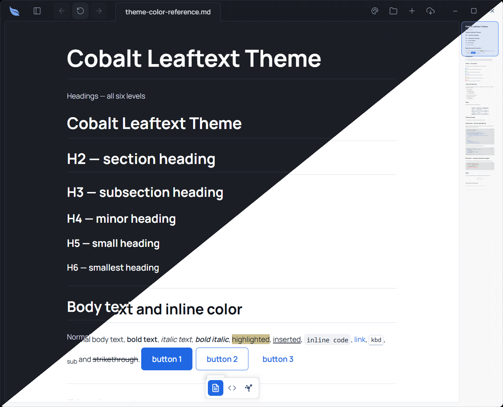

# Cobalt

**Family ID:** `cobalt`

**Pack:** `feather`

**Earned:** Cobalt mode, in Foraging

One hue, blue: every surface, border, heading and accent is a shade of it, and danger, warning and success keep their own colors so an action still says what it will do.

## Fonts

| Role    | Stack |
| ------- | ----- |
| Heading | `"Manrope", -apple-system, BlinkMacSystemFont, "Segoe UI", Helvetica, Arial, sans-serif, "Apple Color Emoji", "Segoe UI Emoji"` |
| Body    | `"Manrope", -apple-system, BlinkMacSystemFont, "Segoe UI", Helvetica, Arial, sans-serif, "Apple Color Emoji", "Segoe UI Emoji"` |
| Code    | `"Noto Sans Mono", ui-monospace, SFMono-Regular, Consolas, "Liberation Mono", Menlo, monospace` |
| Google  | `https://fonts.googleapis.com/css2?family=Manrope:wght@400;500;600;700&family=Noto+Sans+Mono:wght@400;500;600;700&display=swap` |

## Light

| Token                                   | Value                      |
| --------------------------------------- | -------------------------- |
| background                              | `#ffffff`                  |
| foreground                              | `#1b222f`                  |
| surface                                 | `#ffffff`                  |
| surface-elevated                        | `#ffffff`                  |
| surface-muted                           | `#f4f6f9`                  |
| surface-sunken                          | `#edf0f5`                  |
| border                                  | `#dbe0eb`                  |
| border-strong                           | `#b1bed3`                  |
| muted-foreground                        | `#445879`                  |
| primary                                 | `#2068e3`                  |
| primary-foreground                      | `#ffffff`                  |
| accent                                  | `#2068e3`                  |
| accent-foreground                       | `#ffffff`                  |
| danger                                  | `#d3243a`                  |
| danger-foreground                       | `#ffffff`                  |
| warning                                 | `#8a6d00`                  |
| success                                 | `#087a34`                  |
| success-foreground                      | `#ffffff`                  |
| done                                    | `#2068e3`                  |
| link                                    | `#2068e3`                  |
| link-hover                              | `#1449a4`                  |
| editor-inline-code-background           | `#f0f2f6`                  |
| editor-inline-code-foreground           | `#1b222f`                  |
| editor-code-background                  | `#f4f6f9`                  |
| editor-code-foreground                  | `#1b222f`                  |
| editor-code-border                      | `#dbe0eb`                  |
| editor-code-selection-background        | `#d9e5fa`                  |
| editor-code-selection-foreground        | `#1b222f`                  |
| markdown-background                     | `#ffffff`                  |
| markdown-foreground                     | `#1b222f`                  |
| markdown-heading                        | `#0e1219`                  |
| markdown-heading-2                      | `#0e1219`                  |
| markdown-heading-3                      | `#0e1219`                  |
| markdown-heading-4                      | `#0e1219`                  |
| markdown-heading-5                      | `#0e1219`                  |
| markdown-heading-6                      | `#0e1219`                  |
| markdown-rule                           | `#dbe0eb`                  |
| markdown-link                           | `#2068e3`                  |
| markdown-blockquote-border              | `#598feb`                  |
| markdown-blockquote-foreground          | `#35445f`                  |
| markdown-alert-note                     | `#2068e3`                  |
| markdown-alert-tip                      | `#087a34`                  |
| markdown-alert-important                | `#2068e3`                  |
| markdown-alert-warning                  | `#8a6d00`                  |
| markdown-alert-caution                  | `#d3243a`                  |
| markdown-badge-background               | `#ebeef4`                  |
| markdown-badge-foreground               | `#1b222f`                  |
| markdown-table-border                   | `#758bb1`                  |
| markdown-thematic-break                 | `#dbe0eb`                  |
| markdown-math-inline-background         | `#ebeef4`                  |
| markdown-keyboard-background            | `#ffffff`                  |
| markdown-keyboard-border                | `#cdd5e3`                  |
| minimap-viewport-border                 | `#2068e3`                  |
| minimap-viewport-background             | `rgba(32, 104, 227, 0.14)` |
| navigation-button-hover-background      | `#548bea`                  |
| navigation-button-disabled-background   | `#ebeef4`                  |
| navigation-button-disabled-foreground   | `#879abb`                  |
| navigation-recent-border                | `#dbe0eb`                  |
| navigation-recent-item-foreground       | `#1b222f`                  |
| navigation-recent-item-hover-foreground | `#2068e3`                  |
| focus-ring                              | `#598feb`                  |
| focus-selection-background              | `#dfe9fb`                  |
| focus-selection-foreground              | `#1b222f`                  |
| syntax-background                       | `#f4f6f9`                  |
| syntax-foreground                       | `#1b222f`                  |
| syntax-comment                          | `#485d80`                  |
| syntax-keyword                          | `#2068e3`                  |
| syntax-string                           | `#1a5dd2`                  |
| syntax-number                           | `#164fb2`                  |
| syntax-function                         | `#1858c5`                  |
| syntax-variable                         | `#1b222f`                  |
| syntax-type                             | `#1858c5`                  |
| syntax-operator                         | `#2068e3`                  |
| syntax-punctuation                      | `#3a4b67`                  |
| syntax-inserted                         | `#0a6a2f`                  |
| syntax-inserted-background              | `#d6f2de`                  |
| syntax-deleted                          | `#a01a2a`                  |
| syntax-deleted-background               | `#fbdde1`                  |
| syntax-changed                          | `#7a5200`                  |
| syntax-changed-background               | `#f7ecc9`                  |
| accent-ink                              | `#1858c5`                  |

## Dark

| Token                                   | Value                       |
| --------------------------------------- | --------------------------- |
| background                              | `#1b1e25`                   |
| foreground                              | `#d6dae1`                   |
| surface                                 | `#1b1e25`                   |
| surface-elevated                        | `#22262e`                   |
| surface-muted                           | `#252a33`                   |
| surface-sunken                          | `#15181d`                   |
| border                                  | `#303642`                   |
| border-strong                           | `#4b5668`                   |
| muted-foreground                        | `#8e9aad`                   |
| primary                                 | `#77a3ee`                   |
| primary-foreground                      | `#1b1e25`                   |
| accent                                  | `#9cbcf3`                   |
| accent-foreground                       | `#1b1e25`                   |
| danger                                  | `#fb4f55`                   |
| danger-foreground                       | `#1e1e1e`                   |
| warning                                 | `#e0de71`                   |
| success                                 | `#44cf6e`                   |
| success-foreground                      | `#1e1e1e`                   |
| done                                    | `#77a3ee`                   |
| link                                    | `#9cbcf3`                   |
| link-hover                              | `#aec8f5`                   |
| editor-inline-code-background           | `#252a33`                   |
| editor-inline-code-foreground           | `#d6dae1`                   |
| editor-code-background                  | `#15181d`                   |
| editor-code-foreground                  | `#d6dae1`                   |
| editor-code-border                      | `#303642`                   |
| editor-code-selection-background        | `#0f377b`                   |
| editor-code-selection-foreground        | `#ffffff`                   |
| markdown-background                     | `#1b1e25`                   |
| markdown-foreground                     | `#d6dae1`                   |
| markdown-heading                        | `#ffffff`                   |
| markdown-heading-2                      | `#ffffff`                   |
| markdown-heading-3                      | `#ffffff`                   |
| markdown-heading-4                      | `#ffffff`                   |
| markdown-heading-5                      | `#ffffff`                   |
| markdown-heading-6                      | `#ffffff`                   |
| markdown-rule                           | `#303642`                   |
| markdown-link                           | `#9cbcf3`                   |
| markdown-blockquote-border              | `#77a3ee`                   |
| markdown-blockquote-foreground          | `#d6dae1`                   |
| markdown-alert-note                     | `#9cbcf3`                   |
| markdown-alert-tip                      | `#44cf6e`                   |
| markdown-alert-important                | `#77a3ee`                   |
| markdown-alert-warning                  | `#e0de71`                   |
| markdown-alert-caution                  | `#fb464c`                   |
| markdown-badge-background               | `#252a33`                   |
| markdown-badge-foreground               | `#d6dae1`                   |
| markdown-table-border                   | `#5d6a80`                   |
| markdown-thematic-break                 | `#303642`                   |
| markdown-math-inline-background         | `#252a33`                   |
| markdown-keyboard-background            | `#20242c`                   |
| markdown-keyboard-border                | `#303642`                   |
| minimap-viewport-border                 | `#77a3ee`                   |
| minimap-viewport-background             | `rgba(119, 163, 238, 0.14)` |
| navigation-button-hover-background      | `#9cbcf3`                   |
| navigation-button-disabled-background   | `#252a33`                   |
| navigation-button-disabled-foreground   | `#5e6b81`                   |
| navigation-recent-border                | `#303642`                   |
| navigation-recent-item-foreground       | `#d6dae1`                   |
| navigation-recent-item-hover-foreground | `#9cbcf3`                   |
| focus-ring                              | `#77a3ee`                   |
| focus-selection-background              | `#0e316f`                   |
| focus-selection-foreground              | `#ffffff`                   |
| syntax-background                       | `#15181d`                   |
| syntax-foreground                       | `#d6dae1`                   |
| syntax-comment                          | `#808da3`                   |
| syntax-keyword                          | `#bcd2f7`                   |
| syntax-string                           | `#c8daf8`                   |
| syntax-number                           | `#6898ec`                   |
| syntax-function                         | `#9cbcf3`                   |
| syntax-variable                         | `#d6dae1`                   |
| syntax-type                             | `#9cbcf3`                   |
| syntax-operator                         | `#bcd2f7`                   |
| syntax-punctuation                      | `#b3bbc8`                   |
| syntax-inserted                         | `#44cf6e`                   |
| syntax-inserted-background              | `#143621`                   |
| syntax-deleted                          | `#ff8f92`                   |
| syntax-deleted-background               | `#3a1d20`                   |
| syntax-changed                          | `#e0de71`                   |
| syntax-changed-background               | `#33301a`                   |
