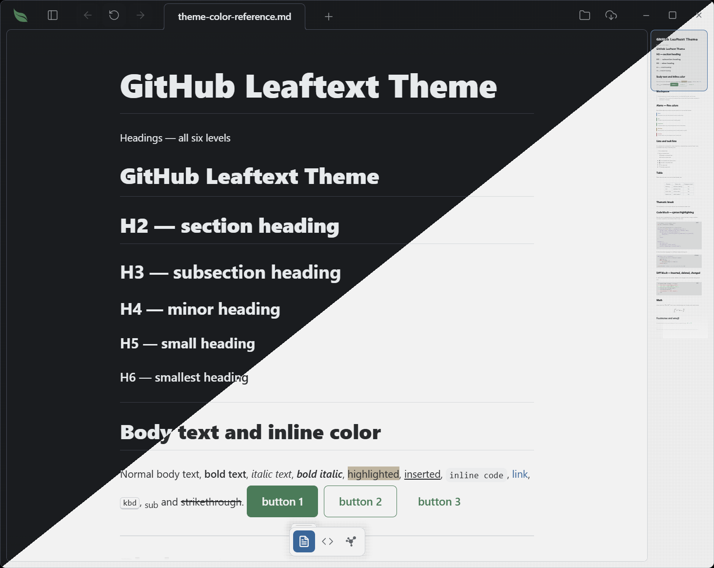

# GitHub

**Family ID:** `github`

## Fonts

| Role    | Stack |
| ------- | ----- |
| Heading | `-apple-system, BlinkMacSystemFont, "Segoe UI", "Noto Sans", Helvetica, Arial, sans-serif, "Apple Color Emoji", "Segoe UI Emoji"` |
| Body    | `-apple-system, BlinkMacSystemFont, "Segoe UI", "Noto Sans", Helvetica, Arial, sans-serif, "Apple Color Emoji", "Segoe UI Emoji"` |
| Code    | `ui-monospace, SFMono-Regular, "SF Mono", Menlo, Consolas, "Liberation Mono", monospace` |
| Google  |  |

## Light

| Token                                   | Value                                          |
| --------------------------------------- | ---------------------------------------------- |
| background                              | `#ffffff`                                      |
| foreground                              | `#1f2328`                                      |
| surface                                 | `#ffffff`                                      |
| surface-elevated                        | `#ffffff`                                      |
| surface-muted                           | `#f6f8fa`                                      |
| surface-sunken                          | `#f6f8fa`                                      |
| border                                  | `#d1d9e0`                                      |
| border-strong                           | `#818b98`                                      |
| muted-foreground                        | `#59636e`                                      |
| primary                                 | `#1f883d`                                      |
| primary-foreground                      | `#ffffff`                                      |
| accent                                  | `#0969da`                                      |
| accent-foreground                       | `#ffffff`                                      |
| danger                                  | `#d1242f`                                      |
| danger-foreground                       | `#ffffff`                                      |
| warning                                 | `#9a6700`                                      |
| success                                 | `#1a7f37`                                      |
| success-foreground                      | `#ffffff`                                      |
| done                                    | `#8250df`                                      |
| link                                    | `#0969da`                                      |
| link-hover                              | `#0969da`                                      |
| editor-inline-code-background           | `#f6f8fa`                                      |
| editor-inline-code-foreground           | `#1f2328`                                      |
| editor-code-background                  | `#f6f8fa`                                      |
| editor-code-foreground                  | `#1f2328`                                      |
| editor-code-border                      | `#d1d9e0`                                      |
| editor-code-selection-background        | `#0969da33`                                    |
| editor-code-selection-foreground        | `#1f2328`                                      |
| markdown-background                     | `#ffffff`                                      |
| markdown-foreground                     | `#1f2328`                                      |
| markdown-heading                        | `#1f2328`                                      |
| markdown-heading-2                      | `#1f2328`                                      |
| markdown-heading-3                      | `#1f2328`                                      |
| markdown-heading-4                      | `#1f2328`                                      |
| markdown-heading-5                      | `#1f2328`                                      |
| markdown-heading-6                      | `#1f2328`                                      |
| markdown-rule                           | `#d1d9e0b3`                                    |
| markdown-link                           | `#0969da`                                      |
| markdown-blockquote-border              | `#d1d9e0`                                      |
| markdown-blockquote-foreground          | `#59636e`                                      |
| markdown-alert-note                     | `#0969da`                                      |
| markdown-alert-tip                      | `#1a7f37`                                      |
| markdown-alert-important                | `#1f883d`                                      |
| markdown-alert-warning                  | `#9a6700`                                      |
| markdown-alert-caution                  | `#d1242f`                                      |
| markdown-badge-background               | `#f6f8fa`                                      |
| markdown-badge-foreground               | `#25292e`                                      |
| markdown-table-border                   | `#d1d9e0`                                      |
| markdown-table-header-background        | `#f6f8fa`                                      |
| markdown-thematic-break                 | `#d1d9e0b3`                                    |
| markdown-math-inline-background         | `#f6f8fa`                                      |
| markdown-keyboard-background            | `#ffffff`                                      |
| markdown-keyboard-border                | `#d1d9e0`                                      |
| minimap-viewport-border                 | `#0969da`                                      |
| minimap-viewport-background             | `rgba(110, 118, 129, 0.14)`                    |
| navigation-button-hover-background      | `#1c8139`                                      |
| navigation-button-disabled-background   | `#eff2f5`                                      |
| navigation-button-disabled-foreground   | `#818b98`                                      |
| navigation-recent-border                | `#d1d9e0`                                      |
| navigation-recent-item-foreground       | `#1f2328`                                      |
| navigation-recent-item-hover-foreground | `#1f883d`                                      |
| focus-ring                              | `#0969da`                                      |
| focus-selection-background              | `#0969da33`                                    |
| focus-selection-foreground              | `#1f2328`                                      |
| syntax-background                       | `#f6f8fa`                                      |
| syntax-foreground                       | `#1f2328`                                      |
| syntax-comment                          | `#59636e`                                      |
| syntax-keyword                          | `#cf222e`                                      |
| syntax-string                           | `#0a3069`                                      |
| syntax-number                           | `#0550ae`                                      |
| syntax-function                         | `#6639ba`                                      |
| syntax-variable                         | `#953800`                                      |
| syntax-type                             | `#6639ba`                                      |
| syntax-operator                         | `#cf222e`                                      |
| syntax-punctuation                      | `#59636e`                                      |
| syntax-inserted                         | `#116329`                                      |
| syntax-inserted-background              | `#dafbe1`                                      |
| syntax-deleted                          | `#82071e`                                      |
| syntax-deleted-background               | `#ffebe9`                                      |
| syntax-changed                          | `#953800`                                      |
| syntax-changed-background               | `#ffd8b5`                                      |

## Dark

| Token                                   | Value                                          |
| --------------------------------------- | ---------------------------------------------- |
| background                              | `#0d1117`                                      |
| foreground                              | `#f0f6fc`                                      |
| surface                                 | `#0d1117`                                      |
| surface-elevated                        | `#0d1117`                                      |
| surface-muted                           | `#151b23`                                      |
| surface-sunken                          | `#010409`                                      |
| border                                  | `#3d444d`                                      |
| border-strong                           | `#656c76`                                      |
| muted-foreground                        | `#9198a1`                                      |
| primary                                 | `#238636`                                      |
| primary-foreground                      | `#ffffff`                                      |
| accent                                  | `#4493f8`                                      |
| accent-foreground                       | `#ffffff`                                      |
| danger                                  | `#f85149`                                      |
| danger-foreground                       | `#ffffff`                                      |
| warning                                 | `#d29922`                                      |
| success                                 | `#3fb950`                                      |
| success-foreground                      | `#ffffff`                                      |
| done                                    | `#ab7df8`                                      |
| link                                    | `#4493f8`                                      |
| link-hover                              | `#4493f8`                                      |
| editor-inline-code-background           | `#151b23`                                      |
| editor-inline-code-foreground           | `#f0f6fc`                                      |
| editor-code-background                  | `#151b23`                                      |
| editor-code-foreground                  | `#f0f6fc`                                      |
| editor-code-border                      | `#3d444d`                                      |
| editor-code-selection-background        | `#1f6febb3`                                    |
| editor-code-selection-foreground        | `#f0f6fc`                                      |
| markdown-background                     | `#0d1117`                                      |
| markdown-foreground                     | `#f0f6fc`                                      |
| markdown-heading                        | `#f0f6fc`                                      |
| markdown-heading-2                      | `#f0f6fc`                                      |
| markdown-heading-3                      | `#f0f6fc`                                      |
| markdown-heading-4                      | `#f0f6fc`                                      |
| markdown-heading-5                      | `#f0f6fc`                                      |
| markdown-heading-6                      | `#f0f6fc`                                      |
| markdown-rule                           | `#3d444db3`                                    |
| markdown-link                           | `#4493f8`                                      |
| markdown-blockquote-border              | `#3d444d`                                      |
| markdown-blockquote-foreground          | `#9198a1`                                      |
| markdown-alert-note                     | `#4493f8`                                      |
| markdown-alert-tip                      | `#3fb950`                                      |
| markdown-alert-important                | `#238636`                                      |
| markdown-alert-warning                  | `#d29922`                                      |
| markdown-alert-caution                  | `#f85149`                                      |
| markdown-badge-background               | `#212830`                                      |
| markdown-badge-foreground               | `#f0f6fc`                                      |
| markdown-table-border                   | `#3d444d`                                      |
| markdown-table-header-background        | `#151b23`                                      |
| markdown-thematic-break                 | `#3d444db3`                                    |
| markdown-math-inline-background         | `#212830`                                      |
| markdown-keyboard-background            | `#0d1117`                                      |
| markdown-keyboard-border                | `#3d444d`                                      |
| minimap-viewport-border                 | `#4493f8`                                      |
| minimap-viewport-background             | `rgba(110, 118, 129, 0.14)`                    |
| navigation-button-hover-background      | `#29903b`                                      |
| navigation-button-disabled-background   | `#212830`                                      |
| navigation-button-disabled-foreground   | `#656c76`                                      |
| navigation-recent-border                | `#3d444d`                                      |
| navigation-recent-item-foreground       | `#f0f6fc`                                      |
| navigation-recent-item-hover-foreground | `#238636`                                      |
| focus-ring                              | `#1f6feb`                                      |
| focus-selection-background              | `#1f6febb3`                                    |
| focus-selection-foreground              | `#f0f6fc`                                      |
| syntax-background                       | `#151b23`                                      |
| syntax-foreground                       | `#f0f6fc`                                      |
| syntax-comment                          | `#9198a1`                                      |
| syntax-keyword                          | `#ff7b72`                                      |
| syntax-string                           | `#a5d6ff`                                      |
| syntax-number                           | `#79c0ff`                                      |
| syntax-function                         | `#d2a8ff`                                      |
| syntax-variable                         | `#ffa657`                                      |
| syntax-type                             | `#d2a8ff`                                      |
| syntax-operator                         | `#ff7b72`                                      |
| syntax-punctuation                      | `#9198a1`                                      |
| syntax-inserted                         | `#aff5b4`                                      |
| syntax-inserted-background              | `#033a16`                                      |
| syntax-deleted                          | `#ffdcd7`                                      |
| syntax-deleted-background               | `#67060c`                                      |
| syntax-changed                          | `#ffdfb6`                                      |
| syntax-changed-background               | `#5a1e02`                                      |

### Overrides

| Token                      | Value       |
| -------------------------- | ----------- |
| border                     | `#39435f`   |
| border-strong              | `#5b6788`   |
| editor-code-border         | `#39435f`   |
| markdown-rule              | `#39435fb3` |
| markdown-blockquote-border | `#39435f`   |
| markdown-table-border      | `#39435f`   |
| markdown-thematic-break    | `#39435fb3` |
| markdown-keyboard-border   | `#39435f`   |
| navigation-recent-border   | `#39435f`   |
