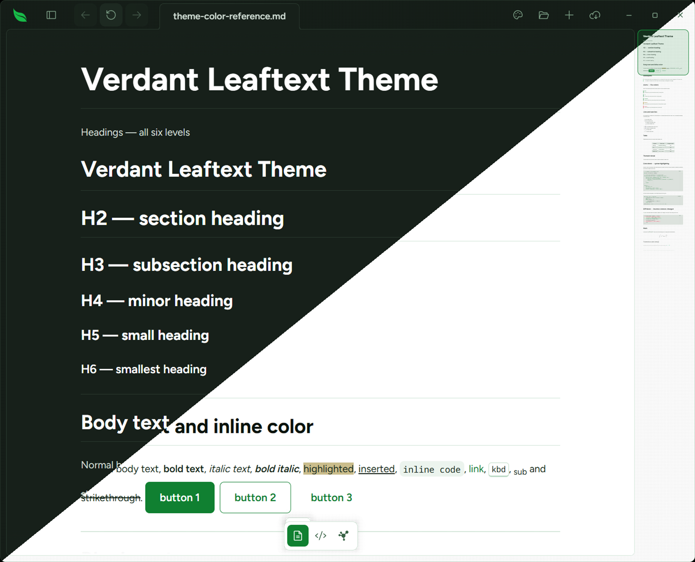

# Verdant

**Family ID:** `verdant`

**Pack:** `phosphor`

**Earned:** Verdant mode, in Foraging

One hue, green: every surface, border, heading and accent is a shade of it, and danger, warning and success keep their own colors so an action still says what it will do.

## Fonts

| Role    | Stack |
| ------- | ----- |
| Heading | `"Figtree", -apple-system, BlinkMacSystemFont, "Segoe UI", Helvetica, Arial, sans-serif, "Apple Color Emoji", "Segoe UI Emoji"` |
| Body    | `"Figtree", -apple-system, BlinkMacSystemFont, "Segoe UI", Helvetica, Arial, sans-serif, "Apple Color Emoji", "Segoe UI Emoji"` |
| Code    | `"Noto Sans Mono", ui-monospace, SFMono-Regular, Consolas, "Liberation Mono", Menlo, monospace` |
| Google  | `https://fonts.googleapis.com/css2?family=Figtree:wght@400;500;600;700&family=Noto+Sans+Mono:wght@400;500;600;700&display=swap` |

## Light

| Token                                   | Value                     |
| --------------------------------------- | ------------------------- |
| background                              | `#ffffff`                 |
| foreground                              | `#15261a`                 |
| surface                                 | `#ffffff`                 |
| surface-elevated                        | `#ffffff`                 |
| surface-muted                           | `#f2f8f3`                 |
| surface-sunken                          | `#e9f3ec`                 |
| border                                  | `#d1e5d7`                 |
| border-strong                           | `#9cc7a9`                 |
| muted-foreground                        | `#366043`                 |
| primary                                 | `#108031`                 |
| primary-foreground                      | `#ffffff`                 |
| accent                                  | `#108031`                 |
| accent-foreground                       | `#ffffff`                 |
| danger                                  | `#d3243a`                 |
| danger-foreground                       | `#ffffff`                 |
| warning                                 | `#8a6d00`                 |
| success                                 | `#087a34`                 |
| success-foreground                      | `#ffffff`                 |
| done                                    | `#108031`                 |
| link                                    | `#108031`                 |
| link-hover                              | `#0b5a23`                 |
| editor-inline-code-background           | `#ecf4ee`                 |
| editor-inline-code-foreground           | `#15261a`                 |
| editor-code-background                  | `#f2f8f3`                 |
| editor-code-foreground                  | `#15261a`                 |
| editor-code-border                      | `#d1e5d7`                 |
| editor-code-selection-background        | `#acf5c2`                 |
| editor-code-selection-foreground        | `#15261a`                 |
| markdown-background                     | `#ffffff`                 |
| markdown-foreground                     | `#15261a`                 |
| markdown-heading                        | `#0b140e`                 |
| markdown-heading-2                      | `#0b140e`                 |
| markdown-heading-3                      | `#0b140e`                 |
| markdown-heading-4                      | `#0b140e`                 |
| markdown-heading-5                      | `#0b140e`                 |
| markdown-heading-6                      | `#0b140e`                 |
| markdown-rule                           | `#d1e5d7`                 |
| markdown-link                           | `#108031`                 |
| markdown-blockquote-border              | `#14a640`                 |
| markdown-blockquote-foreground          | `#2a4b34`                 |
| markdown-alert-note                     | `#108031`                 |
| markdown-alert-tip                      | `#087a34`                 |
| markdown-alert-important                | `#108031`                 |
| markdown-alert-warning                  | `#8a6d00`                 |
| markdown-alert-caution                  | `#d3243a`                 |
| markdown-badge-background               | `#e6f1e9`                 |
| markdown-badge-foreground               | `#15261a`                 |
| markdown-table-border                   | `#559869`                 |
| markdown-thematic-break                 | `#d1e5d7`                 |
| markdown-math-inline-background         | `#e6f1e9`                 |
| markdown-keyboard-background            | `#ffffff`                 |
| markdown-keyboard-border                | `#bfdbc7`                 |
| minimap-viewport-border                 | `#108031`                 |
| minimap-viewport-background             | `rgba(16, 128, 49, 0.14)` |
| navigation-button-hover-background      | `#14a23f`                 |
| navigation-button-disabled-background   | `#e6f1e9`                 |
| navigation-button-disabled-foreground   | `#63a878`                 |
| navigation-recent-border                | `#d1e5d7`                 |
| navigation-recent-item-foreground       | `#15261a`                 |
| navigation-recent-item-hover-foreground | `#108031`                 |
| focus-ring                              | `#14a640`                 |
| focus-selection-background              | `#bbf7cd`                 |
| focus-selection-foreground              | `#15261a`                 |
| syntax-background                       | `#f2f8f3`                 |
| syntax-foreground                       | `#15261a`                 |
| syntax-comment                          | `#396546`                 |
| syntax-keyword                          | `#108031`                 |
| syntax-string                           | `#0e742d`                 |
| syntax-number                           | `#0c6226`                 |
| syntax-function                         | `#0d6d2a`                 |
| syntax-variable                         | `#15261a`                 |
| syntax-type                             | `#0d6d2a`                 |
| syntax-operator                         | `#108031`                 |
| syntax-punctuation                      | `#2e5239`                 |
| syntax-inserted                         | `#0a6a2f`                 |
| syntax-inserted-background              | `#d6f2de`                 |
| syntax-deleted                          | `#a01a2a`                 |
| syntax-deleted-background               | `#fbdde1`                 |
| syntax-changed                          | `#7a5200`                 |
| syntax-changed-background               | `#f7ecc9`                 |
| accent-ink                              | `#0d6d2a`                 |

## Dark

| Token                                   | Value                     |
| --------------------------------------- | ------------------------- |
| background                              | `#17201a`                 |
| foreground                              | `#d0ddd4`                 |
| surface                                 | `#17201a`                 |
| surface-elevated                        | `#1d2921`                 |
| surface-muted                           | `#212d24`                 |
| surface-sunken                          | `#131a15`                 |
| border                                  | `#2a3a2f`                 |
| border-strong                           | `#425b49`                 |
| muted-foreground                        | `#7ea188`                 |
| primary                                 | `#17bb48`                 |
| primary-foreground                      | `#17201a`                 |
| accent                                  | `#1bd753`                 |
| accent-foreground                       | `#17201a`                 |
| danger                                  | `#fb4f55`                 |
| danger-foreground                       | `#1e1e1e`                 |
| warning                                 | `#e0de71`                 |
| success                                 | `#44cf6e`                 |
| success-foreground                      | `#1e1e1e`                 |
| done                                    | `#17bb48`                 |
| link                                    | `#1bd753`                 |
| link-hover                              | `#27e460`                 |
| editor-inline-code-background           | `#212d24`                 |
| editor-inline-code-foreground           | `#d0ddd4`                 |
| editor-code-background                  | `#131a15`                 |
| editor-code-foreground                  | `#d0ddd4`                 |
| editor-code-border                      | `#2a3a2f`                 |
| editor-code-selection-background        | `#08441a`                 |
| editor-code-selection-foreground        | `#ffffff`                 |
| markdown-background                     | `#17201a`                 |
| markdown-foreground                     | `#d0ddd4`                 |
| markdown-heading                        | `#ffffff`                 |
| markdown-heading-2                      | `#ffffff`                 |
| markdown-heading-3                      | `#ffffff`                 |
| markdown-heading-4                      | `#ffffff`                 |
| markdown-heading-5                      | `#ffffff`                 |
| markdown-heading-6                      | `#ffffff`                 |
| markdown-rule                           | `#2a3a2f`                 |
| markdown-link                           | `#1bd753`                 |
| markdown-blockquote-border              | `#17bb48`                 |
| markdown-blockquote-foreground          | `#d0ddd4`                 |
| markdown-alert-note                     | `#1bd753`                 |
| markdown-alert-tip                      | `#44cf6e`                 |
| markdown-alert-important                | `#17bb48`                 |
| markdown-alert-warning                  | `#e0de71`                 |
| markdown-alert-caution                  | `#fb464c`                 |
| markdown-badge-background               | `#212d24`                 |
| markdown-badge-foreground               | `#d0ddd4`                 |
| markdown-table-border                   | `#51705a`                 |
| markdown-thematic-break                 | `#2a3a2f`                 |
| markdown-math-inline-background         | `#212d24`                 |
| markdown-keyboard-background            | `#1c271f`                 |
| markdown-keyboard-border                | `#2a3a2f`                 |
| minimap-viewport-border                 | `#17bb48`                 |
| minimap-viewport-background             | `rgba(23, 187, 72, 0.14)` |
| navigation-button-hover-background      | `#1bd753`                 |
| navigation-button-disabled-background   | `#212d24`                 |
| navigation-button-disabled-foreground   | `#52715b`                 |
| navigation-recent-border                | `#2a3a2f`                 |
| navigation-recent-item-foreground       | `#d0ddd4`                 |
| navigation-recent-item-hover-foreground | `#1bd753`                 |
| focus-ring                              | `#17bb48`                 |
| focus-selection-background              | `#083d18`                 |
| focus-selection-foreground              | `#ffffff`                 |
| syntax-background                       | `#131a15`                 |
| syntax-foreground                       | `#d0ddd4`                 |
| syntax-comment                          | `#6d9579`                 |
| syntax-keyword                          | `#5ceb87`                 |
| syntax-string                           | `#81efa2`                 |
| syntax-number                           | `#16b044`                 |
| syntax-function                         | `#1bd753`                 |
| syntax-variable                         | `#d0ddd4`                 |
| syntax-type                             | `#1bd753`                 |
| syntax-operator                         | `#5ceb87`                 |
| syntax-punctuation                      | `#a8c0af`                 |
| syntax-inserted                         | `#44cf6e`                 |
| syntax-inserted-background              | `#143621`                 |
| syntax-deleted                          | `#ff8f92`                 |
| syntax-deleted-background               | `#3a1d20`                 |
| syntax-changed                          | `#e0de71`                 |
| syntax-changed-background               | `#33301a`                 |
